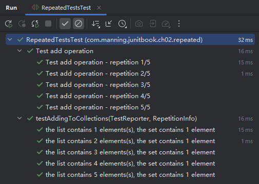
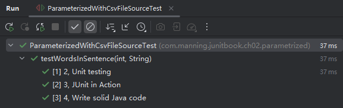

# 第二章 探索 JUnit 的核心功能

> **本章概要**
>
> - `JUnit` 生命周期
> - `JUnit` 的核心类、核心方法、核心注解
> - `JUnit` 运行机制演示


## 2.1 相关资源

- `JUnit 5` 用户手册：[https://docs.junit.org/current/user-guide/](https://docs.junit.org/current/user-guide/)
- `JUnit 5` 接口文档：[https://docs.junit.org/current/api/](https://docs.junit.org/current/api/)
- 随书源码仓库：[https://github.com/ctudose/junit-in-action-third-edition](https://github.com/ctudose/junit-in-action-third-edition)


## 2.2 测试类与测试方法

一个测试类（test class）可以是顶级类、静态成员类，或是使用 `@Nested` 注解的内部类，其中包含一个或多个测试方法。

测试类不能是抽象的，且必须提供单一的无参构造方法（如果确实需要参数，也可以通过运行时依赖注入的方式引入）。

测试类的在 `JUnit 5` 中的可见性可最低降至 **包路级私有（*package-private*）**，即不加任何访问修饰符，保持默认的包级可见即可 [^1]；此前 `JUnit 4` 必须声明为 `public`。


测试方法也不能是抽象方法，并且不能有返回值（统一返回 `void`）。

按照加注注解的不同，可分为两大类：（普通）测试方法（test method）和生命周期方法（life cycle method），其中——

**测试方法** 是加注了如下注解的实例方法：

- `@Test`
- `@RepeatedTest`
- `@ParameterizedTest`
- `@TestFactory`
- `@TestTemplate`

**生命周期方法** 是加注了如下注解的方法：

- `@BeforeAll`
- `@AfterAll`
- `@BeforeEach`
- `@AfterEach`


## 2.3 本章示例代码的运行方法

首先添加 `Maven` 依赖：

```xml
<dependency>
    <groupId>org.junit.jupiter</groupId>
    <artifactId>junit-jupiter-api</artifactId>
    <version>5.6.0</version>
    <scope>test</scope>
</dependency>
<dependency>
    <groupId>org.junit.jupiter</groupId>
    <artifactId>junit-jupiter-engine</artifactId>
    <version>5.6.0</version>
    <scope>test</scope>
</dependency>
```

然后在命令行执行命令：

```bash
mvn test -Dtest=SpecificTestClassName
```

本地实测时由于手动安装并配置了 `Java11`，后续通过 `IDEA` 又安装了 `Java21` 和 `Java24` 等多个版本，导致上述命令报错，提示编译的版本不一致：

```bash
> mvn test
[INFO] Scanning for projects...
[INFO] 
[INFO] ------------------< com.manning.junitbook:ch02-core >-------------------
[INFO] Building ch02-core 1.0-SNAPSHOT
[INFO] --------------------------------[ jar ]---------------------------------
[INFO] 
[INFO] --- maven-resources-plugin:2.6:resources (default-resources) @ ch02-core ---
[INFO] Using 'UTF-8' encoding to copy filtered resources.
[INFO] skip non existing resourceDirectory E:\workspaces\juia3\ch02-core\src\main\resources
[INFO] 
[INFO] --- maven-compiler-plugin:3.1:compile (default-compile) @ ch02-core ---
[INFO] Changes detected - recompiling the module!
[INFO] Compiling 19 source files to E:\workspaces\juia3\ch02-core\target\classes
[INFO] ------------------------------------------------------------------------
[INFO] BUILD FAILURE
[INFO] ------------------------------------------------------------------------
[INFO] Total time:  0.478 s
[INFO] Finished at: 2025-10-09T16:48:42+08:00
[INFO] ------------------------------------------------------------------------
[ERROR] Failed to execute goal org.apache.maven.plugins:maven-compiler-plugin:3.1:compile (default-compile) on project ch02-core: Fatal error compiling: 错误: 无效的目标发行版：1.11 -> [Help 1]
[ERROR] 
[ERROR] To see the full stack trace of the errors, re-run Maven with the -e switch.
[ERROR] Re-run Maven using the -X switch to enable full debug logging.
[ERROR] 
[ERROR] For more information about the errors and possible solutions, please read the following articles:
[ERROR] [Help 1] http://cwiki.apache.org/confluence/display/MAVEN/MojoExecutionException
> 
```

解决方法：新增 `Maven` 插件手动指定编译版本为 `Java11`，与本机系统保持一致：

```xml
<build>
    <plugins>
        <!-- snip -->
        <plugin>
            <groupId>org.apache.maven.plugins</groupId>
            <artifactId>maven-compiler-plugin</artifactId>
            <version>3.8.1</version>
            <configuration>
                <source>11</source>
                <target>11</target>
            </configuration>
        </plugin>
    </plugins>
</build>
```


## 2.4 关于 @TestInstance 注解

一般情况下，`JUnit` 在调用每个 `@Test` 注解过的方法前会创建一个该测试类的新实例，以确保测试方法的独立性。

如果想让 `@BeforeAll` 注解的方法实现 **只运行一次、然后再运行其余 `@Test` 用例**，通常需要声明为 `static` 静态方法；否则，就必须在测试类上加注 `@TestInstance` 注解，并传入参数 `TestInstance.Lifecycle.PER_CLASS`：

```java
// 1. use static
class SUTTest {
    // -- snip --
    @BeforeAll
    static void setUpClass() {
        resourceForAllTests = new ResourceForAllTests("Our resource for all tests");
    }
    // -- snip --
}

// 2. use @TestInstance annotation
@TestInstance(TestInstance.Lifecycle.PER_CLASS)
class SUTTest {
    // -- snip --
    @BeforeAll
    void setUpClass() {
        resourceForAllTests = new ResourceForAllTests("Our resource for all tests");
    }
    // -- snip --
}
```


## 2.5 @DisplayName 注解

该注解方便 `IDEA` 等 `IDE` 工具增强测试用例运行结果的可读性：


该注解的参数值支持文本、特殊字符、甚至是 `emoji` 表情符号，非常强大。

根据 `IntelliJ IDEA` 官方发布的教学视频，可以创建自定义模板快速输入带 `@DisplayName` 注解的代码块：


另外，编辑变量可实现 `TEST_NAME` 和 `METHOD_NAME` 的联动：


> [!note]
>
> **实测备忘录**
>
> 在测试类上加 `@Disabled` 注解后，直接运行该测试类，里面的方法仍然会执行。
>
> 要让 `IDEA` 不执行该测试类，只能 **从对应的包上** 运行单元测试：
>
> ```bash
> > mvn test -Dtest="com/manning/junitbook/ch02/disabled/*"
> ```


## 2.6 @Nested 注解

用于测试内部类中的待测试方法。

内部类的经典应用场景是通过 `Builder` 模式初始化一个类（强烈建议自行手动实现一遍 `Customer` 实体类，加深印象）：

```java
public class Customer {
    private final Gender gender;
    private final String firstName;
    private final String lastName;

    private final String middleName;
    private final Date becomeCustomer;

    public static class Builder {
        private final Gender gender;
        private final String lastName;
        private final String firstName;

        private String middleName;
        private Date becomeCustomer;
        
        public Builder(Gender gender, String firstName, String lastName) {
            this.gender = gender;
            this.firstName = firstName;
            this.lastName = lastName;
        }

        public Builder withMiddleName(String middleName) {
            this.middleName = middleName;
            return this;
        }

        public Builder withBecomeCustomer(Date becomeCustomer) {
            this.becomeCustomer = becomeCustomer;
            return this;
        }

        public Customer build() {
            return new Customer(this);
        }
    }
    
    private Customer(Builder builder) {
        this.gender = builder.gender;
        this.firstName = builder.firstName;
        this.lastName = builder.lastName;
        this.middleName = builder.middleName;
        this.becomeCustomer = builder.becomeCustomer;
    }
    // getters
}
```

`@Nested` 注解的用法（L5）：

```java
public class NestedTestsTest {
    private static final String FIRST_NAME = "John";
    private static final String LAST_NAME = "Smith";

    @Nested()
    class BuilderTest {
        private final String MIDDLE_NAME = "Michael";

        @Test
        void customerBuilder() throws ParseException {
            SimpleDateFormat simpleDateFormat = new SimpleDateFormat("MM-dd-yyyy");
            Date customerDate = simpleDateFormat.parse("04-21-2019");

            Customer customer = new Customer.Builder(Gender.MALE, FIRST_NAME, LAST_NAME)
                    .withMiddleName(MIDDLE_NAME)
                    .withBecomeCustomer(customerDate)
                    .build();
            
            assertAll(() -> {
                assertEquals(Gender.MALE, customer.getGender());
                assertEquals(FIRST_NAME, customer.getFirstName());
                assertEquals(LAST_NAME, customer.getLastName());
                assertEquals(MIDDLE_NAME, customer.getMiddleName());
                assertEquals(customerDate, customer.getBecomeCustomer());
            });
        }
    }
}
```

这部分最吸引眼球的是 Builder 构建模式的手动实现，以及全新的断言方法 `assertAll()` 与 `JDK 8` 的 `Lambda` 表达式的结合。根据 `assertAll` 的签名，最后的断言逻辑还可以改写为如下模式，并且都能起到“执行所有断言、但不因某一个失败而中断后续断言的判定”的目的：

```java
assertAll(
    () -> assertEquals(Gender.MALE, customer.getGender()),
    () -> assertEquals(FIRST_NAME, customer.getFirstName()),
    () -> assertEquals(LAST_NAME, customer.getLastName()),
    () -> assertEquals(MIDDLE_NAME, customer.getMiddleName()),
    () -> assertEquals(customerDate, customer.getBecomeCustomer())
);
```

本地 `IDEA` 的实测效果如下（起到了很好的分组效果）：


## 2.7 @Tag 注解

该注解是 `JUnit 4` 中 `@Category` 的升级版，可通过 `IDE` 或 `pom.xml` 配置，实现指定类别的测试类或测试方法的分组运行。

`pom.xml` 配置（推荐做法）：

```xml
<build>
    <plugins>
        <plugin>
            <artifactId>maven-surefire-plugin</artifactId>
            <version>2.22.2</version>
            <configuration>
                <groups>individual</groups>
                <excludedGroups>repository</excludedGroups>
            </configuration>
        </plugin>
</build>
```

`IDEA` 配置：


原书截图界面和实测版本相差较大，新版 `IDEA` 已通过运行 **配置文件** 来完成相关设置。根据实测情况，`Tags` 标签可用 `|`、`&` 等符号实现多个标签的组合运行（分别表示 **或**、**且**）。特别地，对于 **且** 的情况还有两种写法：

```java
// version 1
@Tag("individual")
@Tag("repository")
public class CustomerTest {
    // snip
}

// version 2
@Tags({@Tag("individual"), @Tag("repository")})
public class CustomerTest {
    // snip
}
```

其中第二种的可读性更好。启用 `@Tag` 注解后，执行命令 `mvn test` 将只对指定了标签、且明确设置参与测试的单元测试用例才会最终执行。由于无法保证运行测试的人都使用 `IDEA`，因此更推荐使用 `pom.xml` 来配置 `Tag` 标签。


## 2.8 断言方法

新版 `JUnit 5` 提供了大量的断言方法，并支持 `Java 8` 的函数式声明提高测试性能。常见的几种有：

|                   断言方法                   | 功能                                                         |
| :------------------------------------------: | ------------------------------------------------------------ |
|                 `assertAll`                  | 断言所有提供的可执行对象都不会抛出异常，参数类型为 `org.junit.jupiter.api.function.Executable` 型对象或对象数组。 |
|             `assertArrayEquals`              | 断言预期数组与实际数组相等。                                 |
|                `assertEquals`                | 断言期望值与实际值相等。                                     |
|        `assertX(..., String message)`        | 当断言失败时，向测试框架提供指定消息的断言。                 |
| `assertX(..., Supplier<String> msgSupplier)` | 当断言失败时，向测试框架提供指定消息的断言。报错后的消息提示会通过 `msgSupplier` 延迟获取。 |

此外，`JUnit 4` 中的 `assertThat` 断言在新版中被移除，该断言由 `JUnit` 第三方辅助框架 `Hamcrest` 重新实现，更加灵活且符合 `Java 8` 特性。

> [!tip]
>
> **关于 `Hamcrest` 框架**
>
> 该框架是辅助编写 `JUnit` 测试用例的第三方工具框架，内置了大量可读性极强的断言方法和辅助工具（各种 `matcher` 匹配器）。其名称 `Hamcrest` 就是 `matchers` 各字母变位后的组合单词，以突出其灵活实用的断言特性。


## 2.9 新版超时断言

对于超时场景下的断言测试，`JUnit 5` 提供了两种超时机制：

- 超时后立即停止测试，不等待可执行的目标代码最终完成（使用 `assertTimeout` 断言）；
- 超时后继续执行测试，直到可执行的目标代码最终完成（使用 `testTimeoutPreemptively` 断言）；

```java
class AssertTimeoutTest {
    private SUT systemUnderTest = new SUT("Our system under test");

    @Test
    @DisplayName("A job is executed within a timeout")
    void testTimeout() throws InterruptedException {
        systemUnderTest.addJob(new Job("Job 1"));
        assertTimeout(ofMillis(500), () -> systemUnderTest.run(200));
    }

    @Test
    @DisplayName("A job is executed preemptively within a timeout")
    void testTimeoutPreemptively() throws InterruptedException {
        systemUnderTest.addJob(new Job("Job 1"));
        assertTimeoutPreemptively(ofMillis(500), () -> systemUnderTest.run(200));
    }
}
```

`assertTimeout()` 超时后的报错信息的句式为：`execution exceeded timeout of 100 ms by 193 ms.`；

`assertTimeoutPreemptively()` 超时后的报错信息的句式为：`execution timed out after 100 ms.`；


## 2.10 需要抛出异常的断言测试

`JUnit 5` 还对需要抛异常的应用场景提供了便捷的断言方法。既可以直接书写 `assertThrows()` 断言，也可以通过该断言返回的 `Throwable` 对象作进一步断言，例如断言异常原因是否为指定的内容等。

实测代码如下：

```java
class AssertThrowsTest {
    private SUT systemUnderTest = new SUT("Our system under test");

    @Test
    @DisplayName("An exception is expected")
    void testExpectedException() {
        assertThrows(NoJobException.class, systemUnderTest::run);
    }

    @Test
    @DisplayName("An exception is caught")
    void testCatchException() {
        Throwable throwable = assertThrows(NoJobException.class, () -> systemUnderTest.run(1000));
        assertEquals("No jobs on the execution list!", throwable.getMessage());
    }
}
```


## 2.11 假设断言

应用场景：满足某种前提条件后，方可执行后续的断言测试；否则直接跳过该断言的执行。

示例代码：

```java
class AssumptionsTest {
    private static String EXPECTED_JAVA_VERSION = "1.8";
    private TestsEnvironment environment = new TestsEnvironment(
            new JavaSpecification(System.getProperty("java.vm.specification.version")),
            new OperationSystem(System.getProperty("os.name"), System.getProperty("os.arch"))
    );

    private SUT systemUnderTest = new SUT();

    @BeforeEach
    void setUp() {
        assumeTrue(environment.isWindows());
    }

    @Test
    void testNoJobToRun() {
        assumingThat(
                () -> environment.getJavaVersion().equals(EXPECTED_JAVA_VERSION),
                () -> assertFalse(systemUnderTest.hasJobToRun()));
    }

    @Test
    void testJobToRun() {
        assumeTrue(environment.isAmd64Architecture());
        systemUnderTest.run(new Job());
        assertTrue(systemUnderTest.hasJobToRun());
    }
}
```

其中，`L12`、`L18`、`L24` 均为假设断言，如果该行假设不成立，则后续断言均不会执行。


## 2.12 JUnit 5 中内置的依赖注入参数

在新版测试类的构造方法和其他测试方法中，可以通过 **依赖注入** 的方式传参——这是 `JUnit 4` 不具备的新功能。这些参数只能通过依赖注入进行动态解析。通过注册一个参数解析器接口 `ParameterResolver`，分别实现 `supportsParameter()` 和 `resolveParameter()` 两个接口方法，开发者理论上就可以在运行时注入任意数量、任意位置顺序的方法参数。


### 2.12.1 内置参数的用法演示

`JUnit 5` 内置了三种参数解析器，可以直接在方法中使用，分别是——

- `TestInfo` 参数：内部注册了 `TestInfoParameterResolver` 解析器，可以访问 `DisplayName`、`Tags` 分组标签集合、当前测试类、当前测试方法等测试信息。
- `TestReporter` 参数：内部注册了 `TestReporterParameterResolver` 解析器，可用于测试报表的自定义 `Key-Value` 型参数设置，并提供三种不同的 `publishEntry()` 重载方法，满足实际场景下的多种键值对录入。
- `RepetitionInfo` 型参数：这类参数相对比较特殊，它们不直接写到参数列表中，且仅限在重复性测试（`@RepeatedTest`）和参数化测试（`@ParameterizedTest`）的测试用例中使用。主要包括以下几个常用参数——
  - `{index}`：从 1 开始计数，表示当前测试的编号；
  - `{displayName}`：引用 `@DisplayName` 注解中的自定义内容；
  - `{currentRepetition}`：引用当前用例的循环次数，同样从 1 开始计数；
  - `{totalRepetitions}`：引用本次测试的循环总数；
  - `{0}`、`{1}`、`{2}`：通过方法签名中各参数的占位符写法，可在 `@ParameterizedTest` 注解中动态拼接 `name` 属性的值，作为旗下动态测试用例的展示名称。

理论介绍完毕，下面是代码演示时间。

首先是 `TestInfo` 参数的用法（作构造函数参数、以及作测试方法的参数）：

```java
class TestInfoTest {

    TestInfoTest(TestInfo testInfo) {
        assertEquals("TestInfoTest", testInfo.getDisplayName());
    }

    @BeforeEach
    void setUp(TestInfo testInfo) {
        String displayName = testInfo.getDisplayName();
        assertTrue(displayName.equals("display name of the method") || displayName.equals("testGetNameOfTheMethod(TestInfo)"));
    }

    @Test
    void testGetNameOfTheMethod(TestInfo testInfo) {
        assertEquals("testGetNameOfTheMethod(TestInfo)", testInfo.getDisplayName());
    }

    @Test
    @DisplayName("display name of the method")
    void testGetNameOfTheMethodWithDisplayNameAnnotation(TestInfo testInfo) {
        assertEquals("display name of the method", testInfo.getDisplayName());
    }
}
```

本地运行结果：


接着是 `TestReporter` 的用法：

```java
class TestReporterTest {
    @Test
    void testReportSingleValue(TestReporter testReporter) {
        testReporter.publishEntry("Single value");
    }

    @Test
    void testReportKeyValuePair(TestReporter testReporter) {
        testReporter.publishEntry("Key", "Value");
    }

    @Test
    void testReportMultipleKeyValuePairs(TestReporter testReporter) {
        Map<String, String> values = new HashMap<>();
        values.put("user", "John");
        values.put("password", "secret");

        testReporter.publishEntry(values);
    }
}
```

本地实测效果：


至于第三种内置参数，需要先了解一下参数化测试的概念。简单理解，在功能测试时测试者经常会根据一组固定的输入调用同一个模板的测试用例，这些测试用例的核心逻辑都一样，只是测试输入略有不同，这时就可以像写 `for` 循环那样批量生成测试用例，实现 **同一测试逻辑在不同参数的作用下多次运行** 的效果，这就是参数化测试。`JUnit 5` 为这类测试场景也提供了相应的内置循环参数，在 `@Repeated` 注解的重复测试中，可以使用的参数有：

- `{index}`：从 1 开始计数；
- `{displayName}`：引用 `@DisplayName` 注解中的内容
- `{currentRepetition}`：引用当前循环次数，从 1 开始计数

例如：

```java
public class RepeatedTestsTest {

    private static Set<Integer> integerSet = new HashSet<>();
    private static List<Integer> integerList = new ArrayList<>();

    @RepeatedTest(value = 5, name = "{displayName} - repetition {currentRepetition}/{totalRepetitions}")
    @DisplayName("Test add operation")
    void addNumber() {
        Calculator calculator = new Calculator();
        assertEquals(2, calculator.add(1, 1), "1 + 1 should equal 2");
    }

    @RepeatedTest(value = 5, name = "the list contains {currentRepetition} elements(s), the set contains 1 element")
    void testAddingToCollections(TestReporter testReporter, RepetitionInfo rpt) {
        integerSet.add(1);
        integerList.add(rpt.getCurrentRepetition());

        testReporter.publishEntry("Repetition number", String.valueOf(rpt.getCurrentRepetition()));
        assertEquals(1, integerSet.size());
        assertEquals(rpt.getCurrentRepetition(), integerList.size());
    }
}
```

运行结果：



而在 `@ParameterizedTest` 注解的参数化测试中，还可以使用位置占位符。例如基于 `CSV` 数据源的参数化测试：

```java
class ParameterizedWithCsvSourceTest {
    private final WordCounter wordCounter = new WordCounter();

    @ParameterizedTest(name = "Line {index}: [{0}] - {1}")
    @CsvSource(value = {"2, Unit testing", "3, JUnit in Action", "4, Write solid Java code"})
    @DisplayName(value = "should parse CSV file")
    void testWordsInSentence(int expected, String sentence) {
        assertEquals(expected, wordCounter.countWords(sentence));
    }
}
```

运行结果：


上述演示适用于 `CSV` 数据量较小的情况。如果是大量成批出现的 `CSV` 数据源，应该换用 `@CsvFileSource` 注解，直接解析 `CSV` 文件：

```java
class ParameterizedWithCsvFileSourceTest {
    private WordCounter wordCounter = new WordCounter();

    @ParameterizedTest
    @CsvFileSource(resources = "/word_counter.csv")
    void testWordsInSentence(int expected, String sentence) {
        assertEquals(expected, wordCounter.countWords(sentence));
    }
}
/*
CSV 文件内容：
2, Unit testing
3, JUnit in Action
4, Write solid Java code
*/
```

最终效果（用例的默认显示格式为 `[{index}] <每行读取到的内容>`）：


### 2.12.2 自定义注入参数的用法演示

可能是出于篇幅考虑，作者并未对自定义的参数注入进行演示。这里一并补充完整。

假设要在多个测试用例中通过自定义注解 `@RandomAnnotation` 注入任意数量的随机数作为参数，就可以这样操作：

1. 先创建一个自定义注解 `RandomAnnotation`：

```java
import java.lang.annotation.ElementType;
import java.lang.annotation.Retention;
import java.lang.annotation.RetentionPolicy;
import java.lang.annotation.Target;

@Retention(RetentionPolicy.RUNTIME)
@Target(ElementType.PARAMETER)
public @interface RandomAnnotation {
}
```

2. 接着新建一个实现了 `ParameterResolver` 接口方法的实现类 `RandomNumberResolver`：

```java
import org.junit.jupiter.api.extension.ExtensionContext;
import org.junit.jupiter.api.extension.ParameterContext;
import org.junit.jupiter.api.extension.ParameterResolutionException;
import org.junit.jupiter.api.extension.ParameterResolver;

import java.util.Random;

public class RandomNumberResolver implements ParameterResolver {

    private final Random random = new Random();

    @Override
    public boolean supportsParameter(
            ParameterContext paramCtx,
            ExtensionContext extCtx
    ) throws ParameterResolutionException {
        // 只支持用 @RandomAnnotation 注解的 int 或 long 类型参数
        return paramCtx.isAnnotated(RandomAnnotation.class) &&
                (paramCtx.getParameter().getType() == int.class ||
                        paramCtx.getParameter().getType() == long.class);
    }

    @Override
    public Object resolveParameter(
            ParameterContext paramCtx, 
            ExtensionContext extCtx
    ) throws ParameterResolutionException {
        // 提供随机数
        Class<?> type = paramCtx.getParameter().getType();
        if (type == int.class) {
            return random.nextInt(100); // 生成 0-99 的随机整数
        } else if (type == long.class) {
            return random.nextLong();
        } else {
            throw new IllegalArgumentException("Unsupported parameter type: " + type);
        }
    }
}
```

3. 最后编写如下测试用例（注意自定义的解析器的引用位置和自定义注解的用法）：

```java
@ExtendWith(RandomNumberResolver.class)
public class RandomNumberTest {

    @Test
    @DisplayName("Test with a random int number")
    void testWithRandomNumber(@RandomAnnotation int randomNumber) {
        // JUnit 5 会使用我们的 RandomNumberResolver 来提供 randomNumber 的值
        System.out.println("Injected random number: " + randomNumber);
        assertTrue(randomNumber >= 0 && randomNumber < 100);
    }

    @Test
    @DisplayName("Test with two random integers and compare ")
    void testWithMultipleRandomParameters(@RandomAnnotation int number1, @RandomAnnotation int number2) {
        // 每个被 @RandomAnnotation 注解的 int 参数都会触发一次解析
        System.out.println("Injected random numbers: " + number1 + ", " + number2);
        assertTrue(number1 != number2); // 有很大概率通过，但非绝对，这里仅作演示
    }
}
```

验证结果：


## 2.13 基于手动硬编码的字符串数组的参数化测试

通过组合使用 `@ParameterizedTest` 注解和 `@ValueSource` 注解，可以自定义参数化测试用例的展示名称：

```java
class ParameterizedWithValueSourceTest {
    private WordCounter wordCounter = new WordCounter();

    @ParameterizedTest
    @ValueSource(strings = {"Check three parameters", "JUnit in Action"})
    void testWordsInSentence(String sentence) {
        assertEquals(3, wordCounter.countWords(sentence));
    }
}
```

实测结果：


## 2.14 基于枚举类的参数化测试

通过组合使用 `@ParameterizedTest` 注解和 `@EnumSource` 注解，可以自定义参数化测试用例的展示名称：

```java
import static org.junit.jupiter.params.provider.EnumSource.Mode.EXCLUDE;

class ParameterizedWithEnumSourceTest {
    private WordCounter wordCounter = new WordCounter();

    @ParameterizedTest
    @EnumSource(Sentences.class)
    void testWordsInSentence(Sentences sentence) {
        assertEquals(3, wordCounter.countWords(sentence.value()));
    }

    @ParameterizedTest
    @EnumSource(value = Sentences.class, names = {"JUNIT_IN_ACTION", "THREE_PARAMETERS"})
    void testSelectedWordsInSentence(Sentences sentence) {
        assertEquals(3, wordCounter.countWords(sentence.value()));
    }

    @ParameterizedTest
    @EnumSource(value = Sentences.class, mode = EXCLUDE, names = {"THREE_PARAMETERS"})
    void testExcludedWordsInSentence(Sentences sentence) {
        assertEquals(3, wordCounter.countWords(sentence.value()));
    }

    enum Sentences {
        JUNIT_IN_ACTION("JUnit in Action"),
        SOME_PARAMETERS("Check some parameters"),
        THREE_PARAMETERS("Check three parameters");

        private final String sentence;

        Sentences(String sentence) {
            this.sentence = sentence;
        }

        public String value() {
            return sentence;
        }
    }
}
```

实测结果：


## 2.15 基于 CSV 文件的参数化测试

最让人意外的是 `JUnit 5` 还能通过 `@CsvFileSource` 注解直接解析 `CSV` 文件，并将解析结果以 **方法参数的形式** 注入参数化测试。如果数据量较小，也可以用 `@CsvSource` 注解手动输入 `CSV` 格式的数据源。

示例代码1：

```java
class ParameterizedWithCsvFileSourceTest {
    private WordCounter wordCounter = new WordCounter();

    @ParameterizedTest
    @CsvFileSource(resources = "/word_counter.csv")
    void testWordsInSentence(int expected, String sentence) {
        assertEquals(expected, wordCounter.countWords(sentence));
    }
}
```

运行结果：



示例代码2：（手动录入数据源）

```java
class ParameterizedWithCsvSourceTest {
    private final WordCounter wordCounter = new WordCounter();

    @ParameterizedTest(name = "Line {index}: [{0}] - {1}")
    @CsvSource(value = {"2, Unit testing", "3, JUnit in Action", "4, Write solid Java code"})
    @DisplayName(value = "should parse CSV file")
    void testWordsInSentence(int expected, String sentence) {
        assertEquals(expected, wordCounter.countWords(sentence));
    }
}
```

运行结果：


## 2.16 动态测试

利用工厂模式注解 `@TestFactory` 可以动态生成多个测试用例。需要注意的是，最核心的测试方法需要返回如下指定类型：

- 一个 `DynamicNode` 型对象（`DynamicNode` 为抽象类，`DynamicContainer` 和 `DynamicTest` 是其具体的实现类）；
- 一个 `DynamicNode` 型数组；
- 一个基于 `DynamicNode` 的 `Stream` 流；
- 一个基于 `DynamicNode` 的 `Collection` 集合；
- 一个基于 `DynamicNode` 的 `Iterable` 可迭代对象；
- 一个基于 `DynamicNode` 的 `Iterator` 迭代器对象。

示例代码如下：

```java
class DynamicTestsTest {

    private PositiveNumberPredicate predicate = new PositiveNumberPredicate();

    @BeforeAll
    static void setUpClass() {
        System.out.println("@BeforeAll method");
    }

    @AfterAll
    static void tearDownClass() {
        System.out.println("@AfterAll method");
    }

    @BeforeEach
    void setUp() {
        System.out.println("@BeforeEach method");
    }

    @AfterEach
    void tearDown() {
        System.out.println("@AfterEach method");
    }

    @TestFactory
    Iterator<DynamicTest> positiveNumberPredicateTestCases() {
        return asList(
                dynamicTest("negative number", () -> {
                    System.out.println("negative number ...");
                    assertFalse(predicate.check(-1));
                }),
                dynamicTest("zero", () -> {
                    System.out.println("zero ...");
                    assertFalse(predicate.check(0));
                }),
                dynamicTest("positive number", () -> {
                    System.out.println("positive number ...");
                    assertTrue(predicate.check(1));
                })
        ).iterator();
    }
}
```

实测结果：


可以看到，各生命周期注解仅对添加了 `@TestFactory` 工厂注解的外层方法本身生效，对工厂方法中动态生成的测试用例均无效。具体的测试用例行为，由动态测试的第二个参数，即传入的 `Executable` 型断言对象决定。

> [!tip]
>
> 实测发现，IDEA 中的控制台输出结果与期望的顺序不符，每次在 IDEA 中运行动态测试，`@BeforeAll` 和 `@AfterAll` 注解的输出结果都在最末尾：
>
> ```markdown
> ### snip ###
> @BeforeEach method
> negative number ...
> zero ...
> positive number ...
> @AfterEach method
> @BeforeAll method
> @AfterAll method
> 
> Process finished with exit code 0
> ```
>
> 但在命令行中的就是正确的顺序：
>
> ```bash
> > mvn test -Dtest=DynamicTestsTest
> ### snip ###
> [INFO] -------------------------------------------------------
> [INFO]  T E S T S
> [INFO] -------------------------------------------------------
> [INFO] Running com.manning.junitbook.ch02.dynamic.DynamicTestsTest
> @BeforeAll method
> @BeforeEach method
> negative number ...
> zero ...
> positive number ...
> @AfterEach method
> @AfterAll method
> [INFO] Tests run: 3, Failures: 0, Errors: 0, Skipped: 0, Time elapsed: 0.016 s - in com.manning.junitbook.ch02.dynamic.DynamicTestsTest
> ### snip ###
> ```


## 2.17 Hamcrest 框架用法示例

`Hamcrest` 辅助框架提供了更加声明式的测试断言方法和组合工具，可以让代码可读性更好，同时报错信息的提示更加友好。其中会大量涉及 `Matcher` 对象的组合应用（`matcher` 又称为 **约束（*constraints*）** 或 **判定条件（*predicates*）**，相关概念源自 `Java`、`C++`、`Objective-C`、`Python`、`PHP` 等编程语言）。

必要依赖项：

```xml
<dependency>
    <groupId>org.hamcrest</groupId>
    <artifactId>hamcrest-library</artifactId>
    <version>2.1</version>
    <scope>test</scope>
</dependency>
```

示例代码（报错信息演示）：

```java
public class HamcrestListTest {

    private List<String> values;

    @BeforeEach
    public void setUp() {
        values = new ArrayList<>();
        values.add("John");
        values.add("Michael");
        values.add("Edwin");
    }

    @Test
    @DisplayName("List without Hamcrest will intentionally fail to show how failing information is displayed")
    public void testListWithoutHamcrest() {
        assertEquals(3, values.size());
        assertTrue(values.contains("Oliver") || values.contains("Jack") || values.contains("Harry"));
    }

    @Test
    @DisplayName("List with Hamcrest will intentionally fail to show how failing information is displayed")
    public void testListWithHamcrest() {
        assertThat(values, hasSize(3));
        assertThat(values, hasItem(anyOf(
                equalTo("Oliver"), 
                equalTo("Jack"), 
                equalTo("Harry"))));
        assertThat("The list doesn't contain all the expected objects, in order", 
                values, 
                contains("Oliver", "Jack", "Harry")
        );
        assertThat("The list doesn't contain all the expected objects", 
                values, 
                containsInAnyOrder("Jack", "Harry", "Oliver"));
    }
}
```

运行结果：


常见的 `Hamcrest` 静态工厂方法：

|                           工厂方法                           | 功能                                                         |
| :----------------------------------------------------------: | ------------------------------------------------------------ |
|                          `anything`                          | 匹配任意内容，常用于单纯提高可读性。                         |
|                             `is`                             | 仅用于提高语句的可读性                                       |
|                           `allof`                            | 检查其中的条件是否都满足                                     |
|                           `anyOf`                            | 检查包含的条件是否存在任意一个满足                           |
|                            `not`                             | 反转目标条件的语义                                           |
|                         `instanceOf`                         | 检查某对象是否均为另一对象的实例                             |
|                        `sameInstance`                        | 测试对象的同一性                                             |
|                 `nullValue`、`notNullValue`                  | 测试空值、非空值                                             |
|                        `hasProperty`                         | 测试该 `Java Bean` 是否具有某个属性                          |
|               `hasEntry`、`hasKey`、`hasValue`               | 测试目标 `Map` 是否包含指定的项、键或值                      |
|                    `hasItem`、`hasItems`                     | 检测目标集合中是否存在某个或某些子项                         |
| `closeTo`、<br/>`greaterThan`、<br/>`greaterThanOrEqualTo`、<br/>`lessThan`、<br/>`lessThanOrEqualTo` | 测试目标数值是否接近、<br/>大于、<br/>大于或等于、<br/>小于、<br/>小于或等于某个值 |
|                    `equalToIgnoringCase`                     | 测试某字符串是否与另一字符串相等（忽略大小写）               |
|                 `equalToIgnoringWhiteSpace`                  | 测试某字符串是否与另一字符串相等（忽略空白字符）             |
|          `containsString`、`endsWith`、`startsWith`          | 测试某字符串是否包含指定字符串、或者以指定字符串开头或结尾   |


---

[^1]: `JUnit 5` 团队认为，测试代码是实现细节的一部分，通常不需要被外部代码所调用。将测试类的可见性降至包私有，更符合封装的原则，使得代码更加简洁。


