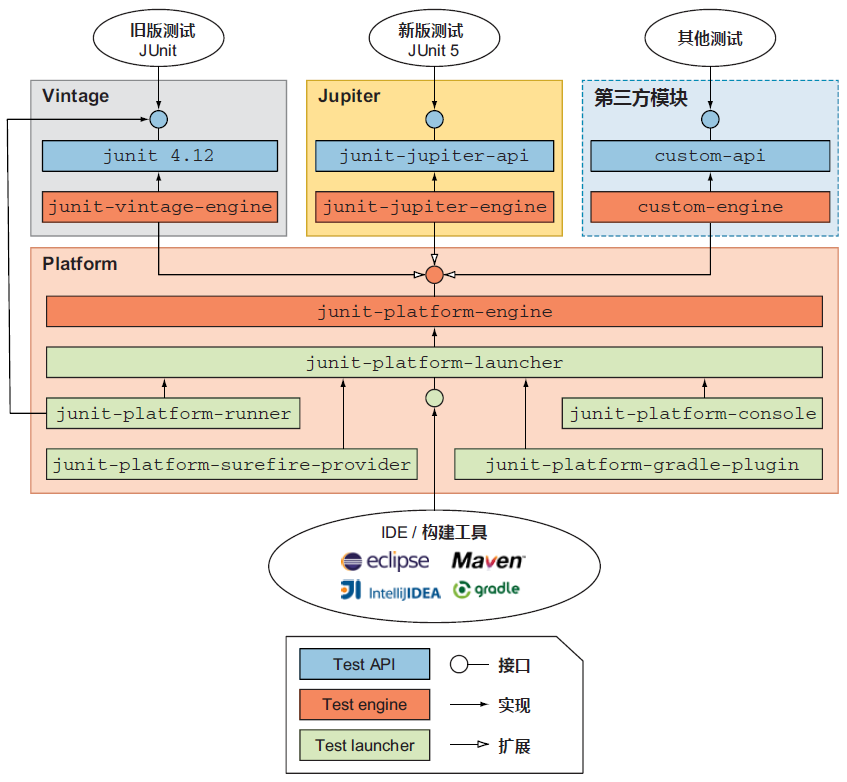

# 第三章 JUnit 的体系结构


> Architecture is the stuff that’s hard to change later. And there should be as little of that stuff as possible.
> 架构是那些日后难以变更的部分，应当尽可能减少这类内容。
>
> —— Martin Fowler

本章介绍与 `JUnit` 架构相关的知识点，从 `JUnit 4` 的架构特点切入，再讨论旧版架构存在的问题以及新版 `JUnit 5` 重点关注的部分，让读者对 JUnit 的架构特点及演进过程有一个大致的了解。


## 3.1 软件架构的概念


如图所示，软件架构的概念类似建筑物的体系结构，刻画了架构在整栋建筑物中的基础性地位。软件架构本身通常难以移动和替换，类似建筑物的底座；位于中间的各个部件则代表具体的设计层（design）；最顶部则代表软件的惯用模式（idiom）。虽然底座难以整体移动和替换，构建底座的架构元素反倒应该具备一定的灵活性且易于更换。`JUnit 4` 向 `JUnit 5` 的架构演进过程完美诠释了这一观点。


## 3.2 架构演进要素之——轻量化


为了形象说明轻量化在架构演进中的作用，书中讲述了一个电话簿的故事。面对两家供应商生产的同等价位、同等规格的电话簿，公司采购最终的策略是优先考虑更小巧轻便的那家供应商，因为同等情况下更小巧的尺寸意味着更高的信息密度；从使用习惯来考虑，人们也更愿意优先取用小巧便捷的电话簿。`JUnit 5` 也遵循了轻量化的原则。


## 3.3 架构演进要素之——模块化


相比之下，模块化的案例则略显生硬：一个运动鞋制造商为了降低生产成本将产地迁到低成本地区，面对当地频繁的新鞋失窃，决策层最终决定将左右脚的鞋子分开生产，从而节省了雇佣保安的额外费用。真正的模块化带来的核心价值在于 **灵活性、可复用性和效率的提升**，而不是解决“防盗”这种风马牛不相及的问题。

要说明模块化带来的好处，可以类比传统咖啡和定制咖啡之间的差异：旧模式下，每一款咖啡新品都像一个大包大揽的函数，里面包含了制作新咖啡的所有步骤，存在的问题主要是效率低下，点单的灵活性较差，库存管理复杂，同时存在创新瓶颈。采用定制模式后，将一杯咖啡解构为 **基础模块** + **组装规则模块**，例如确立几个独立的基础模块：

1. **基底模块**：意式浓缩、茶汤
2. **奶制品模块**：纯牛奶、燕麦奶、厚椰乳
3. **风味模块**：香草糖浆、焦糖糖浆、抹茶粉、巧克力酱
4. **顶料模块**：奶泡、肉桂粉

以及几个组合规则：

- 一个杯型（如中杯）默认包含**1 份** 基底和 **1 份** 风味。
- 更换奶制品或额外增加风味/顶料需要 **额外付费**。
- 所有模块通过 **搅拌和融合** 这个标准动作来连接。

这样一来，生产效率不仅因模块化大幅提升，同时也贴合了用户的多样化选择，库存管理上也可以精细到某个模块的开销，既优化采购环节，又减少了浪费。

最重要的是通过将复杂系统（整个菜单）拆分为可复用、可互换的模块，最终实现了 **效率、灵活性和可扩展性** 的飞跃。


## 3.4 JUnit 4 的架构特点

探讨旧版 `JUnit 4` 的架构有助于更好地理解和使用 `JUnit 5`，同时也为了兼顾当前大量基于 `JUnit 4` 构建的测试代码。

旧版 `JUnit` 发布于 2006 年，当时采用了笼统的单体架构，所有功能都集合在一个 `jar` 文件内，使用时只需在 `classpath` 下添加该文件即可。

所谓成也萧何败也萧何，当初 `JUnit 4` 作为亮点的架构设计反而成了进一步演进的缺陷，并最终催生了 `JUnit 5` 的问世。

主要体现在以下三个方面：

- 模块化设计：单体设计致使可扩展性不足。
- `runner` 测试运行器：`JUnit 4` 自带的解决功能扩展问题的方案之一，通过添加 `@RunWith` 注解并传入自定义的 `runner` 运行器类，间接实现 `JUnit 4` 的功能扩展。该自定义类须实现 `JUnit 4` 的抽象 `org.junit.runner.Runner` 类，并重写继承的 `getDescription()` 方法和 `run()` 方法。具体处理逻辑主要利用了 `Java` 的反射机制来实现。
- `rules` 测试规则的设计：`JUnit 4` 提供了另一种扩展方案，须实现接口 `org.junit.rules.TestRule` 并重写其 `apply()` 方法，然后在利用 `@Rule` 注解注入目标测试类。底层逻辑依然是 `Java` 反射机制。

因为反射机制破坏了 `OOP` 编程的封装原则，但书中并未展开解释，这里有必要补充说明。运行基于反射机制编写的 `JUnit 4` 测试代码，使得开发者可以绕开公共接口，直接窥探目标类或方法的私有状态。尤其是代码中直接设置 `method.setAccessible(true)` 的操作，相当于直接告诉 `JVM` 无视 `private` 这些修饰符，可以随便调用设计者限定的内部逻辑。一旦内部实现发生变更，即便公共接口不受影响，测试代码的运行也会立即失败，无形中推高了运维成本，也使得测试代码变得更加脆弱。

此外，测试方法在 `JUnit 4` 中还必须声明为 `public` 公有方法，并且方法名还必须满足特定的命名规则（`testXYZ`）才能被反射机制成功识别，给人一种 **测试代码并不是为了表达测试意图而书写、倒更像是为了满足框架的反射调用需求而书写** 的本末倒置的感觉。

最后一个致命缺陷才是书中说的，`JUnit 4` 只考虑了开发者的测试体验，却忽视了流行的代码工具对集成测试框架迫切需求。主流 `IDE` 工具和代码构建工具想要集成 `JUnit` 不得不深入框架内部，只能利用反射机制来访问受保护的私有类、方法或成员变量，不得不让这些工具与 JUnit 深度绑定，为后续升级带来巨大阻力，市场亟盼更轻量的基于模块化设计的全新测试框架，于是 `JUnit 5` 应运而生。


## 3.5 JUnit 5 的架构特点

全新的 `JUnit 5` 采用了模块化的解决方案，在践行 **关注点的逻辑分离** 原则上，主要聚焦三个方面：

- 为开发者提供编写测试的核心 `API`
- 重构测试的发现和运行机制
- 提供能与主流 `IDE` 和热门构建工具轻松交互的新 `API`，以简化测试的运行

这样就有了目前的三个固定模块：

- `JUnit Platform` 平台模块：不仅提供了基于 `JVM` 启动测试的专属平台，全新的 `API` 还可以让测试代码很方便地在控制台、`IDE` 及构建工具上启动。
- `JUnit Jupiter` 模型模块：提出了全新的单元测试编程模型与扩展模型。其命名 `Jupiter` 源自太阳系第五大行星木星——同时也是体积最大的行星。
- `JUnit Vintage` 测试引擎：用于在平台上运行基于 `JUnit 3`、`JUnit 4` 等历史版本的测试代码，实现向后兼容。

各模块的主要构件及用途梳理如下：

`JUnit Platform`：

|              构件名称               | 作用                                                         |
| :---------------------------------: | ------------------------------------------------------------ |
|      `junit-platform-commons`       | `JUnit` 的内部通用库，仅限 `JUnit` 框架内部使用。            |
|      `junit-platform-console`       | 提供从控制台发现和执行 `JUnit` 平台测试的相关支持。          |
| `junit-platform-console-standalone` | 包含所有依赖项的可执行 `jar` 包，是一个基于 `Java` 的命令行应用，可从控制台启动 `JUnit` 平台。 |
|       `junit-platform-engine`       | 测试引擎的公共 `API`。                                       |
|      `junit-platform-launcher`      | 用于配置和启动测试计划的公共 `API`，通常被 `IDE` 和构建工具使用。 |
|       `junit-platform-runner`       | 用于在 `JUnit 4` 环境下执行 `JUnit` 平台测试及测试套件的运行工具。 |
|     `junit-platform-suite-api`      | 包含在 `JUnit` 平台配置测试套件的相关注解。                  |
| `junit-platform-surefire-provider`  | 基于 `Maven` 在 `JUnit` 平台发现和执行测试。                 |
|   `junit-platform-gradle-plugin`    | 基于 `Gradle` 在 `JUnit` 平台发现和执行测试。                |

`JUnit Jupiter`：

|             构建名称             | 作用                                           |
| :------------------------------: | ---------------------------------------------- |
|       `junit-jupiter-api`        | 用于编写测试和扩展的专属 `API`                 |
|      `junit-jupiter-engine`      | `JUnit Jupiter` 专属测试引擎，仅用于运行时     |
|      `junit-jupiter-params`      | 为 `JUnit Jupiter` 的参数化测试提供相关支持    |
| `junit-jupiter-migrationsupport` | 提供从 `JUnit 4` 迁移到 `JUnit Jupiter` 的支持 |

而 `JUnit Vintage` 只包含一个 `junit-vintage-engine` 构件，用于运行 `JUnit 3` 或 `JUnit 4` 的实测用例。


## 3.6 JUnit 5 架构图

（详见原书图 3.8、3.9，P61）

简要版：


细致版：




## 3.7 旧版 JUnit 功能扩展示例

为了加深印象，本章还基于 `JUnit 4` 演示了自定义 `runner` 运行器和自定义 `rules` 规则的写法，同时附带了两个 `JUnit 4` 内置的 `rules` —— `ExpectedException` 和 `TemporaryFolder` 的用法（主要是为下一章的版本升级做铺垫）。

必需的依赖项：

```xml
<dependency>
    <groupId>org.junit.vintage</groupId>
    <artifactId>junit-vintage-engine</artifactId>
    <version>5.6.0</version>
    <scope>provided</scope>
</dependency>
```


### 3.7.1 示例1：自定义 rules 规则

先来看自定义 `rules` 的例子，实现在测试方法前后输出一行文字内容：

```java
public class CustomRule implements TestRule {
    private Statement base;
    private Description description;

    @Override
    public Statement apply(Statement base, Description description) {
        this.base = base;
        this.description = description;
        return new CustomStatement(base, description);
    }

    private static class CustomStatement extends Statement {
        private final Statement base;
        private final Description description;

        public CustomStatement(Statement base, Description description) {
            this.base = base;
            this.description = description;
        }

        @Override
        public void evaluate() throws Throwable {
            System.out.println(this.getClass().getSimpleName() + " " + description.getMethodName() + " has started");
            try {
                base.evaluate();
            } finally {
                System.out.println(this.getClass().getSimpleName() + " " + description.getMethodName() + " has finished");
            }
        }
    }
}

// test class
public class CustomRuleTester {
    @Rule
    public CustomRule myRule = new CustomRule();

    @Test
    public void myCustomRuleTest() {
        System.out.println("Call of a test method");
    }
}
```

运行结果：


> [!note]
>
> **注意**
>
> `@Rule` 注解除了像 `L3` 那样加到成员变量上，还可以加到注入字段的 `getter` 方法上（比成员变量先执行，也是官方文档的推荐做法）：
>
> ```java
> public class CustomRuleTester2 {
> 
>     private CustomRule myRule = new CustomRule();
>     @Rule
>     public CustomRule getMyRule() {
>         return myRule;
>     }
> 
>     @Test
>     public void myCustomRuleTest() {
>         System.out.println("Call of a test method");
>     }
> }
> ```
>
> 最终实测效果也是一样的。


### 3.7.2 示例2：自定义 runner 运行器

自定义 `runner` 稍显复杂，需要通过 `RunNotifier` 对象手动指定测试用例的开头和结尾：

```java
public class CustomTestRunner extends Runner {

    private final Class<?> testedClass;

    public CustomTestRunner(Class<?> testedClass) {
        this.testedClass = testedClass;
    }

    @Override
    public Description getDescription() {
        return Description
                .createTestDescription(testedClass, this.getClass().getSimpleName() + " description");
    }

    @Override
    public void run(RunNotifier notifier) {
        System.out.println("Running tests with " + this.getClass().getSimpleName() + ": " + testedClass);
        try {
            Object testObject = testedClass.newInstance();
            for (Method method : testedClass.getMethods()) {
                if (method.isAnnotationPresent(Test.class)) {
                    notifier.fireTestStarted(Description
                            .createTestDescription(testedClass, method.getName()));
                    method.invoke(testObject);
                    notifier.fireTestFinished(Description
                            .createTestDescription(testedClass, method.getName()));
                }
            }
        } catch (InstantiationException | IllegalAccessException | InvocationTargetException e) {
            throw new RuntimeException(e);
        }
    }
}

// test class
@RunWith(CustomTestRunner.class)
public class CalculatorTest {
    @Test
    public void testAdd() {
        Calculator calculator = new Calculator();
        double result = calculator.add(10, 50);
//      assertEquals(61, result, 0);
        MatcherAssert.assertThat("10 add 50 should be 60", result, Matchers.closeTo(61, 0.01));
    }
}
```

实测结果（故意改为报错的情况，用到了 `Hamcrest` 提供的断言方法）：


### 3.7.3 示例3：内置 rules 演示抛异常下的测试

需要用到内置 `rules` 类 `ExpectedException`，对抛出的异常和异常信息的设置必须先于测试代码的执行：

```java
public class RuleExceptionTester {
    @Rule
    public ExpectedException expectedException = ExpectedException.none();

    private Calculator calculator = new Calculator();

    @Test
    public void expectIllegalArgumentException() {
        expectedException.expect(IllegalArgumentException.class);
        expectedException.expectMessage("Cannot extract the square root of a negative value");
        calculator.sqrt(-1);
    }

    @Test
    public void expectArithmeticException() {
        expectedException.expect(ArithmeticException.class);
        expectedException.expectMessage("Cannot divide by zero");
        calculator.divide(1, 0);
    }
}
```


### 3.7.4 示例4：内置 rules 演示临时文件与文件夹的测试

对于需要临时创建文件夹或临时文件的测试场景，`JUnit 4` 也提供了内置的工具类 `TemporaryFolder`，可实现测试前的自动创建，并在测试完成后自动清理。

和 `ExpectedException` 类似，相关文件操作必须写在断言语句前面（L9、L10）：

```java
public class RuleTester {
    @Rule
    public TemporaryFolder folder = new TemporaryFolder();
    private static File createdFolder;
    private static File createdFile;

    @Test
    public void testTemporaryFolder() throws IOException {
        createdFolder = folder.newFolder("createdFolder");
        createdFile = folder.newFile("createdFile.txt");
        assertTrue(createdFolder.exists());
        assertTrue(createdFile.exists());
    }

    @AfterClass
    public static void cleanUpAfterAllTestsRan() {
        assertFalse(createdFolder.exists());
        assertFalse(createdFile.exists());
    }
}
```


注意：给出这四个示例的根本目的，是为了突出 `JUnit 4` 自定义扩展的难写和反射机制的种种弊端，为下一章 `JUnit 5` 的优化做铺垫。

