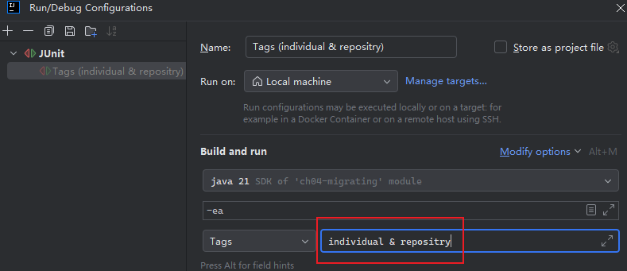

# 第四章 从 JUnit 4 迁移到 JUnit 5


> *Nothing in this world can survive and remain useful without an update.*
> 世间万物若不更新迭代，终将难逃消亡命运。
>
> —— Charles M. Tadros

本章通过一个具体的例子，详细介绍了 `JUnit 4` 迁移到 `JUnit 5` 的全过程，可作为日后项目实战的重要参考。


## 4.1 版本迁移的基本步骤

`JUnit` 版本迁移的基本顺序如下：

| 主要步骤                                  | 说明                                                         |
| ----------------------------------------- | ------------------------------------------------------------ |
| 替换所需的 `Maven` 依赖项                 | `JUnit 4` 只需要一个依赖项；`JUnit 5` 则需要更多依赖项。`JUnit 5` 使用 `JUnit Vintage` 模块兼容 `JUnit 4` 的测试用例。 |
| 改用新版注解                              | `JUnit 5` 注解与旧版注解部分相同，同时引入了新注解。         |
| 替换测试类与测试方法                      | `JUnit 5` 的断言和假设已调整到不同包路、不同的类中了。       |
| 替换旧版的 `rules` 规则和 `runner` 运行器 | 这是 **最费劲** 的一步；但由于新旧测试可以长期共存，相关升级也可以陆续逐步完成。 |


## 4.2 依赖项的变更

迁移前：

```xml
<dependency>
    <groupId>junit</groupId>
    <artifactId>junit</artifactId>
    <version>4.12</version>
    <scope>test</scope>
</dependency>
```

迁移中：替换为新版的 `Vintage` 模块后，先完整运行一遍所有旧版测试，确保测试用例本身没问题：

```xml
<dependency>
    <groupId>org.junit.vintage</groupId>
    <artifactId>junit-vintage-engine</artifactId>
    <version>5.6.0</version>
    <scope>test</scope>
</dependency>
```

确认无误后，再根据需要引入新的 `JUnit 5` 模块依赖：

```xml
<dependency>
    <groupId>org.junit.jupiter</groupId>
    <artifactId>junit-jupiter-api</artifactId>
    <version>5.6.0</version>
    <scope>test</scope>
</dependency>
<dependency>
    <groupId>org.junit.jupiter</groupId>
    <artifactId>junit-jupiter-engine</artifactId>
    <version>5.6.0</version>
    <scope>test</scope>
</dependency>
```

如果存在重复性或参数化测试用例，还需引入 `junit-jupiter-params` 依赖：

```xml
<dependency>
    <groupId>org.junit.jupiter</groupId>
    <artifactId>junit-jupiter-params</artifactId>
    <version>5.6.0</version>
    <scope>test</scope>
</dependency>
```

最后，彻底迁移完毕后，删除最开始引入的、兼容旧版测试用例的 `Vintage` 引擎模块：

```xml
<dependency>
    <groupId>org.junit.vintage</groupId>
    <artifactId>junit-vintage-engine</artifactId>
    <version>5.6.0</version>
    <scope>test</scope>
</dependency>
```


## 4.3 注解、类和方法的迁移

注解主要涉及的迁移如下：

| **JUnit 4**                   | **JUnit 5**                 |
| ----------------------------- | --------------------------- |
| `@BeforeClass`、`@AfterClass` | `@BeforeAll`、`@AfterAll`   |
| `@Before`、`@After`           | `@BeforeEach`、`@AfterEach` |
| `@Ignore`                     | `@Disabled`                 |
| `@Category`                   | `@Tag`、`@Tags`             |

断言类主要涉及的迁移如下：

| **JUnit 4**                                 | **JUnit 5**                                                  |
| ------------------------------------------- | ------------------------------------------------------------ |
| `org.junit.Assert`                          | `org.junit.jupiter.api.Assertions`                           |
| 可选的失败提示消息在 **第一个** 参数位置    | 可选的失败提示消息在 **最后一个** 参数位置                   |
| `assertThat` 方法还在 `org.junit.Assert` 内 | 已迁出 `JUnit`，推荐调用 `Hamcrest` 中 `org.hamcrest.MatcherAssert` 的同名断言方法。 |

假设类主要涉及的迁移如下：

| **JUnit 4**                                          | **JUnit 5**                         |
| ---------------------------------------------------- | ----------------------------------- |
| `org.junit.Assume`                                   | `org.junit.jupiter.api.Assumptions` |
| 存在 `assumeNotNull()` 和 `assumeNoException()` 方法 | 已移除                              |


## 4.4 @Category 注解的升级

新版 `JUnit` 通过 `@Tag` 和 `@Tags` 实现对 `@Category` 的升级。旧版 `@Category` 注解的写法非常繁琐（P73）。

实测发现同一个测试类或方法可以加注多个 `@Tag` 注解，也可以在 `@Tags` 注解中填入一个 `@Tag` 数组，效果是一样的：

```java
@Tag("individual")
@Tag("repository")
public class JUnit5CustomerTest {
    private String CUSTOMER_NAME = "John Smith";
    @Test
    void testCustomer() {
        Customer customer = new Customer(CUSTOMER_NAME);
        assertEquals("John Smith", customer.getName());
    }
}

// 等效于：

@Tags({@Tag("individual"), @Tag("repository")})
public class JUnit5CustomerTest {
    private String CUSTOMER_NAME = "John Smith";
    @Test
    void testCustomer() {
        Customer customer = new Customer(CUSTOMER_NAME);
        assertEquals("John Smith", customer.getName());
    }
}
```

上述注解表达的语义是：**两个标签同时存在** 的测试方法才可以运行；对应的 `IDEA` 配置文件的 `Tags` 的值应该为 `individual & repositry`：



此外，`IDEA` 中的 `Tags` 值还可以是 `individual | repositry`，表示逻辑或的筛选条件。

指定一个或多个标签时，既可以从 `IDEA` 设置启动，也可以从 `pom.xml` 配置启动：

```xml
<plugin>
    <artifactId>maven-surefire-plugin</artifactId>
    <version>2.22.2</version>
    <configuration>
        <groups>individual</groups>
        <excludedGroups>repository</excludedGroups>
    </configuration>
</plugin>
```

> [!tip]
>
> **关于 `groups` 和 `excludedGroups` 的取值**
>
> 经实测，如果存在多个标签要运行，只能写为 `<groups>individual, repository</groups>` 或者 `<groups>individual | repository</groups>`，并且只支持逻辑或关系，无法描述逻辑与关系（只有在 `IDEA` 才能描述逻辑与，需键入 `individual & repository`）。
>
> 并且 `groups` 和 `excludedGroups` 只支持单个 `XML` 标签，强制写多个只会另最后一个生效。

测试执行命令：`mvn test`


## 4.5 Hamcrest 断言的迁移

这部分反倒没有需要特别注意的地方，无非是将 `JUnit 4` 中的注解改为 `JUnit 5` 的，或者将原来在 `JUnit 4` 中的 `assertThat` 断言改为从 `Hamcrest` 导入；其他辅助 `Matcher` 对象通常保持不变。


## 4.6 rules 的迁移

这部分内容沿用了第三章末尾列举了两个 `JUnit 4` 内置的扩展 `rules`：抛异常场景下的测试用例、以及存在临时文件操作的测试用例，分别要用到 `ExpectedException` 规则类和 `TemporaryFolder` 规则类。

在新版 `JUnit 5` 中：

- `ExpectedException` 可以直接用新增的 `assertThrows` 断言替换；
- `TemporaryFolder` 则可以通过添加了 `@TempDir` 注解的 `Path` 成员变量来实现。

这两个案例的代码可读性都得到了显著增强。


## 4.7 自定义 rules 规则的迁移

由于篇幅限制，本章只演示了自定义 `rules` 规则的版本升级做法，自定义 `runner` 运行器的案例在后续章节中展开。

书中案例介绍了如何在常规断言逻辑的前后实现各插入一段文字内容的扩展功能。

根据 `JUnit 4` 的扩展设计，旧版 `rules` 规则需要创建一个规则类来实现 `TestRule` 接口。在实现其 `apply()` 方法的过程中，还需要返回一个自定义语句类；该语句类必须实现抽象类 `Statement` 中的 `evaluate()` 方法。最后，要执行这个自定义规则的逻辑，需要在测试类中利用 `@Rule` 注解注入该自定义规则。整个过程十分繁琐。

对比 `JUnit 5` 提供的全新扩展方案，开发者只需要定义一个自定义的扩展类 `CustomExtension`，并让它同时实现 `AfterEachCallback` 和 `BeforeEachCallback` 两个生命周期接口，然后重写其抽象方法即可，代码结构大大简化。使用时，只需在测试类上加注 `@ExtendWith(CustomExtension.class)` 注解，即可引入刚创建的自定义逻辑。

具体代码如下：

旧版 `rules` 实现：

```java
public class CustomRule implements TestRule {

    @Override
    public Statement apply(Statement base, Description description) {
        return new CustomStatement(base, description);
    }

    private static class CustomStatement extends Statement {
        private final Statement base;
        private final Description description;

        public CustomStatement(Statement base, Description description) {
            this.base = base;
            this.description = description;
        }

        @Override
        public void evaluate() throws Throwable {
            System.out.println(this.getClass().getSimpleName() + " " + description.getMethodName() + " has started");
            try {
                base.evaluate();
            } finally {
                System.out.println(this.getClass().getSimpleName() + " " + description.getMethodName() + " has finished");
            }
        }
    }
}

// usage
public class JUnit4CustomRuleTester {
    @Rule
    public CustomRule myRule = new CustomRule();
    @Test
    public void myCustomRuleTest() {
        System.out.println("Call of a test method");
    }
}
```

新版 `extension` 扩展写法：

```java
public class CustomExtension implements AfterEachCallback, BeforeEachCallback {
    @Override
    public void beforeEach(ExtensionContext extensionContext) throws Exception {
        System.out.println(this.getClass().getSimpleName() + " " + extensionContext.getDisplayName() + " has started");
    }

    @Override
    public void afterEach(ExtensionContext extensionContext) throws Exception {
        System.out.println(this.getClass().getSimpleName() + " " + extensionContext.getDisplayName() + " has finished");
    }
}

// usage
@ExtendWith(CustomExtension.class)
public class JUnit5CustomExtensionTester {
    @Test
    public void myCustomRuleTest() {
        System.out.println("Call of a test method");
    }
}
```

