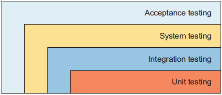

# 第五章 软件测试原则


> *A crash is when your competitor’s program dies. When your program dies, it is an “idiosyncrasy.” Frequently, crashes are followed with a message like “ID 02.” “ID” is an abbreviation for idiosyncrasy, and the number that follows indicates how many more months of testing the product should have had.*
> 竞争对手的程序崩溃叫“崩溃”，而你的程序崩溃则称为“特性（idiosyncrasy）”。崩溃后常会出现类似“ID 02”的提示。“ID”是“特性（idiosyncrasy）”的缩写，后面的数字表示这个产品本应再经过多少个月的测试。
>
> —— Guy Kawasaki

本章重点审视各类软件测试方法及其在应用程序生命周期中所扮演的各种角色。

要成为顶级开发者，必须深谙单元测试与功能测试等其他类型测试的区别和联系。


## 5.1 单元测试 vs 功能测试

相比功能测试，单元测试更加强大，用途更为广泛。

单元测试的必要性集中体现在：

- 测试覆盖面更广；
- 可以提升团队生产力；
- 检测回归问题，减少调试需求；
- 增强重构和常规变更的信心；
- 改进代码实现；
- 记录预期行为；
- 启用代码覆盖率等指标。


根据经验，功能测试大约能覆盖应用代码的 70%；若要更进一步提高测试覆盖率，则需要编写 **单元测试**。

此外，单元测试可以轻松模拟错误工况，而功能测试几乎不可能办到。

离开单元测试，代码重构就缺乏有效的评判依据。

与传统分层实现的水平编程方式不同，敏捷开发践行者主张通过垂直切割来产出可运行的用例。

敏捷开发提供了一系列标准化的快速迭代手段和基本原则，如 `YAGNI` 原则 [^1] 以及 **最简单可行方案** 原则 [^2]。这些基本原则的落地都离不开一整套完善的单元测试体系。

单元测试是展示 `API` 用法的经典范例，堪称最佳的开发者文档。

单元测试记录预期行为的例子：

```java
public class JUnit5ExceptionTester {
    private Calculator calculator = new Calculator();
    @Test
    public void expectIllegalArgumentException() {
        assertThrows(IllegalArgumentException.class,
            () -> calculator.sqrt(-1));
    }
    @Test
    public void expectArithmeticException() {
        assertThrows (ArithmeticException.class,
            () -> calculator.divide(1, 0));
    }
}
```


## 5.2 测试的分类

按照测试的覆盖范围进行分类，可分为以下四类：



从外到内依次为：

- 验收测试
- 系统测试
- 集成测试
- 单元测试


## 5.3 模拟测试及其应用场景

模拟测试通常出现在系统测试阶段。

测试替身（Test doubles）或模拟对象（mock objects）能够模拟复杂真实对象的行为，因此在以下场景中非常有用：

- 与外部服务通信时；
- 与尚未就绪、响应缓慢、配置复杂或难以访问的内部服务交互时；
- 对接尚未完全可用的服务时。


## 5.4 集成测试及其交互特点

集成测试通常需要先定调、再开发。主要的交互类型和特点如下：

| 交互类型 | 交互特点                                                     |
| -------- | ------------------------------------------------------------ |
| 对象间   | 该测试会实例化某个对象并调用对应的方法，观察不同的对象间交互模式是否正确。 |
| 服务间   | 例如需要测试托管到容器的应用，该应用可能会连接数据库或挂载到其他外设上。 |
| 子系统间 | 例如分层设计下的前后端联调测试。这类测试可以验证前端请求的发送，以及后端的响应情况。适用于包含表现层（Web 界面）和执行逻辑的各业务服务层构建的应用。 |


## 5.5 验收测试的经典句式

验收测试通常使用 `Given`、`When` 和 `Then` 等关键词来叙事：

- Given that there is an economy offer, When we have a regular customer, Then we can add them to and remove them from the offer.
- Given that there is an economy offer, When we have a VIP customer, Then we can add them to the offer but not remove them from the offer.
- 基本结构：界定前提、提出条件、给出断言。


## 5.6 黑盒测试 vs 白盒测试

最基础的黑盒测试形式是手动模拟用户界面操作；更复杂的方法是使用自动化工具，例如 `HttpUnit`、`HtmlUnit` 或 `Selenium`。

白盒测试有时也称透明盒测试。这是一种基于对实现细节的深入了解来设计测试并驱动测试的操作流程。

除了理解组件的实现外，测试人还需知晓该组件与其他组件的交互方式。因此，最适合创建白盒测试的其实是 **实现该组件的开发者本人**。


黑白盒测试的优缺点对比：

优点对比：

|              黑盒测试              |                白盒测试                |
| :--------------------------------: | :------------------------------------: |
| 以用户为中心，能够暴露规范中的差异 |     可以从项目的早期阶段就开始实施     |
|      测试人员可以是非技术人员      |           无需图形化用户界面           |
|      测试可以独立于开发者进行      | 测试由开发者控制，能够覆盖多种执行路径 |

缺点对比：

|               黑盒测试               |              白盒测试              |
| :----------------------------------: | :--------------------------------: |
|        仅能测试有限数量的输入        |     只能由懂编程的熟练人员实施     |
|       许多程序路径可能无法覆盖       | 一旦实现有变动，测试很可能就要重写 |
| 易出现冗余测试，因为缺乏对细节的了解 |      测试逻辑与具体实现紧耦合      |

黑盒测试的编写和执行难度更高，因为通常涉及图形化的前端界面；白盒测试写起来容易，但只能让开发者亲自操刀。

白盒测试比黑盒测试提供更好的测试覆盖率；黑盒测试可能比白盒测试更具价值。

极限编程的目标之一就是尽早且高频发布版本，因为客户的及时反馈拥有巨大的价值。


---

[^1]: You Ain't Gonna Need It. 译为“你不需要它”，强调非必要不实现某功能，避免提前开发 **可能** 会用到的代码。
[^2]: The Simplest Thing That Could Possibly Work，即 **用最简单、最直接的方式解决问题，而不是过度设计** 

