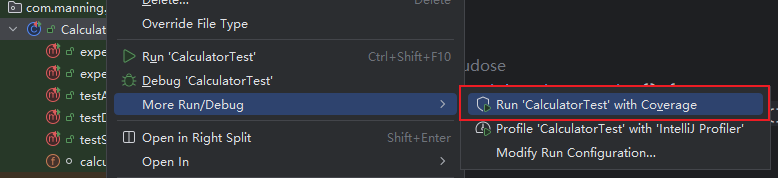

# 第六章 测试质量


> **本章概要**
>
> - 测试覆盖率的度量方法
> - 可测试代码的写法
> - 考察测试驱动开发及行为驱动开发
> - 变异测试入门
> - 开发周期中的测试实践


本章较为深入地剖析了测试代码的质量问题，以及评价测试质量高低的相关指标；然后从实战的角度介绍了测试覆盖率的概念和对应工具插件的用法（`JaCoCo`）。接着探讨了编写可测试代码的几条重要准则（偏理论）。

由于测试覆盖率指标存在缺陷，作者又进一步介绍了其他提高测试质量的手段，包括测试驱动开发、行为驱动开发的基本流程，以及变异测试的相关内容（已超纲，未展开）。

最后，遵循持续集成的基本原则，介绍了项目开发的完整生命周期（四大阶段），并以此为基础介绍了何时应当执行何种类型测试的理想模式，然后梳理总结了 `JUnit` 的最佳实践——持续回归测试。


## 6.1 测试覆盖率的概念

单元测试的目的主要是增强开发者修改和重构代码的信心，关键在于这些测试代码能否及时响应代码的变更，确保改动的内容不会破坏原有的功能。换言之，开发者需要明确知晓这些单元测试代码在运行时到底执行了哪些代码。

测试覆盖率的度量方式并不唯一，通常包括两类：

- 在测试套件执行期间，计算被调用的程序方法的占比，或者被调用代码行在总代码行中的百分比。
- 追踪测试代码最终调用了哪些方法并给出统计结果。

本节还回答了一个十分重要的问题：测试质量仅与测试覆盖率相关，但不存在必然的因果关系——高代码覆盖率并不能确保测试的高质量。

因此，测试覆盖率是一个存在争议的度量指标。优秀的开发者应该透过现象看本质，参考它，但不完全依赖它。


## 6.2 黑白盒测试对测试覆盖率的影响

黑盒测试的覆盖率相对较低，原因如下：


由于白盒测试可以深入功能模块的实现细节，其测试覆盖率理论上可以打到 100%：


覆盖率偏低，要么测试数量不足，要么测试用例本身存在冗余，无法测到真正要测的情况。不管属于哪种，都需要更多的额外分析工作，不能一概而论。


## 6.3 计算测试覆盖率的工具

### 6.3.1 IDEA 内置工具

`IDEA` 内置了包含测试覆盖率的功能：



实测结果：


并且能生成简易的测试报告：


### 6.3.2 第三方 Maven 插件 JaCoCo

想要获取更精确的测试覆盖率指标，可以借助第三方插件 `JaCoCo`（[https://www.jacoco.org/jacoco/](https://www.jacoco.org/jacoco/)）。

先配置 `Maven` 插件（原书版本太久无法运行，更新到最新版 `v0.8.14` 后正常）：

```xml
<plugin>
    <groupId>org.jacoco</groupId>
    <artifactId>jacoco-maven-plugin</artifactId>
    <version>0.8.14</version>
    <executions>
        <execution>
            <goals>
                <goal>prepare-agent</goal>
            </goals>
        </execution>
        <execution>
            <id>report</id>
            <phase>test</phase>
            <goals>
                <goal>report</goal>
            </goals>
        </execution>
        <execution>
            <id>jacoco-check</id>
            <phase>test</phase>
            <goals>
                <goal>check</goal>
            </goals>
            <configuration>
                <rules>
                    <rule>
                        <element>PACKAGE</element>
                        <limits>
                            <limit>
                                <counter>LINE</counter>
                                <value>COVEREDRATIO</value>
                            </limit>
                        </limits>
                    </rule>
                </rules>
            </configuration>
        </execution>
    </executions>
</plugin>
```

运行命令 `mvn test` 后，会在指定的 `target/site/jacoco/` 下生成多种格式的测试报告：


用浏览器打开 `index.html` 看到更详细的测试结果：


甚至能查看目标模块每一行的覆盖情况：


## 6.4 编写可测试代码的基本原则

### 原则一：公共 API 即契约

首先是深化理解：**公共 API 接口就是某种意义上的契约**，变更需趁早，且务须慎重（NASA 火星探测器的血泪教训）。


### 原则二：减少依赖

不要对依赖直接实例化，而要改为依赖注入，以方便后续测试：

```java
// before
class Vehicle {
    Driver d = new Driver();
    boolean hasDriver = true;
    private void setHasDriver(boolean hasDriver) {
        this.hasDriver = hasDriver;
    }
}

// after
class Vehicle {
    Driver d;
    boolean hasDriver = true;
    Vehicle(Driver d) {
        this.d = d;
    }
    private void setHasDriver(boolean hasDriver) {
        this.hasDriver = hasDriver;
    }
}
```


### 原则三：构造函数要尽量简单

每个测试用例需要走到的基本步骤：

1. 实例化待测试的类；
2. 给这个类配置相应的状态；
3. 执行必要的操作；
4. 断言最终的状态。

因此，按照单一职责的思想，构造函数尽量不要混入太多无关逻辑：

```java
// before
class Car {
    private int maxSpeed;
    Car() {
        this.maxSpeed = 180;
    }
}

// after
class Car {
    private int maxSpeed;
    public void setMaxSpeed(int maxSpeed) {
        this.maxSpeed = maxSpeed;
    }
}
```


### 原则四：遵循 Demeter 法则（最少知识原则）

一个类应当仅了解它必须知道的内容。

其他常见表述：

- Talk to your immediate friends.
- Don’t talk to strangers.

```java
// before
class Car {
    private Driver driver;
    Car(Context context) {
        this.driver = context.getDriver();
    }
}

// after
Car(Driver driver) {
    this.driver = driver;
}
```

> [!note]
>
> **切记：**
>
> 直接限定对象，而不是中转搜寻对象；只获取程序必需的对象（引入 `context` 就是个反例）。


> [!tip]
>
> **小知识：Miško Hevery 社会化类比**
>
> 将类之间的关系比作社交关系，提倡类之间应该像社交场景下的独立个体一样，保持 **清晰的边界** 和 **最小化依赖**。
>
> 要点提炼：
>
> - 明确职责边界：每个类应该像社会中的个人一样，有自己明确的职责和能力范围
> - 最小化社交圈：类之间的依赖关系要尽可能少，就像一个人不需要认识全社会的人也能正常工作
> - 自给自足：类应该尽可能独立完成自己的任务，而不是过度依赖其他类
> - 契约化协作：类之间通过清晰的接口（契约）进行协作，而不是紧密耦合
>
> 换言之，A 与 B 相熟，但与 C 都不熟，那么 C 就不应该知道 AB 之间共享的信息。这是最理想的情况。但如果 A 刻意隐瞒与 C 也认识，那么这种平衡就会打破，关键信息就可能在看不见的隐秘途径间传递，从而加大测试难度。


### 原则五：避免隐藏依赖和全局状态

```java
// before
public void makeReservation() {
    Reservation reservation = new Reservation();
    reservation.makeReservation();
}
public class Reservation {
    public void makeReservation() {
        manager.initDatabase(); //manager is a reference to a global
                                //DBManager, already initialized
        //require the global DBManager to do more action
    }
}

// after
public void makeReservation() {
    DBManager manager = new DBManager();
    manager.initDatabase();
    Reservation reservation = new Reservation(manager);
    reservation.makeReservation();
}
```

**切记**：引入全局变量时并非仅仅引入该变量本身，**也包括与它存在依赖关系的 *所有业务逻辑***。


### 原则六：优先考虑泛型方法

在最为核心的底层业务逻辑中，如果大量使用通用的静态方法，会给测试造成极大干扰，导致大量的测试冗余代码，也不利于测试逻辑的植入。

相比于静态方法，更推荐的做法是利用 OOP 的多态特性，为后续测试提供更多的 **接合点/连接点（*articulation points*）**，即多采用 **父类接口 + 子类实现** 的多态设计构建各功能模块。这样一来，后续测试只需要创建一个针对测试的子类实现就能轻松替换原逻辑，具备更好的可扩展性和可维护性。

相比之下，静态方法的灵活性就差了很多，因为缺乏有效的连接点，不得不在测试用例中大量重复调用静态方法，也无法灵活切换到测试场景下。

```java
// before
public static Set union(Set s1, Set s2) {
    Set result = new HashSet(s1);
    result.addAll(s2);
    return result;
}

// after
public static <E> Set<E> union(Set<E> s1, Set<E> s2) {
    Set<E> result = new HashSet<>(s1);
    result.addAll(s2);
    return result;
}
```


### 原则七：优先考虑组合而非继承

继承仅在满足 `IS-A` 关联关系时考虑使用。

最佳实践：应当尽量让代码在运行时保持最大的灵活性。
这样就能确保对象状态之间的切换变得容易，从而使代码更易于测试。

令人感到讽刺的是，`Java` 的内部库也存在违反这一原则的情况：

- `Stack` 继承了 `Vector`：按理 `Stack` 又不是 `Vector`（`IS-A` 不成立），不该继承；
- `Properties` 继承了 `Hashtable`：同上，`IS-A` 关系也不成立，也不该继承。


### 原则八：优先使用多态而非条件判断

直接上代码：

```java
// before
public class DocumentPrinter {
    // snip
    public void printDocument() {
        switch (document.getDocumentType()) {
            case WORD_DOCUMENT:
                printWORDDocument();
                break;
            case PDF_DOCUMENT:
                printPDFDocument();
                break;
            case TEXT_DOCUMENT:
                printTextDocument();
                break;
            default:
                printBinaryDocument();
                break;
        }
    }
    // snip
}

// after:
public class DocumentPrinter {
    // snip
    public void printDocument(Document document) {
        document.printDocument();
    }
}
public abstract class Document {
    // snip
    public abstract void printDocument();
}
public class WordDocument extends Document{
    // snip
    public void printDocument() {
        printWORDDocument();
    }
}
public class PDFDocument extends Document {
    // snip
    public void printDocument() {
        printPDFDocument();
    }
}
public class TextDocument extends Document {
    // snip
    public void printDocument() {
        printTextDocument();
    }
}
```


## 6.5 测试驱动开发简介

概念：**测试驱动开发（*TDD*）** 是这样一种编程实践：它强调 **测试先行**，然后编写代码以通过这些测试；接着审查代码并 **适当重构**，以进一步改进设计。

`TDD` 旨在产出 **可胜任工作的整洁代码**。

`TDD` 让测试用例成为待测方法的 **第一位用户**，与传统的流程（先编写待测方法，然后再测试验证该方法）不同。

传统开发流程：

```markdown
[code, test, (repeat)]
```

`TDD` 开发流程：

```markdown
[test, code, (repeat)]
```

现实中的真实流程还应加入 **重构**：

```markdown
[test, code, _refactor_, (repeat)]
```

`TDD` 两步法：

- 编写新代码之前先编写一个失败的测试；
- 编写能让失败测试通过的最少量代码。


## 6.6 JUnit 最佳实践

**先编写未通过的测试（*Write failing tests first*）**

初始的未通过状态，表明此时还没有正确实现既定的业务逻辑。一旦养成习惯，开发新模块时就会先写测试再写功能模块，然后重构、优化。该过程熟练后，测试通过的时候，往往也是该模块大功告成的时候。


## 6.7 行为驱动开发简介

概念：**行为驱动开发（*Behavior-driven Testing*）** 是这样一种开发手段：它强调 **直接满足业务需求**，其核心理念是由业务战略、需求和目标驱动，并将这些因素提炼、转化为最终的 IT 解决方案。

`BDD` 旨在构建值得构建的软件，并以解决用户痛点为己任。

软件的商业价值究竟体现在什么地方？
`BDD` 给出的回答是：体现在能够胜任实际工作的 **功能特性（*features*）** 上。**功能特性** 是可交付、有形的碎片化功能，可有效帮助相关业务达成商业目的。

为实现业务目标——

- 业务分析师会与客户协作，确定所需的软件功能，例如：
  - 从多个备选路线中，为用户提供某种方法直达目的地；
  - 为客户提供最优路径抵达目的地的方式。
- 然后基于用户视角，将这些功能拆分为具体的叙事（stories）逻辑，例如：
  - 寻找中转次数最少的路线；
  - 寻找用时最少的路线。

这些叙事逻辑需要用具体的测试用例进行描述，并最终转化为用户叙事的验收标准。

`BDD` 固定句式：

- `Given`：假定……成立
- `When`：当满足……条件时
- `Then`：则（应当满足）……（断言结果）


## 6.8 变异测试简介

100% 的代码覆盖率并不意味着你的代码就完美无瑕了——测试代码可能还不够好。

最极端的情况：在测试中略过所有断言。
例如，输出结果过于复杂难以验证，只能将其打印或写入日志，让其他人来决定怎么处理。

**变异测试（*Mutation testing*）**：又称 **变异分析（*mutation analysis*）** 或 **程序变异（*program mutation*）**，主要用于设计新的软件测试、评估现有软件测试的质量。

变异测试的目的在于 **检验测试质量，并确保测试符合预期**。

基本原理：对程序 *P* 进行细微修改。每个修改后的版本 *M* 称为 *P* 的 **变体（*mutant*）**，*P* 则是 *M* 的 **父体（*parent*）**；原始版本的行为与变异体不同，测试执行需要检测并拒绝这些变异体，这个过程称为 **杀死变异体（*killing the mutant*）**。测试套件的编写质量可通过其被杀变异体的占比来衡量，也可以设计新的测试用例来杀死更多变异体。

> [!tip]
>
> 变异测试的内容已超纲，书中并未详细展开。具体情况可参考普渡大学计算机科学教授 **Aditya P. Mathur** 教授编著的 ***Foundations of Software Testing / 2e***（2013 年 5 月出版）。
>
> 根据该书定义，将一个 **活跃变体（*live mutant*）** 同其父体程序区分开的过程，又称作 **杀死（*killing*）** 一个变体。 
>
> 原文：Note that *distinguishing* a mutant from its parent is sometimes referred to as *killing* a mutant.

考虑下列简化程序逻辑：

```js
if(!a) {
    b = 1;
} else {
    b = 2;
}
```

一个强大的变异测试满足以下条件：

- 测试到达了变异后的 `if` 条件；
- 测试会沿着与初始正确分支不同的分支继续执行；
- 变更后的 `b` 值会传播到程序输出结果中，并被测试所验证；
- 由于该方法返回了错误的 `b` 值，测试终将失败。

编写良好的测试必须能判定变异测试的失败，从而证明它们最初覆盖了必要的逻辑条件。

最有名的 `Java` 变异测试框架是 `Pitest`（[https://pitest.org/](https://pitest.org/)）。


## 6.9 开发周期中的测试

为了考察不同类型的测试在整个开发周期中的分布情况，作者将整个开发周期（带 `CI/CD` 工作流）划分为四个核心阶段（开发阶段、集成阶段、验收压力测试阶段、预生产阶段），并给出了各阶段的特点和对应测试类型的主要任务。

以下是开发周期的四个核心阶段：


接着是不同测试类型基于上述分类的分布情况：


其中左下角的准生产环境虽然过于理想，但对于开发者建立完备的知识结构还是有益处的。作者也承认很多公司可能没有如此理想的阶段划分，甚至出于各种现实因素考虑不得不简化甚至取消整个测试环节（躺枪）。但从开发者个人发展的长远考虑看，还是应该从自身做起，重视测试环节。

> [!tip]
>
> **JUnit 最佳实践：持续的回归测试**
>
> 这里揭示了软件功能持续迭代的真实过程：利用代码的可复用性，新功能的开发总是建立在微调现有功能模块的基础上的。有了 `JUnit` 单元测试，微调对原来的功能特性造成的影响可以很快得到响应，因为这些测试用例是可以自动运行的。用变更前的测试用例来防范新变更产生的问题，其实也是回归测试的一种。任何类型的测试都可以用作回归测试，但最基础且最有效的防御手段，还是 **在每次变更后运行单元测试**。
>
> 至于单元测试本身的可靠性如何，可以通过上节的变异测试进行定量评估。


