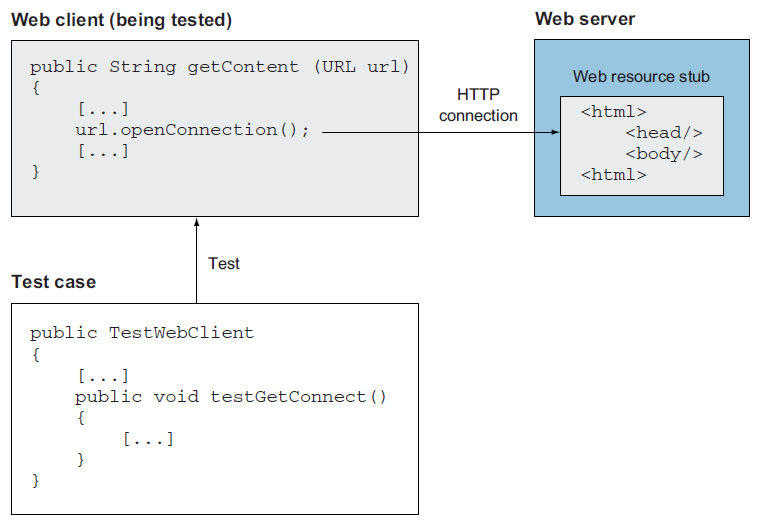
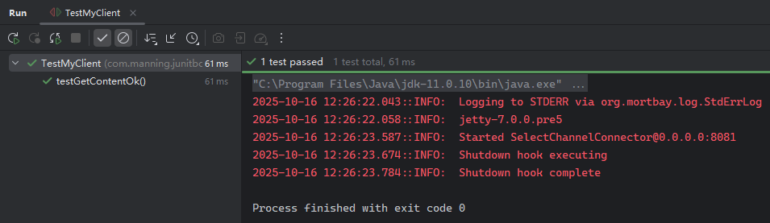

# 第七章 用 Stub 进行粗粒度测试


> **本章概要**
>
> - 用 `Stub` 桩代码进行测试；
> - 用嵌入式服务器替换真实 `Web` 服务器的方法；
> - 利用 `Stub` 桩代码实现 `HTTP` 连接的单元测试。


## 7.1 概述

测试需要保持稳定性，具体体现在重复运行时必须产生相同的结果。

如果某应用依赖特定的运行时环境，编写单元测试的难度就会大幅上升。应对这类问题有两种思路：

- 类比真实环境在开发环境搭建一套测试所需的环境（通常有难度）；
- 利用行为相似的 **伪对象（fake）** 来模拟缺失的功能模块。伪对象的实现方式通常又有两种——
  - 利用 `Stub` 桩代码：
    - 测试流程：初始化 `Stub` :arrow_right: 执行测试 :arrow_right: 验证断言；
  - 使用 `Mock` 模拟对象：
    - 测试流程：初始化 `Mock` :arrow_right: 设置期望值 :arrow_right: 执行测试 :arrow_right: 验证断言。


## 7.2 Stub 桩代码的应用场景

定义：**`Stub` 桩** 是在运行时插入的一段用于替代真实代码逻辑的代码，旨在隔离调用方与真实实现，达到化繁为简、便于测试的效果。

`Stub` 桩代码的典型应用场景：

- 当现有系统过于复杂、脆弱、且无法改动时；
- 应用依赖了一个无法控制的外部环境时；
- 正在替换某个完整的外部系统时（文件系统、服务器连接、数据库等）；
- 正在进行粗粒度测试（子系统间的集成测试等）。

不适合的场景：

- 测试失败信息需要细粒度的测试来提供时；
- 想要单独测试代码逻辑中的某一小部分逻辑时（`DeepSeek`：尤其是涉及条件分支、错误处理、特定算法步骤等需要与依赖对象进行特定交互的场景）。


## 7.3 Stub 桩的优缺点

| 优点                                     | 缺点                                   |
| ---------------------------------------- | -------------------------------------- |
| 为 `SUT`（被测系统）提供很高的可信度     | 实现难度较大                           |
| 无需修改 `SUT`，被测逻辑即为生产环境逻辑 | 可维护性欠佳                           |
|                                          | 不适合细粒度测试                       |
|                                          | 通用性较差，不同情况需要不同的实现策略 |


## 7.4 演示一：用 Stub 替换服务器资源

如果在本地搭建 `Apache` 服务器，则劣势过于明显——

- 容易因自身工况的故障干扰单元测试；
- 测试内容的分散：被测 `Web` 资源和 `JUnit` 测试代码位于不同的环境，难以随时确保一致；
- 难以自动化测试过程：需要先部署测试网页，再启动服务器，最后在运行单元测试。

因此，本例采用 `jetty` 容器来解决上述问题。首先添加 `jetty` 容器的 `Maven` 依赖：

```xml
<dependency>
    <groupId>org.mortbay.jetty</groupId>
    <artifactId>jetty</artifactId>
    <version>7.0.0.pre5</version>
</dependency>
```

本例中 `Stub` 桩要模拟的外部系统，是一个远程 `Web` 资源服务器，其上的远程 `Web` 资源是一个可以生成 `HTML` 格式响应的 `servlet`：


而被测系统（`SUT`）则是一个本地客户端获取远程 `HTML` 响应的实例方法（`getContent()`）：



该 `SUT` 具体实现如下：

```java
import java.net.URL;
import java.net.HttpURLConnection;
import java.io.InputStream;
import java.io.IOException;

public class WebClient {
    public String getContent(URL url) {
        StringBuffer content = new StringBuffer();
        try {
            HttpURLConnection connection = (HttpURLConnection) url.openConnection();
            connection.setDoInput(true);
            InputStream is = connection.getInputStream();
            byte[] buffer = new byte[2048];
            int count;
            while (-1 != (count = is.read(buffer))) {
                content.append(new String(buffer, 0, count));
            }
        } catch (IOException e) {
            throw new RuntimeException(e);
        }
        return content.toString();
    }
}
```

基本思路：在测试开始前初始化 `jetty` 容器，并配置测试地址对应的测试逻辑：

```java
import org.mortbay.jetty.Server;
import org.mortbay.jetty.servlet.Context;

@BeforeAll
public static void setUp() throws Exception {
    Server server = new Server(8081);

    Context ctx = new Context(server, "/testGetContentOk");
    ctx.setHandler(new TestGetContentOkHandler());

    server.setStopAtShutdown(true);
    server.start();
}
```

这里第 `L9` 行的测试内部类 `TestGetContentOkHandler` 稍后讨论。

由于 `L11` 设置了自动关闭容器，测试结束后的注解方法可以不写：

```java
@AfterAll
public static void tearDown() {
    // Empty
}
```

接着是单元测试的相关逻辑：

```java
@Test
public void testGetContentOk() throws MalformedURLException {
    String spec = "http://localhost:8081/testGetContentOk";
    String workingContent = new WebClient().getContent(new URL(spec));
    assertEquals("It works", workingContent);
}
```

`Stub` 模拟测试最复杂的部分，即 `TestGetContentOkHandler` 的实现。需要继承抽象类 `org.mortbay.jetty.handler.AbstractHandler`，并实现其 `handle` 方法：

```java
/**
 * Handler to handle the good requests to the server.
 */
private static class TestGetContentOkHandler extends AbstractHandler {
    public void handle(String target, HttpServletRequest request, HttpServletResponse response, int dispatch)
            throws IOException {
        try (OutputStream out = response.getOutputStream();
            ByteArrayISO8859Writer writer = new ByteArrayISO8859Writer()
        ) {
            writer.write("It works");
            writer.flush();
            response.setIntHeader(HttpHeaders.CONTENT_LENGTH, writer.size());
            writer.writeTo(out);
            out.flush();
        }
    }
}
```

由于模拟服务器响应什么，单元测试用例就接收什么，所以 `L10` 进行了简化。

实测运行情况：




### 7.4.1 处理更多测试分支

上述演示仅仅是正常响应下的单元测试逻辑。如果需要测试其他内容（如报错情况），则需要构建完全不同的测试逻辑，实现各自的 `handle` 方法：

```java
@BeforeAll
public static void setUp() throws Exception {
    Server server = new Server(8081);

    // 配置正确响应的测试逻辑（本次不参与测试）
    Context contentOkContext = new Context(server, "/testGetContentOk");
    contentOkContext.setHandler(new TestGetContentOkHandler());

    // 配置 503 报错的测试逻辑
    Context contentErrorContext = new Context(server, "/testGetContentError");
    contentErrorContext.setHandler(new TestGetContentServerErrorHandler());

    // 配置 404 报错的测试逻辑
    Context contentNotFoundContext = new Context(server, "/testGetContentNotFound");
    contentNotFoundContext.setHandler(new TestGetContentNotFoundHandler());
    
    server.setStopAtShutdown(true);
    server.start();
}
```

为此需要再创建两个内部类：

```java
/**
 * Handler to handle bad requests to the server
 */
private static class TestGetContentServerErrorHandler extends AbstractHandler {
    public void handle(String target, HttpServletRequest request, HttpServletResponse response, int dispatch) throws IOException {
        response.sendError(HttpServletResponse.SC_SERVICE_UNAVAILABLE);
    }
}

/**
 * Handler to handle requests that request unavailable content.
 */
private static class TestGetContentNotFoundHandler extends AbstractHandler {
    public void handle(String target, HttpServletRequest request, HttpServletResponse response, int dispatch) throws IOException {
        response.sendError(HttpServletResponse.SC_NOT_FOUND);
    }
}
```

并且补充两个新的测试用例：

```java
@Test
public void testGetContentNotFound(){
    Throwable t = assertThrows(RuntimeException.class, () -> {
        URL url = new URL("http://localhost:8081/testGetContentNotFound");
        new WebClient().getContent(url);
    });
    String msg = t.getMessage();
    System.err.println("Error message: " + msg);
    assertTrue(msg.contains("FileNotFoundException"));
}

@Test
public void testGetContentNotFound(){
    Throwable t = assertThrows(RuntimeException.class, () -> {
        URL url = new URL("http://localhost:8081/testGetContentNotFound");
        new WebClient().getContent(url);
    });
    String msg = t.getMessage();
    System.err.println("Error message: " + msg);
    assertTrue(msg.contains("FileNotFoundException"));
}
```

实测结果：


## 7.5 演示二：用 Stub 替换 connection 连接

本例较上一案例更轻量，只对 `connection` 进行 `stub` 模拟，无需集成 `jetty` 容器，利用 `Java` 内置的 `java.net` 包就能达到 `stub` 效果。

缺点是：该方法涉及 `Java URL` 系统的扩展机制，用自定义的 `URLStreamHandlerFactory` 工厂类替换了 `Java` 默认的 `URL` 处理机制。一旦设置成功后，同一 `JVM` 中的所有 `URL` 连接都会被拦截。因此测试后需要重置相关状态（如重启 `JVM` 等）。

该方法的核心思想是 **利用 Java 的 SPI(Service Provider Interface) 模式**，通过替换工厂方法来改变整个 `URL` 处理链的行为，从而实现测试桩的效果。

其测试类的代码逻辑相对简单：

```java
/**
 * A test case that tests the WebClient class by stubbing the HTTP connection.
 */
public class TestWebClient1 {

    @BeforeAll
    public static void setUp() {
        URL.setURLStreamHandlerFactory(protocol -> new URLStreamHandler(){
            @Override
            protected URLConnection openConnection(URL url) {
                return new StubHttpURLConnection(url);
            }
        });
    }

    @Test
    public void testGetContentOk() throws MalformedURLException {
        WebClient client = new WebClient();
        String workingContent = client.getContent(new URL("http://localhost/"));
        assertEquals("It works", workingContent);
    }
}

/**
 * A stub class to stub the HttpUrl connection. We override the getInputStream method to return the "It works" string.
 */
public class StubHttpURLConnection extends HttpURLConnection {
    private boolean isInput = true;
    protected StubHttpURLConnection(URL url) {
        super(url);
    }

    @Override
    public InputStream getInputStream() throws IOException {
        if (!isInput) {
            throw new ProtocolException(
                "Cannot read from URLConnection if doInput=false (call setDoInput(true))");
        }
        final String data = "It works";
        ByteArrayInputStream is = new ByteArrayInputStream(data.getBytes());
        return is;
    }

    @Override
    public void connect() {}
    @Override
    public void disconnect() {}
    @Override
    public boolean usingProxy() { return false; }
}
```

由于测试逻辑仅用到了输入流，所以这里重写的是 `getInputStream()` 方法。

另外，如果测试逻辑涉及更多 `HttpURLConnection` 的其他接口，则需重写相应的接口方法补充测试桩代码。这也是该方法的实现难度最容易攀升的地方。


## 7.6 演示小结

案例一用到的 `jetty` 版本过于落后，案例二为了实现不集成 `jetty` 那样的容器又走入了另一个极端——拦截所有 `URL`。归根结底，是因为作者认为业界不看好 `stub` 模拟的未来，认为它仅仅是 **过去测试理念尚未统一** 下的产物——当时普遍以为测试应该是独立的，不应修改现有代码逻辑。

而新的 `mock` 模拟对象策略，不仅允许修改代码，甚至还鼓励这样做。`mock` 对象的引入不仅是一种单元测试策略，更是一种全新的编码范式。

