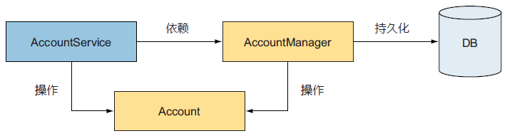
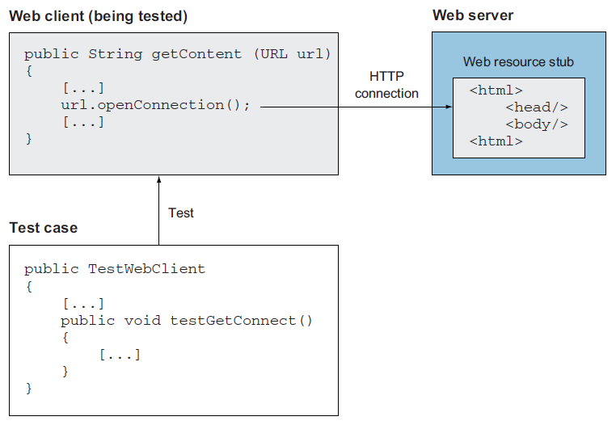

# 第八章 用 mock 对象进行测试


> **本章概要**
>
> - `mock` 对象简介与用法演示
> - 借助 `mock` 对象执行多种重构
> - 案例演示：用 `mock` 对象模拟 `HTTP` 连接
> - `EasyMock`、`JMock` 和 `Mockito` 框架的用法及平行对比


> *Programming today is a race between software engineers striving to build bigger and better idiot-proof programs, and the Universe trying to produce bigger and better idiots. So far, the Universe is winning.*
> 如今的编程是一场竞赛：软件工程师们在竭尽全力地构建更庞大、更厉害的“傻瓜式”程序，而宇宙则在不遗余力地制造更强大、更厉害的傻瓜。目前暂居上风的是宇宙。
>
> —— Rich Cook

本章较为全面地介绍了 `mock` 对象模拟技术在单元测试中的基本原理和具体应用。

无论是 `Stub` 桩模拟还是 `mock` 对象模拟，其本质都是为了实现测试环境与真实环境的 **隔离（*isolation*）**；区别在于它们实现的隔离程度不同：`stub` 桩的粒度更粗，常用于模拟远程 `Web` 服务器、文件系统、数据库等；而 `mock` 对象实现的隔离粒度更细，让单元测试可以精确到针对 **具体某个方法** 开展。

相关背景：`mock` 对象模拟的概念最早由 **Tim Mackinnon**、**Steve Freeman** 和 **Philip Craig** 在 `XP2000` 极限编程国际大会[^1] 上被首次提出。


## 8.1 基本概念

测试环境与真实环境相隔离的最大好处在于：被测系统即便依赖了其他对象，也不会受到任何因调用了它们的方法所产生的副作用的影响。

**时刻保持测试用例的简单、轻量、小巧** 是第一重要的。

单元测试套件的意义：让后续扩展及重构更有底气。

`mock` 模拟与 `Stub` 模拟的差异：

|   对比维度   |                          mock 对象                           |                         Stub 桩模拟                         |
| :----------: | :----------------------------------------------------------: | :---------------------------------------------------------: |
|   隔离级别   |                       方法级（细粒度）                       |                  系统级、模块级（粗粒度）                   |
| 业务逻辑实现 |              完全不涉及原逻辑，只是个 **空壳**               |               完全保留原逻辑，与生产环境一致                |
|   预设行为   |                    完全无预设，须手动设置                    |                  提前预设，运行后无法变更                   |
|   测试模式   | 初始化 `mock` :arrow_right: 设置期望 :arrow_right: 执行测试 :arrow_right: 验证断言 | 初始化 `Stub` :arrow_right: 执行测试 :arrow_right: 验证断言 |


## 8.2 演示案例概况

本章重点研究两个案例：简化的银行转账场景，以及第七章介绍的远程 `URL` 连接场景。

银行转账场景的核心设计如下图所示：



相关实现如下：

1. `AccountService` 服务实现类：包含一个经办人 `manager` 依赖，以及待测方法 `transfer()`：

```java
public class AccountService {
    private AccountManager accountManager;
    public void setAccountManager(AccountManager manager) {
        this.accountManager = manager;
    }

    /**
     * A transfer method which transfers the amount of money
     * from the account with the senderId to the account of
     * beneficiaryId.
     */
    public void transfer(String senderId, String beneficiaryId, long amount) {
        Account sender = accountManager.findAccountForUser(senderId);
        Account beneficiary = accountManager.findAccountForUser(beneficiaryId);

        sender.debit(amount);
        beneficiary.credit(amount);

        this.accountManager.updateAccount(sender);
        this.accountManager.updateAccount(beneficiary);
    }
}
```

2. 经办人接口 `AccountManager`：转账逻辑主要涉及两个接口实现：转账前的帐户查询、转账后的帐户更新。由于本例不考虑更新失败导致的事务回滚操作，帐户更新对转账核心逻辑就没有任何贡献，因此可以不用实现：

```java
public interface AccountManager {
    Account findAccountForUser(String userId);
    void updateAccount(Account account);
}
```

3. `Account` 帐户实体类：仅包含帐户 `id` 和余额两个成员属性，以及涉及转账的两个核心操作（支出、收入）：

```java
/**
 * Account POJO to hold the bank account object.
 */
public class Account {
    private String accountId;
    private long balance;

    public Account(String accountId, long initialBalance) {
        this.accountId = accountId;
        this.balance = initialBalance;
    }

    public void debit(long amount) {
        this.balance -= amount;
    }

    public void credit(long amount) {
        this.balance += amount;
    }

    public long getBalance() {
        return this.balance;
    }
}
```


## 8.3 模拟1：无重构模拟 transfer 方法

先从最简单的 `mock` 模拟开始演示。仔细观察转账方法 `transfer()`，其服务类已经通过依赖注入的方式引用了 `accountManager`，并调用了它的两个接口。在不考虑帐户更新失败导致的事务回滚的情况下，只需要模拟 `findAccountForUser()` 的实现即可。于是有了如下的模拟对象 `MockAccountManager`：

```java
public class MockAccountManager implements AccountManager {
    private Map<String, Account> accounts = new HashMap<String, Account>();

    public void addAccount(String userId, Account account) {
        this.accounts.put(userId, account);
    }

    public Account findAccountForUser(String userId) {
        return this.accounts.get(userId);
    }

    public void updateAccount(Account account) {
        // do nothing
    }
}
```

可以看到，帐户更新方法可以不用任何模拟逻辑；新增的 `addAccount()` 方法也只是为了方便测试过程中的初始化。这样测试用例就能完全控制 `MockAccountManager` 的所有状态了：

```java
public class TestAccountService {
    @Test
    void testTransferOk() {
        // 1. 初始化 mock 对象
        MockAccountManager mockManager = new MockAccountManager();

        // 2. 设置期望值
        Account senderAccount = new Account("1", 200);
        Account beneficiaryAccount = new Account("2", 100);
        mockManager.addAccount("1", senderAccount);
        mockManager.addAccount("2", beneficiaryAccount);

        AccountService service = new AccountService();
        service.setAccountManager(mockManager);

        // 3. 执行测试
        service.transfer("1", "2", 50);

        // 4. 验证断言
        assertEquals(150, senderAccount.getBalance());
        assertEquals(150, beneficiaryAccount.getBalance());
    }
}
```

上述代码中——

- `mock` 对象的模拟逻辑和真实环境下的具体逻辑毫不相关，只是实现了同一个 `AccountManager` 接口而已；
- `mock` 对象的所有模拟逻辑都是围绕 **怎样让测试用例完全控制 mock 对象的必要状态** 展开的，包括新增的 `HashMap<String, Account>` 型成员变量，以及 `addAccount()` 方法的添加；
- `updateAccount()` 由于对转账核心逻辑没有实质性贡献，模拟时直接留白即可。

> [!tip]
>
> **关于 mock 模拟的两则 JUnit 最佳实践**
>
> - 永远不要在 `mock` 对象中编写任何真实业务逻辑；
> - 测试仅针对可能出错的业务逻辑（忽略 `updateAccount()`）。

第一次看到这里时，心中是非常疑惑的：既然 `mock` 对象的所有逻辑都是为了方便测试用例的全权控制专门模拟出来的，那它们就和真实环境完全脱钩了，即便后期切到真实场景报错了，这些模拟逻辑也依然会通过测试。这样的单元测试又有什么实际意义呢？要模拟转账，一不考虑数据库的查询逻辑，二不考虑更新失败后的回滚逻辑，这样的测试还能叫模拟转账吗？

如果你也跟我有同样的困惑，说明对前面提到的 **隔离** 二字的理解仍停留在表面：`mock` 对象模拟的最大价值，恰恰在于依靠这些模拟逻辑真正实现了 **本地逻辑** 与 **外部逻辑** 的 **完全隔离**：

- `findAccountForUser()` 是 `transfer()` 方法自己的逻辑吗？
  - 答案是 **否定的**。那是 `accountManager` 引入的外来逻辑；
- 同理，`updateAccount()` 是 `transfer()` 自己的逻辑吗？
  - 答案也是 **否定的**。那也是 `accountManager` 引入的另一个外来逻辑。

查询、更新帐户是否顺利，本质上同我们真正关心的 `transfer()` 方法自带的业务逻辑 **没有任何交集**，那都是 `accountManager` 在具体实现时才需要考虑的问题。那么，`transfer()` 考虑的到底是哪些问题呢？无非是——

1. 是否通过 `accountManager.findAccountForUser()` 的调用得到指定的帐户对象；
2. 是否通过转账人的 `debit()` 方法扣减了正确的金额；
3. 是否通过收款人的 `credit()` 方法收入了正确的金额；
4. 是否利用 `accountManager.updateAccount()` 方法更新了转账后的帐户信息。

其中，1 和 4 通过 `mock` 对象已经通过验证了，因为对其设置的期望值就是按这些要求来的。2 和 3 的验证需要测试用例末尾的两个断言来决定，通过比较转账后的余额是否是设置的期望值就知道了。这样，`transfer()` 的固有逻辑就全部通过了，一旦真实转账出现 `Bug` 时，可以很明确地排除是转账逻辑本身导致的问题，只可能是由 `accountManager` 引入的外部逻辑有问题。如果 `accountManager` 的两个接口方法也按这个思路进行模拟，则可以进一步缩小排查范围，第一时间找出 `Bug` 的位置。

解决了最核心的困惑，后面的案例理解起来就轻松多了。

注意到 `transfer()` 方法没有需要重构的地方，`accountManager` 也通过依赖注入实现了数据库持久层和转账逻辑之间的解耦，上述模拟不涉及重构原逻辑环节。下面通过另一个方法演示需要重构源码的情况。


## 8.4 模拟2：重构并模拟 findAccountForUser 方法

本例考察数据库持久层的 `accountManager.findAccountForUser()` 方法的模拟。真实场景可以涉及日志信息的输出以及 `SQL` 语句的获取：

```java
public class DefaultAccountManager1 implements AccountManager {

    private static final Log logger = LogFactory.getLog(DefaultAccountManager1.class);

    public Account findAccountForUser(String userId) {
        logger.debug("Getting account for user [" + userId + "]");
        ResourceBundle bundle = PropertyResourceBundle.getBundle("technical");
        String sql = bundle.getString("FIND_ACCOUNT_FOR_USER");

        // 以下代表通过 JDBC 等方式加载帐户信息的具体逻辑（从略）
        return null;
    }
    // -- snip --
}
```

有了上个案例的深入剖析，不难看出上述代码存在的问题：查询的核心逻辑深度绑定了日志的具体实现，以及获取 `SQL` 配置的具体实现。此外，`logger` 和 `bundle` 都是在方法体内直接赋值的，完全没有预留出切入点，以便测试期间换成相应的 `mock` 对象，因此有必要先重构再模拟，充分利用依赖注入模式：

```java
public class DefaultAccountManager2 implements AccountManager {
    private Log logger;
    private Configuration configuration;

    public DefaultAccountManager2() {
        this(LogFactory.getLog(DefaultAccountManager2.class),
                new DefaultConfiguration("technical"));
    }

    public DefaultAccountManager2(Log logger, Configuration configuration) {
        this.logger = logger;
        this.configuration = configuration;
    }

    public Account findAccountForUser(String userId) {
        this.logger.debug("Getting account for user [" + userId + "]");
        this.configuration.getSQL("FIND_ACCOUNT_FOR_USER");

        // 以下代表通过 JDBC 等方式加载帐户信息的具体逻辑（从略）
        return null;
    }
    // -- snip --
}

// 重构引入的新接口
public interface Configuration {
    String getSQL(String sqlString);
}
```

这样，模拟日志和 SQL 语句配置的 `mock` 对象可以轻松定义并替换原有注入逻辑：

```java
import org.apache.commons.logging.Log;
public class MockLog implements Log {
    // -- snip --
}

public class MockConfiguration implements Configuration {
    public void setSQL(String sqlString) { }
    public String getSQL(String sqlString) {
        return null;
    }
}
```

`MockLog` 看起来代码很多，其实都是 `org.apache.commons.logging.Log` 接口自身的原因，与重构本身无关。

相应的测试用例写起来就更简单了：

```java
public class TestDefaultAccountManager {
    @Test
    void testFindAccountByUser() {
        // 1. 初始化
        MockLog logger = new MockLog();
        MockConfiguration configuration = new MockConfiguration();
        // 2. 设置期望值
        configuration.setSQL("SELECT * [...]");
        DefaultAccountManager2 am = new DefaultAccountManager2(logger, configuration);
        // 3. 运行测试
        @SuppressWarnings("unused")
        Account account = am.findAccountForUser("1234");

        // 以下为断言逻辑（略）
    }
}
```

> [!tip]
>
> **关于 IoC 控制反转模式**
>
> 本例的重构基于设计模式中的 **控制反转（*IoC，Inversion of Control*）**。对某个类应用 `IoC` 模式，则意味着需要移除该类不直接负责的所有对象实例的创建，所需的任何实例均通过构造函数或 `setter` 方法传入，或者通过方法参数传入。这样一来，正确配置这个类所需的其他实例的职责，就全权交由调用该类的调用方身上，而非这个类本身了（详见 [https://spring.io](https://spring.io)）。


## 8.5 模拟3：重构并模拟远程连接的 getContent 方法

本节是全章的重点内容，既详细介绍了 `mock` 模拟的两种常用策略（`Method Factory` 与 `Class Factory`），又与上一章相呼应，对比了基于 `Stub` 桩代码的工厂方法与 `mock` 对象模拟的不同思路。需要认真分辨各自的特点和异同点。

演示案例还是第七章最后模拟的远程 URL 连接的案例，测试场景如图所示：



被测系统的原逻辑 `WebClient.getContent()` 方法如下所示：

```java
public class WebClient {
    public String getContent(URL url) {
        StringBuffer content = new StringBuffer();
        try {
            HttpURLConnection connection = (HttpURLConnection) url.openConnection();
            connection.setDoInput(true);
            InputStream is = connection.getInputStream();
            byte[] buffer = new byte[2048];
            int count;
            while (-1 != (count = is.read(buffer))) {
                content.append(new String(buffer, 0, count));
            }
        } catch (IOException e) {
            throw new RuntimeException(e);
        }
        return content.toString();
    }
}
```

上述代码中，`getContent()` 已经通过传入 `URL` 参数的方式注入了该依赖，并得到一个 `connection` 实例。按照之前的思路，本来应该继承 `URL` 类自定义一个 `mock` 对象，让其调用重写的 `openConnection()` 方法返回一个类型为 `MockHttpURLConnection` 的 `connection` 模拟实例，并创建测试用例如下：

```java
@Test
public void testGetContentOk() throws Exception {
    MockHttpURLConnection mockConnection = new MockHttpURLConnection();
    mockConnection.setupGetInputStream(new ByteArrayInputStream("It works".getBytes()));
    MockURL mockURL = new MockURL();
    mockURL.setupOpenConnection(mockConnection);
    WebClient client = new WebClient();
    String workingContent = client.getContent(mockURL);
    assertEquals("It works", workingContent);
}
```

但很可惜，`URL` 是 `java.net` 包中被 `JDK` 声明为 `final` 的类，因此继承这条路就彻底断了，只有像第七章的第二个方案那样，寻求某个工厂方法的 `mock` 模拟。

这通常有两种实现策略：**工厂方法（*Method Factory*）**和 **类工厂（*Class Factory*）**。


### 8.5.1 基于 Method Factory 工厂方法的 mock 模拟


### 8.5.2 基于 Class Factory 类工厂的 mock 模拟


## 8.6 模拟4：从 IO 流的 mock 模拟探究被测系统的内部状态监控


## 8.7 主流 mock 模拟框架对比


---

[^1]: 三人在大会上发表了著名论文 **Endo-Testing: Unit Testing with Mock Objects**。自此，`mock objects` 逐渐成为软件测试的标准实践，并催生了一系列模拟框架的发展，例如 `JMock`、`EasyMock`、`Mockito` 等。

