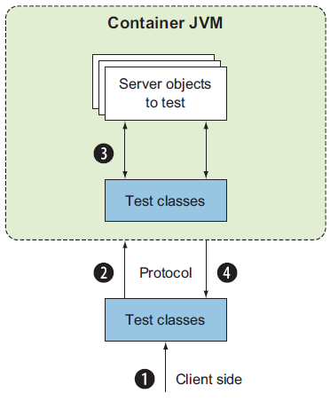
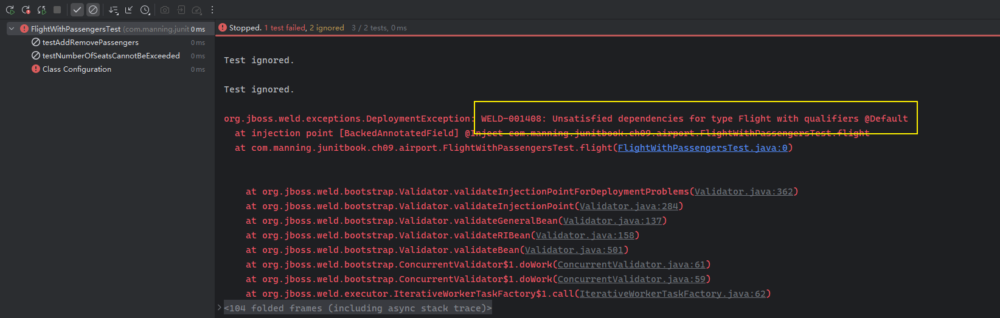
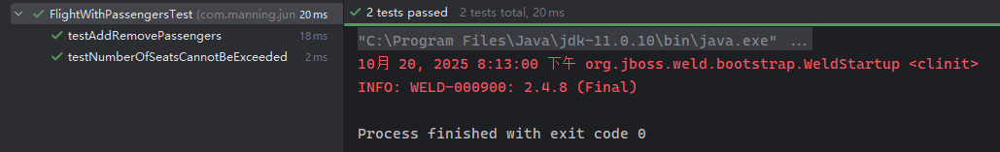

# 第九章 容器内测试


> **本章概要**
>
> - `mock` 对象模拟的局限性分析
> - 容器内测试的用法
> - `Stub` 模拟、`mock` 对象模拟及容器内测试的横向评估对比
> - `Arquillian` 框架用法简介


> *The secret of success is sincerity. Once you can fake that you’ve got it made.*
> 成功的秘诀在于真诚。一旦能伪装出真诚，离成功也就不远了。
>
> —— Jean Giraudoux

本章探讨了一种在应用容器内对组件进行单元测试的方法：容器内单元测试或集成测试。这里的容器不是像 `Docker` 那样的容器，而是像 `Jetty` 或 `Tomcat` 这样的 `servlet` 容器，或者像 `JBoss`（已更名为 `WildFly`）那样的企业级 `Java Bean`（即 `EJB`）容器。本章还会对比容器内测试和 `Stub` 桩模拟、`mock` 对象模拟的优缺点，并介绍 `Arquillian` 框架 —— 一种与具体容器无关的、专门用于集成测试的 `JavaEE` 框架的用法。


## 9.1 容器内测试的应用场景

对容器内测试的迫切需求，源于常规单元测试的局限性。例如，在 `servlet` 语境下，如果一个类继承了抽象类 `javax.servlet.http.HttpServlet`，并重写了 `isAuthenticated(HttpServletRequest request)` 方法：

```java
public class SampleServlet extends HttpServlet {
    private static final long serialVersionUID = 1L;

    public boolean isAuthenticated(HttpServletRequest request) {
        HttpSession session = request.getSession(false);
        if (session == null) {
            return false;
        }
        String authenticationAttribute = String.valueOf(session.getAttribute("authenticated"));
        return Boolean.parseBoolean(authenticationAttribute);
    }
}
```

按照此前 `mock` 对象模拟的思路，借助 `Mockito` 框架写出的测试用例大致如下：

```java
@ExtendWith(MockitoExtension.class)
public class TestSampleServletWithMockito {
    @Mock
    private HttpServletRequest request;

    @Mock
    private HttpSession session;

    private SampleServlet servlet;

    @BeforeEach
    public void setUp() {
        servlet = new SampleServlet();
    }

    @Test
    public void testIsAuthenticatedAuthenticated() {
        when(request.getSession(false)).thenReturn(session);
        when(session.getAttribute("authenticated")).thenReturn("true");
        assertTrue(servlet.isAuthenticated(request));
    }

    @Test
    public void testIsAuthenticatedNotAuthenticated() {
        when(request.getSession(false)).thenReturn(session);
        when(session.getAttribute("authenticated")).thenReturn("false");
        assertFalse(servlet.isAuthenticated(request));
    }

    @Test
    public void testIsAuthenticatedNoSession() {
        when(request.getSession(false)).thenReturn(null);
        assertFalse(servlet.isAuthenticated(request));
    }
}
```

上述代码通过在每个测试用例中分别初始化 `mock` 对象、设置期望值、最后执行断言，`isAuthenticated()` 方法的核心逻辑全部得以验证通过，看起来没什么问题。

但是问题就出在对这些对象的模拟上：因为被测系统是在 `servlet` 语境下运行的，要测试 `isAuthenticated()` 需要一个有效的 `HttpServletRequest` 对象及 `HttpSession` 对象；而 `HttpServletRequest` 只是一个接口，其生命周期和具体实现是由所在的 `servlet` 容器提供的。只要这些对象是在容器运行时创建并管理的，测试人员就应该模拟出一个与真实场景差不多的容器环境，最好还能追踪这些对象的状态，让测试用例在一个相对真实的环境下运行，而不是脱离容器、仅凭常规的 `JUnit` 技术（即 `JUnit 5` 的功能特性、`Stub` 桩和 `mock` 对象模拟等）来测试它们。

上述 `mock` 对象的测试方法虽然也没问题，但遇到真实的复杂业务逻辑，运行测试前很可能需要设置大量的期望值来还原当时的容器环境，导致编写大量的辅助代码，淹没真正的测试逻辑。虽然人们总希望对容器行为的模拟尽可能精简，但往往事与愿违。一旦 `servlet` 环境出现变动，这些预设的期望值也必须同步更新，无形中加大了测试编码的编写难度和后期的运维成本。

总之，当代码与容器存在交互，且测试无法创建有效的容器对象（如 `HttpServletRequest`）时，应该首选 **容器内测试（in-container testing）**。


## 9.2 容器内测试的基本流程

测试 `SampleServlet` 最理想的方案是在一个 `servlet` 容器中运行测试用例，此时无需模拟 `HttpServletRequest` 和 `HttpSession`，而是可以直接在真实容器中访问所需的对象和方法。这就要寻求某种机制，让测试用例可以部署到容器中执行。

容器内测试大致有两种架构驱动模式：

- 服务端驱动
- 客户端驱动

以下为客户端驱动的示意图：



基于客户端驱动的容器内测试的生命周期（基本流程）大致如下：

1. 执行客户端测试类；
2. 调用服务器端相同的测试用例（通过 `HTTP(S)` 等协议）；
3. 测试领域对象；
4. 将结果响应给客户端。


> [!tip]
>
> **补充：服务端驱动的基本流程**
>
> 根据 `DeepSeek` 提供的思路，服务端驱动的大致流程如下（待验证）：
>
> ```mermaid
> flowchart TD
>     A[测试客户端<br>触发测试] --> B[① 部署]
>     subgraph C [应用服务器容器]
>         D[测试协调器<br>Servlet/MBean] --> E[测试类<br>MyServiceIT]
>         E --> F[被测组件<br>MyService]
>     end
> 
>     B --> C
>     G[② 启动容器] --> C
> 
>     E -- 执行测试 --> D
>     F -- 调用 --> E
> 
>     D --③ 收集结果--> H[生成测试报告]
>     H -- ④ 获取报告 --> A
> ```
>
> 其基本流程概括如下：
>
> 1. **打包并部署**：将包含测试代码的应用部署到服务器。
> 2. **从外部触发**：通过测试客户端（通常为一个脚本或一个简单的 `Java` 程序）触发容器内的测试协调器。
> 3. **在容器内部**：由协调器利用 `JUnit` 执行测试类，并通过测试类调用真实的业务组件实施测试。
> 4. **收集结果**：最终生成测试报告，供外部客户端消费。


## 9.3 Stub 模拟、mock 对象模拟、容器内测试横向对比


### 9.3.1 Stub 桩代码模拟的优缺点

|        优点        |                   缺点                    |
| :----------------: | :---------------------------------------: |
|     快速且轻量     |         需要专门的方法来验证状态          |
|   易于编写和理解   | 无法测试模拟对象（`faked objects`）的行为 |
|      功能强大      |         在复杂交互场景下耗时较长          |
| 适合更粗粒度的测试 |          代码变更时需要更多维护           |


### 9.3.2 mock 对象模拟的优缺点

|            优点            |                          缺点                          |
| :------------------------: | :----------------------------------------------------: |
| 测试执行无需依赖容器的运行 |         无法测试与容器的交互，以及组件间的交互         |
|      配置和运行速度快      |                    不测试组件的部署                    |
|   支持更细粒度的单元测试   | 需充分了解待模拟的 `API`（尤其对外部库而言可能很困难） |
|                            |             无法保证代码能在目标容器中运行             |
|                            |     更细粒度的测试也意味着测试代码很可能被接口淹没     |
|                            |    代码变更时需要投入更多维护（与 `Stub` 模拟类似）    |


### 9.3.3 容器内测试的优缺点

主要优势：提供容器环境方便测试。

劣势：

- 需要特定的工具支持：尽管概念本身具备通用性，但具体的实现工具则因容器 `API` 而不同：基于 `servlet` 容器需用 `Jetty`、`Tomcat`；基于 `EJB` 容器需用 `WildFly` 等等；
- 与 `IDE` 的集成欠佳：常用 `Maven` / `Gradle` 在嵌入式容器中执行测试，或在持续集成服务器中运行 `build` 构建流程。业内普遍缺乏良好的 `IDE` 支持；
- 执行时间较长：由于测试在容器中运行，需要启动和管理容器，这可能会很耗时；
- 配置复杂：这也是容器内测试的最大缺点。为了让应用及其测试在容器中运行，项目必须打包（如 `war` 或 `ear` 文件）并部署到容器中；然后必须启动容器、运行测试。最佳实践是将该测试流程自动化并纳入整个构建体系。


## 9.4 Arquillian 框架用法简介

`Arquillian`（http://arquillian.org）是一款针对 `Java` 的测试框架。它利用了 `JUnit` 在 `Java` 容器中执行测试用例。

`Arquillian` 框架主要分为三个核心部分：

- **测试运行器（Test runners）**：由 `JUnit` 测试框架提供；
- **容器（Containers）**：如 `WildFly`、`Tomcat`、`GlassFish`、`Jetty` 等；
- **测试增强工具（Test enrichers）**：负责将容器资源和各种 `Bean` 直接注入到测试类中。

遗憾的是，该书出版五年后的今天，`Arquillian` 框架仍然没有与 `JUnit 5` 实现完美集成，相关演示只能在 `JUnit 4` 中进行。

`Arquillian` 框架使用 `ShrinkWrap` 这一外部依赖提供的流畅 `API` 接口完成归档文件的组装工作（如组装成 `jar`、`war` 和 `ear` 文件等），并在测试期间由 `Arquillian` 直接部署。

本节演示了一个航班与乘客管理的模拟场景，航班对象可以动态添加或删除乘客集合中的元素，并通过该航班的总座位数对乘客总数进行限制。航班中的乘客数据以 `HashSet<Passenger>` 的形式存在，并从一个 `CSV` 文件中完成初始化。具体情况如下。

首先添加所需的 `Maven` 依赖：

```xml
<dependencyManagement>
    <dependencies>
        <dependency>
            <groupId>org.jboss.arquillian</groupId>
            <artifactId>arquillian-bom</artifactId>
            <version>1.4.0.Final</version>
            <scope>import</scope>
            <type>pom</type>
        </dependency>
    </dependencies>
</dependencyManagement>
<dependencies>
    <dependency>
        <groupId>org.jboss.spec</groupId>
        <artifactId>jboss-javaee-7.0</artifactId>
        <version>1.0.3.Final</version>
        <type>pom</type>
        <scope>provided</scope>
    </dependency>
    <dependency>
        <groupId>org.junit.vintage</groupId>
        <artifactId>junit-vintage-engine</artifactId>
        <version>5.9.2</version>
        <scope>test</scope>
    </dependency>
    <dependency>
        <groupId>org.jboss.arquillian.junit</groupId>
        <artifactId>arquillian-junit-container</artifactId>
        <scope>test</scope>
    </dependency>
    <dependency>
        <groupId>org.jboss.arquillian.container</groupId>
        <artifactId>arquillian-weld-ee-embedded-1.1</artifactId>
        <version>1.0.0.CR9</version>
        <scope>test</scope>
    </dependency>
    <dependency>
        <groupId>org.jboss.weld</groupId>
        <artifactId>weld-core</artifactId>
        <version>2.4.8.Final</version>
        <scope>test</scope>
    </dependency>
</dependencies>
```

> [!note]
>
> **注意**：由于本地实测距图书出版时相隔近五年，为了消除 `IDEA` 提示的易遭攻击风险，`JUnit` 版本最好升至 `5.9.2`、`weld-core` 的版本提升到 `2.4.8.Final`。同时为了消除 `JDK11` 限制使用 `Java` 反射机制的警告，可以按照运行提示修改如下插件配置：
>
> ```xml
> <plugins>
>     <plugin>
>         <artifactId>maven-surefire-plugin</artifactId>
>         <version>2.22.2</version>
>         <configuration>
>             <argLine>
>                 --add-opens java.base/java.lang=ALL-UNNAMED
>                 --add-opens java.base/java.security=ALL-UNNAMED
>                 --add-opens java.base/java.io=ALL-UNNAMED
>                 --add-opens java.base/java.util=ALL-UNNAMED
>             </argLine>
>         </configuration>
>     </plugin>
>     <plugin>
>         <groupId>org.apache.maven.plugins</groupId>
>         <artifactId>maven-compiler-plugin</artifactId>
>         <version>3.8.1</version>
>         <configuration>
>             <source>11</source>
>             <target>11</target>
>         </configuration>
>     </plugin>
> </plugins>
> ```

`Passenger` 乘客实体类：

```java
public class Passenger {

    private String identifier;
    private String name;

    public Passenger(String identifier, String name) {
        this.identifier = identifier;
        this.name = name;
    }

    public String getIdentifier() {
        return identifier;
    }

    public String getName() {
        return name;
    }

    @Override
    public String toString() {
        return "Passenger " + getName() + " with identifier: " + getIdentifier();
    }
}
```

`Flight` 航班实体类：

```java
public class Flight {

    private String flightNumber;
    private int seats;
    Set<Passenger> passengers = new HashSet<>();

    public Flight(String flightNumber, int seats) {
        this.flightNumber = flightNumber;
        this.seats = seats;
    }

    public String getFlightNumber() {
        return flightNumber;
    }

    public int getSeats() {
        return seats;
    }

    public void setSeats(int seats) {
        if (passengers.size() > seats) {
            throw new RuntimeException("Cannot reduce seats under the number of existing passengers!");
        }
        this.seats = seats;
    }

    public int getNumberOfPassengers() {
        return passengers.size();
    }

    public boolean addPassenger(Passenger passenger) {
        if (passengers.size() >= seats) {
            throw new RuntimeException("Cannot add more passengers than the capacity of the flight!");
        }
        return passengers.add(passenger);
    }

    public boolean removePassenger(Passenger passenger) {
        return passengers.remove(passenger);
    }

    @Override
    public String toString() {
        return "Flight " + getFlightNumber();
    }
}
```

乘客集合的初始化通过一个静态工具方法实现，需要从一个 `CSV` 文件 `flights_information.csv` 读取：

```markdown
1236789; John Smith
9006789; Jane Underwood
1236790; James Perkins
9006790; Mary Calderon
1236791; Noah Graves
9006791; Jake Chavez
1236792; Oliver Aguilar
9006792; Emma McCann
1236793; Margaret Knight
9006793; Amelia Curry
1236794; Jack Vaughn
9006794; Liam Lewis
1236795; Olivia Reyes
9006795; Samantha Poole
1236796; Patricia Jordan
9006796; Robert Sherman
1236797; Mason Burton
9006797; Harry Christensen
1236798; Jennifer Mills
9006798; Sophia Graham
```

对应的工具类代码如下：

```java
public class FlightBuilderUtil {
    public static Flight buildFlightFromCsv() throws IOException {
        Flight flight = new Flight("AA1234", 20);
        try (BufferedReader reader = new BufferedReader(new FileReader("src/test/resources/flights_information.csv"))) {
            String line = null;
            do {
                line = reader.readLine();
                if (line != null) {
                    String[] passengerString = line.toString().split(";");
                    Passenger passenger = new Passenger(passengerString[0].trim(), passengerString[1].trim());
                    flight.addPassenger(passenger);
                }
            } while (line != null);

        }
        return flight;
    }
}
```

最终的 `Arquillian` 测试类如下：

```java
@RunWith(Arquillian.class)
public class FlightWithPassengersTest {

    @Deployment
    public static JavaArchive createDeployment() {
        return ShrinkWrap.create(JavaArchive.class)
                .addClasses(Passenger.class, Flight.class, FlightProducer.class)
                .addAsManifestResource(EmptyAsset.INSTANCE, "beans.xml");
    }

    @Inject
    Flight flight;

    @Test(expected = RuntimeException.class)
    public void testNumberOfSeatsCannotBeExceeded() throws IOException {
        assertEquals(20, flight.getNumberOfPassengers());
        flight.addPassenger(new Passenger("1247890", "Michael Johnson"));
    }

    @Test
    public void testAddRemovePassengers() throws IOException {
        flight.setSeats(21);
        Passenger additionalPassenger = new Passenger("1247890", "Michael Johnson");
        flight.addPassenger(additionalPassenger);
        assertEquals(21, flight.getNumberOfPassengers());
        flight.removePassenger(additionalPassenger);
        assertEquals(20, flight.getNumberOfPassengers());
        assertEquals(21, flight.getSeats());
    }
}
```

上述代码中，相关组件的打包通过 `@Deployment` 注解的方法完成，具体由 `ShrinkWrap` 相关 `API` 实现。最初没有 `FlightProducer.class` 这个类（`L7`），但由于首次运行时 `Arquillian` 无法顺利注入 `Flight` 实例（仅支持无参构造函数）：



因此需要利用 `JavaEE` 中的 `CDI`（`Context & Dependency Injection`）机制，手动注入 `Flight` 实例，通过新增一个带 `@Produces` 注解方法的普通工具类：

```java
// FlightProducer.java
import javax.enterprise.inject.Produces;

public class FlightProducer {
    @Produces
    public Flight createFlight() throws IOException {
        return FlightBuilderUtil.buildFlightFromCsv();
    }
}
```

最后再将这个 `FlightProducer` 类一并打包到归档文件中即可（`L4`）：

```java
@Deployment
public static JavaArchive createDeployment() {
    return ShrinkWrap.create(JavaArchive.class)
            .addClasses(Passenger.class, Flight.class, FlightProducer.class)
            .addAsManifestResource(EmptyAsset.INSTANCE, "beans.xml");
}
```

最终实测截图：



