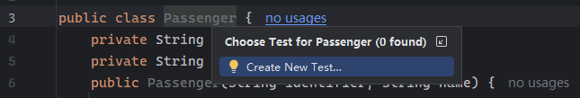

# 第十章 用 Maven 3 运行 JUnit 测试


> **本章概要**
>
> - 从零创建 `Maven` 项目
> - 用 `JUnit 5` 测试 `Maven` 项目
> - `Maven` 插件的用法
> - `Maven Surefire` 插件的用法

第 10 ~ 13 章为本书的第三个模块，重点探讨 `JUnit 5` 与其他工具的协同。其中，本章介绍 `Maven`，第 11 章介绍 `Gradle`，第 12 章介绍 `JUnit 5` 与当前主流 `IDE` 的集成，第 13 章精讲持续集成工具。学习本章需结合附录 A，以加深对 `Maven` 基础概念和基本流程的了解。对熟悉 `Maven` 的开发者而言，本章难度不大，也可以作为复习材料查漏补缺。


## 10.1 Maven 解决的痛点问题

`Maven` 官网：[https://maven.apache.org/](https://maven.apache.org/)。发音：`/ˈmeɪvn/`。

主要有两个：

- 定义了软件的基础构建方式；
- 对项目依赖实现了统一管理。

`Maven` 遵循 **约定优于配置（*Convention Over Configuration*）** 的设计原则，始终认为一个项目的构建系统应当尽可能简单好用，能让开发者从繁琐枯燥又严格的各种配置规则中解放出来，转而只对个别特殊情况进行说明。`Maven` 用一个 `pom.xml` 文件记录项目配置，包含项目的元信息、外部依赖、所需插件等。

约定优于配置的原则从 `Maven` 构建的文件夹结构体现出来，例如：

- `src/main/java/`：存放 `Java` 源文件；
- `src/test/java`：存放项目的各类单元测试文件；
- `target/`：项目构建的根目录。


## 10.2 从命令行新建一个 Maven 项目

本地安装 `Maven` 后，可以从命令行创建一个默认的 `Maven` 项目：

首先确认 `Maven` 的版本：

```powershell
> mvn --version
Apache Maven 3.9.11 (3e54c93a704957b63ee3494413a2b544fd3d825b)
Maven home: D:\apache-maven-3.9.11
Java version: 11.0.10, vendor: Oracle Corporation, runtime: C:\Program Files\Java\jdk-11.0.10
Default locale: zh_CN, platform encoding: GBK
OS name: "windows 10", version: "10.0", arch: "amd64", family: "windows"
```

然后新建一个示例文件夹 `C:\junitbook`，并在该目录下运行如下命令：

```powershell
> mvn archetype:generate -DgroupId="com.manning.junitbook" -DartifactId="maven-sampling" -DarchetypeArtifactid="maven-artifact-mojo"
```

若中途遇到停顿，一律按回车键（保持默认配置）继续，最后就会得到一个名为 `maven-sampling` 的 `Maven` 骨架项目。

上述命令的各参数含义：

- `-DgroupId=com.manning.junitbook`：定义变量 `groupId`，变量值为 `com.manning.junitbook`。通常使用公司或组织的反向域名命名规则；
- `-DartifactId=maven-sampling`：定义变量 `artifactId`，变量值为 `maven-sampling`。这是项目的 **构件 ID**，也是项目的唯一标识符，通常为项目名称；
- `-DarchetypeArtifactId=maven-archetype-mojo`：定义变量 `archetypeArtifactId`，变量值为 `maven-archetype-mojo`。这是在指定要使用的 `archetype` 模板，`maven-archetype-mojo` 是一个专门用于创建 `Maven` 项目的模板，其中预设了 `Maven` 项目的目录结构和必要的依赖项。

和原书不同的是，`Maven` 版本越新，生成的默认依赖版本越新。例如实测时的 `JUnit` 版本就升级到了 `5.11`：

```xml
<?xml version="1.0" encoding="UTF-8"?>
<project xmlns="http://maven.apache.org/POM/4.0.0" xmlns:xsi="http://www.w3.org/2001/XMLSchema-instance"
         xsi:schemaLocation="http://maven.apache.org/POM/4.0.0 http://maven.apache.org/xsd/maven-4.0.0.xsd">
  <modelVersion>4.0.0</modelVersion>

  <groupId>com.manning.junitbook</groupId>
  <artifactId>maven-sampling</artifactId>
  <version>1.0-SNAPSHOT</version>

  <name>maven-sampling</name>
  <!-- FIXME change it to the project's website -->
  <url>http://www.example.com</url>

  <properties>
    <project.build.sourceEncoding>UTF-8</project.build.sourceEncoding>
    <maven.compiler.release>17</maven.compiler.release>
  </properties>

  <dependencyManagement>
    <dependencies>
      <dependency>
        <groupId>org.junit</groupId>
        <artifactId>junit-bom</artifactId>
        <version>5.11.0</version>
        <type>pom</type>
        <scope>import</scope>
      </dependency>
    </dependencies>
  </dependencyManagement>

  <dependencies>
    <dependency>
      <groupId>org.junit.jupiter</groupId>
      <artifactId>junit-jupiter-api</artifactId>
      <scope>test</scope>
    </dependency>
    <!-- Optionally: parameterized tests support -->
    <dependency>
      <groupId>org.junit.jupiter</groupId>
      <artifactId>junit-jupiter-params</artifactId>
      <scope>test</scope>
    </dependency>
  </dependencies>
  <!-- snip -->
</project>
```

上述配置中，`dependencyManagement` 通过 `BOM`（`Bill of Materials`）的方式管理了 `JUnit` 的版本；当中的 `junit-bom` 是一个特殊的 `POM` 文件，里面定义了所有 `JUnit` 相关组件的版本号。因此，实际 `JUnit` 各依赖项的版本都可以省略不写，统一为 `junit-bom` 指定的版本。

此外，实测过程中，部分插件可能 `IDEA` 无法顺利解析，比如这个 `maven-project-info-reports-plugin` 插件：

```xml
<build>
  <pluginManagement>
    <plugins>
      <!-- snip -->
      <plugin>
        <artifactId>maven-project-info-reports-plugin</artifactId>
        <version>3.6.1</version>
      </plugin>
    </plugins>
  </pluginManagement>
</build>
```

首次导入 `IDEA` 时上述代码 `L4` - `L5` 都有红色报错标记，提示 `IDEA` 无法解析该插件。

解决办法：从 `Maven` 线上的 [中央仓库](https://central.sonatype.com/) 手动导入该插件的 `dependency` 依赖，重新加载项目触发 `IDEA` 自动下载：

```xml
<dependency>
    <groupId>org.apache.maven.plugins</groupId>
    <artifactId>maven-project-info-reports-plugin</artifactId>
    <version>3.6.1</version>
</dependency>
```

下载成功后，删除该 `dependency` 节点即可（慎重升级到最新版 `3.9.0`，后续生成文档时有兼容性报错）。

将该骨架项目导入 `IDEA` 的最终效果：


## 10.3 pom.xml 中的主要标签

从第二行开始，该项目的所有 `Maven` 配置都在 `<project>` 标签内，起到 **唯一标识作用** 的是这三个标签的组合（相当于位置坐标）：

- `groupId`：通常充当文件系统 `Java` 包的分组标识；
- `artifactId`：项目的名称标识；
- `version`：构件当前的版本号。带 `SNAPSHOT` 后缀标识的表明该构件还处于开发模式，尚未对外发布。

其他常见的标签还有 `<modelVersion>`，它是 `POM` 模型的版本号，一般为 `4.0.0`；以及 `<dependencies>` 标签，用于描述项目需要的所有依赖包。

此外也可以在 `<project>` 标签下补充其他增强项目元信息的标签，例如 `developers`、`description`、`organization`、`inceptionYear` 等：

```xml
<developers>
    <developer>
        <name>Catalin Tudose</name>
        <id>ctudose</id>
        <organization>Manning</organization>
        <roles>
            <role>Java Developer</role>
        </roles>
    </developer>
    <!-- snip -->
</developers>
<description>
    “JUnit in Action III” book, the sample project for the “Running JUnit
    tests from Maven” chapter.
</description>
<organization>
    <name>Manning Publications</name>
    <url>http://manning.com/</url>
</organization>
<inceptionYear>2019</inceptionYear>
```

这些补充内容不仅能让 `pom.xml` 更加完善，后期构件项目网站时也会包含这些关键信息。

> [!tip]
>
> **POM 标签不是完全自定义的**
>
> `Maven` 的 `POM` 规范定义了一系列标准元素，不是完全自定义的。通常是为后期发布该构件设计，以便在发布后联系到相关维护人员。常见的选填标签有：
>
> - 项目基本信息：
>
>   ```xml
>   <name>maven-sampling</name>
>   <description>项目描述信息</description>
>   <url>http://www.example.com</url>
>   ```
>
> - 项目组织信息：
>
>   ```xml
>   <organization>
>     <name>公司/组织名称</name>
>     <url>组织官网</url>
>   </organization>
>   ```
>
> - 开发者信息：
>
>   ```xml
>   <developers>
>     <developer>
>       <id>developer-id</id>
>       <name>开发者姓名</name>
>       <email>email@example.com</email>
>       <url>http://developer-website.com</url>
>       <organization>所属组织</organization>
>       <organizationUrl>组织网址</organizationUrl>
>       <roles>
>         <role>architect</role>
>         <role>developer</role>
>       </roles>
>       <timezone>+8</timezone>
>     </developer>
>   </developers>
>   ```
>
> - 项目许可信息：
>
>   ```xml
>   <licenses>
>     <license>
>       <name>Apache License, Version 2.0</name>
>       <url>https://www.apache.org/licenses/LICENSE-2.0.txt</url>
>       <distribution>repo</distribution>
>     </license>
>   </licenses>
>   ```
>
> - 源码管理相关：
>
>   ```xml
>   <scm>
>     <connection>scm:git:https://github.com/username/repo.git</connection>
>     <developerConnection>scm:git:https://github.com/username/repo.git</developerConnection>
>     <url>https://github.com/username/repo</url>
>   </scm>
>   ```
>
> - 问题追踪系统：
>
>   ```xml
>   <issueManagement>
>     <system>GitHub Issues</system>
>     <url>https://github.com/username/repo/issues</url>
>   </issueManagement>
>   ```


## 10.4 常用插件

从插件的角度看，`Maven` 也是一个通过运行插件来构建源代码的构建环境。`Maven` 构建中的每个任务都是由相应的插件来完成的。本节重点介绍了三个插件：`maven-compiler-plugin`、`maven-surefire-plugin`、`maven-site-plugin`，分别负责项目的编译、单元测试和项目文档生成。

另外，如果刚才的 `Maven` 项目骨架需要导入 `Eclipse`，`Maven` 也专门提供了一个 `maven-eclipse-plugin` 插件方便一键导入 `Eclipse`，无需手动安装，只要在创建好骨架后再运行 `mvn eclipse:eclipse` 即可。该插件会生成 `Eclipse` 识别项目需要的两个文件：`.project` 和 `.classpath`。

这是用最新版的 `Eclipse`（`v2025-12 M1`）导入 `Maven` 项目、并打开 `pom.xml` 后的实测截图：


> [!tip]
>
> **踩坑备忘：慎用 Eclipse 的 exe 安装包**
>
> 为了实测导入 `Eclipse` 的效果，安装 `Eclipse` 时不小心下载了官方提供的 `.exe` 格式的安装包，结果又填错了 `Java 21` 的 `JRE` 路径（应该详细到 `bin` 目录），导致安装完成后软件能从 `GUI` 界面启动、但从快捷方式或安装目录双击 `eclipse.exe` 文件打开就报错（报错提示也很奇葩）：
>
> 
>
> 排查了很多地方，`jar` 包和里面的主类都是存在的，最后和老本本上的 `Eclipse` 仔细对比才找到根本原因：运行 `exe` 安装包时 `JRE` 路径不正确，导致最后的启动配置文件 `eclipse.ini` 缺了最关键的 `-vm` 参数。`eclipse.ini` 前后对比如下（节选）：
>
> ```ini
> # 更正前
> -startup
> plugins/org.eclipse.equinox.launcher_1.7.0.v20250519-0528.jar
> 
> # 更正后
> -vm
> C:\Program Files\Java\jdk-21\bin
> -startup
> plugins/org.eclipse.equinox.launcher_1.7.0.v20250519-0528.jar
> ```
>
> 时隔多年，`Eclipse` 官网已经将熟悉的 `zip` 包下载链接放在了很不起眼的位置，取而代之的时 `exe` 安装包：运行后可以优先从线上匹配最新的 `JDK` 和 `JRE` 版本，同时也方便插播硬广和捐款链接，可谓用心良苦……这个不大不小的坑也花了我大半个小时的宝贵时间，希望后来者能吸取教训。


### 10.4.1 编译器插件

即 `maven-compiler-plugin` 插件。每次运行 `mvn compile` 命令，其实就在调用该插件。编译前 `Maven` 还会经历一个验证阶段（对应命令 `mvn  validate`），负责将 `pom.xml` 的依赖下载的本地，并引入项目的 `classpath` 中。而编译完成后的所有类文件则放入 `target/classes/` 文件夹下。

该插件支持手动指定编译器支持的源代码版本，以及编译生成的字节码目标版本：

```xml
<build>
    <plugins>
        <plugin>
            <artifactId>maven-compiler-plugin</artifactId>
            <version>2.3.2</version>
            <configuration>
                <source>1.8</source>
                <target>1.8</target>
            </configuration>
        </plugin>
    </plugins>
</build>
```

可以看到，插件在 `pom.xml` 中的声明和项目依赖很像，之所以省略 `groupId` 标签，是因为这是 `Maven` 的核心标签，`groupId` 默认均为 `org.apache.maven.plugins`，配置时可以不写。


### 10.4.2 单元测试插件

即 `maven-surefire-plugin` 插件，它是命令 `mvn test` 运行背后调用的插件，负责执行具体的单元测试（不仅限于 `JUnit` 单元测试）。通常在执行测试前，还会先执行一个 `clean` 命令（即 `mvn clean test`），以消除历史编译内容对本次测试的潜在干扰。

该插件也可以指定筛选条件，使得符合某种命名规范的测试用例才会最终执行。例如只执行后缀为 `-Test.java` 的测试用例：

```xml
<build>
    <plugins>
        <plugin>
            <artifactId>maven-surefire-plugin</artifactId>
            <version>2.22.2</version>
            <configuration>
                <includes>**/*Test.java</includes>
            </configuration>
        </plugin>
    </plugins>
</build>
```

更多手动配置详见 `Maven` [官方文档](https://maven.apache.org/surefire/maven-surefire-plugin/index.html)。


### 10.4.3 项目文档生成插件

即 `maven-site-plugin` 插件。该插件平时很少用到，但它可以根据配置自动生成项目文档，对应的命令是 `mvn site`，使用前需要先配置到 `pom.xml`：

```xml
<plugin>
    <groupId>org.apache.maven.plugins</groupId>
    <artifactId>maven-site-plugin</artifactId>
    <version>3.12.1</version>
</plugin>
```

`mvn site` 运行成功后会在 `target/site/` 目录下生成该项目的文档，实测时的新版本较原书中的 `3.7.1` 版更加简洁规范（注意：以下截图效果必须先手动添加上面补充的 `developers` 等非必填标签）：


### 10.4.4 生成单元测试报表

`Maven` 可以根据 `JUnit` 生成的 `XML` 格式的测试报表生成 `HTML` 格式的报表页。同理，该任务也是由一个名为 `maven-surefire-report-plugin` 插件完成的。虽然无需在 `pom.xml` 中单独声明，但由于 `Maven` 默认的构建阶段内，因此需要手动执行命令：

```bash
mvn surefire-report:report
```

最终会在 `target/reports/` 文件夹中生成 `HTML` 格式的测试报表，其数据源是 `JUnit` 测试产生的原始格式（`XML`）报表，可以在 `target/surefire-reports/` 下查看：


新版报表效果如下：


> [!note]
>
> **命令行和 IDE 在 Java 版本处理上的差异**
>
> 实测发现，最新版的 `pom.xml` 中指定的 `Java` 版本为 17：
>
> ```xml
> <maven.compiler.release>17</maven.compiler.release>
> ```
>
> 导入 `IDEA` 后项目结构自动选用我本机上的 `JDK21`，运行报表生成命令一切正常；但是从命令行运行该命令就会严格按上述设置的 17 执行（本地未安装 `JDK17`），于是运行报错：
>
> 
>
> 根本原因：安装 `JDK21` 时忘了同步更新 `JAVA_HOME` 的值，报错时还是 `JDK11` 所在的路径（太粗心）。
>
> 另外，`Maven` 官方文档也推荐这种显式声明 `Java` 发行版本的写法，否则 `maven-compiler-plugin` 默认还是按 `Java 8` 处理。


## 10.5 Maven 构建的生命周期

`Maven` 有三个内置的生命周期：

- `default`：用于生成项目构件（`artifact`）；
- `clean`：用于清空项目构建产物；
- `site`：用于生成标准化的项目文档。

每个生命周期都由若干个阶段组成。一个相对完整的 `Maven` 默认生命周期如下图所示：


这里再次体现了 `Maven` **约定优于配置** 的核心原则。`Maven` 会严格按照该顺序依次调用这些阶段，让它们依次执行。例如，执行 `mvn compile` 命令时，`Maven` 会先执行 `Validate` 验证阶段，然后再执行 `Compile` 阶段，完成项目源代码的编译工作。


## 10.6 实战演练：航班管理应用

本章的最后呼应“实战”主题，完整演示了如何利用 `Maven` 从零创建一个虚构的航班管理应用的全过程，其间还编写了一个单元测试，并最终将项目打包成 `jar` 文件、进而安装到本地 `Maven` 仓库。具体实战过程如下：

首先在 `C:\junitbook\` 目录下打开命令行，运行以下 `Maven` 命令：

```cmd
mvn archetype:generate -DgroupId=com.testeddatasystems.flights -DartifactId=flightsmanagement -DarchetypeArtifactid=maven-artifact-mojo
```

中途所有设置一律按默认设置执行，直接按回车键继续：


运行成功后，就得到一个 `flightsmanagement` 文件夹：


然后从 `IDEA` 导入该项目，效果如下：


删除默认的 `App.java` 及其测试类 `AppTest.java`，新增一个乘客实体类 `Passenger.java`：

```java
package com.testeddatasystems.flights;

public class Passenger {
    private String identifier;
    private String name;
    public Passenger(String identifier, String name) {
        this.identifier = identifier;
        this.name = name;
    }
    public String getIdentifier() {
        return identifier;
    }
    public String getName() {
        return name;
    }
    @Override
    public String toString() {
        return "Passenger " + getName() +
                " with identifier: " + getIdentifier();
    }
}
```

然后将光标放到 `Passenger` 上，按 <kbd>Ctrl</kbd> + <kbd>Shift</kbd> + <kbd>T</kbd> 弹出新建单元测试的快捷窗口，按 <kbd>Enter</kbd> 继续后根据提示操作（测试类的名称都生成好了，只需按 <kbd>Enter</kbd> 确认）即可：




然后添加如下测试用例：

```java
@Test
void testPassenger() {
    Passenger passenger = new Passenger("123-456-789", "John Smith");
    assertEquals("Passenger John Smith with identifier: 123-456-789",
        passenger.toString());
}
```

再从 `Maven` 侧边栏中执行命令 `mvn clean install`，将项目打包并安装到本地 `Maven` 仓库：


最终，`target` 目录下新增了一个名为 `flightsmanagement-1.0-SNAPSHOT.jar` 的 `jar` 文件；本地 `Maven` 库也多了一个对应的本地依赖：


> [!tip]
>
> **小贴士**
>
> 实战过程中尽量多用 `IDEA` 的各种键盘操作，尽量少通过鼠标完成操作，以提高构建效率。

