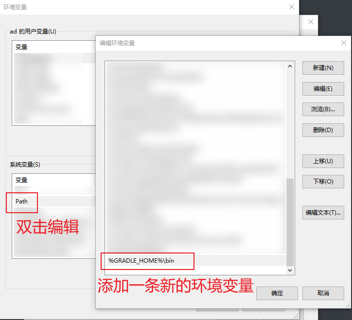

# 第十一章：用 Gradle 运行 JUnit 测试


> **本章概要**
>
> - `Gradle` 简介
> - `Gradle` 项目的设置
> - `Gradle` 插件的用法
> - 从零创建 `Gradle` 项目、并用 `JUnit 5` 进行测试
> - 对比 `Gradle` 和 `Maven`

本章对 `Gradle` 介绍十分简要，因为截止 2020 年成书时，全球使用 `Gradle` 构建的项目也仅占约 25%，近年来的市场份额也没有太大的变化；再加上 `Gradle` 本身的学习曲线比较陡峭，当时最新的 `v6.0` 版对 `@Display` 注解的支持也存在一些问题，相关介绍就更少了。因此，实测本章内容时将采用最新的 `v9.0.0` 进行验证，并结合 **附录 B** 对一些基础用法做一些介绍。

---


## 11.1 Gradle 简介

`Gradle`（[https://gradle.org](https://gradle.org)）是继 `Apache Ant`（2000 年）和 `Apache Maven`（2004 年）后，由 `Google` 于 2012 年推出的、基于 `Groovy` 的 `DSL` 语言开发的新一代项目构建工具。

`Gradle`（读作：`/ˈɡreɪdəl/`），该名称的设计灵感源于 `Groovy` 和 `Ant` 的结合[^1]；其单词本意为等级、阶梯、渐变，这也恰好暗含了 `Gradle` 的另一个关键特性：**增量构建**。`Gradle` 的问世主要是为了在 `Ant` 的灵活性和 `Maven` 的规范性之间找到一个最佳平衡点，并利用一门真正的编程语言（即 `Groovy`，目前默认使用 `Kotlin`）来打破 `XML` 的固有局限性。

> [!tip]
>
> **知识拓展：增量构建**
>
> 所谓的增量构建，是指 `Gradle` 能通过分析任务的输入和输出，智能地判断哪些任务是最新的、哪些需要重新执行。由于只执行那些“已升级”或“已变更”的部分，从而极大地提升了构建速度。这种 **一步步升级/构建** 的过程，与 **阶梯** 的意象非常吻合。

`Groovy` 是一门典型的 **DSL（domain-specific language，特定领域语言）**语言。它兼容 `Java` 语法，支持面向对象编程，且可以在 `Java` 虚拟机上运行。

`DSL` 是一种专门解决特定应用领域问题的计算机语言，常见的还包括 `SQL`、正则表达式、`AWK`、`Scala`、`Kotlin` 等；其核心理念是为了 **在特定领域提升表达效率和清晰度**，让代码或配置读起来更像是某个领域的专家在描述问题，而不是程序员编写的通用逻辑。

与 `DSL` 概念相对立的另一个概念即 `GPL`（**General-Purpose Language，即通用编程语言**），例如 `Java`、`Python`、`C++` 等语言。`GPL` 旨在解决各种领域的复杂计算问题，能够提供完备的编程抽象（变量、循环、函数等），功能强大，但学习曲线也相对陡峭。

而在项目构建领域，践行 `DSL` 理念的一个重要成果，就是基于 `Groovy` 语言的 `Gradle`。


## 11.2 Gradle 的安装与基础配置

本节根据 **附录 B** 整理，实测时 `Gradle` [官网](https://gradle.org/) 已经正式发布 `v9.1.0`：


对应的 `Java` 版本也升级到了 `JDK17`。为了增强实测的时效性，本地选用最新版进行演示。

`zip` 安装包下载地址：[https://gradle.org/releases/](https://gradle.org/releases/)

下载成功后，将 `Gradle` 安装包解压到某个目录下（如 `D:\gradle-9.1.0\`）：


然后按如下步骤配置环境变量：

```powershell
# 打开系统高级设置窗口
> systemPropertiesAdvanced
```

新建环境变量 `GRADLE_HOME`，对应的值为刚才解压的 `Gradle` 路径 （`D:\gradle-9.1.0\`）：


然后调用该变量，将 `%GRADLE_HOME%\bin` 添加到 `Path` 中：



再用同样的方式创建一个系统变量 `GRADLE_USER_HOME`，对应的值为本地 `Maven` 仓库的路径，这样就能和 `Maven` 共享本地依赖；否则 `Gradle` 在构建项目时会默认在 `{USER_HOME}/.gradle/` 文件夹下重新下载所需依赖，浪费磁盘空间：


确认后验证配置：

```powershell
> gradle -version

------------------------------------------------------------
Gradle 9.1.0
------------------------------------------------------------

Build time:    2025-09-18 13:05:56 UTC
Revision:      e45a8dbf2470c2e2474ccc25be9f49331406a07e

Kotlin:        2.2.0
Groovy:        4.0.28
Ant:           Apache Ant(TM) version 1.10.15 compiled on August 25 2024
Launcher JVM:  21.0.6 (Oracle Corporation 21.0.6+8-LTS-188)
Daemon JVM:    C:\Program Files\Java\jdk-21 (no JDK specified, using current Java home)
OS:            Windows 10 10.0 amd64
> 
```

说明 `Gradle` 安装成功。


## 11.3 用 Gradle 创建一个项目

本节演示如何利用 `Gradle` 命令创建一个默认项目。

任意新建一个文件夹（例如上一章的 `C:\junitbook\`），然后命令行导航到该路径，并执行如下命令：

```bash
> mkdir flightmanagement | Out-Null
> cd flightmanagement
> gradle init
Starting a Gradle Daemon, 1 stopped Daemon could not be reused, use --status for details

Select type of build to generate:
  1: Application
  2: Library
  3: Gradle plugin
  4: Basic (build structure only)
Enter selection (default: Application) [1..4]

Select implementation language:
  1: Java
  2: Kotlin
  3: Groovy
  4: Scala
  5: C++
  6: Swift
Enter selection (default: Java) [1..6]

Enter target Java version (min: 7, default: 21):

Project name (default: flightmanagement):

Select application structure:
  1: Single application project
  2: Application and library project
Enter selection (default: Single application project) [1..2]

Select build script DSL:
  1: Kotlin
  2: Groovy
Enter selection (default: Kotlin) [1..2] 2

Select test framework:
  1: JUnit 4
  2: TestNG
  3: Spock
  4: JUnit Jupiter
Enter selection (default: JUnit Jupiter) [1..4]

Generate build using new APIs and behavior (some features may change in the next minor release)? (default: no) [yes, no]


> Task :init
Learn more about Gradle by exploring our Samples at https://docs.gradle.org/9.1.0/samples/sample_building_java_applications.html

BUILD SUCCESSFUL in 50s
1 actionable task: 1 executed
> 
```

注意，最新版 `Gradle` 默认的构建脚本已经切换到 `Kotlin` 了，因此应该手动选择 `Groovy`，输入 `2` 后按 <kbd>Enter</kbd> 键继续（第 `L34` 行）。其余选项均保持默认设置即可。最后得到的项目结构如下：

```powershell
> tree /f .
Folder PATH listing for volume OS
Volume serial number is 00000085 DA4A:6CB8
C:\JUNITBOOK\FLIGHTMANAGEMENT
│   .gitattributes
│   .gitignore
│   gradle.properties
│   gradlew
│   gradlew.bat
│   settings.gradle
│
├───app
│   │   build.gradle
│   │
│   └───src
│       ├───main
│       │   ├───java
│       │   │   └───org
│       │   │       └───example
│       │   │               App.java
│       │   │
│       │   └───resources
│       └───test
│           ├───java
│           │   └───org
│           │       └───example
│           │               AppTest.java
│           │
│           └───resources
└───gradle
    │   libs.versions.toml
    │
    └───wrapper
            gradle-wrapper.jar
            gradle-wrapper.properties
> 
```

接着删除默认生成的 `org.example.App.java` 以及对应的测试类 `org.example.AppTest.java`，改为书中指定的 `Passenger` 类和测试类 `PassengerTest`：

```powershell
# 删除默认的类和测试类
> rm -recurse -Force app\src\main\java\org, app\src\test\java\org
```

导入 `IDEA` 后添加新的 `Passenger` 类和测试类 `PassengerTest`：

```java
// 乘客实体类
package com.testeddatasystem.flights;

public class Passenger {
    private String identifier;
    private String name;

    public Passenger(String identifier, String name) {
        this.identifier = identifier;
        this.name = name;
    }

    public String getIdentifier() {
        return identifier;
    }

    public String getName() {
        return name;
    }

    @Override
    public String toString() {
        return "Passenger " + getName() +", with identifier: " + getIdentifier();
    }

    public static void main(String[] args) {
        final Passenger passenger = new Passenger("123-456-789", "John Smith");
        System.out.println(passenger);
    }
}
```

然后在 `Passenger` 类上按 <kbd>Ctrl</kbd> + <kbd>Shift</kbd> + <kbd>T</kbd> 自动创建测试类：


添加测试逻辑如下：

```java
package com.testeddatasystem.flights;

import org.junit.jupiter.api.DisplayName;
import org.junit.jupiter.api.Test;

import static org.junit.jupiter.api.Assertions.*;

class PassengerTest {

    @Test
    @DisplayName("toString() method should match the desired content")
    void testToString() {
        final Passenger passenger = new Passenger("123-456-789", "John Smith");
        assertEquals("Passenger John Smith, with identifier: 123-456-789",
                passenger.toString());
    }
}
```

按 <kbd>Shift</kbd> + <kbd>F10</kbd> 快速运行该测试用例，得到如下结果：


和 `Maven` 不同的是，`Gradle` 会在 `app/build/` 目录下直接生成 `HTML` 格式的测试报表：


用浏览器打开该文件，还可以看到原书中提到的 `@DisplayName` 注解显示异常的问题早已解决：


最后，再按书中演示的步骤过一遍 `Gradle` 的相关构建命令。

先修改配置文件 `app/build.gradle` 中的主类引用：

```groovy
application {
    // Define the main class for the application.
    mainClass = 'com.testeddatasystem.flights.Passenger'
}
```

然后运行命令 `gradle run`：


接着执行命令 `gradle build`：


最后是 `gradle test`：


`Gradle 9.1.0` 最新的默认配置脚本已经和书中的 `6.0` 大相径庭了（`9.1` 版已无法顺利编译 `6.0` 的配置脚本了），新 `build.gradle` 的完整内容如下：

```groovy
/*
 * This file was generated by the Gradle 'init' task.
 *
 * This generated file contains a sample Java application project to get you started.
 * For more details on building Java & JVM projects, please refer to https://docs.gradle.org/9.1.0/userguide/building_java_projects.html in the Gradle documentation.
 */

plugins {
    // Apply the application plugin to add support for building a CLI application in Java.
    id 'application'
}

repositories {
    // Use Maven Central for resolving dependencies.
    mavenCentral()
}

dependencies {
    // Use JUnit Jupiter for testing.
    testImplementation libs.junit.jupiter

    testRuntimeOnly 'org.junit.platform:junit-platform-launcher'

    // This dependency is used by the application.
    implementation libs.guava
}

// Apply a specific Java toolchain to ease working on different environments.
java {
    toolchain {
        languageVersion = JavaLanguageVersion.of(21)
    }
}

application {
    // Define the main class for the application.
    mainClass = 'com.testeddatasystem.flights.Passenger'
}

tasks.named('test') {
    // Use JUnit Platform for unit tests.
    useJUnitPlatform()
}
```

关于上述配置的具体含义，详见 `Gradle` 官方文档：[https://docs.gradle.org/current/userguide/userguide.html](https://docs.gradle.org/current/userguide/userguide.html)。

想深入了解 `Gradle` 各种用法的朋友，还可以参考作者推荐的一本参考书：《*Gradle in Action*》（[Benjamin Muschko](https://www.manning.com/authors/benjamin-muschko), [Manning, 2014.02](https://www.manning.com/books/gradle-in-action)）。


## 11.4 拓展：Gradle 任务的创建

**附录 B** 中还介绍了几个关于 `Gradle` 任务的小例子，这里也在本地实测了一遍。

`Gradle` 是通过 **构建文件**（`build file`）来管理项目。每个 `Gradle` 构建文件都能描述 **一个或多个** 项目，而项目则是由不同的 **任务** 构成。所谓的 `Gradle` 任务，是指通过运行构建文件执行的某项工作内容，如编译某些类、创建 `JAR` 包、生成 `Javadoc` 文档、或将归档文件发布到 `repository` 仓库等等。构建或测试项目所需的操作都可以通过 `Gradle` 任务来定义和执行。

`Gradle` 还有个 **闭包** 的概念。闭包代表了某个独立的代码块，既可以接收参数，也可以有返回值。

`Gradle` 构建文件的默认名称为 `build.gradle`，因此可以利用该文件在桌面新建一个示例文件夹 `gradleTest`，然后执行下列命令，体验一下 `Gradle` 任务的相关操作：

```powershell
# 初始化示例文件夹
> (pwd).Path
C:\Users\ad\Desktop
> mkdir gradleTest | Out-Null
> cd gradleTest

# 示例1：创建一个 gradle 配置脚本
> vim build.gradle
> cat build.gradle
task junit {
  print "JUnit in Action"
}
# 执行 gradle 任务 junit（静默模式）
> gradle -q junit
JUnit in Action 0% CONFIGURING [79ms]

# 示例2：运行带依赖关系的 gradle 任务
> vim build.gradle
> cat build.gradle
task junit {
  print "JUnit in Action"
}

task third (dependsOn: 'junit') {
  println ", third edition"
}
# 执行任务 third
> gradle -q third
JUnit in Action, third edition

# 示例3：运行带依赖关系、且任务中包含多个阶段的复杂任务
> vim build.gradle
> cat build.gradle
task junit {
  print "JUnit "

  doFirst {
    print "Action"
  }

  doLast {
    print ", "
  }
}

task third (dependsOn: 'junit') {
  print "in "

  doFirst {
    print "third "
  }

  doLast {
    println "edition"
  }
}
# 执行复杂任务 third
> gradle -q third
JUnit in Action, third edition
> 
```

其中的 `dependsOn`、`doFirst`、`doLast` 都是 `Gradle API` 中的固定写法，不可随意变更。具体用法详见 `Gradle` [官方文档](https://docs.gradle.org/current/userguide/userguide.html)。


## 11.5 对比 `Gradle` 与 `Maven`

由于书中没有详细对比 `Maven` 和 `Gradle` 的区别和联系，以下是内容根据 `DeepSeek` 整理——

### 11.5.1 核心理念对比

|          | Maven             | Gradle                                                       |
| :------- | :---------------- | :----------------------------------------------------------- |
| 主要特点 | 声明式、标准化    | 声明式 + 命令式、高度灵活                                    |
| 构建语言 | `XML` (`pom.xml`) | `Groovy` / `Kotlin` 的 `DSL` 语言（`build.gradle` 或 `build.gradle.kts`） |
| 核心原则 | 约定优于配置      | 约定优于配置，但可轻松覆盖约定配置                           |


### 11.5.2 Maven 优缺点分析

优点——

1. 简单统一：
   - 标准的项目结构和生命周期，所有 `Maven` 项目都遵循相同的约定。新手容易上手，项目易于理解。
   - `pom.xml` 结构固定，可读性（对简单项目）较强。
2. 强大的依赖管理：
   - 通过中央仓库和标准的 `groupId:artifactId:version` 坐标管理依赖，解决了 `Ant` 时代的 `JAR` 包地狱的问题。
   - 依赖作用域（`scope`）如 `compile`, `test`, `provided` 等定义清晰。
3. 庞大的生态系统：
   - 出现时间早，社区庞大，几乎所有的第三方库都提供了 `Maven` 支持。
   - 有大量成熟的插件，文档齐全。
4. 稳定性与一致性：
   - 构建过程可预测、一致。在团队协作中，能保证每个人的构建行为相同。

缺点——

1. `XML` 配置冗长且僵化：
   - `XML` 非常繁琐，不适合逻辑表达。在 `pom.xml` 中编写复杂的条件判断或循环几乎不可能，即使可行也十分笨拙。
2. 扩展性差：
   - 自定义行为必须通过编写 `Maven` 插件（需要 `Java` 知识和打包部署），过程繁琐，远不如在构建脚本中直接写代码方便。
3. 依赖管理不够灵活：
   - 排除传递性依赖比较麻烦，需要显式声明。
   - 处理依赖冲突时，控制力方面不如 `Gradle`。
4. 构建性能相对较低：
   - 默认不支持增量构建。
   - 相比 `Gradle`，构建速度通常更慢。


### 11.5.3 Gradle 优缺点分析

优点——

1. 极致的灵活性和可扩展性：
   - 使用真正的编程语言（`Groovy` / `Kotlin`）作为脚本语言，可以轻松编写自定义逻辑、条件判断和循环。
   - 可以创建非常强大的 `DSL` 语言，使脚本既简洁又富有表达力。
2. 卓越的构建性能：
   - 增量构建：`Gradle` 通过分析任务的输入和输出，只执行变化的部分，构建速度极快。
   - 构建缓存：可以复用本地甚至远程（如 `CI` 持续集成服务器）的构建缓存，进一步加速构建。
   - 守护进程：常驻内存的 `Daemon` 避免了重复启动 `JVM` 的开销。
3. 强大的依赖管理：
   - 继承了 `Maven` 依赖管理的所有优点，并提供了更强大的依赖解析和冲突解决策略。
   - 依赖声明更简洁，支持动态版本（如 `1.0.+`），但同时也提供了严格锁定版本的能力。
4. 与 `Android` 生态的深度绑定：
   - 谷歌官方选择 `Gradle` 作为 `Android` 应用的默认构建工具，使其在移动开发领域占据统治地位。

缺点——

1. 学习曲线更陡峭：
   - 虽然简单的构建脚本很容易写，但要精通 `Gradle`（理解任务图、自定义任务/插件、性能调优）需要学习更多概念。
   - `Groovy` / `Kotlin` 等 `DSL` 的自由度也可能导致编写出难以维护的“坏”脚本。
2. 构建脚本的可读性差异大：
   - 一个编写良好的 `Gradle` 脚本非常易读，但一个充满复杂逻辑的脚本可能比 `XML` 更难理解。
3. 主流 `IDE` 的支持不及 `Maven`：
   - 虽然主流 `IDE` 对 `Gradle` 支持良好，但在依赖解析、自动补全等方面有时仍不如对 `Maven` 的支持稳定快速（尤其是在使用 `Groovy` 的 `DSL` 特性时）。


### 11.5.4 构建工具选型建议

|              场景              | 推荐工具 | 理由                                                         |
| :----------------------------: | :------: | :----------------------------------------------------------- |
| 传统 `Java EE` / `Spring` 项目 | `Maven`  | 项目结构标准，依赖管理简单，团队学习成本低，稳定性高。       |
|         `Android` 开发         | `Gradle` | 官方唯一支持，无其他选择。                                   |
|     大型、复杂、多项目构建     | `Gradle` | 卓越的性能和灵活性，能有效管理复杂的项目依赖和构建逻辑。     |
|     需要高度自定义构建流程     | `Gradle` | 用代码编写构建逻辑的能力是决定性优势。                       |
|       初创团队或快速原型       | `Maven`  | 简单的 `pom.xml` 可以快速搭建项目，避免在构建工具上花费过多时间。 |
|        追求极致构建速度        | `Gradle` | 增量构建和构建缓存带来的性能提升是碾压性的。                 |


---

[^1]: `Gradle` 创始人 **Hans Dockter** 曾在多次访谈和演讲中提到，该名字意在传达它是一款基于 `Groovy` 的、建立在 `Ant` 最佳理念之上的构建工具，并将其提升到一个新的水平。

