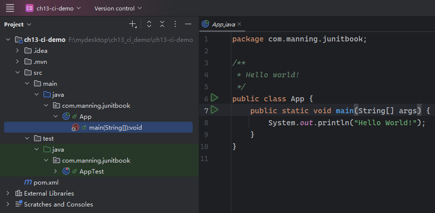
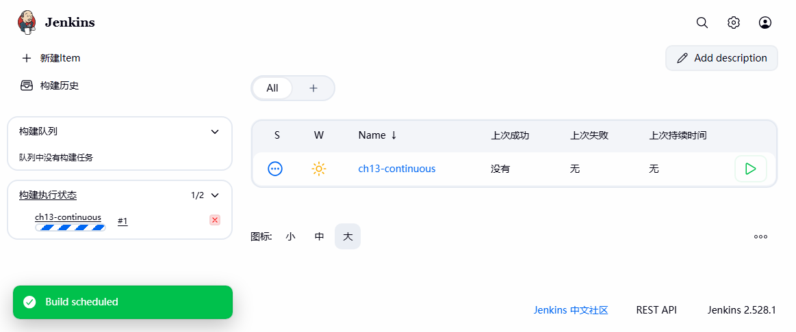
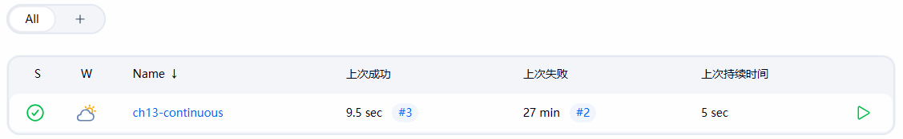

# 第十三章：用 JUnit 5 做持续集成


> **本章概要**
>
> - `Jenkins` 的配置与定制；
> - 简介开发团队常见的持续集成实践；
> - 演示持续集成环境下的任务处理流程。


> *Life is a continuous exercise in creative problem solving.*
> 人生就是个不断练习创造性解决问题的过程。
>
> —— **Michael J. Gelb**


## 13.1 持续集成的概念

**持续集成（*continuous integration*，即 *CI*）** 是一种软件开发实践，要求团队成员能够频繁集成各自的工作成果，通常每人每天至少集成一次，从而每天完成多次集成；每次集成均利用自动化构建（含测试）进行验证，以求尽快尽早发现集成本身存在的问题。

将 `JUnit` 测试集成到日常开发周期后，基本流程大致为：[`code` :arrow_right: `run` :arrow_right: `test` :arrow_right: `code` ]：


如果是 `TDD` 模式则略有不同，大致为：[`test` :arrow_right: `code` :arrow_right: `run` :arrow_right: `test`]：


除了定期集成外，还需要集成系统模块，以便尽快查看集成的结果。具体说来，用于持续集成的工具至少需要做到以下步骤：

1. 从源码版本库签出（`check out`）项目；
2. 构建每个模块并执行 **所有的** 单元测试，以验证每个模块均能独立、正常运行；
3. 执行集成测试，验证各模块能否按预期实现既定交互；
4. 发布上一步测试的执行结果。

使用工具集成和纯手动集成有何区别？答案是 **没有本质上的区别**，也不应该有本质区别。

持续集成的基本模式：


## 13.2 Jenkins 相关背景

`Jenkins` 的前身是一款准 `CI` 工具 `Hudson`。`Hudson` 最初是由 `Sun` 公司开发的一款免费软件，自从 2010 年 `Oracle` 甲骨文公司正式收购 `Sun` 公司后，`Hudson` 逐渐走上商业道路；2011 年初，开发者社区的绝大多数成员决定以 `Jenkins` 为名继续维护该开源项目。随后 `Hudson` 热度急剧下滑，并最终被 `Jenkins` 取代。2017 年 2 月，`Hudson` 停止维护。这是开源生态圈一次经典的 **庶民的胜利**，也给所有开源项目上了一课：**社区的活力和项目的质量，远比一个名字来得重要**。资本纵然可以买下源代码，但却买不下整个开源社区。

`Jenkins` 崛起于 `DevOps` 文化和技术实践蓬勃发展的关键时期，并凭借其无与伦比的灵活性和可扩展性，成为 `DevOps` 早期的探路者们实践 `CI/CD` 的 **事实上的标准工具**。可以说，`Jenkins` 奠定了现代 `DevOps` 运动的基石，为后来的云原生和 `GitOps` 等更先进理念的生根发芽创造了条件。


## 13.3 Jenkins 的安装

我本地实测前的相关准备工作：

- `java -version`：`java version "21.0.6" 2025-01-21 LTS`
- `git --version`：`git version 2.45.1.windows.1`
- `mvn -v`：`Apache Maven 3.9.11`

到 [官网](https://www.jenkins.io/) 下载 `Jenkins` 的最新稳定版 `Windows` 安装包 `jenkins.msi`（[https://www.jenkins.io/download/thank-you-downloading-windows-installer-stable/](https://www.jenkins.io/download/thank-you-downloading-windows-installer-stable/)）：


之后就是傻瓜式操作（这里我只改了安装路径，改到 `D:\ProgramFiles\Jenkins\`），最后来到安装目录下，找到启动 `Jenkins` 需要的 `war` 文件：


其实完全按 `msi` 包的安装流程走，`Windows` 会自动创建一个 `Jenkins` 服务，最后直接在浏览器访问 `http://localhost:8080/`、新建管理员帐号、重置登录密码、完成初始化插件安装后，`Jenkins` 就能像书中那样正常使用了：


但是，如果要进一步实测 `CI` 持续集成的工作流程，在这样的 `Jenkins` 平台模拟几次手动构建，就会遇到很多新问题（稍后详细复盘）。该问题暂时只能通过从命令行启动 `Jenkins` 来解决（已位于 `Jenkins` 安装目录下）：

```cmd
java -jar ./Jenkins.war
```


## 13.4 CI 实战：在 Jenkins 创建项目并处理构建任务

本章后续内容就是模拟了一个用 `Jenkins` 做持续集成的小案例，具体场景即示例公司 `Tested Data Systems` 的航班管理应用，涉及两个实体类的交互：`Flight` 和 `Passenger`，分别由两位开发者独立维护。航班对象有一个名为 `passengers` 的乘客集合，并且提供了实例方法来动态添加或删除乘客元素；此外还有一些校验逻辑，限制乘客总数不超过总的座位数。

模拟的工作流是这样的：两位开发者先实现各自的实体类和测试类，运行无误后完成了代码版本的初始提交。后来维护 `Passenger` 的开发者决定新增一个实例方法，让乘客也能主动选择某个航班，而不是只能被动地接受航班的指派。结果修改完代码并提交到代码库后，`Jenkins` 构建失败了，原因是 `Flight` 及其测试类也需要同步修改一些细节。于是，维护 `Flight` 的开发者又重新签出项目代码，修复 Bug 并提交了一个新的版本到 `Jenkins`。最后通过了 `Jenkins` 的手动构建任务。

这个流程涉及 `Jenkins` 的相关配置、`Git` 本地代码库的临时搭建、多次版本提交的演示、以及 `Jenkins` 构建任务的执行。可能是篇幅有限，作者并没有详细展开演示每一个步骤，很多地方都是一带而过。作为以实战为主的自学笔记，肯定是需要亲自动手尝试的，一来看看书中有没有遗漏的关键节点，二来也可以验证一下五年后的新版本新环境下会遇到哪些具体的新问题。

以下是具体实测过程。


### 13.4.1 构建示例项目

在桌面新建文件夹 `ch13_ci_demo` 作为项目的本地 `Git` 仓库。先完成基础配置：

```powershell
# 在桌面创建一个空的示例文件夹，用于存放本地 Git 代码库，以及模拟两个开发者的本地工作空间（稍后实现）
> (pwd).Path
F:\mydesktop
> mkdir ch13_ci_demo | Out-Null
> cd ch13_ci_demo
# 用 Maven 命令快速初始化示例项目
> mvn archetype:generate -DgroupId="com.manning.junitbook" -DartifactId="ch13-ci-demo" -DarchetypeArtifactid="maven-artifact-mojo"
```

> [!tip]
>
> **关于 Maven 命令中的两个细节**
>
> 注意：在 `PowerShell` 命令行中，各参数的值最好用双引号标注一下（如 `"com.manning.junitbook"`），以免运行报错。如果是 `CMD` 命令行环境则可以不用加注。
>
> 另外，上述 `Maven` 命令在最后确认环节如果需要调整某些配置，只需输入一个 `n`，再按回车确认，即可逐一审核每个初始参数。例如初始配置的 `Java` 版本是 `17`，我本地只有 `21`，于是就有手动修改环节：
>
> 

然后用 `IDEA` 打开该项目：



然后根据书中步骤，完成 `Flight` 实体、`Passenger` 实体及其各自的测试类的创建：

```java
package com.manning.junitbook.flights;

import com.manning.junitbook.passengers.Passenger;

import java.util.HashSet;
import java.util.Set;
import java.util.regex.Matcher;
import java.util.regex.Pattern;

public class Flight {

    private final String flightNumber;
    private final int seats;
    private final Set<Passenger> passengers = new HashSet<>();

    private static final String flightNumberRegex = "^[A-Z]{2}\\d{3,4}$";
    private static final Pattern pattern = Pattern.compile(flightNumberRegex);

    public Flight(String flightNumber, int seats) {
        Matcher matcher = pattern.matcher(flightNumber);
        if (!matcher.matches()) {
            throw new RuntimeException("Invalid flight number");
        }
        this.flightNumber = flightNumber;
        this.seats = seats;
    }

    public String getFlightNumber() {
        return flightNumber;
    }

    public int getNumberOfPassengers() {
        return passengers.size();
    }

    public boolean addPassenger(Passenger passenger) {
        if (getNumberOfPassengers() >= seats) {
            throw new RuntimeException("Not enough seats for flight " + getFlightNumber());
        }
        return passengers.add(passenger);
    }

    public boolean removePassenger(Passenger passenger) {
        return passengers.remove(passenger);
    }
}
```

初始测试类 `FlightTest`：

```java
package com.manning.junitbook.flights;

import org.junit.jupiter.api.Test;

import static org.junit.jupiter.api.Assertions.*;

class FlightTest {
    @Test
    public void testFlightCreation() {
        Flight flight = new Flight("AA123", 100);
        assertNotNull(flight);
    }

    @Test
    public void testInvalidFlightNumber() {
        assertThrows(RuntimeException.class,
                () -> new Flight("AA12", 100));
    }
}
```

乘客实体类 `Passenger`：

```java
package com.manning.junitbook.passengers;

import java.util.Arrays;
import java.util.Locale;

public class Passenger {

    private final String identifier;
    private final String name;
    private final String countryCode;

    public Passenger(String identifier, String name, String countryCode) {
        if (!Arrays.asList(Locale.getISOCountries()).contains(countryCode)) {
            throw new RuntimeException("Invalid country code");
        }

        this.identifier = identifier;
        this.name = name;
        this.countryCode = countryCode;
    }

    public String getIdentifier() {
        return identifier;
    }

    public String getName() {
        return name;
    }

    public String getCountryCode() {
        return countryCode;
    }

    @Override
    public String toString() {
        return "Passenger " + getName() + " with identifier: " + getIdentifier() + " from " + getCountryCode();
    }
}
```

对应的初始测试类 `PassengerTest`：

```java
package com.manning.junitbook.passengers;

import org.junit.jupiter.api.Test;

import static org.junit.jupiter.api.Assertions.*;

class PassengerTest {
    @Test
    public void testPassengerCreation() {
        Passenger passenger = new Passenger("123-45-6789", "John Smith", "US");
        assertNotNull(passenger);
    }

    @Test
    public void testInvalidCountryCode() {
        assertThrows(RuntimeException.class,
                () -> new Passenger("900-45-6789", "John Smith", "GJ"));
    }

    @Test
    public void testPassengerToString() {
        Passenger passenger = new Passenger("123-45-6789", "John Smith", "US");
        assertEquals("Passenger John Smith with identifier: 123-45-6789 from US", passenger.toString());
    }
}
```

由于 `Flight` 航班实体可以控制预订该航班乘客的数量，因此负责实现 `Flight` 的开发者又新增了一个集成测试类 `FlightWithPassengersTest`：

```java
package com.manning.junitbook.flightspassengers;

import com.manning.junitbook.flights.Flight;
import com.manning.junitbook.passengers.Passenger;
import org.junit.jupiter.api.Test;

import static org.junit.jupiter.api.Assertions.*;

public class FlightWithPassengersTest {

    private final Flight flight = new Flight("AA123", 1);

    @Test
    void testAddRemovePassengers() {
        Passenger passenger = new Passenger("124-56-7890", "Michael Johnson", "US");
        assertTrue(flight.addPassenger(passenger));
        assertEquals(1, flight.getNumberOfPassengers ());
        assertTrue(flight.removePassenger(passenger));
        assertEquals(0, flight.getNumberOfPassengers ());
    }

    @Test
    void testNumberOfSeats() {
        Passenger passenger1 = new Passenger("124-56-7890", "Michael Johnson", "US");
        flight.addPassenger(passenger1);
        assertEquals(1, flight.getNumberOfPassengers ());
        Passenger passenger2 = new Passenger("127-23-7991", "John Smith", "GB");
        final RuntimeException ex = assertThrows(RuntimeException.class, () -> flight.addPassenger(passenger2));
        assertEquals("Not enough seats for flight AA123", ex.getMessage());
    }
}
```

最后运行测试，为下一步 `Git` 仓库的初始化做准备：


### 13.4.2 Git 仓库初始化

根据书中的演示内容，远程仓库的地址是 `\\192.168.1.5\ch13-continuous`。这就需要在本地创建一个 `Git` 远程仓库，并共享该仓库，好让后续两个开发者签出代码。具体操作如下：

```powershell
# 导航到示例项目根目录下
> cd F:/mydesktop/ch13_ci_demo/ch13-ci-demo
# 初始化 Git 仓库
> git init
# 添加 .gitignore 忽略文件，筛除无关内容
> vim .gitignore
> cat .gitignore
.idea
.mvn

target
# 添加本地变更
> git add *
# 生成首个本地提交版本
> git commit -m 'init commit'
[master (root-commit) 7c23e4d] init repo
 7 files changed, 255 insertions(+)
 create mode 100644 .gitignore
 create mode 100644 pom.xml
 create mode 100644 src/main/java/com/manning/junitbook/flights/Flight.java
 create mode 100644 src/main/java/com/manning/junitbook/passengers/Passenger.java
 create mode 100644 src/test/java/com/manning/junitbook/flights/FlightTest.java
 create mode 100644 src/test/java/com/manning/junitbook/flightspassengers/FlightWithPassengersTest.java
 create mode 100644 src/test/java/com/manning/junitbook/passengers/PassengerTest.java
```

接下来这一步很关键，要在本地模拟一个 `Git` 远程仓库，名称为 `ch13-continuous`：

```powershell
# 生成模拟远程仓库
> git init --bare ../ch13-continuous
Initialized empty Git repository in F:/mydesktop/ch13_ci_demo/ch13-continuous/
# 关联本地工作目录与远程仓库
> git remote add origin "F:\mydesktop\ch13_ci_demo\ch13-continuous"
# 推送本地变更到远程库
> git push -u origin master
Enumerating objects: 25, done.
Counting objects: 100% (25/25), done.
Delta compression using up to 16 threads
Compressing objects: 100% (12/12), done.
Writing objects: 100% (25/25), 3.74 KiB | 637.00 KiB/s, done.
Total 25 (delta 0), reused 0 (delta 0), pack-reused 0 (from 0)
To F:\mydesktop\ch13_ci_demo\ch13-continuous
 * [new branch]      master -> master
branch 'master' set up to track 'origin/master'.
```

然后共享该远程仓库，得到远程仓库的访问地址（即 `\\TX2\ch13-continuous`）：


然后就可以模拟两个开发者的工作目录了（`devPassenger`、`devFlight`）：

```powershell
> (pwd).Path
F:\mydesktop\ch13_ci_demo
# 模拟维护 Passenger 的开发者 Beth，其本地工作目录命名为 devPassenger
> git clone \\TX2\ch13-continuous devPassenger
Cloning into 'devPassenger'...
done.
> cd devPassenger
> git config user.name Beth
> git config user.email "beth@example.com"
# 同理，模拟维护 Flight 的开发者 John，其本地工作目录命名为 devFlight
> git clone \\TX2\ch13-continuous devFlight
Cloning into 'devFlight'...
done.
> cd devFlight
> git config user.name John
> git config user.email "john@example.com"
```

> 对上述操作不熟的朋友可以参考我的 `Git` [笔记专栏](https://blog.csdn.net/frgod/category_12716684.html)。


### 13.4.3 用 Jenkins 完成首次构建

这里实测时遇到个大坑：`Windows` 自动安装的 `Jenkins` 服务始终无法正常构建项目，因为出于安全考虑中止了本地共享文件夹做 `Git` 远程仓库的相关操作：


而按照截图中的提示，启动时需要添加一个系统属性 `hudson.plugins.git.GitSCM.ALLOW_LOCAL_CHECKOUT`，值设为 `true` 就能运行。但无论是修改 `Jenkins` 安装目录下的配置文件 `jenkins.xml`，还是从 `WebUI` 界面运行 `Groovy` 脚本 `System.setProperty('hudson.plugins.git.GitSCM.ALLOW_LOCAL_CHECKOUT', 'true')` 都不生效；唯一生效的方案是在 `CMD` 命令行用 `java -jar` 启动：

```cmd
java -Dhudson.plugins.git.GitSCM.ALLOW_LOCAL_CHECKOUT=true -jar jenkins.war
```

这种方式也要重新安装插件（如图所示）、重新初始化登录帐号密码等例行步骤：


接着来到 **新建Item** 的配置页（`http://localhost:8080/job/ch13-continuous/configure`），在源码管理栏填写刚建好的远程 `Git` 仓库地址：


然后在 `Build Steps` 栏输入构建命令 `clean install`：


保存配置，就得到一个名为 `ch13-continuous` 的构建目标：


点击右边的运行按钮，完成首次构建：



稍等片刻，刷新页面会看到状态已经更新（表示构建成功）：


### 13.4.4 新增乘客主动选择航班接口

用 `IDEA` 打开由开发者 A 维护的工作目录 `devPassenger`，在 `Passenger` 实体类中新增一个实例方法 `public void joinFlight(Flight flight)`，让乘客可以自主选择某个航班：

```java
public class Passenger {
    // -- snip --
    private Flight flight;

    public Flight getFlight() {
        return flight;
    }

    public void setFlight(Flight flight) {
        this.flight = flight;
    }

    public void joinFlight(Flight flight) {
        Flight previousFlight = this.flight;
        if (null != previousFlight) {
            if (!previousFlight.removePassenger(this)) {
                throw new RuntimeException("Cannot remove passenger");
            }
        }
        setFlight(flight);
        if (null != flight) {
            if (!flight.addPassenger(this)) {
                throw new RuntimeException("Cannot add passenger");
            }
        }
    }
    // -- snip --
}
```

这里一定要十分仔细，因为 `Flight` 和 `Passenger` 此时实现了双向通信，作为参数传入 `joinFlight()` 方法的 `flight` 对象也可以直接访问预订该航班的乘客集合 `passengers`，因此在第 `L20` 行指定新的航班前后，都需要 **同步更新** 前一航班及当前航班的乘客集合。

同时，集成测试类也要新增相应的测试用例，并微调之前的测试逻辑：

```java
public class FlightWithPassengersTest {
    // -- snip --
    @Test
    public void testPassengerJoinsFlight() {
        Passenger passenger = new Passenger("123-45-6789", "John Smith", "US");
        Flight flight = new Flight("AA123", 100);
        passenger.joinFlight(flight);
        assertEquals(flight, passenger.getFlight());
        assertEquals(1, flight.getNumberOfPassengers());
    }

    @Test
    void testAddRemovePassengers() {
        Passenger passenger = new Passenger("124-56-7890", "Michael Johnson", "US");
        assertTrue(flight.addPassenger(passenger));
        assertEquals(1, flight.getNumberOfPassengers ());
        assertEquals(flight, passenger.getFlight());

        assertTrue(flight.removePassenger(passenger));
        assertEquals(0, flight.getNumberOfPassengers ());
        assertNull(passenger.getFlight());
    }
    // -- snip --
}
```


### 13.4.5 用 Jenkins 完成第二次构建

为了演示构建失败的效果，这里故意跳过了本地测试，直接推送到远程仓库：

```powershell
> (pwd).Path
F:\mydesktop\ch13_ci_demo\devPassenger
> git add *.java
> git commit -m 'Allow the passenger to make the individual choice of a flight'
[master e5d238a] Allow the passenger to make the individual choice of a flight
 2 files changed, 38 insertions(+)
# 推送到远程仓库
> git push
Enumerating objects: 31, done.
Counting objects: 100% (31/31), done.
Delta compression using up to 16 threads
Compressing objects: 100% (8/8), done.
Writing objects: 100% (17/17), 1.43 KiB | 366.00 KiB/s, done.
Total 17 (delta 3), reused 0 (delta 0), pack-reused 0 (from 0)
To \\TX2\ch13-continuous
   7c23e4d..e5d238a  master -> master
# 确认推送结果
> git log --oneline --graph --decorate --all
* e5d238a (HEAD -> master, origin/master, origin/HEAD) Allow the passenger to make the individual choice of a flight
* 7c23e4d init repo
> 
```

回到 `Jenkins` 页面，重新构建项目失败了：


从编号为 `#2` 的构建记录中查看报错原因，发现有个为空的断言失败了：


在 `IDEA` 中再次定位报错断言：


### 13.4.6 修复集成测试中的 Bug

经分析，是 `Flight` 在管理乘客时没有对该乘客所在的航班进行同步关联，这需要另一名开发者进行修改。于是负责 `Flight` 的开发者 `John` 先同步最新的代码到他的工作空间：

```powershell
> (pwd).Path
F:\mydesktop\ch13_ci_demo\devFlight
> git pull
From \\TX2\ch13-continuous
 + 3a43104...e5d238a master     -> origin/master  (forced update)
Updating 7c23e4d..e5d238a
Fast-forward
 .../manning/junitbook/passengers/Passenger.java    | 26 ++++++++++++++++++++++
 .../FlightWithPassengersTest.java                  | 12 ++++++++++
 2 files changed, 38 insertions(+)
> 
```

再对 `addPassenger()` 和 `removePassenger()` 修改如下（`L7`、`L12`）：

```java
public class Flight {
    // -- snip --
    public boolean addPassenger(Passenger passenger) {
        if (getNumberOfPassengers() >= seats) {
            throw new RuntimeException("Not enough seats for flight " + getFlightNumber());
        }
        passenger.setFlight(this);
        return passengers.add(passenger);
    }

    public boolean removePassenger(Passenger passenger) {
        passenger.setFlight(null);
        return passengers.remove(passenger);
    }
}
```

在本地运行 `mvn test` 确认无误后，再推送到远程：

```powershell
> git add *.java
> git commit -m 'Adding integration code for a passenger join/unjoin'
[master 3a43104] Adding integration code for a passenger join/unjoin
 1 file changed, 2 insertions(+)
> git push
Enumerating objects: 19, done.
Counting objects: 100% (19/19), done.
Delta compression using up to 16 threads
Compressing objects: 100% (5/5), done.
Writing objects: 100% (10/10), 711 bytes | 355.00 KiB/s, done.
Total 10 (delta 2), reused 0 (delta 0), pack-reused 0 (from 0)
To \\TX2\ch13-continuous
   e5d238a..3a43104  master -> master
> 
```


### 13.4.7 用 Jenkins 完成第三次构建

再次回到 `Jenkins` 页面，状态图标重新变为正常，构建成功，Bug 已修复：



完整的构建历史记录如下：


至此，`Jenkins` 持续集成与示例开发流程的交互过程全部演示完毕。
