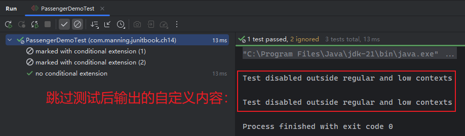
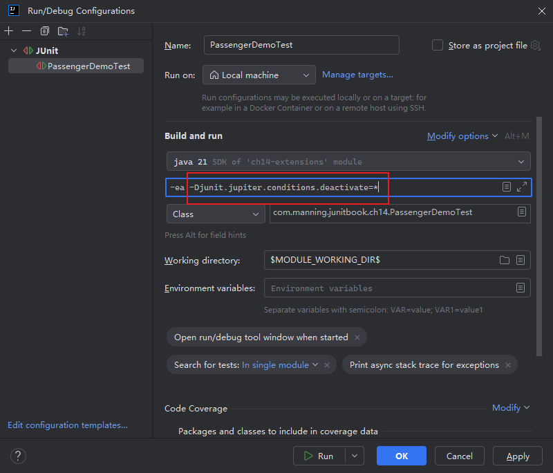
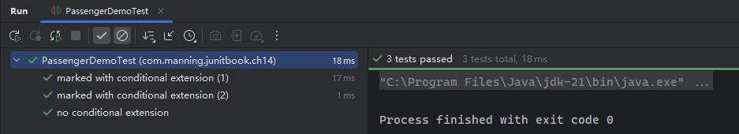
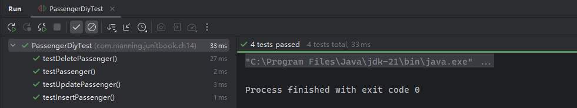
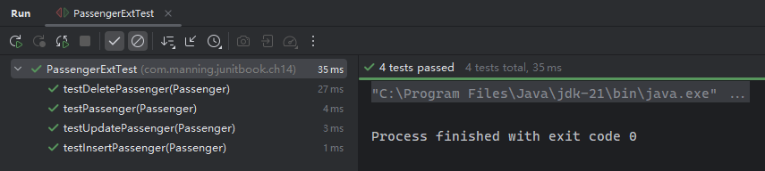
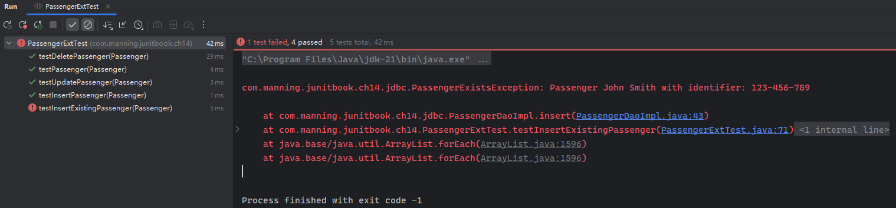
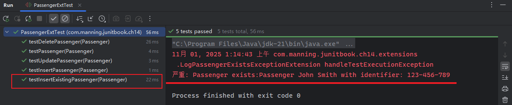

# 第四部分：现代框架与 JUnit 5 实战

该板块是全书的核心内容——

- 第 14 章介绍 `JUnit 5` 全新的扩展（`extension`）模型；
- 第 15 章介绍表现层测试及 `HtmlUnit`、`Selenium` 工具的使用；
- 第 16、17 章介绍 `Spring`、`SpringBoot` 中 `JUnit 5` 的用法；
- 第 18 章介绍 `REST` 风格接口应用的测试；
- 第 19 章介绍数据库应用的测试（`JDBC`、`Spring`、`Hibernate`）。


# 第十四章：JUnit 5 扩展模型

> **本章概要**
>
> - `JUnit 5` 扩展（`extension`）的创建方法；
> - 利用扩展点实现 `JUnit 5` 测试用例的方法；
> - 学会基于 `JUnit 5` 扩展模型生成的测试用例开发应用程序。

> *The wheel is an extension of the foot, the book is an extension of the eye, clothing an extension of the skin, electric circuitry an extension of the central nervous system.*
> 轮子是脚的延伸，书籍是眼睛的延伸，衣物是皮肤的延伸，电路是中枢神经系统的延伸。
>
> —— **Marshall McLuhan**


## 14.1 JUnit 5 扩展模型概述

`JUnit 4` 通过 `Runners` 和 `Rules` 提供扩展接口，`JUnit 5` 则通过全新的 `Extension API` 接口。`Extension` 本身只是一个 **标记接口（*marker interface*）**，也叫 **标签接口（*tag interface*）**、**令牌接口（*token interface*）**，其内部不包含任何字段或接口方法，只用于标识其实现类具备某种特定行为，如 `Serializable`、`Cloneable` 接口等。

扩展模型的基本原理：`JUnit 5` 扩展的具体实现逻辑，可以关联到测试执行过程中的某个特定事件的发生节点，即 **扩展点（*extension point*）**。当测试声明周期抵挡该节点时，`JUnit` 引擎就会自动调用这些扩展逻辑。

`JUnit 5` 提供了以下几类扩展点：

- **条件测试执行（Conditional test execution）**：根据某个判定条件决定测试是否应该运行；
- **生命周期回调（Life-cycle callback）**：响应测试的生命周期内的特定事件；
- **参数解析（*Parameter resolution*）**：解析测试运行时接收到的参数；
- **异常处理（*Exception handling*）**：在测试遇到特定类型的异常时，定义测试的行为；
- **测试实例后处理（*Test instance postprocessing*）**：在测试实例创建后需要执行的具体逻辑。

`JUnit 5` 的扩展逻辑常被框架或构建工具内部调用，也可用于应用开发，只是程度有限。


## 14.2 示例一：定制判定条件选择性执行测试

思路：实现 `org.junit.jupiter.api.extension.ExecutionCondition` 接口，并重写 `evaluateExecutionCondition()` 方法。

示例从资源目录下的配置文件 `context.properties` 读取参数 `context` 的值，并通过验证这个值是否在指定的值域范围内（`regular`、`low`）来决定被标注的测试类或方法是否执行：

```java
public class ExecutionContextExtension implements ExecutionCondition {

    @Override
    public ConditionEvaluationResult evaluateExecutionCondition(ExtensionContext context) {
        Properties properties = new Properties();
        String executionContext = "";

        try {
            properties.load(getClass().getClassLoader().getResourceAsStream("context.properties"));
            executionContext = properties.getProperty("context");
            if (!"regular".equalsIgnoreCase(executionContext) && !"low".equalsIgnoreCase(executionContext)) {
                return ConditionEvaluationResult.disabled("Test disabled outside regular and low contexts");
            }
        } catch (IOException e) {
            throw new RuntimeException(e);
        }
        return ConditionEvaluationResult.enabled("Test enabled on the " + executionContext + " context");
    }
}

// 用法：
@ExtendWith({ExecutionContextExtension.class})
class PassengerTest {
    // -- snip --
}
```

这些被标记的测试类或方法在 `IDEA` 中按类似 `@Disabled` 注解的方式跳过测试逻辑。以上一章演示过的 `Passenger` 乘客实体类为例，快速构建一个包含三个测试方法的测试类 `PassengerDemoTest`：

```java
public class PassengerDemoTest {

    private static void runTestLogics() {
        Passenger passenger = new Passenger("123-456-789", "John Smith");
        assertEquals("Passenger John Smith with identifier: 123-456-789", passenger.toString());
    }

    @Test
    @ExtendWith(ExecutionContextExtension.class)
    @DisplayName("marked with conditional extension (1)")
    void testPassenger1() {
        runTestLogics();
    }

    @Test
    @ExtendWith(ExecutionContextExtension.class)
    @DisplayName("marked with conditional extension (2)")
    void testPassenger2() {
        runTestLogics();
    }

    @Test
    @DisplayName("no conditional extension")
    void testPassenger3() {
        runTestLogics();
    }
}
```

运行该测试类，`IDEA` 将跳过被标注的测试方法（效果如同添加了 `@Disabled` 注解）：



此外，`IDEA` 还支持通过 **虚拟机参数** 来禁用这些判定条件，参数写法为：

```bash
-Djunit.jupiter.conditions.deactivate=*
```

实测 `IDEA` 最新版中的设置界面（`IntelliJ IDEA 2025.2.4 (Ultimate Edition)`）：



实测效果：




## 14.3 示例二：实体类持久化到数据库的 CRUD 操作测试

这个例子是全章的重点，也很有现实意义。演示的业务需求，是要将乘客实体类 `Passenger` 存入某个数据库，然后用 `JUnit 5` 创建单元测试。

### 14.3.1 实现数据持久化逻辑

乘客实体类 `Passenger` 的具体逻辑不变：

```java
public class Passenger {

    private String identifier;
    private String name;

    public Passenger(String identifier, String name) {
        this.identifier = identifier;
        this.name = name;
    }

    public String getIdentifier() {
        return identifier;
    }

    public String getName() {
        return name;
    }

    @Override
    public String toString() {
        return "Passenger " + getName() + " with identifier: " + getIdentifier();
    }
}
```

为了方便演示，书中使用的工具链为：`H2` + `JDBC` + `JUnit 5` 扩展。

为此，需要在 `pom.xml` 中引入内存数据库 `H2` 的依赖（之前的版本 `1.4.199` 太旧了，实测时升级到最新的 `2.4.240`）：

```xml
<dependency>
    <groupId>com.h2database</groupId>
    <artifactId>h2</artifactId>
    <version>2.4.240</version>
</dependency>
```

然后创建工具类 `ConnectionManager`，利用传统的 `JDBC API` 实现连接数据库的基础逻辑：

```java
public class ConnectionManager {

    private static Connection connection;
    public static Connection getConnection() {
        return connection;
    }

    public static Connection openConnection() {
        try {
            Class.forName("org.h2.Driver"); // this is driver for H2
            connection = DriverManager.getConnection("jdbc:h2:~/passenger",
                    "sa", // login
                    "" // password
            );
            return connection;
        } catch (ClassNotFoundException | SQLException e) {
            throw new RuntimeException(e);
        }
    }

    public static void closeConnection() {
        if (null != connection) {
            try {
                connection.close();
            } catch (SQLException e) {
                throw new RuntimeException(e);
            }
        }
    }
}
```

只创建连接还不够，还得提前建好一张乘客表 `PASSENGERS` 用于增删改查操作；测试结束后再删除该表（也可以保留，根据具体需求确定），相关逻辑放到另一个工具类 `TablesManager`：

```java
public class TablesManager {

    public static void createTable(Connection connection) {
        String sql = "CREATE TABLE IF NOT EXISTS PASSENGERS (ID VARCHAR(50), NAME VARCHAR(50));";
        executeStatement(connection, sql);
    }

    public static void dropTable(Connection connection) {
        String sql = "DROP TABLE IF EXISTS PASSENGERS;";
        executeStatement(connection, sql);
    }

    private static void executeStatement(Connection connection, String sql) {
        try (PreparedStatement statement = connection.prepareStatement(sql)) {
            statement.executeUpdate();
        } catch (SQLException e) {
            throw new RuntimeException(e);
        }
    }
}
```

然后是数据访问层逻辑，包含一个 `DAO` 接口和对应实现。接口层 `PassengerDao` 定义了 `CRUD` 四个方法：

```java
// 接口层
public interface PassengerDao {
	void insert(Passenger passenger);
	void update(String id, String name);
	void delete(Passenger passenger);
	Passenger getById(String id);
}
```

然后实现该接口，并通过构造函数传参的方式注入数据库连接：

```java
public class PassengerDaoImpl implements PassengerDao {

    private Connection connection;
    public PassengerDaoImpl(Connection connection) {
        this.connection = connection;
    }

    @Override
    public void insert(Passenger passenger){
        String sql = "INSERT INTO PASSENGERS (ID, NAME) VALUES (?, ?)";

        try (PreparedStatement statement = connection.prepareStatement(sql)) {
            statement.setString(1, passenger.getIdentifier());
            statement.setString(2, passenger.getName());
            statement.executeUpdate();
        } catch (SQLException e) {
            throw new RuntimeException(e);
        }
    }

    @Override
    public void update(String id, String name) {
        String sql = "UPDATE PASSENGERS SET NAME = ? WHERE ID = ?";

        try (PreparedStatement statement = connection.prepareStatement(sql)) {
            statement.setString(1, name);
            statement.setString(2, id);
            statement.executeUpdate();
        } catch (SQLException e) {
            throw new RuntimeException(e);
        }
    }

    @Override
    public void delete(Passenger passenger) {
        String sql = "DELETE FROM PASSENGERS WHERE ID = ?";

        try (PreparedStatement statement = connection.prepareStatement(sql)) {
            statement.setString(1, passenger.getIdentifier());
            statement.executeUpdate();
        } catch (SQLException e) {
            throw new RuntimeException(e);
        }
    }

    @Override
    public Passenger getById(String id) {
        String sql = "SELECT * FROM PASSENGERS WHERE ID = ?";
        Passenger passenger = null;

        try (PreparedStatement statement = connection.prepareStatement(sql)) {
            statement.setString(1, id);
            ResultSet resultSet = statement.executeQuery();

            if (resultSet.next()) {
                passenger = new Passenger(resultSet.getString(1), resultSet.getString(2));
            }

        } catch (SQLException e) {
            throw new RuntimeException(e);
        }
        
        return passenger;
    }
}
```

这样功能模块就实现好了，下一步该编写测试用例了。


### 14.3.2 不用 Extension API 的单元测试写法

按照正常逻辑，测试类中也要注入一个 `PassengerDao` 的依赖，然后在每个测试方法内依次执行下列步骤：

1. 连接数据库、数据表：交给添加了 `@BeforeAll` 注解的生命周期方法；
2. 初始化数据库：交给添加了 `@BeforeEach` 注解的生命周期方法；
3. 执行 `CRUD` 测试逻辑；测试方法的核心逻辑；
4. 断言 `CRUD` 执行结果：测试方法的核心逻辑；
5. 还原数据库操作：交给添加了 `@AfterEach` 注解的生命周期方法；
6. 清空数据表、关闭数据库连接：交给添加了 `@AfterAll` 注解的生命周期方法。

上述步骤除了 `3` 和 `4` 外，其余都是配合核心逻辑的辅助工作，如果不演示 `Extension API` 的用法，测试用例应该写成这样：

```java
public class PassengerDiyTest {

    private static Connection connection;
    private Savepoint savepoint;
    private PassengerDao passengerDao;

    @BeforeAll
    static void setUp() {
        connection = ConnectionManager.openConnection();
        TablesManager.dropTable(connection);
        TablesManager.createTable(connection);
    }

    @AfterAll
    static void tearDown() {
        TablesManager.dropTable(connection);
        if (null != connection) {
            try {
                connection.close();
            } catch (SQLException e) {
                throw new RuntimeException(e);
            }
        }
    }

    @BeforeEach
    void setUpEach() throws SQLException {
        passengerDao = new PassengerDaoImpl(connection);
        connection.setAutoCommit(false);
        savepoint = connection.setSavepoint("savepoint");
    }

    @AfterEach
    void tearDownEach() throws SQLException {
        connection.rollback(savepoint);
    }

    @Test
    void testPassenger() {
        Passenger passenger = new Passenger("123-456-789", "John Smith");
        assertEquals("Passenger John Smith with identifier: 123-456-789", passenger.toString());
    }

    @Test
    void testInsertPassenger() {
        Passenger passenger = new Passenger("123-456-789", "John Smith");
        passengerDao.insert(passenger);
        assertEquals("John Smith", passengerDao.getById("123-456-789").getName());
    }

    @Test
    void testUpdatePassenger() {
        Passenger passenger = new Passenger("123-456-789", "John Smith");
        passengerDao.insert(passenger);
        passengerDao.update("123-456-789", "Michael Smith");
        assertEquals("Michael Smith", passengerDao.getById("123-456-789").getName());
    }

    @Test
    void testDeletePassenger() {
        Passenger passenger = new Passenger("123-456-789", "John Smith");
        passengerDao.insert(passenger);
        passengerDao.delete(passenger);
        assertNull(passengerDao.getById("123-456-789"));
    }
}
```

实测效果也是没问题的：




### 14.3.3 利用 Extension API 的测试用例写法

对照常规写法不难发现：除了核心测试逻辑外，还有大量的样板代码需要处理：测试开始前的数据库连接、DAO 实例的初始化、临时数据表的管理……无形中加重了开发者的认知负担，例如在操作数据库前必须让测试用例完全控制事务的开启和关闭，以免对数据库造成污染。

而利用 `JUnit 5` 提供的 **生命周期回调扩展点**，就能用扩展类的方式将这些样板代码的处理逻辑从测试逻辑中抽离出来，从而简化单元测试的书写。具体来说，可以创建一个实现类 `DatabaseOperationsExtension` 同时继承四个生命周期注解对应的扩展点接口：

```java
public class DatabaseOperationsExtension implements BeforeAllCallback, AfterAllCallback, BeforeEachCallback, AfterEachCallback {

    private Connection connection;
    private Savepoint savepoint;

    @Override
    public void beforeAll(ExtensionContext context) {
        connection = ConnectionManager.openConnection();
        TablesManager.dropTable(connection);
        TablesManager.createTable(connection);
    }

    @Override
    public void afterAll(ExtensionContext context) {
        TablesManager.dropTable(connection);
        ConnectionManager.closeConnection();
    }

    @Override
    public void beforeEach(ExtensionContext context) throws SQLException {
        connection.setAutoCommit(false);
        savepoint = connection.setSavepoint("savepoint");
    }

    @Override
    public void afterEach(ExtensionContext context) throws SQLException {
        connection.rollback(savepoint);
    }
}
```

这样就率先封装了 `connection` 和 `savepoint` 实例。

至于数据访问对象 `passengerDao`，可以通过构造函数的参数传入测试类。这就需要 `JUnit 5` 能正确解析 `PassengerDao` 型的参数，通过手动实现另一个扩展点 `ParameterResolver` 接口即可：

```java
public class DataAccessObjectParameterResolver implements ParameterResolver {
    @Override
    public boolean supportsParameter(ParameterContext paramCtx, ExtensionContext extCtx) throws ParameterResolutionException {
        return paramCtx.getParameter()
                .getType()
                .equals(PassengerDao.class);
    }

    @Override
    public Object resolveParameter(ParameterContext paramCtx, ExtensionContext extCtx) throws ParameterResolutionException {
        return new PassengerDaoImpl(ConnectionManager.getConnection());
    }
}
```

同理，甚至每个测试方法中手动创建的 `passenger` 实例对象也可以通过方法参数的形式注入（只是不推荐这样写罢了）：

```java
public class PassengerParameterResolver implements ParameterResolver {
    @Override
    public boolean supportsParameter(ParameterContext paramCtx, ExtensionContext extCtx) throws ParameterResolutionException {
        return paramCtx.getParameter()
                .getType()
                .equals(Passenger.class);
    }

    @Override
    public Object resolveParameter(ParameterContext paramCtx, ExtensionContext extCtx) throws ParameterResolutionException {
        return new Passenger("123-456-789", "John Smith");
    }
}
```

通过扩展改造后的测试类如下：

```java
@ExtendWith({DataAccessObjectParameterResolver.class,
        DatabaseOperationsExtension.class,
        PassengerParameterResolver.class})
public class PassengerExtTest {

    private final PassengerDao passengerDao;
    public PassengerExtTest(PassengerDao passengerDao) {
        this.passengerDao = passengerDao;
    }

    @Test
    void testPassenger(Passenger passenger) {
        assertEquals("Passenger John Smith with identifier: 123-456-789", passenger.toString());
    }

    @Test
    void testInsertPassenger(Passenger passenger) {
        passengerDao.insert(passenger);
        Passenger passenger1 = passengerDao.getById("123-456-789");
        assertEquals("John Smith", passenger1.getName());
    }

    @Test
    void testUpdatePassenger(Passenger passenger) {
        passengerDao.insert(passenger);
        passengerDao.update("123-456-789", "Michael Smith");
        assertEquals("Michael Smith", passengerDao.getById("123-456-789").getName());
    }

    @Test
    void testDeletePassenger(Passenger passenger) {
        passengerDao.insert(passenger);
        passengerDao.delete(passenger);
        assertNull(passengerDao.getById("123-456-789"));
    }
}
```

实测效果也和刚才一样，但是核心逻辑更加突出：



> [!tip]
>
> **填坑备忘：轻信 AI 补全的代价**
>
> 在实现 `Passenger` 的参数解析接口时，由于相信 `AI` 工具的补全能力，不慎将 `resolveParameter()` 方法的返回值写成了 `return new Passenger("John Smith", "123-456-789");`（`name` 和 `identifier` 的位置颠倒了），结果运行始终报错。可见信任不能代替监督，`AI` 补全的内容一定要检查一遍。


## 14.4 示例四：利用抛自定义异常来测试乘客记录的唯一性

至此，开头提到的五类扩展点已经演示了三个，本例再演示一个：在测试用例中使用自定义的异常。场景很简单，插入一条新数据前先判定是否已存在。即改造 `insert()` 接口签名和实现类的逻辑：

```java
// 修改接口签名
public interface PassengerDao {
    // -- snip --
	void insert(Passenger passenger) throws PassengerExistsException ;
    // -- snip --
}

// 修改接口实现
public class PassengerDaoImpl implements PassengerDao {
    // -- snip --
    @Override
    public void insert(Passenger passenger) throws PassengerExistsException {
        String sql = "INSERT INTO PASSENGERS (ID, NAME) VALUES (?, ?)";

        if (null != getById(passenger.getIdentifier())) {
            throw new PassengerExistsException(passenger, passenger.toString());
        }

        try (PreparedStatement statement = connection.prepareStatement(sql)) {
            statement.setString(1, passenger.getIdentifier());
            statement.setString(2, passenger.getName());
            statement.executeUpdate();
        } catch (SQLException e) {
            throw new RuntimeException(e);
        }
    }
    // -- snip --
}
```

其中第 `L16` 行的自定义异常实现如下：

```java
public class PassengerExistsException extends Exception {
    private final Passenger passenger;

    public PassengerExistsException(Passenger passenger, String message) {
        super(message);
        this.passenger = passenger;
    }
}
```

然后同步更新各测试用例，凡是调用过 `insert()` 方法的用例都加上 `throws` 字句，同时新增一个用例专门测试重复插入的报错情况：

```java
@ExtendWith({DataAccessObjectParameterResolver.class,
        DatabaseOperationsExtension.class,
        PassengerParameterResolver.class
})
public class PassengerExtTest {

    private final PassengerDao passengerDao;
    public PassengerExtTest(PassengerDao passengerDao) {
        this.passengerDao = passengerDao;
    }

    @Test
    void testPassenger(Passenger passenger) {
        assertEquals("Passenger John Smith with identifier: 123-456-789", passenger.toString());
    }

    @Test
    void testInsertPassenger(Passenger passenger) throws PassengerExistsException {
        passengerDao.insert(passenger);
        assertEquals("John Smith", passengerDao.getById("123-456-789").getName());
    }

    @Test
    void testUpdatePassenger(Passenger passenger) throws PassengerExistsException {
        passengerDao.insert(passenger);
        passengerDao.update("123-456-789", "Michael Smith");
        assertEquals("Michael Smith", passengerDao.getById("123-456-789").getName());
    }

    @Test
    void testDeletePassenger(Passenger passenger) throws PassengerExistsException {
        passengerDao.insert(passenger);
        passengerDao.delete(passenger);
        assertNull(passengerDao.getById("123-456-789"));
    }

    @Test
    void testInsertExistingPassenger(Passenger passenger) throws PassengerExistsException {
        passengerDao.insert(passenger);
        passengerDao.insert(passenger);
        assertEquals("John Smith", passengerDao.getById("123-456-789").getName());
    }
}
```

正常情况下，最后一个用例会抛出自定义异常的报错原因，以及相应的堆栈信息：



如果想按指定的格式输出报错信息，例如只显示自定义的报错原因，不打印堆栈信息，这时就必须利用 `JUnit 5` 的 **异常处理** 扩展点，实现其 `TestExecutionExceptionHandler` 接口并重写 `handleTestExecutionException()` 方法：

```java
public class LogPassengerExistsExceptionExtension implements TestExecutionExceptionHandler {
    private final Logger logger = Logger.getLogger(getClass().getName());

    @Override
    public void handleTestExecutionException(ExtensionContext context, Throwable throwable) throws Throwable {
        if (throwable instanceof PassengerExistsException) {
            logger.severe("Passenger exists:" + throwable.getMessage());
            return;
        }
        throw throwable;
    }
}
```

上述逻辑在抛出自定义的异常时只打印一段错误日志就结束，不含任何堆栈信息。然后将这个实现类放入 `@ExtendWith` 注解中让扩展逻辑生效：

```java
@ExtendWith({DataAccessObjectParameterResolver.class,
        DatabaseOperationsExtension.class,
        PassengerParameterResolver.class,
        LogPassengerExistsExceptionExtension.class
})
public class PassengerExtTest {
    // -- snip --
}
```

再次运行，报错输出的就是指定内容了：



注意：由于测试用例执行到第二句 `passengerDao.insert(passenger);` 就抛异常了，且异常处理逻辑是扩展定制的内容，输出日志后直接 `return` 结束了，因此该用例也不会判定为执行失败。


## 14.5 小结

本章相对全面地演示了 `JUnit 5` 全新的 `Extension API` 在扩展单元测试功能特性方面的诸多应用，包括选择性执行单元测试、扩展生命周期回调接口取代相应的生命周期注解方法、自定义参数解析器让测试类的构造函数或测试方法能正确解析传入的参数，最后还通过 **去重校验逻辑** 扩展了适用于单元测试场景下的异常处理逻辑。至于最后一种（测试实例的后处理）可能因为和前面的案例有所重叠，书中并没有进行演示（也不排除是后面内容的伏笔）。

除了本章提过的五类扩展类型外，`JUnit 5` 还提供了大量其他的扩展接口与应用场景，详见 `JUnit` 官方文档：[https://docs.junit.org/current/user-guide/#extensions](https://docs.junit.org/current/user-guide/#extensions)。

总之，通过重写各生命周期回调接口的方法，可以让单元测试的书写更加突出重点，应用得当有望大幅减少开发者编写样板代码的工作量，值得一试。

