# 第十五章：表现层测试


> **本章概要**
>
> - `HtmlUnit` 测试用例的写法
> - `Selenium` 测试用例的写法
> - `HtmlUnit` 与 `Selenium` 对比

> *If debugging is the process of removing software bugs, then programming must be the process of putting them in.*
> 如果说调试是消除软件缺陷的过程，那么编程必定是植入缺陷的过程。
>
> —— **Edsger Dijkstra**


## 15.1 表现层测试概述

简言之，**表现层测试（*presentation-layer testing*）** 就是在用户图形界面（`GUI`）中发现应用程序的缺陷的过程。它和其他阶段的测试同等重要，毕竟糟糕的用户体验不仅会让应用的功能异常，更会流失客户、流失订单。

本章重点探讨如何基于 `Java` 代码对 `GUI` 中的内容进行断言测试的方法，不涉及字体样式、颜色、布局等主观元素的测试。

表现层测试的难点在于 **网站内容的稳定性无法长期保证**：网站内容甚至页面结构都会随着时间不断变化。本章介绍的测试方法主要针对短期内相对稳定的网页来设计测试用例。

表现层的测试内容包括：

- 网页内容的任意细节（包括单词拼写等）
- 应用的结构或导航设计（能否链接到预期目标）
- 能否通过验收测试，验证用户叙事逻辑（user stories）

> [!note]
>
> **注意**
>
> **用户叙事逻辑（*User stories*）** 也叫 **用户故事**，是对软件系统一个或多个功能特性的非正式自然语言描述。

根据 `Web` 应用是否独立于操作系统的具体特性、以及是否独立于浏览器对 `JavaScript`、`DOM`、`CSS` 等技术标准的特定实现，本章主要对 `HtmlUnit`、`Selenium` 两款开源工具的用法进行演示。


## 15.2 HtmlUnit 简介

`HtmlUnit`（[https://htmlunit.sourceforge.io/](https://htmlunit.sourceforge.io/)）是一款基于 `Java` 语言开发的开源无头浏览器（headless browser）框架。无头浏览器即没有 `GUI` 界面的浏览器。它能以编程的方式模拟用户在浏览器上对 `Web` 应用进行的各种操作，测试全程不显示任何用户界面。

由于实测时随书源码版本过低，因此更新了 `pom.xml` 中的 `HtmlUnit` 依赖（更新到最新版 `v4.18.0`）：

```xml
<dependency>
    <groupId>org.htmlunit</groupId>
    <artifactId>htmlunit</artifactId>
    <version>4.18.0</version>
</dependency>
```

版本升级后需要逐一更新导入语句，将旧包路 `com.gargoylesoftware.htmlunit` 一并改为 `org.htmlunit`。

本章实测代码旨在熟悉 `HtmlUnit` 具备的基本设置、基础功能，并在最新版的语法下完成各项测试目标。


## 15.3 HtmlUnit 用法演示

`HtmlUnit` 执行测试的基本流程：

- 调用 `getPage()` 方法；
- 定位某个元素；
- 执行某个操作（如单击元素等）；
- 断言结果；


### 15.3.1 示例1：基础设置及页面元素基础测试

`HtmlUnit` 部分的所有测试用例几乎都需要继承一个新建的抽象类 `ManagedWebClient`，目的是为了统一配置 `@BeforeEach` 和 `@AfterEach` 方法，让核心测试逻辑更加突出。新版抽象类定义如下：

```java
package com.manning.junitbook.ch15.htmlunit;

import org.htmlunit.BrowserVersion;
import org.htmlunit.SilentCssErrorHandler;
import org.htmlunit.WebClient;
import org.junit.jupiter.api.AfterEach;
import org.junit.jupiter.api.BeforeEach;

import java.util.logging.Level;

/**
 * Manages an HtmlUnit WebClient on behalf of subclasses. The class makes sure
 * the close() method is called when a test is done with a WebClient instance.
 */
public abstract class ManagedWebClient {
    protected WebClient webClient;

    @BeforeEach
    public void setUp() {
        webClient = new WebClient(BrowserVersion.BEST_SUPPORTED);

        // 抑制无关警告日志
        java.util.logging.Logger.getLogger("org.htmlunit.IncorrectnessListenerImpl").setLevel(Level.OFF);

        // 忽略脚本错误，防止因外部脚本问题导致测试失败
        webClient.getOptions().setThrowExceptionOnScriptError(false);

        // 默认启用 JavaScript 脚本
        webClient.getOptions().setJavaScriptEnabled(true);

        // 忽略 CSS 错误
        webClient.setCssErrorHandler(new SilentCssErrorHandler());
    }

    @AfterEach
    public void tearDown() {
        webClient.close();
    }
}
```

上述设置中，`webClient` 用于模拟浏览器客户端；`L22` 至 `L32` 为升级后添加的配置项，旨在消除实测过程中因解析 `CSS` 和 `JS` 造成的超时和报错。

接着，就可以进行一些基础性测试了，例如测试页面的 `title` 值、是否包含某个节点元素、是否包含某段文本等：

```java
public class HtmlUnitPageTest extends ManagedWebClient {

    @Test
    public void homePage() throws IOException {
        webClient.getOptions().setJavaScriptEnabled(false);
        HtmlPage page = webClient.getPage("https://htmlunit.sourceforge.io/");
        assertEquals("HtmlUnit – Welcome to HtmlUnit", page.getTitleText());

        String pageAsXml = page.asXml();
        assertTrue(pageAsXml.contains("<div class=\"container-fluid\">"));

        String pageAsText = page.asNormalizedText();
        assertTrue(pageAsText.contains("Support for the HTTP and HTTPS protocols"));
    }

    @Test
    public void testClassNav() throws IOException {
        HtmlPage mainPage = webClient.getPage("https://htmlunit.sourceforge.io/apidocs/index.html");
        HtmlPage packagePage = (HtmlPage) mainPage.getFrameByName("packageFrame").getEnclosedPage();
        HtmlListItem htmlListItem = (HtmlListItem) packagePage.getElementsByTagName("li").item(0);
        assertEquals("AbortController", htmlListItem.getTextContent());
    }
}
```

实测结果：

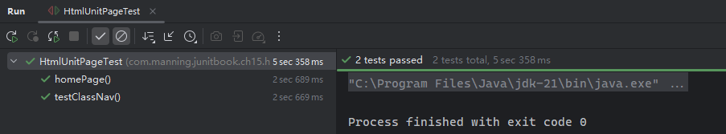


### 15.3.2 示例2：利用参数化测试提效 HtmlUnit 用例

将浏览器版本作为参数化测试的动态参数，可对同一页面快速生成一组等效的用例。新版示例代码如下：

```java
package com.manning.junitbook.ch15.htmlunit;

import org.htmlunit.BrowserVersion;
import org.htmlunit.WebAssert;
import org.htmlunit.WebClient;
import org.htmlunit.html.HtmlListItem;
import org.htmlunit.html.HtmlPage;
import org.junit.jupiter.params.ParameterizedTest;
import org.junit.jupiter.params.provider.MethodSource;

import java.io.IOException;
import java.util.Arrays;
import java.util.Collection;

import static org.junit.jupiter.api.Assertions.assertEquals;

/**
 * Tests navigating the HtmlUnit SourceForge site.
 */
public class JavadocPageAllBrowserTest {

    private static Collection<BrowserVersion[]> getBrowserVersions() {
        return Arrays.asList(new BrowserVersion[][]{
                {BrowserVersion.FIREFOX},
                {BrowserVersion.EDGE},
                {BrowserVersion.CHROME},
                {BrowserVersion.BEST_SUPPORTED}
        });
    }

    @ParameterizedTest
    @MethodSource("getBrowserVersions")
    public void testClassNav(BrowserVersion browserVersion) throws IOException {
        WebClient webClient = new WebClient(browserVersion);
        webClient.getOptions().setJavaScriptEnabled(false);

        HtmlPage mainPage = (HtmlPage) webClient.getPage("https://htmlunit.sourceforge.io/apidocs/index.html");
        WebAssert.notNull("Missing main page", mainPage);

        HtmlPage packagePage = (HtmlPage) mainPage.getFrameByName("packageFrame").getEnclosedPage();
        WebAssert.notNull("Missing package page", packagePage);

        HtmlListItem htmlListItem = (HtmlListItem) packagePage.getElementsByTagName("li").item(0);
        assertEquals("AbortController", htmlListItem.getTextContent());
    }
}
```

实测效果：

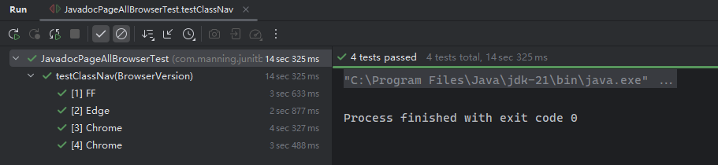


### 15.3.3 示例3：创建页面内容相对固定的测试

这类用例类似第八章介绍的 `Mock` 对象，需要人为设置模拟的请求和页面响应内容，人为地固化页面内容，以方便测试：

```java
package com.manning.junitbook.ch15.htmlunit;

import org.htmlunit.MockWebConnection;
import org.htmlunit.WebAssert;
import org.htmlunit.html.HtmlPage;
import org.junit.jupiter.api.Test;

import java.io.IOException;
import java.net.URI;
import java.net.URISyntaxException;
import java.net.URL;

/**
 * Demonstrates using in-line HTML fixtures in test methods.
 */
public class InLineHtmlFixtureTest extends ManagedWebClient {
    
    @Test
    public void testInLineHtmlFixture() throws IOException {
        final String expectedTitle = "Hello 1!";
        String html = "<html><head><title>" + expectedTitle + "</title></head></html>";
        MockWebConnection connection = new MockWebConnection();
        connection.setDefaultResponse(html);
        webClient.setWebConnection(connection);
        HtmlPage page = webClient.getPage("http://page");
        WebAssert.assertTitleEquals(page, expectedTitle);
    }
}
```

对于需要模拟多个 `URL`、响应多个页面内容的情况，也可以通过 `MockWebConnection` 实例的 `setResponse()` 方法统一设置。例如：

```java
@Test
public void testInLineHtmlFixtures() throws IOException, URISyntaxException {
    final URL page1Url = new URI("http://Page1/").toURL();
    final URL page2Url = new URI("http://Page2/").toURL();
    final URL page3Url = new URI("http://Page3/").toURL();

    MockWebConnection connection = new MockWebConnection();
    connection.setResponse(page1Url, "<html><head><title>Hello 1!</title></head></html>");
    connection.setResponse(page2Url, "<html><head><title>Hello 2!</title></head></html>");
    connection.setResponse(page3Url, "<html><head><title>Hello 3!</title></head></html>");
    webClient.setWebConnection(connection);

    HtmlPage page1 = webClient.getPage(page1Url);
    WebAssert.assertTitleEquals(page1, "Hello 1!");

    HtmlPage page2 = webClient.getPage(page2Url);
    WebAssert.assertTitleEquals(page2, "Hello 2!");

    HtmlPage page3 = webClient.getPage(page3Url);
    WebAssert.assertTitleEquals(page3, "Hello 3!");
}
```

实测效果：

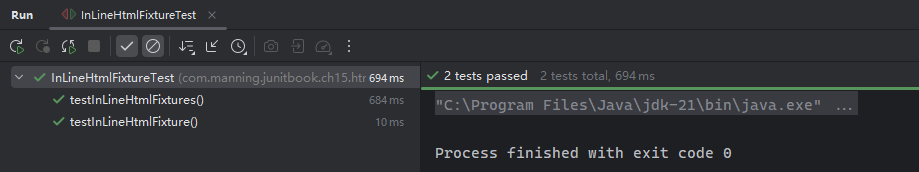

> [!note]
>
> **实测备忘录**
>
> 实测时出现过两个小问题：
>
> 1. 手动指定响应页面时，`URL` 一定要以斜杆 `/` 结尾，否则解析失败；但设置默认响应时则无需考虑；
> 2. `JDK` 版本改为 `21` 后，`URL` 对象直接通过 `new` 关键字实例化的做法已经被淘汰了。推荐写法是通过 `uri.toURL()`，然后抛一个异常 `URISyntaxException`。


### 15.3.4 示例4：页面表单测试

准备两个 `HTML` 示例文件，一个是表单页，另一个表单正常提交后的页面：

```html
<!-- formtest.html -->
<!doctype html>
<html lang="en">
    <head>
        <meta charset="utf-8">
        <script>
            function validate_form(form) {
                if (form.in_text.value=="") {
                    alert("Please enter a value.");
                    form.in_text.focus();
                    return false;
                }
            }
        </script>
        <title>Form Test</title>
    </head>
    <body>
    <form name="validated_form" action="submit.html" onsubmit="return validate_form(this);" method="post">
        Value:
        <input type="text" name="in_text" id="in_text" size="30"/>
        <input type="submit" value="Submit" id="submit" name="submit"/>
    </form>
    </body>
</html>


<!-- submit.html -->
<!DOCTYPE html PUBLIC "-//W3C//DTD XHTML 1.0 Transitional//EN"
        "http://www.w3.org/TR/xhtml1/DTD/xhtml1-transitional.dtd">
<html xmlns="http://www.w3.org/1999/xhtml">
<head>
    <meta http-equiv="Content-Type" content="text/html; charset=utf-8"/>
    <title>Result</title>
</head>
<body>Result</body></html>
```

然后分三种情况进行演示：

1. 文本框正常输入一些内容，模拟表单提交，页面正常跳转到新页面；
2. 文本框不输入任何内容，触发校验逻辑 `JS` 脚本，测试弹出的警告框是否符合预期；
3. 文本框正常输入，提交后正常跳转，测试是否不弹出警告框。

具体实现代码如下：

```java
package com.manning.junitbook.ch15.htmlunit;

import org.htmlunit.CollectingAlertHandler;
import org.htmlunit.WebAssert;
import org.htmlunit.html.HtmlForm;
import org.htmlunit.html.HtmlPage;
import org.htmlunit.html.HtmlSubmitInput;
import org.htmlunit.html.HtmlTextInput;
import org.junit.jupiter.api.Test;

import java.io.IOException;
import java.util.Collections;
import java.util.List;

import static org.junit.jupiter.api.Assertions.assertEquals;
import static org.junit.jupiter.api.Assertions.assertTrue;

/**
 * Demonstrates testing a form.
 */
public class FormTest extends ManagedWebClient {

    @Test
    public void testForm() throws IOException {
        HtmlPage page = webClient.getPage("file:src/main/webapp/formtest.html");
        HtmlForm form = page.getFormByName("validated_form");
        HtmlTextInput input = form.getInputByName("in_text");
        input.setValueAttribute("typing...");
        HtmlSubmitInput submitButton = form.getInputByName("submit");
        HtmlPage resultPage = submitButton.click();
        WebAssert.assertTitleEquals(resultPage, "Result");
    }

    @Test
    public void testFormAlert() throws IOException {
        CollectingAlertHandler alertHandler = new CollectingAlertHandler();
        webClient.setAlertHandler(alertHandler);
        //alternative code for the line above:
        // webClient.setAlertHandler((page, message) -> fail("JavaScript alert: " + message));

        HtmlPage page = webClient.getPage("file:src/main/webapp/formtest.html");
        HtmlForm form = page.getFormByName("validated_form");
        HtmlSubmitInput submitButton = form.getInputByName("submit");

        HtmlPage resultPage = submitButton.click();
        WebAssert.assertTitleEquals(resultPage, page.getTitleText());
        WebAssert.assertTextPresent(resultPage, page.asNormalizedText());

        List<String> collectedAlerts = alertHandler.getCollectedAlerts();
        List<String> expectedAlerts = Collections.singletonList("Please enter a value.");
        assertEquals(expectedAlerts, collectedAlerts);
    }

    @Test
    public void testFormNoAlert() throws IOException {
        CollectingAlertHandler alertHandler = new CollectingAlertHandler();
        webClient.setAlertHandler(alertHandler);
        HtmlPage page = webClient.getPage("file:src/main/webapp/formtest.html");
        HtmlForm form = page.getFormByName("validated_form");
        HtmlTextInput input = form.getInputByName("in_text");

        input.setValueAttribute("typing...");
        HtmlSubmitInput submitButton = form.getInputByName("submit");
        HtmlPage resultPage = submitButton.click();

        WebAssert.assertTitleEquals(resultPage, "Result");
        assertTrue(alertHandler.getCollectedAlerts().isEmpty(), "No alerts expected");
    }
}
```

实测结果：

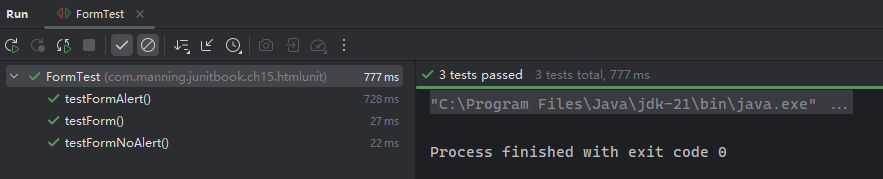

> [!note]
>
> **实测备忘录**
>
> 测试逻辑是否需要启用 `JavaScript` 脚本的解析，是通过 `webClient` 的设置开关实现的：
>
> ```java
> webClient.getOptions().setJavaScriptEnabled(true); // true 启用，false 关闭
> ```
>
> 此外，新版 `HtmlUnit` 已经没有专门控制 `JS` 超时的写法了：`webClient.setJavaScriptTimeout(timeout);`。新版只保留了 `webClient.setTimeout(timeout);` 的写法，参数类型为 `int`，表示毫秒数。


### 15.3.5 示例5：测试页面 confirm 弹框内容

与 `alert` 弹窗类似，`HtmlUnit` 也支持 `confirm` 确认对话框内容的测试，并且可以自定义确认对话框的处理逻辑，通过 `webClient.setConfirmHandler(handler)` 实现（对 `alert` 调用的是 `webClient.setAlertHandler(handler)`）：

```java
package com.manning.junitbook.ch15.htmlunit;

import org.htmlunit.CollectingAlertHandler;
import org.htmlunit.FailingHttpStatusCodeException;
import org.htmlunit.MockWebConnection;
import org.htmlunit.WebAssert;
import org.htmlunit.html.HtmlPage;
import org.junit.jupiter.api.Test;

import java.io.IOException;
import java.net.URI;
import java.net.URISyntaxException;
import java.util.ArrayList;
import java.util.List;

import static org.junit.jupiter.api.Assertions.assertArrayEquals;

/**
 * Demonstrates testing a confirmation handler.
 */
public class WindowConfirmTest extends ManagedWebClient {

    @Test
    public void testWindowConfirm() throws FailingHttpStatusCodeException, IOException, URISyntaxException {
        String html = "<html><head><title>Hello</title></head><body onload='confirm(\"Confirm Message\")'></body></html>";
        URL testUrl = new URI("http://Page1/").toURL();
        MockWebConnection mockConnection = new MockWebConnection();
        final List<String> confirmMessages = new ArrayList<>();
        // set up
        webClient.setConfirmHandler((page, message) -> {
            confirmMessages.add(message);
            return true;
        });
        mockConnection.setResponse(testUrl, html);
        webClient.setWebConnection(mockConnection);
        // go
        HtmlPage firstPage = webClient.getPage(testUrl);
        WebAssert.assertTitleEquals(firstPage, "Hello");
        assertArrayEquals(new String[]{"Confirm Message"}, confirmMessages.toArray());
    }

    @Test
    public void testWindowConfirmAndAlert() throws FailingHttpStatusCodeException, IOException, URISyntaxException {
        String html = "<html><head><title>Hello</title>" +
                "<script>function go(){" +
                  "alert(confirm('Confirm Message'))" +
                "}</script>\n"
                + "</head><body onload='go()'></body></html>";
        URL testUrl = new URI("http://Page1/").toURL();
        MockWebConnection mockConnection = new MockWebConnection();
        final List<String> confirmMessages = new ArrayList<>();
        // set up
        webClient.setAlertHandler(new CollectingAlertHandler());
        webClient.setConfirmHandler((page, message) -> {
            confirmMessages.add(message);
            return true;
        });
        mockConnection.setResponse(testUrl, html);
        webClient.setWebConnection(mockConnection);
        // go
        HtmlPage firstPage = webClient.getPage(testUrl);
        WebAssert.assertTitleEquals(firstPage, "Hello");
        assertArrayEquals(new String[]{"Confirm Message"}, confirmMessages.toArray());
        assertArrayEquals(new String[]{"true"}, ((CollectingAlertHandler) webClient.getAlertHandler()).getCollectedAlerts().toArray());
    }
}
```

实测效果：

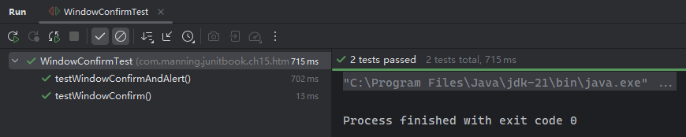

可以通过查看 `ConfirmHandler` 和 `AlertHandler` 接口的源码了解更多传参细节：

```java
/**
 * A handler for the JavaScript function <code>window.confirm()</code>. Confirms
 * are triggered when the JavaScript function <code>window.confirm()</code> is invoked.
 *
 * @author Mike Bowler
 * @author Ronald Brill
 */
@FunctionalInterface
public interface ConfirmHandler extends Serializable {

    /**
     * Handles a confirm for the specified page.
     * @param page the page on which the confirm occurred
     * @param message the message in the confirm
     * @return {@code true} if we are simulating clicking the OK button,
     *         {@code false} if we are simulating clicking the Cancel button
     */
    boolean handleConfirm(Page page, String message);
}

/**
 * A handler for JavaScript alerts. Alerts are triggered when the JavaScript method Window.alert()
 * is called.
 *
 * @author Mike Bowler
 * @author Ronald Brill
 */
@FunctionalInterface
public interface AlertHandler extends Serializable {

    /**
     * Handle an alert for the given page.
     * @param page the page on which the alert occurred
     * @param message the message in the alert
     */
    void handleAlert(Page page, String message);
}
```

这也是为什么自定义处理逻辑可以直接传入 `Lambda` 表达式的原因。


## 15.4 Selenium 简介

`Selenium`（[https://www.selenium.dev/](https://www.selenium.dev/)）是一套免费开源的 `Web` 应用测试工具集。它与 `HtmlUnit` 在相同虚拟机中模拟浏览器来运行测试的方式不同，`Selenium` 的优势在于能够在特定操作系统上针对真实浏览器运行测试。

`Selenium WebDriver` 是编写测试时要用到的核心接口。作为 `W3C` 的推荐标准，当前的主流浏览器均实现了该接口。`WebDriver` 利用这些浏览器对自动化的原生支持，可以直接向浏览器发起调用，从而实现表现层的自动化测试。

`Selenium WebDriver` 的架构示意图如下：

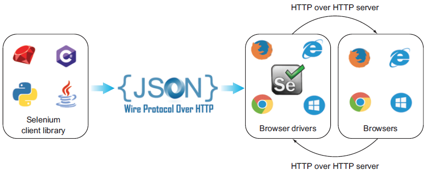

`WebDriver` 包含四个组件：

- **`Selenium` 客户端库**：即编写测试用例需要的 `Selenium` 库，支持多种编程语言（`Java`、`C#`、`PHP`、`Python`、`Ruby` 等）；
- **基于 `HTTP` 的 `JSON` 有线协议**：每个 `WebDriver` 都有自己的 `HTTP` 服务器。该协议是一种通过 `HTTP` 服务器传递信息的 `REST API`；
- **浏览器驱动**：每个浏览器都有独立的驱动程序（driver），用于与对应的浏览器进行通信，同时又不暴露浏览器功能的内部逻辑；当浏览器驱动接到命令时，该命令会在对应的浏览器上执行，并以 `HTTP` 响应的形式返回结果。
- **浏览器**：即 `Selenium` 兼容的浏览器，如 `Chrome`、`Firefox`、`Edge`、`Safari` 等。


常见的浏览器及其对应驱动梳理：

|     Web 浏览器      |       浏览器驱动类       |
| :-----------------: | :----------------------: |
|   `Google Chrome`   |      `ChromeDriver`      |
| `Internet Explorer` | `InternetExplorerDriver` |
|      `Safari`       |      `SafariDriver`      |
|       `Opera`       |      `OperaDriver`       |
|      `Firefox`      |     `FirefoxDriver`      |
|       `Edge`        |       `EdgeDriver`       |


## 15.5 Selenium 用法演示

实战准备工作：

- 分别下载 `Chrome`、`Firefox`、`Edge` 的 `Web` 驱动（必须与本机浏览器版本一致）——
  - `ChromeDriver`：[win64 zip](https://storage.googleapis.com/chrome-for-testing-public/142.0.7444.59/win64/chromedriver-win64.zip)（本机 `Chrome` 版本：`v142.0.7444.60`）
  - `FirefoxDriver`：[geckodriver-v0.36.0-win64.zip](https://github.com/mozilla/geckodriver/releases/download/v0.36.0/geckodriver-v0.36.0-win64.zip)（本机 `Firefox` 版本：`v144.0.2 (64-bit)`）
  - `EdgeDriver`：[edgedriver_win64.zip](https://msedgedriver.microsoft.com/142.0.3595.53/edgedriver_win64.zip)（本机 `Edge` 版本：`v142.0.3595.53`）
- 将上述压缩包内的驱动程序统一解压到 `D:/manning/drivers/` 文件夹下，并将该路径配置到环境变量 `PATH` 中。

测试环境变量是否生效（均已生效）：

```powershell
> msedgedriver --version
Microsoft Edge WebDriver 142.0.3595.53 (e9d637e9672ec1e9386e16d27f47c1384f2bae93)
> chromedriver --version
ChromeDriver 142.0.7444.59 (4b8153ab58d3c3f4c9f7e4baad9616ecf80db5fa-refs/branch-heads/7444_52@{#4})
> geckodriver --version
geckodriver 0.36.0 (a3d508507022 2025-02-24 15:57 +0000)
```

最后是更新随书源码中的 `Selenium` 依赖版本：

```xml
<dependency>
    <groupId>org.seleniumhq.selenium</groupId>
    <artifactId>selenium-java</artifactId>
    <version>4.38.0</version>
</dependency>
```


### 15.5.1 示例1：对特定 Web 浏览器进行测试

```java
public class ChromeSeleniumTest {

    private WebDriver driver;

    @BeforeEach
    void setUp() {
        driver = new ChromeDriver();
    }

    @Test
    void testChromeManning() {
        driver.get("https://www.manning.com/");
        assertThat(driver.getTitle(), is("Manning"));
    }

    @Test
    void testChromeGoogle() {
        driver.get("https://www.google.com");
        assertThat(driver.getTitle(), is("Google"));
    }


    @AfterEach
    void tearDown() {
        driver.quit();
    }
}
```

注意：实测过程中会弹出一个新的浏览器窗口加载网页（即 `Chrome` 驱动程序），稍后自动关闭：

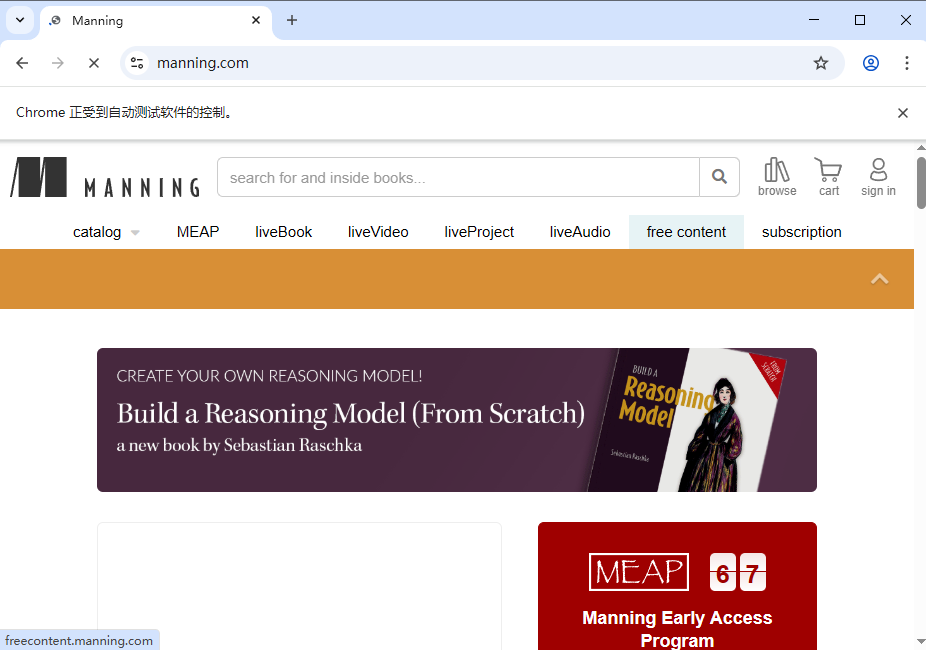

最终实测效果：

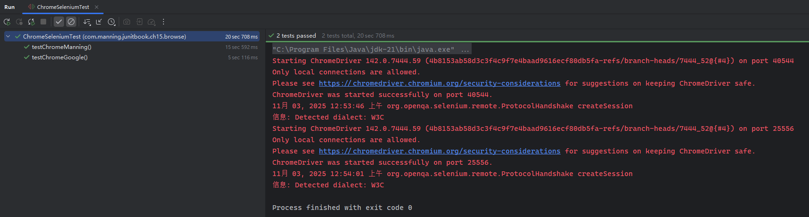


### 15.5.2 示例2：使用 Web 浏览器测试导航

实测用 `Firefox` 驱动访问维基百科首页，并从捐赠链接打开捐赠页面，判定页面标题是否一致（原 `Content` 内容链接早已改版，以下代码根据最新页面修改）：

```java
public class WikipediaAccessTest {

    private RemoteWebDriver driver;

    @BeforeEach
    void setUp() {
        driver = new FirefoxDriver();
    }

    @Test
    void testWikipediaAccess() {
        driver.get("https://en.wikipedia.org/");
        assertThat(driver.getTitle(), is("Wikipedia, the free encyclopedia"));

        WebElement contents = driver.findElement(By.linkText("Donate"));
        assertTrue(contents.isDisplayed());

        contents.click();
        assertThat(driver.getTitle(), is("Make your donation now - Wikimedia Foundation"));
    }

    @AfterEach
    void tearDown() {
        driver.quit();
    }
}
```

实测效果（中途 `Firefox` 驱动程序窗口会自动打开 `Wiki` 首页，然后自动跳转到 `Donate` 页面）：

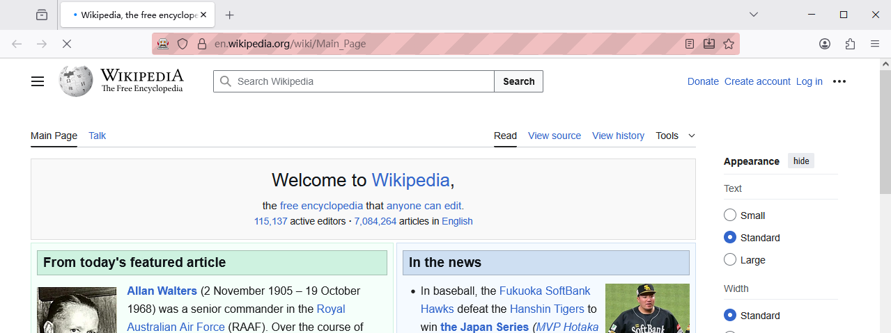

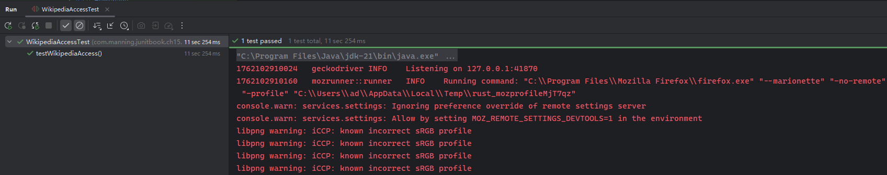


### 15.5.3 示例3：测试多个 Web 浏览器

利用 `JUnit 5` 的参数化测试注解及相关写法，还可以批量注入不同的浏览器 `driver` 实例，一次性执行多个测试：

```java
public class MultiBrowserSeleniumTest {

    private WebDriver driver;

    public static Collection<WebDriver> getBrowserVersions() {
        return Arrays.asList(new WebDriver[]{ new FirefoxDriver(), new ChromeDriver() });
    }

    @ParameterizedTest
    @MethodSource("getBrowserVersions")
    void testManningAccess(WebDriver driver) {
        this.driver = driver;
        driver.get("https://www.manning.com/");
        assertThat(driver.getTitle(), is("Manning"));
    }

    @ParameterizedTest
    @MethodSource("getBrowserVersions")
    void testGoogleAccess(WebDriver driver) {
        this.driver = driver;
        driver.get("https://www.google.com");
        assertThat(driver.getTitle(), is("Google"));
    }

    @AfterEach
    void tearDown() {
        driver.quit();
    }
}
```

实测时发现 `Edge` 驱动程序存在很多问题：先提示系统变量 `webdriver.edge.driver` 缺失，通过静态代码块手动补全后又报该框架没有执行上下文。后者尝试过升级 `Selenium` 版本、新增 `Driver Manager` 依赖、提问 `DeepSeek` 修改测试逻辑等方法，均以失败告终：

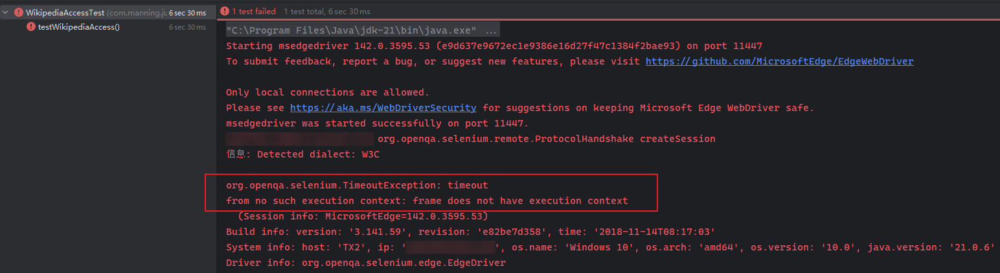

剔除 `Edge` 驱动后，最终运行结果：

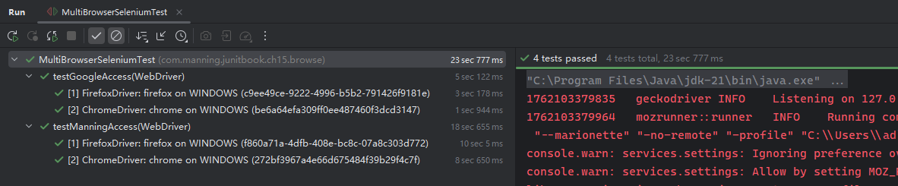


### 15.5.4 示例4：用不同的 Web 浏览器测试 Google 搜索和导航

本节案例通过对 `Chrome` 和 `Firefox` 驱动进行参数化测试，实测其通过谷歌检索维基百科，并点击第一个词条进入其首页，然后点开其 `Donate` 捐赠页面完成相应测试逻辑。实测代码如下（已调整）：

```java
public class GoogleSearchTest {

    private RemoteWebDriver driver;

    public static Collection<RemoteWebDriver> getBrowserVersions() {
        return Arrays.asList(new RemoteWebDriver[]{new ChromeDriver(), new FirefoxDriver()});
    }

    @ParameterizedTest
    @MethodSource("getBrowserVersions")
    void testGoogleSearch(RemoteWebDriver driver) {
        this.driver = driver;
        driver.get("http://www.google.com");
        WebElement element = driver.findElement(By.name("q"));
        element.sendKeys("en.wikipedia.org");
        driver.findElement(By.name("q")).sendKeys(Keys.ENTER);

        // wait until the Google page shows the result
        WebElement myDynamicElement = (new WebDriverWait(driver, 100))
                .until(ExpectedConditions.presenceOfElementLocated(By.id("result-stats")));

        List<WebElement> findElements = driver.findElements(By.xpath("//*[@id='rso']//a/h3"));

        findElements.get(0).click();

        assertEquals("https://en.wikipedia.org/wiki/Main_Page", driver.getCurrentUrl());
        assertThat(driver.getTitle(), is("Wikipedia, the free encyclopedia"));

        WebElement contents = driver.findElement(By.linkText("Donate"));
        assertTrue(contents.isDisplayed());
        contents.click();

        assertThat(driver.getTitle(), is("Make your donation now - Wikimedia Foundation"));
    }

    @AfterEach
    void tearDown() {
        driver.quit();
    }
}
```

和之前不同的是，频繁调用测试可能触发谷歌的人机检测模块，需要手动验证一下。其余流程均自动进行：

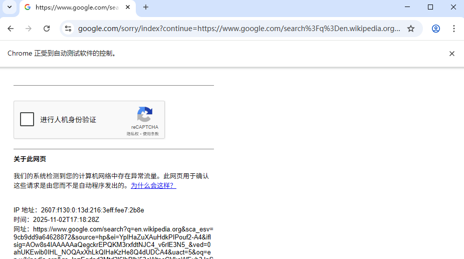

最终效果：

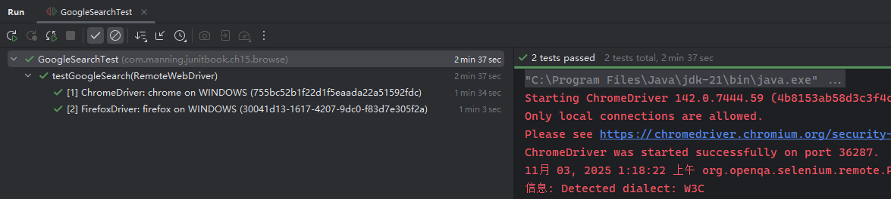


### 15.5.5 示例5：测试网站的身份验证

本例模拟了在浏览器打开指定页面后，再从当前页面点开一个登录页，并自动完成帐号信息的填写（一次正确+一次错误）：

```java
public class LoginTest {

    private Homepage homepage;
    private WebDriver webDriver;

    public static Collection<WebDriver> getBrowserVersions() {
        return Arrays.asList(new WebDriver[]{new FirefoxDriver(), new ChromeDriver()});
    }

    @ParameterizedTest
    @MethodSource("getBrowserVersions")
    public void loginWithValidCredentials(WebDriver webDriver) {
        this.webDriver = webDriver;
        homepage = new Homepage(webDriver);
        homepage.openFormAuthentication()
                .loginWith("tomsmith", "SuperSecretPassword!")
                .thenLoginSuccessful();
    }

    @ParameterizedTest
    @MethodSource("getBrowserVersions")
    public void loginWithInvalidCredentials(WebDriver webDriver) {
        this.webDriver = webDriver;
        homepage = new Homepage(webDriver);
        homepage.openFormAuthentication()
                .loginWith("tomsmith", "SuperSecretPassword")
                .thenLoginUnsuccessful();
    }

    @AfterEach
    void tearDown() {
        webDriver.quit();
    }
}
```

以下是实测过程中的自动填写表单时的动态截图：

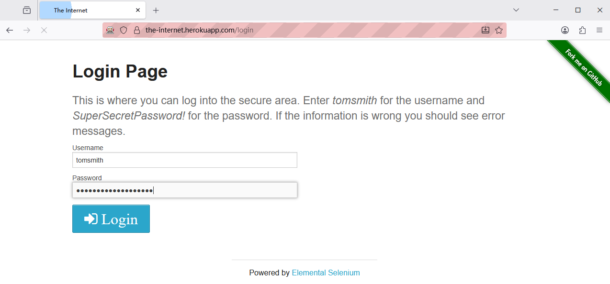

最终执行结果：

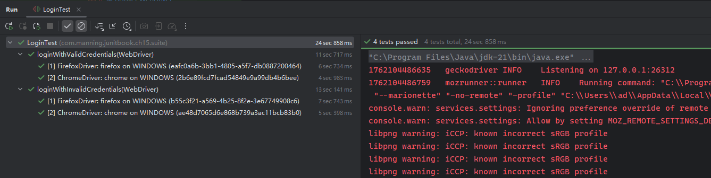


> [!note]
>
> **注意**
>
> 本章没有详细讨论 `HtmlUnit` 和 `Selenium` 爬取网页元素及内容的具体 `API` 写法，因为它们很可能随着版本的升级而不断改进。因此学习本章时重点在于把握大的操作流程和粗粒度的底层逻辑，实际工作中遇到类似场景再深入挖掘相关接口。
