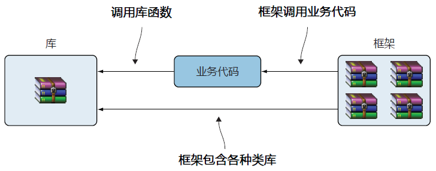
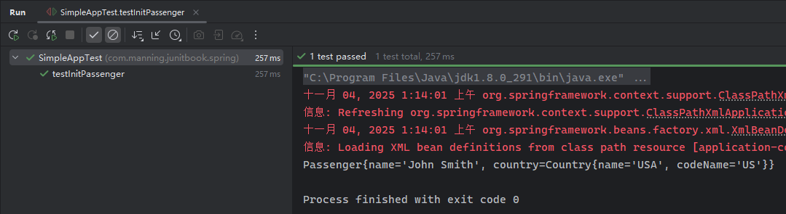
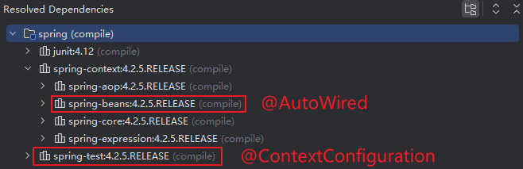
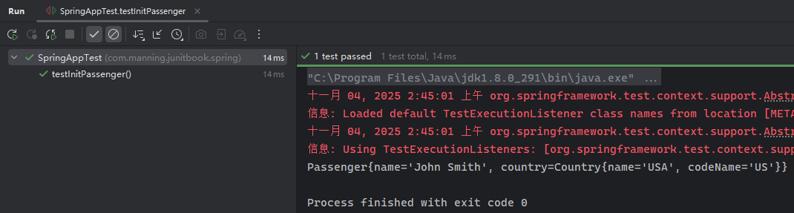

# 第十六章：测试 Spring 应用

> **本章概要**
>
> - 深入理解依赖注入原理；
> - `Spring` 应用的构建与测试方法；
> - 通过 `SpringExtension` 启用 `JUnit JUpiter` 的方法；
> - 使用 `JUnit 5` 相关特性测试 `Spring` 应用。


> *“Dependency Injection” is a 25-dollar term for a 5-cent concept.*
> “依赖注入”是用二十五美元的术语描述的一个五美分的概念。
>
> —— **James Shore** [^1]

本章对 `Spring` 框架中最核心的依赖注入设计进行了详细介绍，并结合两个典型案例加深理解。


## 16.1 Spring 框架简介

**Rod Johnson** 于 2003 年在其著作《***Expert One-on-One J2EE Design and Development***》中首次提出了 `Spring` 框架，其设计理念在于简化传统企业级应用开发。

业务代码（即开发者写的代码）、库函数与框架间的调用关系示意图如下：



框架的作用在于提供某种开发范式，助力开发者更专注于业务本身的开发，而不过分关注架构设计方面的问题。


## 16.2 关于依赖注入

`Java` 应用的良好运转离不开对象间的相互协作，可惜 `Java` 语言本身无法自行组织一款应用程序的基本要素，`Spring` 出现前这部分工作是由开发者或架构师亲自负责实现的，涉及各种必要的设计模式和架构考虑等，心智负担较重。

`Spring` 框架实现了多种设计模式，尤其是 **依赖注入（*dependency injection*）** 模式（又称 **控制反转（*IoC、Inversion of Control*）**）让 `Spring` 框架完成这类枯燥繁琐的组织工作成为了可能，真正解放了开发者的生产力。


## 16.3 依赖注入的简单案例

考察如下乘客管理示例应用中的乘客实体类 `Passenger` 及国家实体类 `Country`：

```java
public class Passenger {
    private String name;
    private Country country;

    public Passenger(String name) {
        this.name = name;
        this.country = new Country("USA", "US");
    }

    public String getName() {
        return name;
    }
    public Country getCountry() {
        return country;
    }
}

public class Country {
    private String name;
    private String codeName;

    public Country(String name, String codeName) {
        this.name = name;
        this.codeName = codeName;
    }

    public String getName() {
        return name;
    }
    public String getCodeName() {
        return codeName;
    }
}
```

写成 `L7` 这样后的主要问题：

- `Passenger` 直接依赖 `Country`；
- 测试时 `Passenger` 无法与 `Country` 相隔离；
- `Country` 实例的生命周期严重依赖于 `Passenger`；
- 测试时无法将 `Country` 替换为其他对象；

正确的写法应该是：

```java
public class Passenger {
    private String name;
    private Country country;
    
    public Passenger(String name) {
        this.name = name;
    }
    public String getName() {
        return name;
    }
    public Country getCountry() {
        return country;
    }
    public void setCountry(Country country) {
        this.country = country;
    }
}
```

这样 `country` 的取值完全由 `setter` 方法控制，`Passenger` 不再直接依赖于 `Country`。


## 16.4 利用 Spring4 + JUnit 4 践行 IoC 原则

将 `Passenger` 和 `Country` 解耦后，再通过一个对比案例，看看遵循 `IoC` 原则实例化 `Passenger` 和传统方式得到的乘客实例究竟有无区别。

为了顺便演示两个框架的演变过程，这里先用旧版 `Spring4` + `JUnit 4` 搭建测试环境。

配置旧版环境 `Maven` 依赖：

```xml
<!-- Spring framework 4 -->
<dependency>
    <groupId>org.springframework</groupId>
    <artifactId>spring-context</artifactId>
    <version>4.2.5.RELEASE</version>
</dependency>
<dependency>
    <groupId>org.springframework</groupId>
    <artifactId>spring-test</artifactId>
    <version>4.2.5.RELEASE</version>
</dependency>
<!-- JUnit 4 -->
<dependency>
    <groupId>junit</groupId>
    <artifactId>junit</artifactId>
    <version>4.12</version>
</dependency>
```

传统 `IoC` 实例化方式如下：

```java
public class PassengerUtil {
    public static Passenger getExpectedPassenger() {
        Passenger passenger = new Passenger("John Smith");
        Country country = new Country("USA", "US");
        passenger.setCountry(country);
        return passenger;
    }
}
```

然后再用 `Spring` 来实现一个等效对象（从最原始的 `XML` 配置文件开始）——

先在 `CLASSPATH` 下创建 `XML` 格式的配置文件 `src/test/resources/application-context.xml`：

```xml
<?xml version="1.0" encoding="UTF-8"?>
<beans xmlns="http://www.springframework.org/schema/beans"
       xmlns:xsi="http://www.w3.org/2001/XMLSchema-instance"
       xsi:schemaLocation="http://www.springframework.org/schema/beans http://www.springframework.org/schema/beans/spring-beans.xsd">

    <bean id="passenger" class="com.manning.junitbook.spring.Passenger">
        <constructor-arg name="name" value="John Smith"/>
        <property name="country" ref="country"/>
    </bean>

    <bean id="country" class="com.manning.junitbook.spring.Country">
        <constructor-arg name="name" value="USA"/>
        <constructor-arg name="codeName" value="US"/>
    </bean>
</beans>
```

然后读取该 `XML` 配置，并通过应用上下文 `context` 来实例化 `Passenger`（即依赖注入）：

```java
public class PassengerUtil {
    public static Passenger getActualPassenger() {
        ClassPathXmlApplicationContext context = new ClassPathXmlApplicationContext(
                "classpath:application-context.xml");
        return context.getBean("passenger", Passenger.class);
    }
}
```

完整的测试逻辑如下：

```java
public class SimpleAppTest {

    private static final String APPLICATION_CONTEXT_XML_FILE_NAME = "classpath:application-context.xml";

    private ClassPathXmlApplicationContext context;

    private Passenger expectedPassenger;

    @Before
    public void setUp() {
        context = new ClassPathXmlApplicationContext(APPLICATION_CONTEXT_XML_FILE_NAME);
        expectedPassenger = getExpectedPassenger();
    }

    @Test
    public void testInitPassenger() {
        Passenger passenger = context.getBean("passenger", Passenger.class);
        assertEquals(expectedPassenger, passenger);
        System.out.println(passenger);
    }
}
```

实测结果：



注意：这里的 `assertEquals()` 断言之所以能通过，是因为 `Passenger` 和 `Country` 实体重写了 `equals()` 方法和 `hashCode()` 方法，只比较属性值，不涉及对象的引用。


## 16.5 使用 Spring TestContext 框架

`Spring TestContext` 框架是 `Spring` 框架对单元测试和集成测试做的集成，支持多种测试框架（`JUnit 3.x`、`JUnit 4.x`、`TestNG` 等）。上述案例套用 `Spring` 注解的等效版本为：

```java
@RunWith(SpringJUnit4ClassRunner.class)
@ContextConfiguration("classpath:application-context.xml")
public class SpringAppTest {
    @Autowired
    private Passenger passenger;
    private Passenger expectedPassenger;

    @Before
    public void setUp() {
        expectedPassenger = getExpectedPassenger();
    }

    @Test
    public void testInitPassenger() {
        assertEquals(expectedPassenger, passenger);
        System.out.println(passenger);
    }
}
```

其中——

- `@ContextConfiguration` 注解来自 `spring-test` 依赖；
- `@Autowired` 注解来自 `spring-context` 中的 `spring-bean` 依赖；
- `@RunWith` 来自 `JUnit 4.x`。

还可以从 `IDEA` 的依赖分析图中更直观地查看 `Spring` 注解所属的 `Maven` 依赖：



可以看到，传统方式如果要修改 `expectedPassenger` 实例，必须修改源代码并重新编译项目才能生效；而引入 `Spring` 容器后，注入新的 `passenger` 实例无需改动源代码更无需重新编译，只需修改 `XML` 配置文件即可。

同时，测试类通过 `@AutoWired` 注入 `passenger` 依赖后，测试方法就不再以代码的方式干预 `passenger` 的实现细节了（由 `Spring` 注入），更不用关心 `passenger` 和它的 `country` 属性是怎么组合的（`XML` 配置）；只需要和 `expectedPassenger` 直接比较就行了（核心逻辑）。

两种实例化方式的具体对比如下：

|              |              传统方式               |             Spring DI 方式             |
| :----------: | :---------------------------------: | :------------------------------------: |
| **创建细节** | `Passenger` 知道如何创建 `Country`  |        两者都不知道对方如何创建        |
| **依赖关系** |  `Passenger` 硬编码依赖 `Country`   |         依赖关系由外部配置决定         |
| **具体实现** | `Passenger` 依赖具体的 `Country` 类 | 自动装配还可以依赖接口，实现是可替换的 |
| **测试难度** |      难以单独测试 `Passenger`       |    可以轻松模拟 `Country` 进行测试     |


## 16.6 改为 Spring 5 + JUnit 5 版本

将 `Maven` 依赖升级到 `Spring 5` 和 `JUnit 5`：

```xml
<!-- Spring framework -->
<dependency>
    <groupId>org.springframework</groupId>
    <artifactId>spring-context</artifactId>
    <version>5.2.0.RELEASE</version>
</dependency>

<dependency>
    <groupId>org.springframework</groupId>
    <artifactId>spring-test</artifactId>
    <version>5.2.0.RELEASE</version>
</dependency>

<dependency>
    <groupId>org.junit.jupiter</groupId>
    <artifactId>junit-jupiter-api</artifactId>
    <version>5.6.0</version>
    <scope>test</scope>
</dependency>
<dependency>
    <groupId>org.junit.jupiter</groupId>
    <artifactId>junit-jupiter-engine</artifactId>
    <version>5.6.0</version>
    <scope>test</scope>
</dependency>
```

等效测试类如下：

```java
@ExtendWith(SpringExtension.class)
@ContextConfiguration("classpath:application-context.xml")
public class SpringAppTest {

    @Autowired
    private Passenger passenger;
    private Passenger expectedPassenger;


    @BeforeEach
    public void setUp() {
        expectedPassenger = getExpectedPassenger();
    }

    @Test
    public void testInitPassenger() {
        assertEquals(expectedPassenger, passenger);
        System.out.println(passenger);
    }
}
```

和 `16.5` 小节的主要区别：

- `@ContextConfiguration` 和 `@Autowired` 均为 `Spring 5.x` 框架下的注解；
- 测试用例使用 `JUnit 5` 的 `Extension API`：`@ExtendWith(SpringExtension.class)`；
- `@BeforeEach` 和 `@Test` 均为 `JUnit 5` 版本。

实测结果：




## 16.7 Spring 5 + JUnit 5 实战：实现观察者模式


---

[^1]: **James Shore** 是一位在软件开发和敏捷方法领域备受尊敬的顾问、演讲者和作者，著有《The Art of Agile Development》（中译本《敏捷开发的艺术》）。因其在敏捷软件开发、特别是测试驱动开发和持续集成方面的深刻见解和实践经验而闻名。


