# 第十七章：测试 Spring Boot 应用


> **本章概要**
>
> - 利用 `Spring Initializr` 创建项目的方法；
> - 将集成了 `JUnit 5` 的 `Spring` 项目迁移为 `Spring Boot` 项目的方法；
> - 在 `Spring Boot` 中实现一个测试专用的配置组件；
> - `spring Boot` + `JUnit 5` 实战案例演示。

> *Working with `Spring Boot` is like pair-programming with the `Spring` developers.*
> 用了 `Spring Boot` 就像在和 `Spring` 开发者进行结对编程。
>
> —— 佚名


## 17.1 SpringBoot 简介

`Spring Boot` 是一个基于 `Spring` 框架践行 **约定优于配置（*convention-over-configuration*）** 原则的成功案例。它极大地减少了初始化 `Spring` 应用的繁琐配置工作。

上一章提到，`Spring` 框架通过控制反转和依赖注入，本意是让开发者专注于业务逻辑的实现，但 `Spring` 繁琐的 `XML` 配置细节让初学者望而生畏，适得其反。`Spring Boot` 就是为了简化配置诞生的：大量的默认配置和注解驱动的风格让开发者真正实现了专注于业务本身的开发，很少再花精力去耐心钻研 `XML` 配置了。


## 17.2 用 Spring Initializr 创建项目

时隔六年，通过 `SpringBoot` 官网的 [https://start.spring.io/](https://start.spring.io/) 创建项目已然成为 `Spring` 项目初始化的基础操作。实测时官方已发布了`SpringBoot 4.0.0` 版框架，默认从 `v3.5.7` 起步。实测页面截图如下：

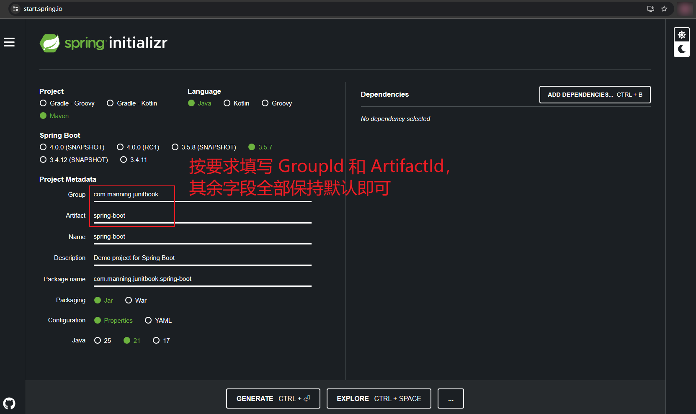

点击 <kbd>EXPLORE CTRL + SPACE</kbd> 按钮看到如下 `pom.xml` 默认配置：

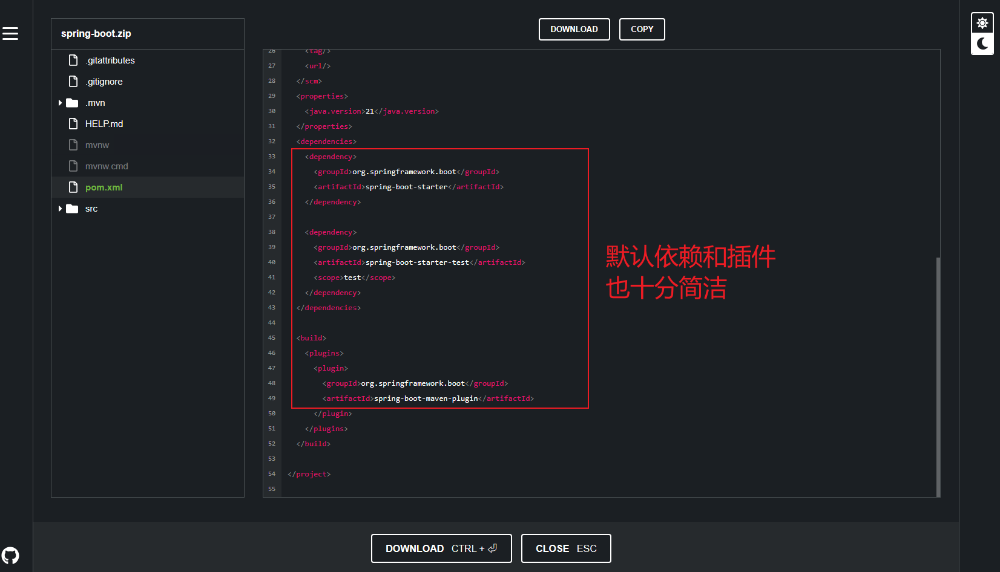

点击 <kbd>DOWNLOAD CTRL + ⏎</kbd> 按钮就能以下载该项目的 `zip` 格式压缩包。解压到本地指定位置后导入 `IDEA` 的实测效果如下：

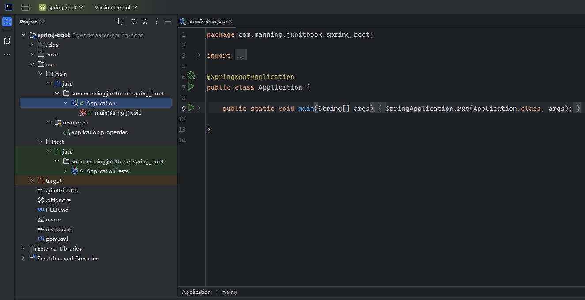


## 17.3 从 Spring 迁移到 Spring Boot

沿用上一章最后演示的观察者模式案例，将实体类、乘客注册相关的主客体、以及事件对象复制到 `SpringBoot` 对应的包下：

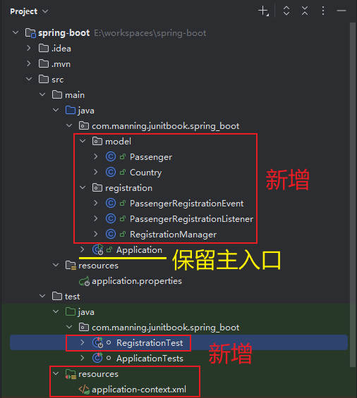

注意：在迁移 `application-context.xml` 时无需自动扫描指定包路的元素节点（即 `<context:component-scan base-package="..." />`），因为 `SpringBoot` 提供了 `@EnableAutoConfiguration` 注解：

```java
@SpringBootTest
@EnableAutoConfiguration
@ImportResource("classpath:application-context.xml")
class RegistrationTest {

    @Autowired
    private Passenger passenger;

    @Autowired
    private RegistrationManager registrationManager;

    @Test
    void testPersonRegistration() {
        registrationManager.getApplicationContext().publishEvent(new PassengerRegistrationEvent(passenger));
        System.out.println("After registering:");
        System.out.println(passenger);
        assertTrue(passenger.isRegistered());
    }
}
```

实测运行结果（迁移成功）：

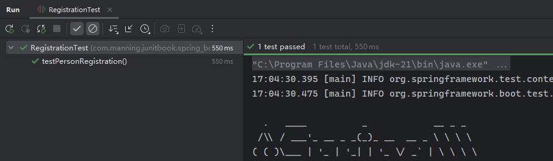


## 17.4 SpringBoot 测试专用配置组件的用法

上一章之所以用 `XML` 配置 `Bean` 的定义和组合关系主要有两个目的：

- 一是方便理解 `IoC` 机制的原理；
- 二是无需修改源代码且无需重新编译，仅修改 XML 配置即可变更 `Passenger` 的实现。

既然已经迁移到了 `SpringBoot` 项目，而 `SpringBoot` 又新增了 `@TestConfiguration` 注解来专门处理仅用于测试的 `Bean` 的实例化，因此可以替换掉原来的 `application-context.xml` 文件。

具体分两步：

- 创建一个配置类重新定义 `XML` 中的两个 `Bean` 对象，并在类上添加 `@TestConfiguration` 注解；
- 在测试类中通过 `@Import` 注解引入该配置类。

等效的配置类 `TestBeans` 如下：

```java
@TestConfiguration
public class TestBeans {

    @Bean
    public Passenger createPassenger(){
        Passenger passenger = new Passenger("John Smith");
        passenger.setCountry(createCountry());
        passenger.setIsRegistered(false);
        return passenger;
    }

    @Bean
    public Country createCountry(){
        return new Country("USA", "US");
    }
}
```

然后将上述配置类导入测试类 `RegistrationTest` 中，同时删除 `@EnableAutoConfiguration` 和 `@ImportResource("classpath:application-context.xml")` 注解：

```java
@SpringBootTest
@Import(TestBeans.class)
class RegistrationTest {

    @Autowired
    private Passenger passenger;

    @Autowired
    private RegistrationManager registrationManager;

    @Test
    void testPersonRegistration() {
        registrationManager.getApplicationContext().publishEvent(new PassengerRegistrationEvent(passenger));
        System.out.println("After registering:");
        System.out.println(passenger);
        assertTrue(passenger.isRegistered());
    }
}
```

通过配置类定义需要的 `Bean`，这种做法更加符合 `SpringBoot` 的设计理念，同时也强化了编译阶段的类型检测，减少了配置 `XML` 出错的几率。此外，通过配置类来定义 `Bean` 还可以获得 `IDEA` 的内置支持。

例如观察者和被观察者的快速定位——

从被观察者定位到观察者（鼠标悬停会出现 `Go to event listener` 提示语）：

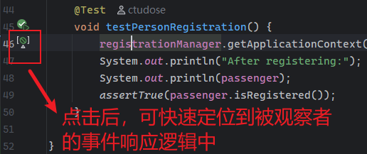

从观察者（`observer`）回到被观察者（`subject`）（鼠标悬停会出现 `Go to event publisher` 提示语）：

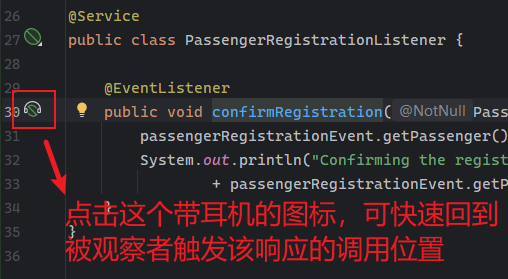

最终的实测结果：

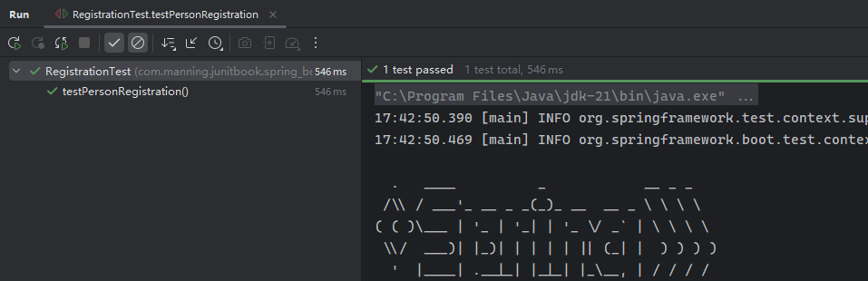

> [!note]
>
> **注意：关于 Bean 的默认名称及修改方法**
>
> `@AutoWired` 注解在实例化 `passenger` 的过程中，首先按 `Bean` 的类型 `Passenger` 进行匹配，然后是名称（默认为 `createPassenger`）。如果从应用上下文手动获取名称为 `"passenger"` 的 `Bean` 是会报错的：
>
> ```java 
> @Test
> @DisplayName("should throw exception if invoked via the name passenger")
> void shouldThrowExceptionIfInvokedViaTheNamePassenger() {
>     final NoSuchBeanDefinitionException ex = assertThrows(NoSuchBeanDefinitionException.class, () -> {
>         final ApplicationContext context = registrationManager.getApplicationContext();
>         final Passenger passenger1 = context.getBean("passenger", Passenger.class);
>         System.out.println("Bean injected by name 'passenger': " + passenger1);
>     });
>     assertTrue("No bean named 'passenger' available".contains(ex.getMessage()));
> }
> ```
>
> 运行结果：
>
> 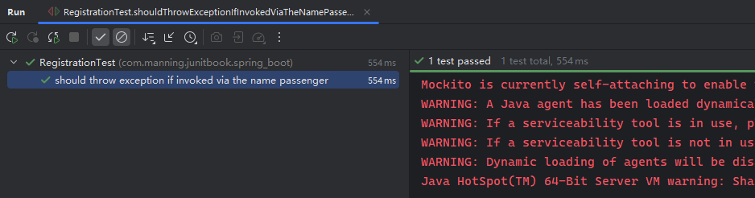
>
> 如果非要用 `"passenger"` 作名称，可以将 `@Bean` 注解改为 `@Bean("passenger")`（`L1`）：
>
> ```java
> @Bean("passenger")
> public Passenger createPassenger(){
>     Passenger passenger = new Passenger("John Smith");
>     passenger.setCountry(createCountry());
>     passenger.setIsRegistered(false);
>     return passenger;
> }
> ```
>
> 这样就能拿到 `passenger` 对象了：
>
> 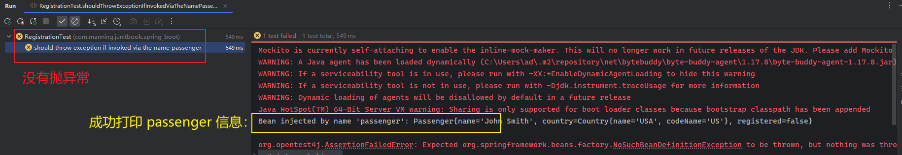


## 17.5 SpringBoot 实战：所有乘客注册事件批量响应

本例在上一章 `Spring` 实战案例的基础上引入了航班实体类 `Flight`：

```java
public class Flight {
    private final String flightNumber;
    private final int seats;
    private final Set<Passenger> passengers = new HashSet<>();

    public Flight(String flightNumber, int seats) {
        this.flightNumber = flightNumber;
        this.seats = seats;
    }

    public String getFlightNumber() {
        return flightNumber;
    }

    public int getSeats() {
        return seats;
    }

    public Set<Passenger> getPassengers() {
        return Collections.unmodifiableSet(passengers);
    }

    public boolean addPassenger(Passenger passenger) {
        if (passengers.size() >= seats) {
            throw new RuntimeException("Cannot add more passengers than the capacity of the flight!");
        }
        return passengers.add(passenger);
    }

    public boolean removePassenger(Passenger passenger) {
        return passengers.remove(passenger);
    }

    @Override
    public String toString() {
        return "Flight " + getFlightNumber();
    }
}
```

本例的测试目标：对某航班内所有注册成功的乘客，都各自反馈一条应答消息，告知乘客已注册成功。

该航班的乘客信息来自一个 `CSV` 格式文件 `src/test/resources/flights_information.csv`。利用 `SpringBoot` 提供的测试专用的配置注解 `@TestConfiguration`，可以创建一个配置类 `FlightBuilder` 来读取文件中的乘客信息，进而在 `Spring` 容器中定义一个航班实例：

```java
@TestConfiguration
public class FlightBuilder {

    private static final Map<String, Country> countries = new HashMap<>(){{
        put("AU", new Country("Australia", "AU"));
        put("US", new Country("USA", "US"));
        put("UK", new Country("United Kingdom", "UK"));
    }};

    @Bean("flight")
    Flight buildFlightFromCsv() throws IOException {
        Flight flight = new Flight("AA1234", 20);
        try(BufferedReader br = new BufferedReader(new FileReader("src/test/resources/flights_information.csv"))) {
            String line;
            do {
                line = br.readLine();
                if(line != null) {
                    String[] fields = line.split(";");
                    Passenger p = new Passenger(fields[0].trim());
                    Country c = countries.get(fields[1].trim());
                    p.setCountry(c);
                    p.setIsRegistered(false);
                    flight.addPassenger(p);
                }
            } while (line != null);
        }
        return flight;
    }
}
```

最后，通过 `@AutoWired` 注解向测试类中注入依赖，并完成航班中已注册乘客的批量信息反馈：

```java
@SpringBootTest
@Import(FlightBuilder.class)
public class FlightTest {

    @Autowired
    private Flight flight;

    @Autowired
    private RegistrationManager registrationManager;

    @Test
    void flightTest() {
        ApplicationContext ctx = registrationManager.getApplicationContext();
        flight.getPassengers()
                .parallelStream()
                .peek(passenger -> assertFalse(passenger.isRegistered()))
                .forEach(passenger -> ctx.publishEvent(new PassengerRegistrationEvent(passenger)));

        System.out.println("All passengers from the flight are now confirmed as registered");

        flight.getPassengers()
                .parallelStream()
                .forEach(passenger -> assertTrue(passenger.isRegistered()));
    }
}
```

实测结果：

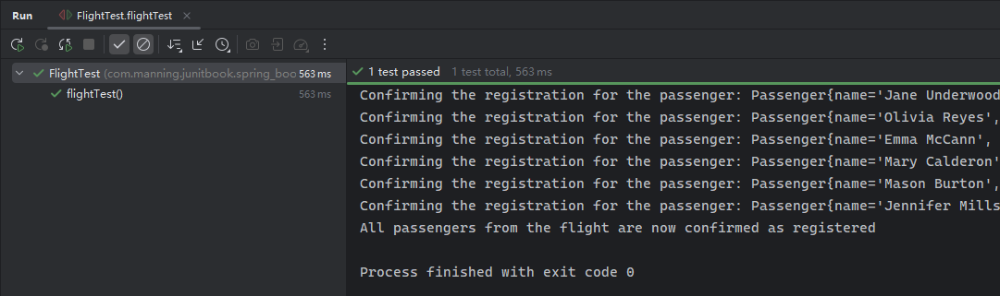


