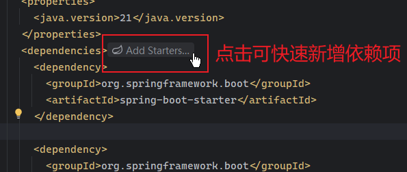
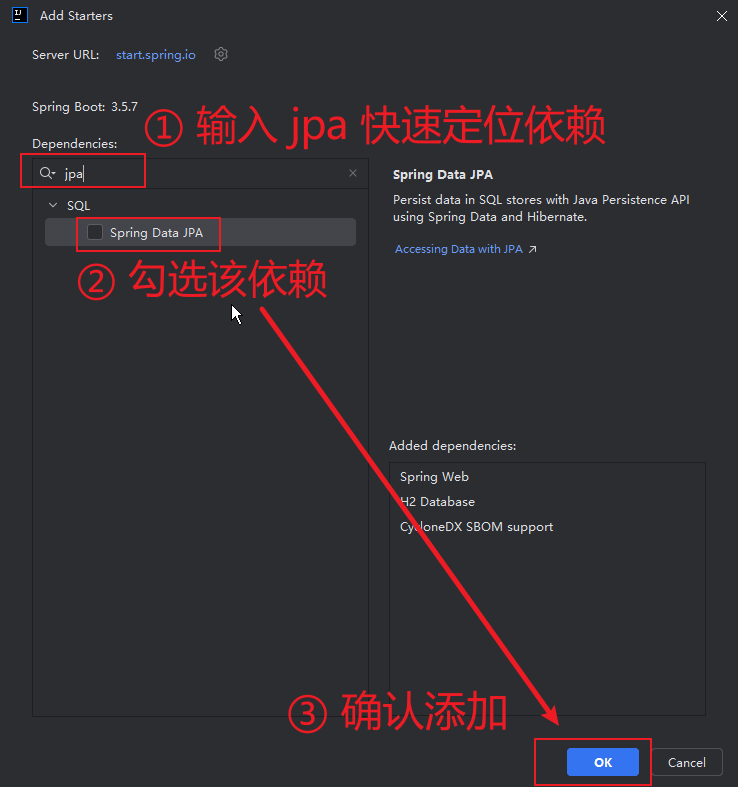
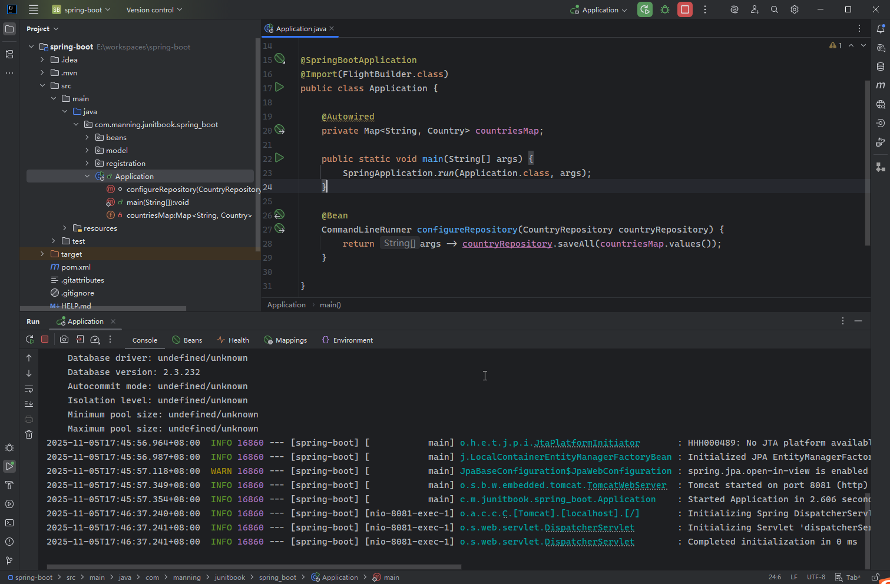
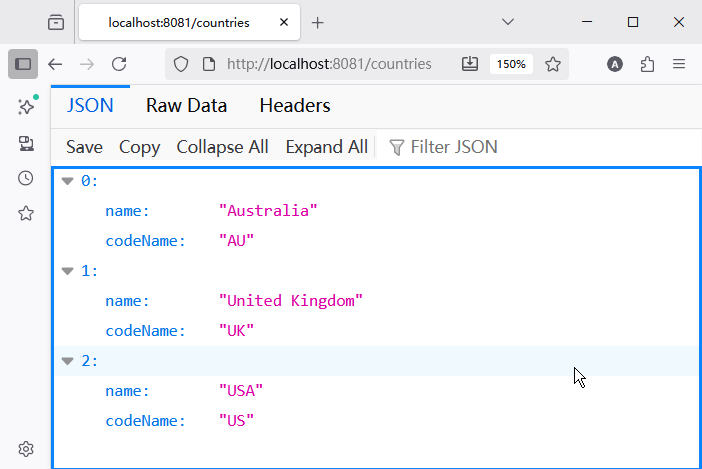
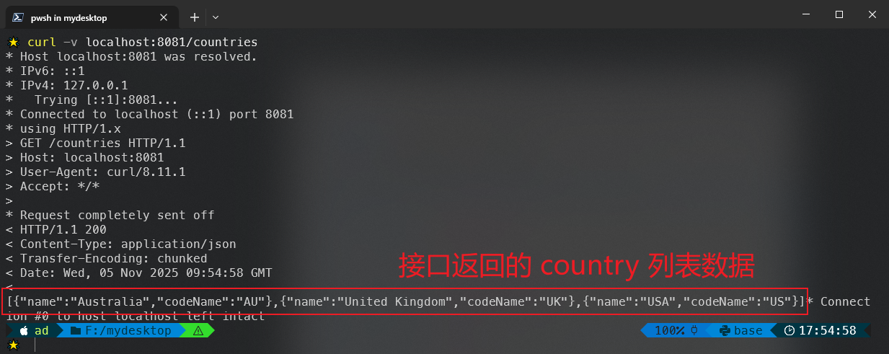

# 第十八章：REST API 测试


> **本章概要**
>
> - 用 `RESTful API` 管理一个或多个实体的方法；
> - `RESTful API` 的测试方法。


> *For now, let's just say that if your API is re-defining the HTTP verbs or if it is assigning new meanings to HTTP status codes or making up its own status codes, it is not RESTful.*
> 此刻，如果你的 API 重新定义了 HTTP 动词，或是赋予了 HTTP 状态码新的含义，甚至自行创建了状态码，那么它就不符合 RESTful 规范。
>
> —— **George Reese**, *The REST API Design Handbook*


## 18.1 REST 应用概述

`REST` 的全称为 `REpresentational State Transfer`，中文译为 “**表述性状态转移**”，由美国计算机科学家 **Roy Fielding** 于 2000 年发表的博士论文中首次定义。

本质上看，`REST` 是一种 **软件架构风格**：它为一组网络组件（客户端和服务器）如何相互通信设计了一组约束和原则。它 **并非** 某个标准或协议，而是一种软件 **设计哲学**。

当某个 `Web Service` 服务遵循了 `REST` 的基本原则时，就称其为 **RESTful API** 接口，或者具备 **RESTful** 风格的 `Web Service` 服务。

具备 `RESTful` 风格的 `Web Service` 服务实现了 `Web` 端与计算机系统间的互操作，其请求系统可以通过一组明确的无状态操作（stateless operations）来访问和操作以 **文本形式** 呈现的网络资源。

`RESTful API` 的两个构成要素：

- **客户端**：使用该接口的人或软件（如浏览器）；
- **资源**：能够用 `API` 接口获取信息的任何对象，均可视为该接口的某种资源（如消息、用户信息、图片等）；每个资源都有一个唯一标识（identifier）。


## 18.2 REST 风格的六大约束

`REST` 架构风格定义的六大约束：

1. **客户端/服务器模式（Client-server）**：客户端与服务器相互分离，各自关注不同的层面：
   1. 客户端关注用户界面呈现效果；
   2. 服务器关注数据存储及域模型逻辑（及包含数据和行为的领域概念模型）
2. **无状态性（Stateless）**：服务器不会在请求间保留客户端任何信息，状态由客户端自行维护；
3. **接口统一（Uniform interface）**：只要接口不变，客户端与服务器可以独立升级演进，接口统一使其保持松耦合关系。
4. **分层设计的系统（Layered systems）**：客户端无法判定其是否直接与服务端还是中间层在交互，每一层均可动态添加或移除，并基于分层设计提供安全、负载均衡、共享缓存等特性；
5. **缓存设计（Cacheable）**：客户端可以对响应进行缓存，响应本身也可以自行声明能否被缓存；
6. **按需定制（Code on demand）**：非必选项。服务器可以临时定制或扩展客户端的功能特性，如向客户端传输某些执行逻辑（`JavaScript` 脚本或 `Java applet` 逻辑）

虽然 `RESTful` 风格的 `API` 接口并不限定通信协议，但应用最广泛的还是基于 `HTTP` 协议的 `REST API` 接口。

客户端发起请求，会收到服务器返回的响应内容，这些内容代表了被请求资源的 **某种状态**。状态的具体表现格式主要有 `JSON`、`XML`、`HTML` 格式。

发送到服务端的具体内容主要由两部分构成：

- 目标资源的 `URL`；
- 希望服务器对该资源执行的某种操作，即 `HTTP` 方法（如 `GET`、`POST`、`PUT`、`PATCH`、`DELETE`）。


## 18.3 RESTful API 接口的创建

首先添加三个 `Maven` 依赖：

- `spring-boot-starter-web`
- `spring-boot-starter-data-jpa`
- `h2`

处于实战考虑，我本地基于最新的 `SpringBoot Initializr` 生成的默认项目进行扩充。`IntelliJ IDEA` 在 `pom.xml` 文件提供了便捷的动态管理入口：





本例将创建一个对国家实体类 `Country` 提供 `CRUD` 基本操作的 `REST API` 接口。该接口的基础 `URL` 为 `http://localhost:8081/`，端口 `8081` 通过项目配置文件 `src/main/resources/application.properties` 指定（第一行是 `Initializr` 的默认配置）：

```properties
spring.application.name=spring-boot
server.port=8081
```

国家数据的初始化拟通过另一个 `CSV` 文件 `src/main/resources/countries_information.csv` 批量导入 `H2` 数据库：

```markdown
Australia; AU
USA; US
United Kingdom; UK
```

具体的导入逻辑通过修改 `FlightBuilder` 类实现：

```java
public class FlightBuilder {

    private final Map<String, Country> countriesMap = new HashMap<>();

    public FlightBuilder() throws IOException {
        try (BufferedReader reader = new BufferedReader(new FileReader("src/main/resources/countries_information.csv"))) {
            String line;
            do {
                line = reader.readLine();
                if (line != null) {
                    String[] countriesString = line.split(";");
                    Country country = new Country(countriesString[0].trim(), countriesString[1].trim());
                    countriesMap.put(countriesString[1].trim(), country);
                }
            } while (line != null);
        }
    }

    @Bean
    Map<String, Country> getCountriesMap() {
        return Collections.unmodifiableMap(countriesMap);
    }

    @Bean("flight")
    Flight buildFlightFromCsv() throws IOException {
        Flight flight = new Flight("AA1234", 20);
        try(BufferedReader br = new BufferedReader(new FileReader("src/main/resources/flights_information.csv"))) {
            String line;
            do {
                line = br.readLine();
                if(line != null) {
                    String[] fields = line.split(";");
                    Passenger p = new Passenger(fields[0].trim());
                    p.setCountry(countriesMap.get(fields[1].trim()));
                    p.setIsRegistered(false);
                    flight.addPassenger(p);
                }
            } while (line != null);
        }
        return flight;
    }
}
```

注意：

- `L21` 行使用的 `Collections.unmodifiableMap()` 方法可以防止 `countriesMap` 被 `Spring` 容器注入后被人为修改；
- `countriesMap` 的初始化是通过 `FlightBuilder` 的构造函数触发的，相当于走了个捷径；
- 由于 `FlightBuilder` 从测试环境迁移到了 `src` 源码环境，实例化 `Flight` 的逻辑也要同步更新 `CSV` 数据源的访问路径。

接着改造 `Country` 实体类，添加两个 `JPA` 注解：

```java
@Entity
public class Country {
    private String name;

    @Id
    private String codeName;
    
    public Country() {
        this(null, null);
    }

    public Country(String name, String codeName) {
        this.name = name;
        this.codeName = codeName;
    }
    // -- snip --
}
```

注意：这里加注 `@Entity` 注解后，需要补一个无参构造函数，以便持久层在实例化 `Country` 时通过 **反射机制** 调用该构造函数 [^1]。

按照 `MVC` 的设计模式，`Country` 这个 `Model` 层准备就绪了，还需要 `C` 代表的 `Controller` 层，以及沟通 `M` 和 `C` 的数据访问层（`Data Access Object` 层，即`DAO` 层）。先创建 `DAO` 层 `CountryRepository`：

```java
public interface CountryRepository extends JpaRepository<Country, String> {
}
```

继承 `JpaRepository` 后，`CountryRepository` 接口就自带了一组基于 `Country` 实体类的 `CRUD` 操作方法，不必再手动实现一遍这些逻辑了；同时，继承该接口相当于让 `Spring` 在类路径 `CLASSPATH` 下扫描该接口，自动生成一个 `Bean` 实例，无需再添加注解 `@Repository` 了。

然后是 `Country` 实体对应的 `Controller` 层 `CountryController`：

```java
@RestController
public class CountryController {

    @Autowired
    private CountryRepository repository;

    @GetMapping("/countries")
    List<Country> findAll() {
        return repository.findAll();
    }
}
```

最后，还需要将 `countriesMap` 中的数据提前存入内存数据库，通过改造启动类 `Application` 实现：

```java
@SpringBootApplication
@Import(FlightBuilder.class)
public class Application {

    @Autowired
    private Map<String, Country> countriesMap;

    public static void main(String[] args) {
        SpringApplication.run(Application.class, args);
    }

    @Bean
    CommandLineRunner configureRepository(CountryRepository countryRepository) {
        return args -> countryRepository.saveAll(countriesMap.values());
    }

}
```

上述代码中，`configureRepository()` 方法将返回一个 `CommandLineRunner` 接口实例。`CommandLineRunner` 让开发者可以直接访问从命令行启动项目时指定的 `args` 参数，并且通过这个 `Spring` 注入的 `Bean` 实例还能在项目启动 **之前** 执行由 `L14` 返回的自定义逻辑——遍历 `countriesMap` 中的国家数据并存入数据库，以确保客户端调用 `GET /countries` 端点时有数据。

最后，运行 `Application` 的 `main` 方法启动项目：



接口是否可用，有两种检测方法——

一是通过浏览器直接访问 [http://localhost:8081/countries](http://localhost:8081/countries)：



二是通过命令行的 `curl` 命令访问：`curl -v localhost:8081/countries`：



注意：`curl` 命令的 `-v` 参数表示展示详细信息。其中——

- 以 `*` 开头的行表示 **curl 信息**，显示连接建立过程；
- 以 `>` 开头的行表示 **请求信息**，显示客户端发送到服务器的内容；
- 以 `<` 开头的行表示 **响应头信息**，显示服务器返回的 `HTTP Header` 头内容；
- 最后一行为 **响应体**，即服务器返回的实际数据内容。


## 18.4 RESTful API 接口的测试


---

[^1]: 如果没有显式定义带参构造函数（本例显然不满足），编译器会默认创建一个无参构造函数。


