# 第五部分：用 JUnit 5 开发应用程序

这一部分内容重点探讨如何将 `JUnit 5` 融入现代项目的日常开发工作——

第 20 章探讨如何使用当下流行的测试驱动开发（TDD）技术进行项目开发。

第 21 章探讨行为驱动开发（BDD）模式实施项目的具体方法。并给出完整开发案例。

第 22 章将借助 `JUnit 5` 构建测试金字塔策略（test pyramid strategy）：从底层（单元测试）到上层（集成测试、系统测试和验收测试）的全方位测试方法。


# 第二十章：用 JUnit 5 进行测试驱动开发


> **本章概要**
>
> - 普通项目改造为 `TDD` 项目的方法；
> - `TDD` 应用的重构方法；
> - `TDD` 在实现新功能特性中的应用。

> *TDD helps you to pay attention to the right issues at the right time so you can make your designs cleaner, you can refine your designs as you learn. TDD enables you to gain confidence in the code over time.*
> 测试驱动开发（`TDD`）有助于在正确的时间关注正确的问题，从而使设计更加清晰，并能在学习过程中不断优化设计。随着时间的推移 `TDD` 能让开发者建立起对代码的信心。

本章没有堆砌 `TDD` 的观点理论，而是真正从实战角度出发，手把手地带领大家见识见识，究竟什么才是真正的测试驱动开发流程。


## 20.1 TDD 核心概念简介

**测试驱动开发（Test-driven development）** 是一种编程实践，它采用短周期循环的开发模式：先将需求转化为测试用例，再修改程序代码使测试通过。

`TDD` 倡导简约设计并强调安全性：其核心理念是追求 **可运行的简洁代码（clean code that works）**。

`TDD` 的三个优势：

- 代码由明确的目标驱动，确保精准满足应用需求；
- 引入新功能的速度显著提升：既能更快实现新功能，又能大幅降低出 Bug 的可能；
- 测试用例就能充当应用的文档（离不开对项目需求的深刻理解和前期良好的设计）。

`TDD` 实施的好坏还跟代码 **重构** 的质量密切相关。

**重构（*Refactoring*）** 就是在不影响软件系统外部行为的前提下改善其内部结构的过程。


## 20.2 实战1：初始项目的搭建

即搭建一个非 `TDD` 的项目作为演示的起点。还是以航班管理应用为例，具体需求如下：

在航班 `Flight` 与 `Passenger` 乘客实体交互过程中，航班添加乘客的规定如下 ——

- 经济舱航班可供 `VIP` 乘客及普通乘客搭乘；
- 商务舱航班仅供 `VIP` 乘客搭乘。

航班移除乘客的规定如下——

- 普通乘客可被移除；
- `VIP` 乘客不可移除。

具体示意图如下：

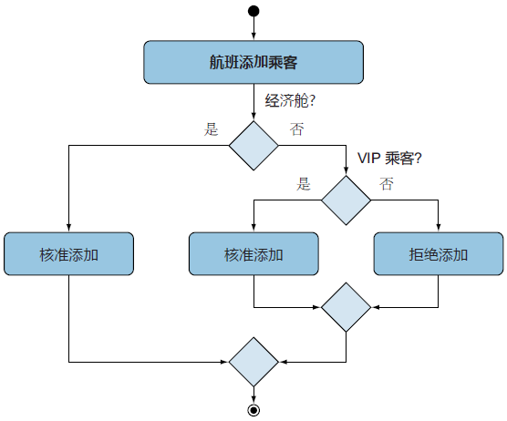

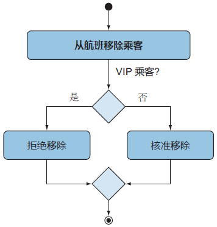

由此确定 `Flight` 与 `Passenger` 的初始设计：航班实体具有 `String` 型字段 `flightType`，`Passenger` 也是航班实体的一个集合字段，具体类图如下：

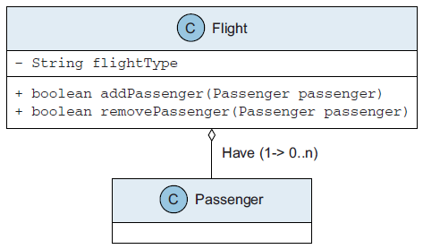

根据需求定义 `Passenger` 实体类如下：

```java
public class Passenger {

    private String name;
    private boolean vip;

    public Passenger(String name, boolean vip) {
        this.name = name;
        this.vip = vip;
    }

    public String getName() {
        return name;
    }

    public boolean isVip() {
        return vip;
    }
}
```

航班实体类 `Flight` 如下：

```java
public class Flight {

    private String id;
    private List<Passenger> passengers = new ArrayList<Passenger>();
    private String flightType;

    public Flight(String id, String flightType) {
        this.id = id;
        this.flightType = flightType;
    }

    public String getId() {
        return id;
    }

    public List<Passenger> getPassengersList() {
        return Collections.unmodifiableList(passengers);
    }

    public String getFlightType() {
        return flightType;
    }

    public boolean addPassenger(Passenger passenger) {
        switch (flightType) {
            case "Economy":
                return passengers.add(passenger);
            case "Business":
                if (passenger.isVip()) {
                    return passengers.add(passenger);
                }
                return false;
            default:
                throw new RuntimeException("Unknown type: " + flightType);
        }

    }

    public boolean removePassenger(Passenger passenger) {
        switch (flightType) {
            case "Economy":
                if (!passenger.isVip()) {
                    return passengers.remove(passenger);
                }
                return false;
            case "Business":
                return false;
            default:
                throw new RuntimeException("Unknown type: " + flightType);
        }
    }
}
```

由于是非 `TDD` 项目，测试用例也最好不用 `JUnit`，于是新建一个 `Airport` 类模拟手动测试逻辑：

```java
public class Airport {

    public static void main(String[] args) {
        Flight economyFlight = new Flight("1", "Economy");
        Flight businessFlight = new Flight("2", "Business");

        Passenger james = new Passenger("James", true);
        Passenger mike = new Passenger("Mike", false);

        businessFlight.addPassenger(james);
        businessFlight.removePassenger(james);
        businessFlight.addPassenger(mike);
        economyFlight.addPassenger(mike);

        System.out.println("Business flight passengers list:");
        for (Passenger passenger : businessFlight.getPassengersList()) {
            System.out.println(passenger.getName());
        }

        System.out.println("Economy flight passengers list:");
        for (Passenger passenger : economyFlight.getPassengersList()) {
            System.out.println(passenger.getName());
        }
    }
}
```

运行 `main` 方法（符合预期）：

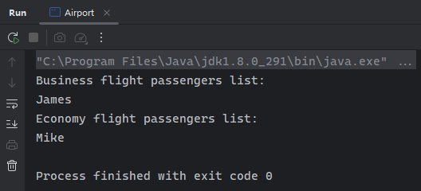


## 20.3 实战2：改造为带单元测试的准 TDD 版

现在将原始的非 `TDD` 的项目改造为 `TDD` 版本。首先添加 `JUnit 5` 依赖。由于实测项目在用 `Maven` 命令行创建时已自带 `JUnit 5`，这一步可以跳过：

```xml
<dependencyManagement>
  <dependencies>
    <dependency>
      <groupId>org.junit</groupId>
      <artifactId>junit-bom</artifactId>
      <version>5.11.0</version>
      <type>pom</type>
      <scope>import</scope>
    </dependency>
  </dependencies>
</dependencyManagement>

<dependencies>
  <dependency>
    <groupId>org.junit.jupiter</groupId>
    <artifactId>junit-jupiter-api</artifactId>
    <scope>test</scope>
  </dependency>
  <!-- Optionally: parameterized tests support -->
  <dependency>
    <groupId>org.junit.jupiter</groupId>
    <artifactId>junit-jupiter-params</artifactId>
    <scope>test</scope>
  </dependency>
</dependencies>
```

对应的 `Maven` 创建命令为：

```powershell
mvn archetype:generate -DgroupId="com.manning.junitbook" -DartifactId="tdd-demo" -DarchetypeArtifactid="maven-artifact-mojo"
```

接着新建 `JUnit 5` 测试用例。根据乘法原理，两种航班类型与两类乘客共有 4 种交互类型，因此对应 4 个测试用例：

|        |   VIP 乘客（James）    |     普通乘客（Mike）     |
| :----: | :--------------------: | :----------------------: |
| 经济舱 | 可被添加、但不可被移除 |   可被添加、且可被移除   |
| 商务舱 | 可被添加、但不可被移除 | 不可被添加、且不可被移除 |

于是可利用 `@Nest` 注解和 `@Display` 注解创建如下测试类 `AirportTest`：

```java
public class AirportTest {

    @DisplayName("Given there is an economy flight")
    @Nested
    class EconomyFlightTest {

        private Flight economyFlight;

        @BeforeEach
        void setUp() {
            economyFlight = new Flight("1", "Economy");
        }

        @Test
        public void testEconomyFlightRegularPassenger() {
            Passenger mike = new Passenger("Mike", false);

            assertEquals("1", economyFlight.getId());
            assertTrue(economyFlight.addPassenger(mike));
            assertEquals(1, economyFlight.getPassengersList().size());
            assertEquals("Mike", economyFlight.getPassengersList().get(0).getName());

            assertTrue(economyFlight.removePassenger(mike));
            assertEquals(0, economyFlight.getPassengersList().size());
        }

        @Test
        public void testEconomyFlightVipPassenger() {
            Passenger james = new Passenger("James", true);

            assertEquals("1", economyFlight.getId());
            assertTrue(economyFlight.addPassenger(james));
            assertEquals(1, economyFlight.getPassengersList().size());
            assertEquals("James", economyFlight.getPassengersList().get(0).getName());

            assertFalse(economyFlight.removePassenger(james));
            assertEquals(1, economyFlight.getPassengersList().size());
        }
    }

    @DisplayName("Given there is a business flight")
    @Nested
    class BusinessFlightTest {
        private Flight businessFlight;

        @BeforeEach
        void setUp() {
            businessFlight = new Flight("2", "Business");
        }

        @Test
        public void testBusinessFlightRegularPassenger() {
            Passenger mike = new Passenger("Mike", false);

            assertFalse(businessFlight.addPassenger(mike));
            assertEquals(0, businessFlight.getPassengersList().size());
            assertFalse(businessFlight.removePassenger(mike));
            assertEquals(0, businessFlight.getPassengersList().size());
        }

        @Test
        public void testBusinessFlightVipPassenger() {
            Passenger james = new Passenger("James", true);

            assertTrue(businessFlight.addPassenger(james));
            assertEquals(1, businessFlight.getPassengersList().size());
            assertFalse(businessFlight.removePassenger(james));
            assertEquals(1, businessFlight.getPassengersList().size());
        }
    }
}
```

运行结果：

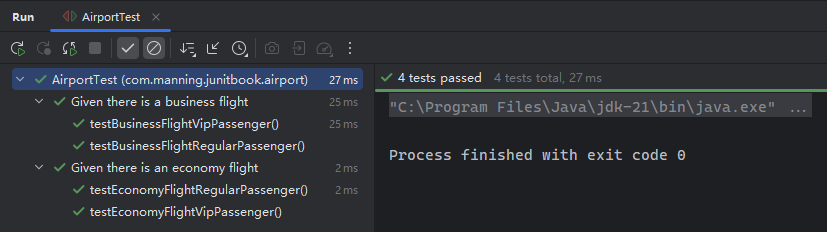

考察测试覆盖率可以看到，`Airport` 类完全不参与测试，因此可以直接删除：

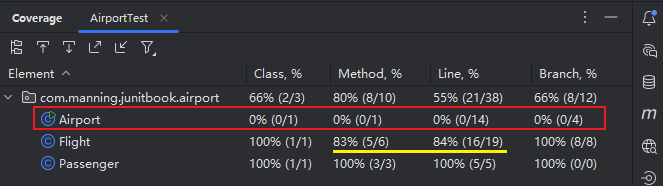

另外 `Flight` 的一些方法和代码行也有没被覆盖的情况（黄色划线部分），可以导出 `HTML` 报表查看详情：

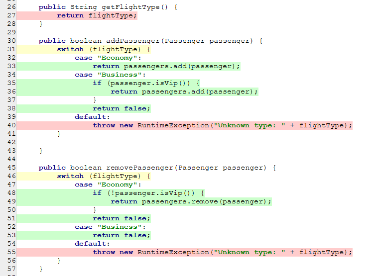

如图所示，一些方法和分支并没有走到，说明源代码还有重构的空间。


## 20.4 实战3：项目重构的正确打开方式

根据测试覆盖率报表详情可知，未被覆盖的代码都和 `flightType` 字段相关；但是 `switch` 分支要是少了 `default` 子句也会无法编译。因此应该跳出原来的思维框架，将写到核心逻辑的类型判定部分（静态）转换成基于多态的动态判定才是关键。有了多态，`flightType` 就可以直接删掉了，之前的条件判定也可以转化为各自不同的子类实现，无论是可读性还是项目的可扩展性都得到了极大的提升：

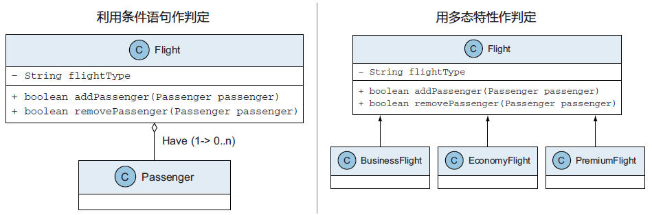

于是可以先删掉 `flightType` 字段，并让 `Flight` 成为抽象基类，让具体类型的子类去实现基类中的抽象方法。改造后的 `Flight` 实体类变为：

```java
public abstract class Flight {

    private final String id;
    protected List<Passenger> passengers = new ArrayList<>();

    public Flight(String id) {
        this.id = id;
    }

    public String getId() {
        return id;
    }

    public List<Passenger> getPassengersList() {
        return Collections.unmodifiableList(passengers);
    }

    public abstract boolean addPassenger(Passenger passenger);

    public abstract boolean removePassenger(Passenger passenger);

}
```

注意 `L4` 的 `protected` 修饰符，以及末尾的两个抽象方法。这样，经济舱和商务舱的实现就简单多了：

```java
// 经济舱航班实体
public class EconomyFlight extends Flight {

    public EconomyFlight(String id) {
        super(id);
    }

    @Override
    public boolean addPassenger(Passenger passenger) {
        return passengers.add(passenger);
    }

    @Override
    public boolean removePassenger(Passenger passenger) {
        if (!passenger.isVip()) {
            return passengers.remove(passenger);
        }
        return false;
    }

}

// 商务舱航班实体
public class BusinessFlight extends Flight {

    public BusinessFlight(String id) {
        super(id);
    }

    @Override
    public boolean addPassenger(Passenger passenger) {
        if (passenger.isVip()) {
            return passengers.add(passenger);
        }
        return false;
    }

    @Override
    public boolean removePassenger(Passenger passenger) {
        return false;
    }

}
```

最后，再同步修改测试用例，将经济舱和商务舱的实例对象分别改成对应子类的初始化（`L11`、`L23`）：

```java
public class AirportTest {

    @DisplayName("Given there is an economy flight")
    @Nested
    class EconomyFlightTest {

        private Flight economyFlight;

        @BeforeEach
        void setUp() {
            economyFlight = new EconomyFlight("1");
        }
        // -- snip --
    }

    @DisplayName("Given there is a business flight")
    @Nested
    class BusinessFlightTest {
        private Flight businessFlight;

        @BeforeEach
        void setUp() {
            businessFlight = new BusinessFlight("2");
        }
        // -- snip --
    }
}
```

再次查看覆盖率指标，所有代码行都覆盖了：

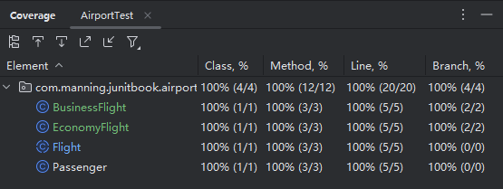

重构目标基本达成。


## 20.5 实战4：添加新特性——新的航班类型

接下来演示新特性的开发，看看一套标准的 `TDD` 开发流程究竟是怎样的。

新的需求描述如下：新增一个 **高级航班**，该航班只能添加 `VIP` 乘客，也可以任意移除乘客。添加和移除乘客的具体流程图如下：

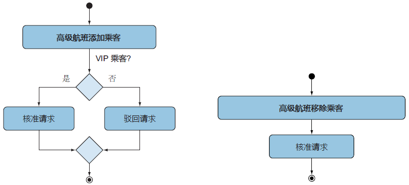

利用之前的重构成果，可以直接创建一个子类 `PremiumFlight` 来描述高级航班。但在此之前，根据 **Don Roberts** 提出的 **三次法则（the Rule of Three）**，需要先对测试用例再次进行重构。

> [!tip]
>
> **小贴士：三次法则**
>
> 三次法则原文摘录如下：
>
> The first time you do something, you just do it. The second time you do something similar, you wince at the duplication, but you do the duplicate thing anyway. The third time you do something similar, you refactor.
> 首次遭遇，干就完了；梅开二度，虽有重复，忍忍也就过了；再次遭遇，事不过三，就该重构了。
>
> 具体解释详见：[https://en.wikipedia.org/wiki/Rule_of_three_(computer_programming)](https://en.wikipedia.org/wiki/Rule_of_three_(computer_programming))。
>
> 本例中，示例项目的子类将增加到三个，因此很有必要对测试逻辑进行一番重构。

演示的重构重心，放在了变量及其初始化的集中处理、`JUnit 5` 特性的改造、以及测试用例的可读性提升上。前两个考察编程的基本功，最后一项考察的是将测试用例作为项目文档的良好编程素养。实测时，我又提取了一些反复用到的集合对象：

```java
public class AirportTest {

    @DisplayName("Given there is an economy flight")
    @Nested
    class EconomyFlightTest {

        private Flight economyFlight;
        private Passenger mike;
        private Passenger james;

        @BeforeEach
        void setUp() {
            economyFlight = new EconomyFlight("1");
            mike = new Passenger("Mike", false);
            james = new Passenger("James", true);
        }

        @Nested
        @DisplayName("When we have a regular passenger")
        class RegularPassenger {
            @Test
            @DisplayName("Then you cannot add or remove him from a business flight")
            public void testEconomyFlightRegularPassenger() {
                final List<Passenger> passengers = economyFlight.getPassengersList();
                assertAll("Verify all conditions for a regular passenger and an economy flight",
                        () -> assertEquals("1", economyFlight.getId()),
                        () -> assertTrue(economyFlight.addPassenger(mike)),
                        () -> assertEquals(1, passengers.size()),
                        () -> assertEquals("Mike", passengers.get(0).getName()),

                        () -> assertTrue(economyFlight.removePassenger(mike)),
                        () -> assertEquals(0, passengers.size()));
            }
        }

        @Nested
        @DisplayName("When we have a VIP passenger")
        class VipPassenger {

            @Test
            @DisplayName("Then you can add him but cannot remove him from an economy flight")
            public void testEconomyFlightVipPassenger() {
                final List<Passenger> passengers = economyFlight.getPassengersList();
                assertAll("Verify all conditions for a VIP passenger and an economy flight",
                        () -> assertEquals("1", economyFlight.getId()),
                        () -> assertTrue(economyFlight.addPassenger(james)),
                        () -> assertEquals(1, passengers.size()),
                        () -> assertEquals("James", passengers.get(0).getName()),

                        () -> assertFalse(economyFlight.removePassenger(james)),
                        () -> assertEquals(1, passengers.size()));
            }
        }
    }

    @DisplayName("Given there is a business flight")
    @Nested
    class BusinessFlightTest {
        private Flight businessFlight;
        private Passenger mike;
        private Passenger james;

        @BeforeEach
        void setUp() {
            businessFlight = new BusinessFlight("2");
            mike = new Passenger("Mike", false);
            james = new Passenger("James", true);
        }

        @Nested
        @DisplayName("When we have a regular passenger")
        class RegularPassenger {
            @Test
            @DisplayName("Then you cannot add or remove him from a business flight")
            public void testBusinessFlightRegularPassenger() {
                final List<Passenger> passengers = businessFlight.getPassengersList();
                assertAll("",
                        () -> assertFalse(businessFlight.addPassenger(mike)),
                        () -> assertEquals(0, passengers.size()),
                        () -> assertFalse(businessFlight.removePassenger(mike)),
                        () -> assertEquals(0, passengers.size()));
            }
        }

        @Nested
        @DisplayName("When we have a VIP passenger")
        class VipPassenger {
            @Test
            @DisplayName("Then you can add him but cannot remove him from a business flight")
            public void testBusinessFlightVipPassenger() {
                final List<Passenger> passengers = businessFlight.getPassengersList();
                assertAll("",
                        () -> assertTrue(businessFlight.addPassenger(james)),
                        () -> assertEquals(1, passengers.size()),
                        () -> assertFalse(businessFlight.removePassenger(james)),
                        () -> assertEquals(1, passengers.size()));
            }
        }
    }
}
```

实测效果：

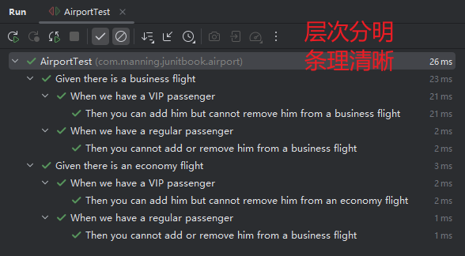

这之后，就可以创建新的子类实现、并追加新的测试套件了。和之前重构不同的是，新的子类实现逻辑先统一设为一个默认值（这里为 `false`）：

```java
public class PremiumFlight extends Flight {

    public PremiumFlight(String id) {
        super(id);
    }

    @Override
    public boolean addPassenger(Passenger passenger) {
        return false;
    }

    @Override
    public boolean removePassenger(Passenger passenger) {
        return false;
    }

}
```

然后追加对应的测试套件：

```java
@Nested
@DisplayName("Given there is a premium flight")
class PremiumFlightTest {
    private Flight premiumFlight;
    private Passenger mike;
    private Passenger james;

    @BeforeEach
    void setUp() {
        premiumFlight = new PremiumFlight("3");
        mike = new Passenger("Mike", false);
        james = new Passenger("James", true);
    }

    @Nested
    @DisplayName("When we have a regular passenger")
    class RegularPassenger {
        @Test
        @DisplayName("Then you cannot add or remove him from a premium flight")
        public void testPremiumFlightRegularPassenger() {
            final List<Passenger> passengers = premiumFlight.getPassengersList();
            assertAll("Verify all conditions for a regular passenger and a premium flight",
                    () -> assertFalse(premiumFlight.addPassenger(mike)),
                    () -> assertEquals(0, passengers.size()),
                    () -> assertFalse(premiumFlight.removePassenger(mike)),
                    () -> assertEquals(0, passengers.size()));
        }
    }

    @Nested
    @DisplayName("When we have a VIP passenger")
    class VipPassenger {
        @Test
        @DisplayName("Verify all conditions for a VIP passenger and a premium flight")
        public void testPremiumFlightVipPassenger() {
            final List<Passenger> passengers = premiumFlight.getPassengersList();
            assertAll("Verify all conditions for a VIP passenger and a premium flight",
                    () -> assertTrue(premiumFlight.addPassenger(james)),
                    () -> assertEquals(1, passengers.size()),
                    () -> assertTrue(premiumFlight.removePassenger(james)),
                    () -> assertEquals(0, passengers.size()));
        }
    }
}
```

先试运行一次测试（报错断言在 `L38~L40`）：

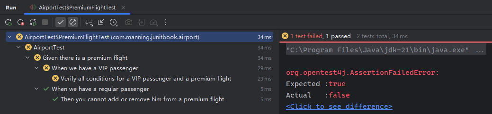

显然，问题出在操作乘客的两个方法都需要讨论乘客类型为 `VIP` 的情况，因此重新修改为：

```java
@Override
public boolean addPassenger(Passenger passenger) {
    if(passenger.isVip()) {
        return passengers.add(passenger);
    }
    return false;
}

@Override
public boolean removePassenger(Passenger passenger) {
    if(passenger.isVip()) {
        return passengers.remove(passenger);
    }
    return false;
}
```

再次执行测试，则顺利通过：

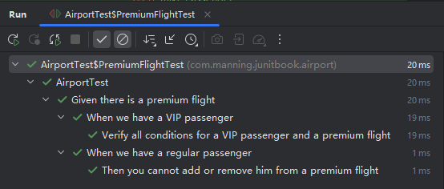

最后运行所有测试再次验证（均通过）：

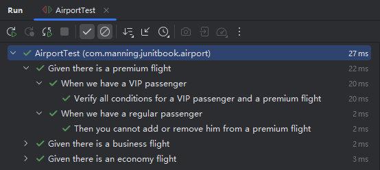

> [!note]
>
> **注意**
>
> 由于使用了内部类作测试套件，实测时并没有一开始就运行所有测试，和书中略有不同；但是最后的全部验证必须要有。


## 20.6 实战5：添加新特性——每位乘客只能被添加一次

需求很明确，就是要在所有支持添加乘客的航班子类中，增加一个限制条件——不允许出现重复元素。

根据 `TDD` 的流程，应该测试先行。于是应该先分析出哪些情况下会允许添加乘客，然后利用重复测试的相关注解，去模拟添加多次的应用场景。通过逐一排查每种类型航班的 `addPassenger()` 方法，根据是否执行 `passengers.add(passenger)` 语句，列表分析如下（`DIY` 增补内容）：

|  航班  |    乘客    |  是否支持添加乘客  | 是否需要补充测试用例 |
| :----: | :--------: | :----------------: | :------------------: |
| 经济舱 |  普通乘客  | :heavy_check_mark: |  :heavy_check_mark:  |
| 经济舱 | `VIP` 乘客 | :heavy_check_mark: |  :heavy_check_mark:  |
| 商务舱 |  普通乘客  |        :x:         |         :x:          |
| 商务舱 | `VIP` 乘客 | :heavy_check_mark: |  :heavy_check_mark:  |
| 高级舱 |  普通乘客  |        :x:         |         :x:          |
| 高级舱 | `VIP` 乘客 | :heavy_check_mark: |  :heavy_check_mark:  |

于是找到相应的测试套件，分别添加重复测试逻辑即可。以【经济舱航班 + 普通乘客】为例：

```java
@DisplayName("Then you cannot add him to an economy flight more than once")
@RepeatedTest(5)
public void testEconomyFlightRegularPassengerAddedOnlyOnce(RepetitionInfo repetitionInfo) {
    IntStream.range(0, repetitionInfo.getTotalRepetitions())
            .forEach(i -> economyFlight.addPassenger(mike));
    final List<Passenger> passengers = economyFlight.getPassengersList();
    assertAll("Verify a regular passenger can be added to an economy flight only once",
            () -> assertEquals(1, passengers.size()),
            () -> assertTrue(passengers.contains(mike)),
            () -> assertEquals("Mike", passengers.get(0).getName())
    );
}
```

以此类推到其他三种场景下，最后运行测试，得到如下结果：

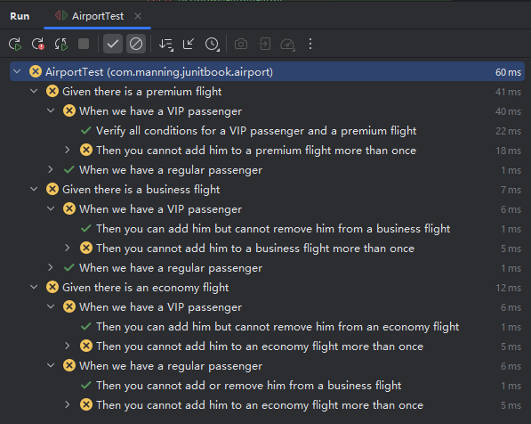

观察报错结果发现，问题出在 `List<Passenger>` 天然不支持去重功能，除非使用 `Set<Passenger>`。于是改造基类 `Flight` 的 `passengers` 成员属性的类型：

```java
public abstract class Flight {
    // -- snip --
    protected Set<Passenger> passengers = new HashSet<>();
    public Set<Passenger> getPassengersSet() {
        return Collections.unmodifiableSet(passengers);
    }
    // -- snip --
}
```

这样一来，`passengers` 就天然支持去重了；但由于改了方法签名，原测试中所有受影响的用例都要同步更新。利用 `IDEA` 的智能提示可以快速定位并更正：

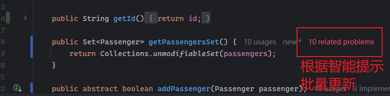

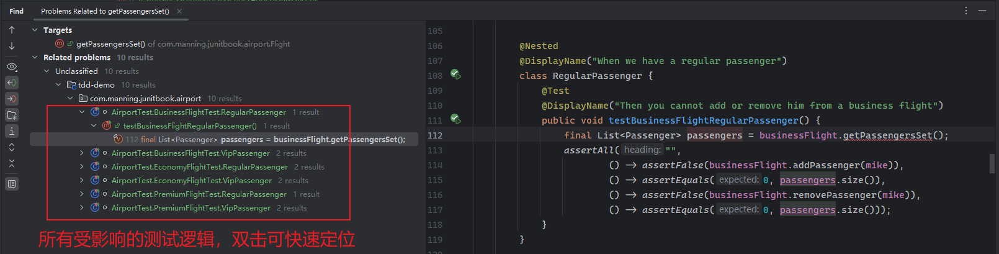

逐一修改完成后，再次运行所有测试：

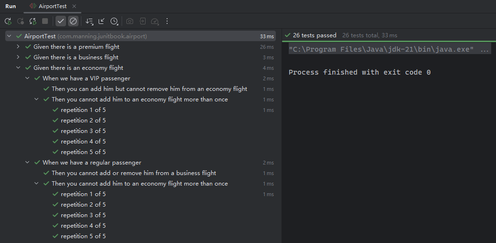
