# 第二十一章：用 JUnit 5 进行行为驱动开发


> **本章概要**
>
> - 解析 BDD 的优势与面临的挑战；
> - 将 TDD 应用迁移至 BDD 模式下的方法；
> - 用 Cucumber 与 JUnit 5 开发 BDD 应用的方法；
> - 用 JBehave 与 JUnit 5 开发 BDD 应用的方法。

> *Some people refer to BDD as “TDD done right.” You can also think of BDD as “how we build the right thing” and TDD as “how we build the thing right.”*
> 有人认为 BDD 是“用对了的 TDD”。你也可以将 BDD 视为“如何构建正确的东西”；而 TDD 则是“如何正确地构建东西”。
>
> —— **Millard Ellingsworth**

本章内容看似很多，其实只触及 `BDD` 的冰山一角。初学时因为 `IDEA` 一个插件报错耽搁了很久。若想深入了解 `BDD`，可以参考 `Manning` 出版社 2023 年 3 月出版的《*BDD in Action*》第二版。本章只能算开胃菜，让纯小白熟悉 `BDD` 的基础玩法。


## 21.1 TDD 暴露的问题

主要体现在三个方面：

- 容易一叶障目：`TDD` 的常规流程（测试 :arrow_right: 编码 :arrow_right: 重构 :arrow_right: ……（循环往复））很可能让人只见树木、不见森林；单元测试通常只关注 `SUT`（被测对象，即某个类或方法），容易忽略业务目标；
- 大型项目运维困难：实际工作场景将比演示案例复杂很多，最终导致测试难以理解和维护；
- 牵一发动全身：测试用例通常与应用实现的细节高度耦合。


## 21.2 BDD 简介

`BDD`（Behavior-driven Development，行为驱动开发） 是一种从业务需求和目标出发，将其转化为可用功能的软件开发方法。它由 **Dan North** 于 2000 年代中期首创，起初是为了在更广泛的人群中推广普及 `TDD`。有了 `BDD`，人们就能确定真正需要的功能并集中予以实现，发现用户的实际需求。

由于人员沟通造成的误解和偏差随处可见，比如以下环节：

1. 客户对接业务分析人员时；
2. 业务分析人员消化需求并指定详细设计时；
3. 开发人员根据需求编写代码，并用单元测试验证新功能时；
4. 测试人员根据需求编写用例，验证新功能的运行情况时。

这些新的功能特性都要被拆分为不同的 **用户叙事（user stories）**，进而体现为具体的 **示例（examples）**；而示例将成为用户叙事最终的 **验收标准（acceptance criteria）**。

`BDD` 核心句式：`Given-When-Then` ——

- **Given** &lt;a context>
- **When** &lt;an action occurs>
- **Then** &lt;expect a result>

例如：

- **Given** the flights operated by company X
- **When** I want to find the quickest route from Bucharest to New York on May 15 20...
- **Then** I will be provided the route Bucharest-Frankfurt-New York, with a duration of...

翻译过来就是：

- **已知** 一批由 X 公司运营的候选航班
- **当** 我想在 5 月 15 号找到从布加勒斯特飞抵纽约的最快线路 **时**
- **就会** 得到线路 `布加勒斯特-法兰克福-纽约`，时长为……

再比如：

- **Given** the flights operated by the company
- **When** I want to travel from Bucharest to London next Wednesday
- **Then** I should be provided 2 possible flights: 10:35 and 16:20

翻译过来就是：

- **已知** 贵公司运营的航班
- **当** 我计划下周三从布加勒斯特飞往伦敦
- **就** 应该能获得两趟可选航班：`10:35` 和 `16:20`


## 21.3 BDD 的优劣势

|   BDD 的优势   |                        BDD 的劣势                        |
| :------------: | :------------------------------------------------------: |
|  聚焦用户需求  | 需要各方深度参与、紧密协作、频繁互动、直接沟通、持续反馈 |
|  阐明问题核心  |    全球化语境下，可能还有语言技能和时差协调方面的问题    |
|  变更管理良好  |                                                          |
| 支持自动化处理 |                                                          |
|  聚焦业务价值  |                                                          |
|    降本增效    |                                                          |


## 21.4 用 Cucumber 实战 BDD

以上一章基于 `TDD` 的航班管理为例，本节用 `Cucumber` 将其转为 `BDD` 模式。

`Cucumber`（[https://cucumber.io/](https://cucumber.io/)，读作 `/ˈkjuːkʌmbər/`，意为黄瓜）是一款基于 `BDD` 的测试框架，它使用一种专用语言（`Gherkin`，读作 `/ˈɡɜːkɪn/`，意为小黄瓜）以通俗英语描述应用场景，既方便了相关人员理解需求，又实现了自动化测试。

`Cucumber` 的特点：

- 需求通过场景（`Scenario`）或实例（`Example`）来描述；
- 场景由一系列步骤（`steps`）定义，进而交给 `Cucumber` 运行；
- `Cucumber` 运行的代码逻辑与定义的场景一一对应，并生成报告描述每个场景的执行结果（成功或失败）。

`Gherkin` 定义了简单的语法规则，使得 `Cucumber` 能够理解纯英文文本。

再来回顾一下开发需求：

1. 共有三种航班类型：经济舱型、商务舱型、高级型；两类乘客：普通乘客、`VIP` 乘客；
2. 经济舱——可以任意添加、移除乘客；
3. 商务舱——只能添加 `VIP` 乘客，添加后不可移除；
4. 高级型——只能添加 `VIP` 乘客，添加后可以移除。

先定义实体类 `Passenger` 和 `Flight` 抽象父类：

```java
public class Passenger {

    private String name;
    private boolean vip;

    public Passenger(String name, boolean vip) {
        this.name = name;
        this.vip = vip;
    }

    public String getName() {
        return name;
    }

    public boolean isVip() {
        return vip;
    }

}

public abstract class Flight {

    private String id;
    Set<Passenger> passengers = new HashSet<>();

    public Flight(String id) {
        this.id = id;
    }

    public String getId() {
        return id;
    }

    public Set<Passenger> getPassengersSet() {
        return Collections.unmodifiableSet(passengers);
    }

    public abstract boolean addPassenger(Passenger passenger);

    public abstract boolean removePassenger(Passenger passenger);

}
```

然后继承 `Flight` 实现三个具体类型的航班实体子类：

```java
// 普通航班
public class EconomyFlight extends Flight {

    public EconomyFlight(String id) {
        super(id);
    }

    @Override
    public boolean addPassenger(Passenger passenger) {
        return passengers.add(passenger);
    }

    @Override
    public boolean removePassenger(Passenger passenger) {
        if (!passenger.isVip()) {
            return passengers.remove(passenger);
        }
        return false;
    }
}

// 商务航班
public class BusinessFlight extends Flight {

    public BusinessFlight(String id) {
        super(id);
    }

    @Override
    public boolean addPassenger(Passenger passenger) {
        if (passenger.isVip()) {
            return passengers.add(passenger);
        }
        return false;
    }

    @Override
    public boolean removePassenger(Passenger passenger) {
        return false;
    }

}

// 高级航班
public class PremiumFlight extends Flight {

    public PremiumFlight(String id) {
        super(id);
    }

    @Override
    public boolean addPassenger(Passenger passenger) {
        if (passenger.isVip()) {
            return passengers.add(passenger);
        }
        return false;
    }

    @Override
    public boolean removePassenger(Passenger passenger) {
        if (passenger.isVip()) {
            return passengers.remove(passenger);
        }
        return false;
    }
}
```

这样，主程序部分就准备就绪了：


然后添加两个 `Maven` 依赖：

```xml
<dependency>
    <groupId>info.cukes</groupId>
    <artifactId>cucumber-java</artifactId>
    <version>1.2.6</version>
    <scope>test</scope>
</dependency>
<dependency>
    <groupId>info.cukes</groupId>
    <artifactId>cucumber-junit</artifactId>
    <version>1.2.6</version>
    <scope>test</scope>
</dependency>
```

以及两个 `IDEA` 插件：`Cucumber for Java`、`Gherkin`：

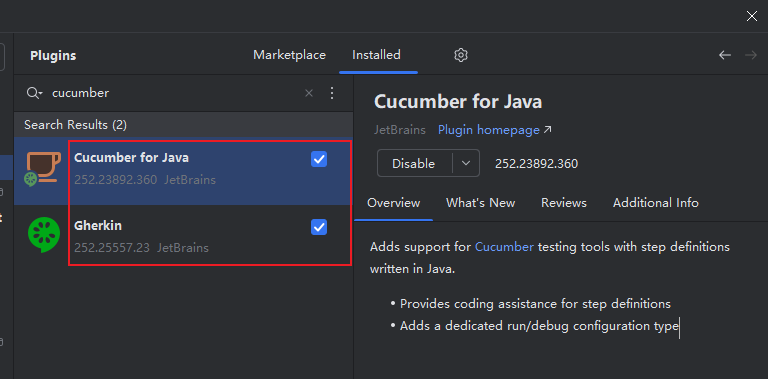

由于上一章的 `TDD` 项目在构建测试用例时已经按照 `BDD` 的经典句式 `Given-When-Then` 组织语言，此时可以直接提取到一个专门的特征文件中（通常以 `.feature` 作扩展名），具体路径为 `src/test/resources/features/passenger_policy.feature`：

```gherkin
Feature: Passengers Policy
  The company follows a policy of adding and removing passengers,
  depending on the passenger type and on the flight type

  Scenario: Economy flight, regular passenger
    Given there is an economy flight
    When we have a regular passenger
    Then you can add and remove him from an economy flight
    And you cannot add a regular passenger to an economy flight more than once

  Scenario: Economy flight, VIP passenger
    Given there is an economy flight
    When we have a VIP passenger
    Then you can add him but cannot remove him from an economy flight
    And you cannot add a VIP passenger to an economy flight more than once

  Scenario: Business flight, regular passenger
    Given there is a business flight
    When we have a regular passenger
    Then you cannot add or remove him from a business flight

  Scenario: Business flight, VIP passenger
    Given there is a business flight
    When we have a VIP passenger
    Then you can add him but cannot remove him from a business flight
    And you cannot add a VIP passenger to a business flight more than once

  Scenario: Premium flight, regular passenger
    Given there is a premium flight
    When we have a regular passenger
    Then you cannot add or remove him from a premium flight

  Scenario: Premium flight, VIP passenger
    Given there is a premium flight
    When we have a VIP passenger
    Then you can add and remove him from a premium flight
    And you cannot add a VIP passenger to a premium flight more than once
```

然后在该文件任意位置右键，从弹出菜单中直接运行该特征文件：

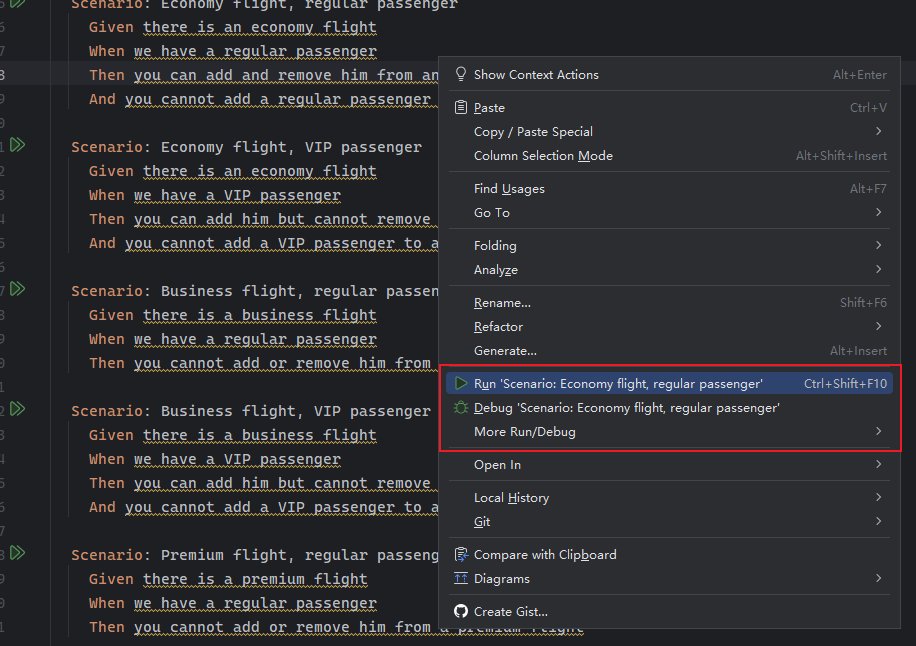

由于缺乏每个 `Scenario` 对应的测试步骤，此时所有测试结果都将是失败的：

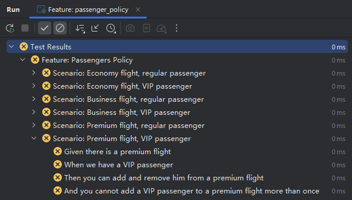

但是 `Cucumber` 插件会在控制台的最后给出一段默认的 `step` 实现，帮助我们快速创建对应的 `step` 定义文件：

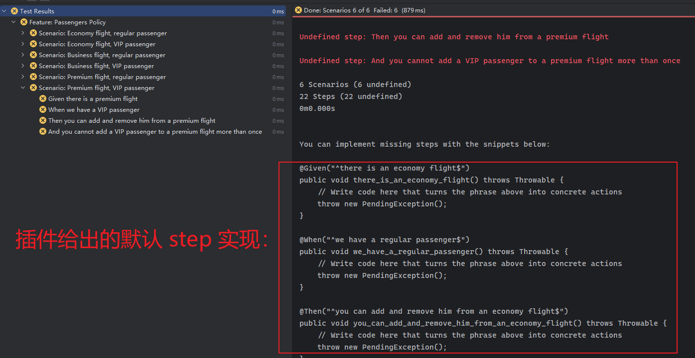

复制这些默认实现，并将其作为文件内容粘贴到真正的 `step` 定义文件 `src/test/java/com/manning/junitbook/airport/PassengerPolicy.java` 中：

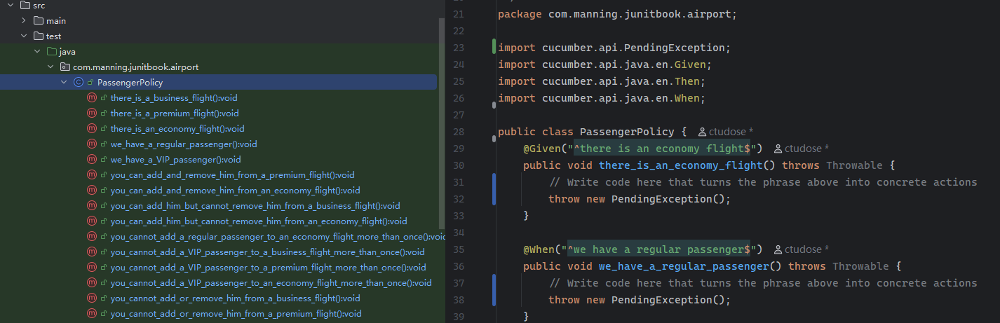

接下来的任务就是将 `TDD` 中的测试逻辑分别填入对应的 `BDD` 步骤方法内（即添加了 `@Given`、`@When`、`@Then` 注解的方法体内）。`BDD` 的测试将按照特征文件 `passenger_policy.feature` 中定义 `Scenario` 场景的顺序，逐一解析这些 `Scenario` 场景下的步骤（即 `Given`/`When`/`Then` 子句），并依次匹配到某一步骤对应的测试方法上。填充测试逻辑的过程中也可以按照描述内容（相当于测试文档）进行二次检查。最终得到如下定义内容：

```java
public class PassengerPolicy {
    private Flight economyFlight;
    private Flight businessFlight;
    private Flight premiumFlight;
    private Passenger mike;
    private Passenger john;

    @Given("^there is an economy flight$")
    public void there_is_an_economy_flight() {
        economyFlight = new EconomyFlight("1");
    }

    @When("^we have a regular passenger$")
    public void we_have_a_regular_passenger() {
        mike = new Passenger("Mike", false);
    }

    @Then("^you can add and remove him from an economy flight$")
    public void you_can_add_and_remove_him_from_an_economy_flight() {
        assertAll("Verify all conditions for a regular passenger and an economy flight",
                () -> assertEquals("1", economyFlight.getId()),
                () -> assertTrue(economyFlight.addPassenger(mike)),
                () -> assertEquals(1, economyFlight.getPassengersSet().size()),
                () -> assertTrue(economyFlight.getPassengersSet().contains(mike)),
                () -> assertTrue(economyFlight.removePassenger(mike)),
                () -> assertEquals(0, economyFlight.getPassengersSet().size()));}

    @Then("^you cannot add a regular passenger to an economy flight more than once$")
    public void you_cannot_add_a_regular_passenger_to_an_economy_flight_more_than_once() {
        IntStream.range(0, 10)
                .forEach(i -> economyFlight.addPassenger(mike));

        assertAll("Verify a regular passenger can be added to an economy flight only once",
                () -> assertEquals(1, economyFlight.getPassengersSet().size()),
                () -> assertTrue(economyFlight.getPassengersSet().contains(mike)),
                () -> assertEquals("Mike", new ArrayList<>(economyFlight.getPassengersSet()).get(0).getName()));
    }

    @When("^we have a VIP passenger$")
    public void we_have_a_VIP_passenger() {
        john = new Passenger("John", true);
    }

    @Then("^you can add him but cannot remove him from an economy flight$")
    public void you_can_add_him_but_cannot_remove_him_from_an_economy_flight() {
        assertAll("Verify all conditions for a VIP passenger and an economy flight",
                () -> assertEquals("1", economyFlight.getId()),
                () -> assertTrue(economyFlight.addPassenger(john)),
                () -> assertEquals(1, economyFlight.getPassengersSet().size()),
                () -> assertTrue(economyFlight.getPassengersSet().contains(john)),
                () -> assertFalse(economyFlight.removePassenger(john)),
                () -> assertEquals(1, economyFlight.getPassengersSet().size()));
    }

    @Then("^you cannot add a VIP passenger to an economy flight more than once$")
    public void you_cannot_add_a_VIP_passenger_to_an_economy_flight_more_than_once() {
        IntStream.range(0, 10)
                .forEach(i -> economyFlight.addPassenger(john));

        assertAll("Verify a VIP passenger can be added to an economy flight only once",
                () -> assertEquals(1, economyFlight.getPassengersSet().size()),
                () -> assertTrue(economyFlight.getPassengersSet().contains(john)),
                () -> assertEquals("John", new ArrayList<>(economyFlight.getPassengersSet()).get(0).getName()));
    }

    @Given("^there is a business flight$")
    public void there_is_a_business_flight() {
        businessFlight = new BusinessFlight("2");
    }

    @Then("^you cannot add or remove him from a business flight$")
    public void you_cannot_add_or_remove_him_from_a_business_flight() {
        assertAll("Verify all conditions for a regular passenger and a business flight",
                () -> assertFalse(businessFlight.addPassenger(mike)),
                () -> assertEquals(0, businessFlight.getPassengersSet().size()),
                () -> assertFalse(businessFlight.removePassenger(mike)),
                () -> assertEquals(0, businessFlight.getPassengersSet().size()));
    }

    @Then("^you can add him but cannot remove him from a business flight$")
    public void you_can_add_him_but_cannot_remove_him_from_a_business_flight() {
        assertAll("Verify all conditions for a VIP passenger and a business flight",
                () -> assertTrue(businessFlight.addPassenger(john)),
                () -> assertEquals(1, businessFlight.getPassengersSet().size()),
                () -> assertFalse(businessFlight.removePassenger(john)),
                () -> assertEquals(1, businessFlight.getPassengersSet().size()));
    }

    @Then("^you cannot add a VIP passenger to a business flight more than once$")
    public void you_cannot_add_a_VIP_passenger_to_a_business_flight_more_than_once() {
        IntStream.range(0, 10)
                .forEach(i -> businessFlight.addPassenger(john));

        assertAll("Verify a VIP passenger can be added to a business flight only once",
                () -> assertEquals(1, businessFlight.getPassengersSet().size()),
                () -> assertTrue(businessFlight.getPassengersSet().contains(john)),
                () -> assertEquals("John", new ArrayList<>(businessFlight.getPassengersSet()).get(0).getName()));
    }

    @Given("^there is a premium flight$")
    public void there_is_a_premium_flight() {
        premiumFlight = new PremiumFlight("3");
    }

    @Then("^you cannot add or remove him from a premium flight$")
    public void you_cannot_add_or_remove_him_from_a_premium_flight() {
        assertAll("Verify all conditions for a regular passenger and a premium flight",
                () -> assertFalse(premiumFlight.addPassenger(mike)),
                () -> assertEquals(0, premiumFlight.getPassengersSet().size()),
                () -> assertFalse(premiumFlight.removePassenger(mike)),
                () -> assertEquals(0, premiumFlight.getPassengersSet().size())
        );
    }

    @Then("^you can add and remove him from a premium flight$")
    public void you_can_add_and_remove_him_from_a_premium_flight() {
        assertAll("Verify all conditions for a VIP passenger and a premium flight",
                () -> assertTrue(premiumFlight.addPassenger(john)),
                () -> assertEquals(1, premiumFlight.getPassengersSet().size()),
                () -> assertTrue(premiumFlight.removePassenger(john)),
                () -> assertEquals(0, premiumFlight.getPassengersSet().size())
        );
    }

    @Then("^you cannot add a VIP passenger to a premium flight more than once$")
    public void you_cannot_add_a_VIP_passenger_to_a_premium_flight_more_than_once() {
        IntStream.range(0, 10)
                .forEach(i -> premiumFlight.addPassenger(john));

        assertAll("Verify a VIP passenger can be added to a premium flight only once",
                () -> assertEquals(1, premiumFlight.getPassengersSet().size()),
                () -> assertTrue(premiumFlight.getPassengersSet().contains(john)),
                () -> assertEquals("John", new ArrayList<>(premiumFlight.getPassengersSet()).get(0).getName())
        );
    }
}
```

然后修改之前运行特征文件的配置文件 `Feature: passenger_policy`（这是 `IDEA` 自动生成的），在 `Glue` 栏填入上述定义文件所在的包名（相对于 `src/test/java/`）：`com.manning.junitbook.airport`，这样特征文件就能自动匹配到对应的步骤实现了：

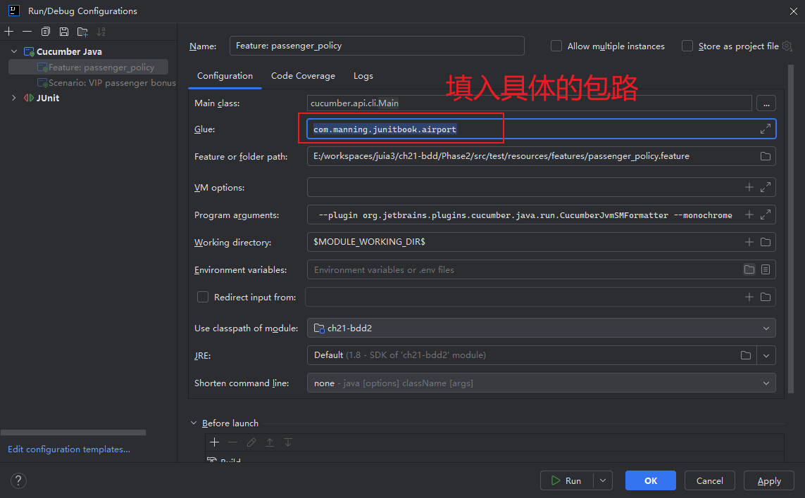

书中截图没有把 `Program arguments` 这一栏的参数完整显示，也没说明这是 IDEA 自动配置的，初次尝试走了不少弯路。完整内容如下：

```markdown
 --plugin org.jetbrains.plugins.cucumber.java.run.CucumberJvmSMFormatter --monochrome
```

其中，`CucumberJvmSMFormatter` 是 `IntelliJ IDEA` 专门为集成 `Cucumber-JVM` 测试报告而设计的一个 **内置格式化工具（Formatter）**；`--monochrome` 也是为了增强控制台输出结果的可读性而经常用到的一个参数。

再次运行 `passenger_policy.feature` 文件，所有场景测试就都通过了：

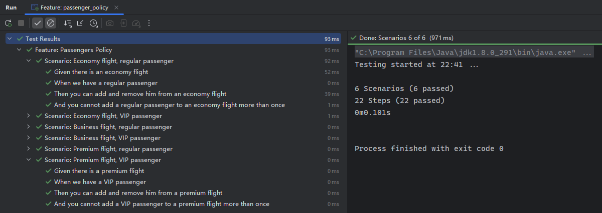

但是这样不如运行测试类来得直观，遇到多个特征文件就很不方便。为此，`Cucumber` 提供了一个批量执行的总入口，在步骤实现类的同级目录下创建一个 `CucumberTest` 类即可，内容如下：

```java
@RunWith(Cucumber.class)
@CucumberOptions(
        plugin = {"pretty"},
        features = "classpath:features"
)
public class CucumberTest {

    /**
     * This class should be empty, step definitions should be in separate classes.
     */

}
```

这里的 `pretty` 用于格式化，`features` 属性用于指定特征文件所在的文件夹。这样一来就能像正常的测试类一样，批量运行所有特征文件定义的测试场景了：

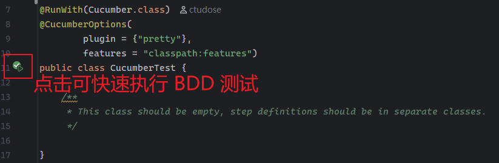

> [!note]
>
> **实战备忘**
>
> 实测过程中，这两个插件与我之前安装了另一个插件 `MyBatisX` 冲突了，导致 `Gherkin` 插件无法正常解析特征文件 `passenger_policy.feature`：
>
> 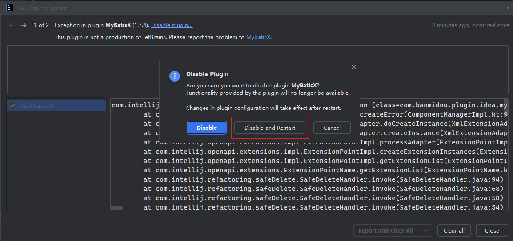
>
> 此时应按提示禁用 `MyBatisX` 插件并重启 `IDEA` 即可。

为了进一步演示 `Cucumber` 对 `BDD` 的强大支持，作者又展示了带表格的场景大纲的用法，让人耳目一新。

具体需求也很简单，根据总里程和乘客类型折算值机积分：`VIP` 乘客每五公里换一个积分，普通乘客则每十公里换一个。假定总里程由三次不同的值机记录汇总而来，那么该如何用特征文件进行描述呢？答案是 **使用场景大纲（Scenario Outline）**。

新建特征文件 `bonus_policy.feature`，内容如下：

```gherkin
Feature: Bonus Policy
  The company follows a bonus policy, depending on the passenger type and on the mileage

  Scenario Outline: Regular passenger bonus policy
    Given we have a regular passenger with a mileage
    When the regular passenger travels <mileage1> and <mileage2> and <mileage3>
    Then the bonus points of the regular passenger should be <points>

    Examples:
      | mileage1 | mileage2 | mileage3| points |
      |     349  |     319  |    623  |     64 |
      |     312  |     356  |    135  |     40 |
      |     223  |     786  |    503  |     75 |
      |     482  |      98  |    591  |     58 |
      |     128  |     176  |    304  |     30 |

  Scenario Outline: VIP passenger bonus policy
    Given we have a VIP passenger with a mileage
    When the VIP passenger travels <mileage1> and <mileage2> and <mileage3>
    Then the bonus points of the VIP passenger should be <points>

    Examples:
      | mileage1 | mileage2 | mileage3| points  |
      |     349  |     319  |    623  |     129 |
      |     312  |     356  |    135  |      80 |
      |     223  |     786  |    503  |     151 |
      |     482  |      98  |    591  |     117 |
      |     128  |     176  |    304  |      60 |
```

可以看到，表格中的列名和场景大纲中的占位符（`mileage1`、`points` 等）一一对应，有点类似 `JUnit 5` 中的参数化测试。

根据场景描述，首先新增一个里程类 `Mileage`：

```java
public class Mileage {

    public static final int VIP_FACTOR = 10;
    public static final int REGULAR_FACTOR = 20;

    private final Map<Passenger, Integer> passengersMileageMap = new HashMap<>();
    private final Map<Passenger, Integer> passengersPointsMap = new HashMap<>();

    public Map<Passenger, Integer> getPassengersPointsMap() {
        return Collections.unmodifiableMap(passengersPointsMap);
    }

    public void addMileage(Passenger passenger, int miles) {
        if (passengersMileageMap.containsKey(passenger)) {
            passengersMileageMap.put(passenger, passengersMileageMap.get(passenger) + miles);
        } else {
            passengersMileageMap.put(passenger, miles);
        }
    }

    public void calculateGivenPoints() {
        for (Passenger passenger : passengersMileageMap.keySet()) {
            if (passenger.isVip()) {
                passengersPointsMap.put(passenger, passengersMileageMap.get(passenger) / VIP_FACTOR);
            } else {
                passengersPointsMap.put(passenger, passengersMileageMap.get(passenger) / REGULAR_FACTOR);
            }
        }
    }
}
```

和刚才一样，先运行特征文件 `bonus_policy.feature`，从控制台末尾复制各步骤的初始实现：

```java
@Given("^we have a regular passenger with a mileage$")
public void we_have_a_regular_passenger_with_a_mileage() throws Throwable {
    // Write code here that turns the phrase above into concrete actions
    throw new PendingException();
}

@When("^the regular passenger travels (\\d+) and (\\d+) and (\\d+)$")
public void the_regular_passenger_travels_and_and(int arg1, int arg2, int arg3) throws Throwable {
    // Write code here that turns the phrase above into concrete actions
    throw new PendingException();
}

@Then("^the bonus points of the regular passenger should be (\\d+)$")
public void the_bonus_points_of_the_regular_passenger_should_be(int arg1) throws Throwable {
    // Write code here that turns the phrase above into concrete actions
    throw new PendingException();
}

@Given("^we have a VIP passenger with a mileage$")
public void we_have_a_VIP_passenger_with_a_mileage() throws Throwable {
    // Write code here that turns the phrase above into concrete actions
    throw new PendingException();
}

@When("^the VIP passenger travels (\\d+) and (\\d+) and (\\d+)$")
public void the_VIP_passenger_travels_and_and(int arg1, int arg2, int arg3) throws Throwable {
    // Write code here that turns the phrase above into concrete actions
    throw new PendingException();
}

@Then("^the bonus points of the VIP passenger should be (\\d+)$")
public void the_bonus_points_of_the_VIP_passenger_should_be(int arg1) throws Throwable {
    // Write code here that turns the phrase above into concrete actions
    throw new PendingException();
}
```

然后将其作为新增的步骤实现类 `BonusPolicy` 的核心逻辑，并按照各步骤内容补充真实的测试断言。最终的版本为：

```java
public class BonusPolicy {
    private Passenger mike;
    private Passenger john;
    private Mileage mileage;

    @Given("^we have a regular passenger with a mileage$")
    public void we_have_a_regular_passenger_with_a_mileage() {
        mike = new Passenger("Mike", false);
        mileage = new Mileage();
    }

    @When("^the regular passenger travels (\\d+) and (\\d+) and (\\d+)$")
    public void the_regular_passenger_travels_and_and(int mileage1, int mileage2, int mileage3) {
        mileage.addMileage(mike, mileage1);
        mileage.addMileage(mike, mileage2);
        mileage.addMileage(mike, mileage3);
    }

    @Then("^the bonus points of the regular passenger should be (\\d+)$")
    public void the_bonus_points_of_the_regular_passenger_should_be(int points) {
        mileage.calculateGivenPoints();
        assertEquals(points, mileage.getPassengersPointsMap().get(mike).intValue());
    }

    @Given("^we have a VIP passenger with a mileage$")
    public void we_have_a_VIP_passenger_with_a_mileage() {
        john = new Passenger("John", true);
        mileage = new Mileage();
    }

    @When("^the VIP passenger travels (\\d+) and (\\d+) and (\\d+)$")
    public void the_VIP_passenger_travels_and_and(int mileage1, int mileage2, int mileage3) {
        mileage.addMileage(john, mileage1);
        mileage.addMileage(john, mileage2);
        mileage.addMileage(john, mileage3);
    }

    @Then("^the bonus points of the VIP passenger should be (\\d+)$")
    public void the_bonus_points_of_the_VIP_passenger_should_be(int points) {
        mileage.calculateGivenPoints();
        assertEquals(points, mileage.getPassengersPointsMap().get(john).intValue());
    }
}
```

然后修改 `IDEA` 运行 `bonus_policy.feature` 文件时自动生成的配置文件 `Feature: bonus_policy`，在 `Glue` 栏填入 `BonusPolicy` 对应的包路 `com.manning.junitbook.airport`：

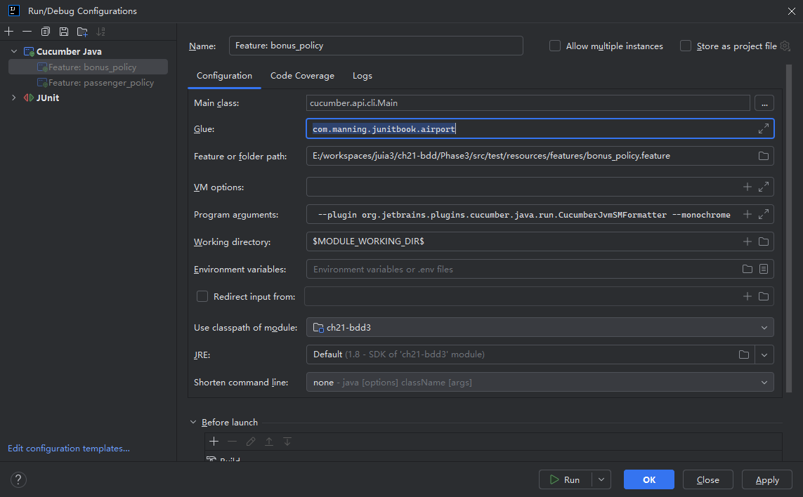

再次运行特征文件，之前的报错就都成功了（左边为新增实现类 `BonusPolicy` 前，右边为新增后）：


如果从 `CucumberTest` 类运行，`IDEA` 的展示效果还会更好些：

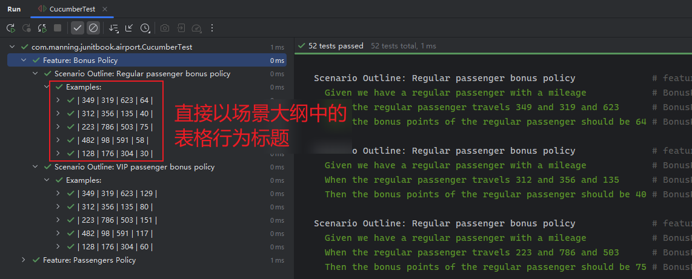

通过和 `TDD` 测试用例的总行数进行比较，还可以发现 `BDD` 的断言行数更精简，无需反复执行一些初始化逻辑。根据作者的统计，总代码量可以节省约 `25%`，还是非常不错的提效指标呢。


## 21.5 用 JBehave 实战 BDD

可能五年前作者写这本书的时候 `JBehave` 还比较流行吧，时至今日 `JBehave` 插件的社区动态几乎停滞了，实测时勉强也能按照书上的流程将上述示例完整跑通，但是开发者体验并不是很好：在最新版的 `IDEA` 中已经无法通过 `story` 文件的右键菜单直接生成对应的步骤实现类了，一直提示 `Nothing here`：

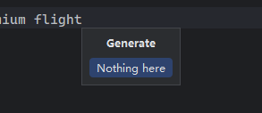

而且最后的控制台输入也不如 `Cucumber` 美观，断言失败后的错误提示也不够清晰，果断放弃了（果然没有对比就没有伤害啊）。


## 21.6 Cucumber 与 JBehave 横向对比

|     对比维度     | Cucumber                                                     | JBehave                                                      |
| :--------------: | :----------------------------------------------------------- | :----------------------------------------------------------- |
|   **核心概念**   | Features（特性）                                             | Stories（用户叙事）                                          |
|  **BDD 关键字**  | 使用 `Given`, `When`, `Then` 等                              | 也用 `Given`, `When`, `Then`，但部分术语有差异               |
|   **场景模板**   | 提供 Scenario Outline 大纲                                   | Scenario 配合 Examples 表格                                  |
| **IDE 支持情况** | 插件支持良好，提供 **更美观的输出**：<br/>- 测试层级一目了然<br/>- 使用醒目的颜色区分状态<br/>- **可直接从特征文件运行测试**，对非技术人员更友好。 | 插件支持欠佳，各步骤的定义是从代码生成的角度实现的，并提供了代码覆盖率相关指标。 |
| **生态及活跃度** | **非常活跃**：<br/>- 代码库更新频繁<br/>- 社区更大，博客和论坛的讨论更新、更频繁，便于故障排查。 | **已进入成熟期**<br/>代码库更新不频繁                        |
|  **多语言支持**  | **支持** 多种编程语言（如 `Ruby`、`JavaScript`、`Python` 等）。 | 主要专注于 `Java` 生态。                                     |
|   **代码效率**   | 与采用 `BDD` 前的代码相比，**两者在减少代码量方面表现相似**，缩减比例相同。 |                                                              |
|   **选择建议**   | 视个人偏好而定。两者都基于同样完善的 `BDD` 原则构建。        |                                                              |


