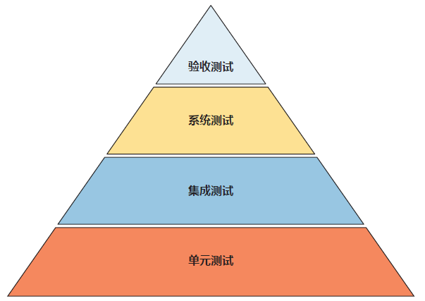
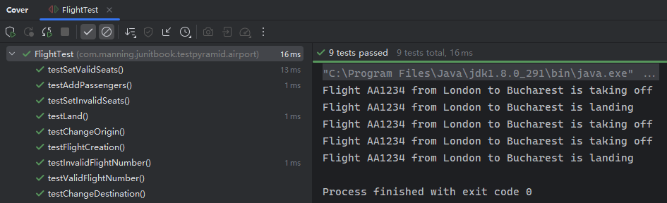
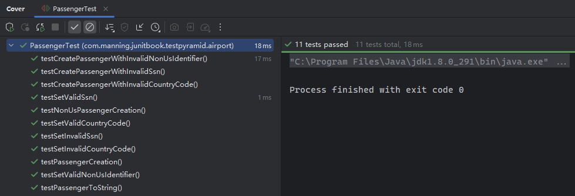
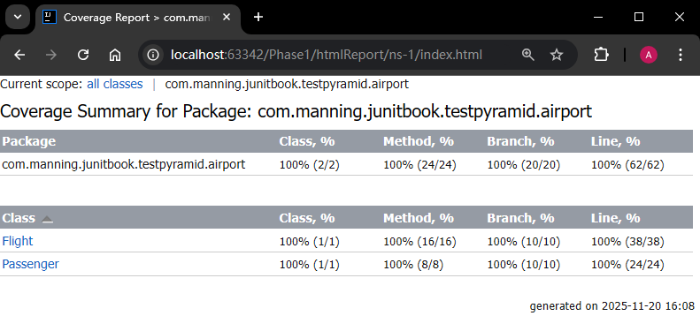

# 第二十二章：用 JUnit 5 实现测试金字塔策略


> **本章概要**
>
> - 为独立组件构建单元测试的方法；
> - 为多个单元构成的模块构建集成测试的方法；
> - 为整个软件构建系统测试的方法；
> - 构建验收测试、确保软件符合业务需求的方法。

作为本书的最后一章，作者通过不同类型测试的有机结合，分别从单元测试、集成测试、系统测试到最后的验收测试，为大家演示了测试金字塔策略与 `JUnit 5` 的落地应用，有助于从宏观层面再次巩固全书介绍的核心内容。


## 22.1 关于测试金字塔策略

软件测试的不同层级可视为一个金字塔结构：



其中——

- 单元测试：以 **方法** 或 **类** 为独立单元，通过有效的 **隔离**，测试各单元的功能是否符合预期；
- 集成测试：将验证通过的独立组件组合为更大的 **模块** 进行模块级联合测试；
- 系统测试：在完整系统上执行测试，评估其与需求的符合度。此阶段无需深入设计或实现细节，而是 **关注整个系统的功能表现**；
- 验收测试：通过 **场景（scenarios）** 和 **测试用例（test cases）** 来验证应用是否满足最终用户的预期。

上述结构和顺序也反映了开发过程从初期到后期的真实演进路径。底层测试更重视实现细节，高层测试更关注功能特性、用户交互及整体运行情况。


## 22.2 关于测试的重点内容

大致分为以下几类：

1. 业务逻辑：考察真实业务的代码实现是否一致；
2. 错误的输入值：例如座位数不能为负数；
3. 边界条件：各种变量的值域极值；
4. 异常操作：不属于常规操作流程的意外情况，如飞机起飞后不可变更始发地；
5. 常量：如乘客对象的唯一标识等；
6. 回归漏洞：排查因升级或打补丁引入的 Bug。


## 22.3 演示项目的搭建

还是以航班管理应用为例，重点讨论航班实体类 `Flight`、乘客实体类 `Passenger` 及其二者交互的测试。

其中，实体类 `Flight` 新增了航班号的正则校验逻辑，以及“起飞”和“着陆”两种状态，以方便后期演示单元测试。具体定义如下：

```java
package com.manning.junitbook.testpyramid.airport;

import java.util.regex.Matcher;
import java.util.regex.Pattern;

public class Flight {

    private final String flightNumber;
    private int seats;
    private int passengers;
    private String origin;
    private String destination;
    private boolean flying;
    private boolean takenOff;
    private boolean landed;

    public Flight(String flightNumber, int seats) {
        Pattern pattern = Pattern.compile("^[A-Z]{2}\\d{3,4}$");
        Matcher matcher = pattern.matcher(flightNumber);
        if (!matcher.matches()) {
            throw new RuntimeException("Invalid flight number");
        }
        this.flightNumber = flightNumber;
        this.seats = seats;
        this.passengers = 0;
        this.flying = false;
        this.takenOff = false;
        this.landed = false;
    }

    public String getFlightNumber() {
        return flightNumber;
    }

    public int getSeats() {
        return seats;
    }

    public void setSeats(int seats) {
        if (passengers > seats) {
            throw new RuntimeException("Cannot reduce the number of seats under the number of existing passengers!");
        }
        this.seats = seats;
    }

    public int getPassengers() {
        return passengers;
    }

    public String getOrigin() {
        return origin;
    }

    public void setOrigin(String origin) {
        if (takenOff) {
            throw new RuntimeException("Flight cannot change its origin any longer!");
        }

        this.origin = origin;
    }

    public String getDestination() {
        return destination;
    }

    public void setDestination(String destination) {
        if (landed) {
            throw new RuntimeException("Flight cannot change its destination any longer!");
        }
        this.destination = destination;
    }

    public boolean isFlying() {
        return flying;
    }

    public boolean isTakenOff() {
        return takenOff;
    }

    public boolean isLanded() {
        return landed;
    }

    @Override
    public String toString() {
        return "Flight " + getFlightNumber() + " from " + getOrigin() + " to " + getDestination();
    }

    public void addPassenger() {
        if (passengers >= seats) {
            throw new RuntimeException("Not enough seats!");
        }
        passengers++;
    }

    public void takeOff() {
        System.out.println(this + " is taking off");
        flying = true;
        takenOff = true;
    }

    public void land() {
        System.out.println(this + " is landing");
        flying = false;
        landed = true;
    }
}
```

而乘客实体类 `Passenger` 新增了标识符和国别代码的校验逻辑，同样也是为了方便演示后续的单元测试逻辑，具体定义如下：

```java
package com.manning.junitbook.testpyramid.airport;

import java.util.Arrays;
import java.util.Locale;
import java.util.regex.Matcher;
import java.util.regex.Pattern;

public class Passenger {

    private String identifier;
    private String name;
    private String countryCode;
    private final Pattern pattern;

    public Passenger(String identifier, String name, String countryCode) {
        String ssnRegex = "^(?!000|666)[0-8][0-9]{2}-(?!00)[0-9]{2}-(?!0000)[0-9]{4}$";
        String nonUsIdentifierRegex = "^(?!000|666)9[0-9]{2}-(?!00)[0-9]{2}-(?!0000)[0-9]{4}$";
        pattern = countryCode.equals("US") ? Pattern.compile(ssnRegex) : Pattern.compile(nonUsIdentifierRegex);
        Matcher matcher = pattern.matcher(identifier);
        if (!matcher.matches()) {
            throw new RuntimeException("Invalid identifier");
        }

        if (!Arrays.asList(Locale.getISOCountries()).contains(countryCode)) {
            throw new RuntimeException("Invalid country code");
        }

        this.identifier = identifier;
        this.name = name;
        this.countryCode = countryCode;
    }

    public String getIdentifier() {
        return identifier;
    }

    public void setIdentifier(String identifier) {
        Matcher matcher = pattern.matcher(identifier);
        if (!matcher.matches()) {
            throw new RuntimeException("Invalid identifier");
        }

        this.identifier = identifier;
    }

    public String getName() {
        return name;
    }

    public void setName(String name) {
        this.name = name;
    }

    public String getCountryCode() {
        return countryCode;
    }

    public void setCountryCode(String countryCode) {
        if (!Arrays.asList(Locale.getISOCountries()).contains(countryCode)) {
            throw new RuntimeException("Invalid country code");
        }

        this.countryCode = countryCode;
    }

    @Override
    public String toString() {
        return "Passenger " + getName() + " with identifier: " + getIdentifier() + " from " + getCountryCode();
    }
}
```

接下来的所有测试内容都是基于上述两个实体类展开的，仿照项目开发的实际流程，从单元测试起，随着新功能的引入而先后设计执行集成测试（引入 `Arquillian` 框架）、系统测试（引入 `Mockito`）、验收测试（引入 `Cucumber`），对全书核心知识点进行一次大串讲。


## 22.4 演示一：单元测试

单元测试是整个测试金字塔的最底层，重点聚焦各方法的实现逻辑是否满足需求。

### 22.4.1 航班实体的单元测试

具体到 `Flight` 实体类，就是要测如下内容：

（1）普通情况下的航班实例化是否成功：

```java
class FlightTest {
    @Test
    void testFlightCreation() {
        Flight flight = new Flight("AA123", 100);
        assertNotNull(flight);
    }
}
```

（2）由于新增了航班号的正则校验（两位大写字母+3位或4位数字），因此还得测一遍不符合正则的两种情况（具体有几种异常情况，要看正则表达式的具体写法）：

```java
@Test
void testInvalidFlightNumber() {
    assertThrows(RuntimeException.class, () -> new Flight("AA12", 100));
    assertThrows(RuntimeException.class, () -> new Flight("AA12345", 100));
}
```

（3）测完异常情况，再回过头来专门测一遍两种正常情况（三位数字和四位数字）：

```java
@Test
void testValidFlightNumber() {
    Flight flight = new Flight("AA345", 100);
    assertNotNull(flight);
    flight = new Flight("AA3456", 100);
    assertNotNull(flight);
}
```

（4）然后测试添加乘客数的校验逻辑是否正常，也分正反向两个分支进行（`L9` 为正向、`L10` 为反向）：

```java
@Test
void testAddPassengers() {
    Flight flight = new Flight("AA1234", 50);
    flight.setOrigin("London");
    flight.setDestination("Bucharest");
    for (int i = 0; i < flight.getSeats(); i++) {
        flight.addPassenger();
    }
    assertEquals(50, flight.getPassengers());
    assertThrows(RuntimeException.class, flight::addPassenger);
}
```

（5）然后是航班座位数 `seat` 的 `setter` 逻辑测试，同样分正反两种情况（可以从测试用例的方法名进行识别，也可以使用 `@Display` 注解定制可读性更好的文字描述内容）：

```java
@Test
void testSetValidSeats() {
    Flight flight = new Flight("AA1234", 50);
    flight.setOrigin("London");
    flight.setDestination("Bucharest");
    for (int i = 0; i < flight.getSeats(); i++) {
        flight.addPassenger();
    }
    assertEquals(50, flight.getPassengers());
    flight.setSeats(52);
    assertEquals(52, flight.getSeats());
}

@Test
void testSetInvalidSeats() {
    Flight flight = new Flight("AA1234", 50);
    flight.setOrigin("London");
    flight.setDestination("Bucharest");
    for (int i = 0; i < flight.getSeats(); i++) {
        flight.addPassenger();
    }
    assertEquals(50, flight.getPassengers());
    assertThrows(RuntimeException.class, () -> flight.setSeats(49));
}
```

（6）接着测试三个状态位：已起飞、飞行中、已着陆。每个状态位也按照正常操作和异常操作两个分支设置断言：

```java
@Test
void testChangeOrigin() {
    Flight flight = new Flight("AA1234", 50);
    flight.setOrigin("London");
    flight.setDestination("Bucharest");
    flight.takeOff();
    assertTrue(flight.isFlying());
    assertTrue(flight.isTakenOff());
    assertFalse(flight.isLanded());
    assertThrows(RuntimeException.class, () -> flight.setOrigin("Manchester"));
}

@Test
void testLand() {
    Flight flight = new Flight("AA1234", 50);
    flight.setOrigin("London");
    flight.setDestination("Bucharest");
    flight.takeOff();
    assertTrue(flight.isTakenOff());
    assertFalse(flight.isLanded());
    flight.land();
    assertTrue(flight.isTakenOff());
    assertTrue(flight.isLanded());
    assertFalse(flight.isFlying());
}

@Test
void testChangeDestination() {
    Flight flight = new Flight("AA1234", 50);
    flight.setOrigin("London");
    flight.setDestination("Bucharest");
    flight.takeOff();
    flight.land();
    assertThrows(RuntimeException.class, () -> flight.setDestination("Sibiu"));
}
```

最终实测结果（也可以结合测试覆盖率查漏补缺）：




### 22.4.2 乘客实体的单元测试

对照乘客实体类的定义，也可以分情况设置单元测试如下：

```java
package com.manning.junitbook.testpyramid.airport;

import org.junit.jupiter.api.Test;

import static org.junit.jupiter.api.Assertions.*;

class PassengerTest {

    @Test
    void testPassengerCreation() {
        Passenger passenger = new Passenger("123-45-6789", "John Smith", "US");
        assertNotNull(passenger);
    }

    @Test
    void testNonUsPassengerCreation() {
        Passenger passenger = new Passenger("900-45-6789", "John Smith", "GB");
        assertNotNull(passenger);
    }

    @Test
    void testCreatePassengerWithInvalidSsn() {
        assertThrows(RuntimeException.class, () ->
                new Passenger("123-456-789", "John Smith", "US"));
        assertThrows(RuntimeException.class, () ->
                new Passenger("900-45-6789", "John Smith", "US"));
    }

    @Test
    void testCreatePassengerWithInvalidNonUsIdentifier() {
        assertThrows(RuntimeException.class, () ->
                new Passenger("900-456-789", "John Smith", "GB"));
        assertThrows(RuntimeException.class, () ->
                new Passenger("123-45-6789", "John Smith", "GB"));
    }

    @Test
    void testCreatePassengerWithInvalidCountryCode() {
        assertThrows(RuntimeException.class, () ->
                new Passenger("900-45-6789", "John Smith", "GJ"));
    }

    @Test
    void testSetInvalidSsn() {
        assertThrows(RuntimeException.class, () -> {
            Passenger passenger = new Passenger("123-45-6789", "John Smith", "US");
            passenger.setIdentifier("123-456-789");
        });

    }

    @Test
    void testSetValidSsn() {
        Passenger passenger = new Passenger("123-45-6789", "John Smith", "US");
        passenger.setIdentifier("123-98-7654");
        assertEquals("123-98-7654", passenger.getIdentifier());
    }

    @Test
    void testSetValidNonUsIdentifier() {
        Passenger passenger = new Passenger("900-45-6789", "John Smith", "GB");
        passenger.setIdentifier("900-98-7654");
        assertEquals("900-98-7654", passenger.getIdentifier());
    }

    @Test
    void testSetInvalidCountryCode() {
        assertThrows(RuntimeException.class, () -> {
            Passenger passenger = new Passenger("123-45-6789", "John Smith", "US");
            passenger.setCountryCode("GJ");
        });
    }

    @Test
    void testSetValidCountryCode() {
        Passenger passenger = new Passenger("123-45-6789", "John Smith", "US");
        passenger.setCountryCode("GB");
        assertEquals("GB", passenger.getCountryCode());
    }

    @Test
    void testPassengerToString() {
        Passenger passenger = new Passenger("123-45-6789", "John Smith", "US");
        passenger.setName("John Brown");
        assertEquals("Passenger John Brown with identifier: 123-45-6789 from US", passenger.toString());
    }
}
```

实测结果：



实测覆盖率情况（100% 覆盖）：



> [!note]
>
> **备忘录**
>
> 本章随书源码分了 6 个文件夹演示不同阶段的测试情况（`Phase1`、`Phase2` … `Phase6`），实测时最好分别导入 `IDEA`，否则最后生成的覆盖率报表页会因为每个文件夹都使用了同一个包路（`com.manning.junitbook.testpyramid.airport`）而混入其他无关的类（如 `Phase3` 才引入的 `DistancesManager` 很可能混入 `Phase1` 和 `Phase2` 中，直接原因是 `IDEA` 的启动配置默认是按包路执行测试的）。


## 22.5 演示二：集成测试


## 22.6 演示三：系统测试


## 22.7 演示四：验收测试


