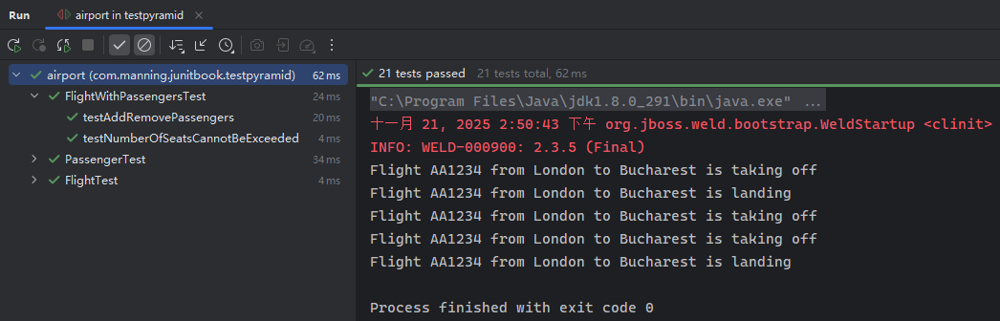
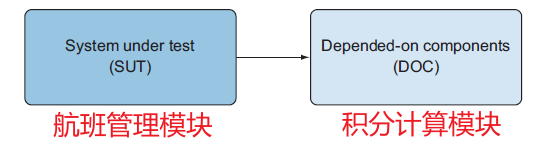
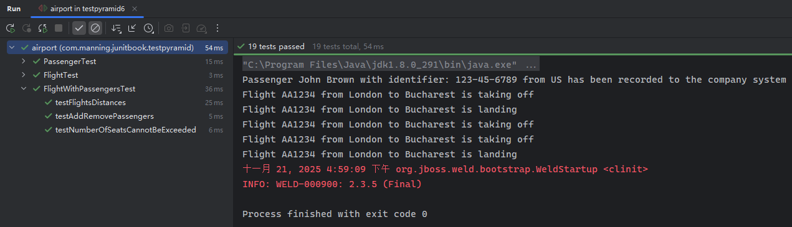
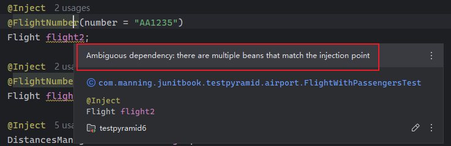
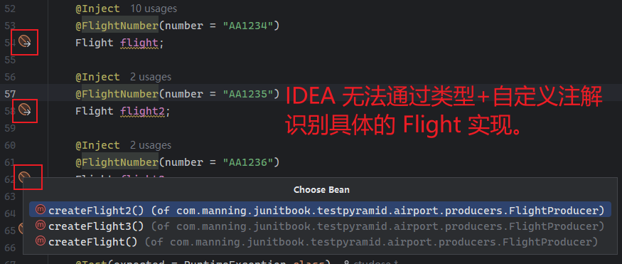
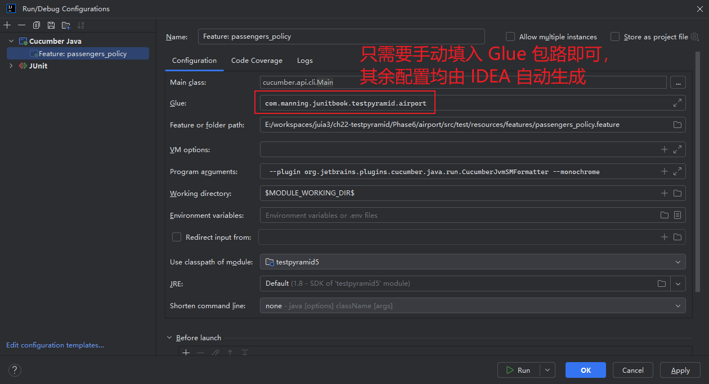
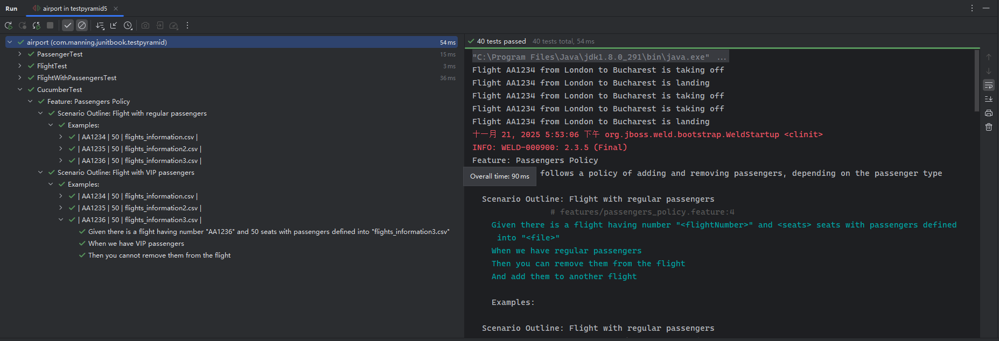

# 第二十二章：用 JUnit 5 实现测试金字塔策略


> **本章概要**
>
> - 为独立组件构建单元测试的方法；
> - 为多个单元构成的模块构建集成测试的方法；
> - 为整个软件构建系统测试的方法；
> - 构建验收测试、确保软件符合业务需求的方法。

作为本书的最后一章，作者通过不同类型测试的有机结合，分别从单元测试、集成测试、系统测试到最后的验收测试，为大家演示了测试金字塔策略与 `JUnit 5` 的落地应用，有助于从宏观层面再次巩固全书介绍的核心内容。


## 22.1 关于测试金字塔策略

软件测试的不同层级可视为一个金字塔结构：


其中——

- 单元测试：以 **方法** 或 **类** 为独立单元，通过有效的 **隔离**，测试各单元的功能是否符合预期；
- 集成测试：将验证通过的独立组件组合为更大的 **模块** 进行模块级联合测试；
- 系统测试：在完整系统上执行测试，评估其与需求的符合度。此阶段无需深入设计或实现细节，而是 **关注整个系统的功能表现**；
- 验收测试：通过 **场景（scenarios）** 和 **测试用例（test cases）** 来验证应用是否满足最终用户的预期。

上述结构和顺序也反映了开发过程从初期到后期的真实演进路径。底层测试更重视实现细节，高层测试更关注功能特性、用户交互及整体运行情况。


## 22.2 关于测试的重点内容

大致分为以下几类：

1. 业务逻辑：考察真实业务的代码实现是否一致；
2. 错误的输入值：例如座位数不能为负数；
3. 边界条件：各种变量的值域极值；
4. 异常操作：不属于常规操作流程的意外情况，如飞机起飞后不可变更始发地；
5. 常量：如乘客对象的唯一标识等；
6. 回归漏洞：排查因升级或打补丁引入的 Bug。


## 22.3 演示项目的搭建

还是以航班管理应用为例，重点讨论航班实体类 `Flight`、乘客实体类 `Passenger` 及其二者交互的测试。

其中，实体类 `Flight` 新增了航班号的正则校验逻辑，以及“起飞”和“着陆”两种状态，以方便后期演示单元测试。具体定义如下：

```java
package com.manning.junitbook.testpyramid.airport;

import java.util.regex.Matcher;
import java.util.regex.Pattern;

public class Flight {

    private final String flightNumber;
    private int seats;
    private int passengers;
    private String origin;
    private String destination;
    private boolean flying;
    private boolean takenOff;
    private boolean landed;

    public Flight(String flightNumber, int seats) {
        Pattern pattern = Pattern.compile("^[A-Z]{2}\\d{3,4}$");
        Matcher matcher = pattern.matcher(flightNumber);
        if (!matcher.matches()) {
            throw new RuntimeException("Invalid flight number");
        }
        this.flightNumber = flightNumber;
        this.seats = seats;
        this.passengers = 0;
        this.flying = false;
        this.takenOff = false;
        this.landed = false;
    }

    public String getFlightNumber() {
        return flightNumber;
    }

    public int getSeats() {
        return seats;
    }

    public void setSeats(int seats) {
        if (passengers > seats) {
            throw new RuntimeException("Cannot reduce the number of seats under the number of existing passengers!");
        }
        this.seats = seats;
    }

    public int getPassengers() {
        return passengers;
    }

    public String getOrigin() {
        return origin;
    }

    public void setOrigin(String origin) {
        if (takenOff) {
            throw new RuntimeException("Flight cannot change its origin any longer!");
        }

        this.origin = origin;
    }

    public String getDestination() {
        return destination;
    }

    public void setDestination(String destination) {
        if (landed) {
            throw new RuntimeException("Flight cannot change its destination any longer!");
        }
        this.destination = destination;
    }

    public boolean isFlying() {
        return flying;
    }

    public boolean isTakenOff() {
        return takenOff;
    }

    public boolean isLanded() {
        return landed;
    }

    @Override
    public String toString() {
        return "Flight " + getFlightNumber() + " from " + getOrigin() + " to " + getDestination();
    }

    public void addPassenger() {
        if (passengers >= seats) {
            throw new RuntimeException("Not enough seats!");
        }
        passengers++;
    }

    public void takeOff() {
        System.out.println(this + " is taking off");
        flying = true;
        takenOff = true;
    }

    public void land() {
        System.out.println(this + " is landing");
        flying = false;
        landed = true;
    }
}
```

而乘客实体类 `Passenger` 新增了标识符和国别代码的校验逻辑，同样也是为了方便演示后续的单元测试逻辑，具体定义如下：

```java
package com.manning.junitbook.testpyramid.airport;

import java.util.Arrays;
import java.util.Locale;
import java.util.regex.Matcher;
import java.util.regex.Pattern;

public class Passenger {

    private String identifier;
    private String name;
    private String countryCode;
    private final Pattern pattern;

    public Passenger(String identifier, String name, String countryCode) {
        String ssnRegex = "^(?!000|666)[0-8][0-9]{2}-(?!00)[0-9]{2}-(?!0000)[0-9]{4}$";
        String nonUsIdentifierRegex = "^(?!000|666)9[0-9]{2}-(?!00)[0-9]{2}-(?!0000)[0-9]{4}$";
        pattern = countryCode.equals("US") ? Pattern.compile(ssnRegex) : Pattern.compile(nonUsIdentifierRegex);
        Matcher matcher = pattern.matcher(identifier);
        if (!matcher.matches()) {
            throw new RuntimeException("Invalid identifier");
        }

        if (!Arrays.asList(Locale.getISOCountries()).contains(countryCode)) {
            throw new RuntimeException("Invalid country code");
        }

        this.identifier = identifier;
        this.name = name;
        this.countryCode = countryCode;
    }

    public String getIdentifier() {
        return identifier;
    }

    public void setIdentifier(String identifier) {
        Matcher matcher = pattern.matcher(identifier);
        if (!matcher.matches()) {
            throw new RuntimeException("Invalid identifier");
        }

        this.identifier = identifier;
    }

    public String getName() {
        return name;
    }

    public void setName(String name) {
        this.name = name;
    }

    public String getCountryCode() {
        return countryCode;
    }

    public void setCountryCode(String countryCode) {
        if (!Arrays.asList(Locale.getISOCountries()).contains(countryCode)) {
            throw new RuntimeException("Invalid country code");
        }

        this.countryCode = countryCode;
    }

    @Override
    public String toString() {
        return "Passenger " + getName() + " with identifier: " + getIdentifier() + " from " + getCountryCode();
    }
}
```

接下来的所有测试内容都是基于上述两个实体类展开的，仿照项目开发的实际流程，从单元测试起，随着新功能的引入而先后设计执行集成测试（引入 `Arquillian` 框架）、系统测试（引入 `Mockito`）、验收测试（引入 `Cucumber`），对全书核心知识点进行一次大串讲。


## 22.4 演示一：单元测试

单元测试是整个测试金字塔的最底层，重点聚焦各方法的实现逻辑是否满足需求。

### 22.4.1 航班实体的单元测试

具体到 `Flight` 实体类，就是要测如下内容：

（1）普通情况下的航班实例化是否成功：

```java
class FlightTest {
    @Test
    void testFlightCreation() {
        Flight flight = new Flight("AA123", 100);
        assertNotNull(flight);
    }
}
```

（2）由于新增了航班号的正则校验（两位大写字母+3位或4位数字），因此还得测一遍不符合正则的两种情况（具体有几种异常情况，要看正则表达式的具体写法）：

```java
@Test
void testInvalidFlightNumber() {
    assertThrows(RuntimeException.class, () -> new Flight("AA12", 100));
    assertThrows(RuntimeException.class, () -> new Flight("AA12345", 100));
}
```

（3）测完异常情况，再回过头来专门测一遍两种正常情况（三位数字和四位数字）：

```java
@Test
void testValidFlightNumber() {
    Flight flight = new Flight("AA345", 100);
    assertNotNull(flight);
    flight = new Flight("AA3456", 100);
    assertNotNull(flight);
}
```

（4）然后测试添加乘客数的校验逻辑是否正常，也分正反向两个分支进行（`L9` 为正向、`L10` 为反向）：

```java
@Test
void testAddPassengers() {
    Flight flight = new Flight("AA1234", 50);
    flight.setOrigin("London");
    flight.setDestination("Bucharest");
    for (int i = 0; i < flight.getSeats(); i++) {
        flight.addPassenger();
    }
    assertEquals(50, flight.getPassengers());
    assertThrows(RuntimeException.class, flight::addPassenger);
}
```

（5）然后是航班座位数 `seat` 的 `setter` 逻辑测试，同样分正反两种情况（可以从测试用例的方法名进行识别，也可以使用 `@Display` 注解定制可读性更好的文字描述内容）：

```java
@Test
void testSetValidSeats() {
    Flight flight = new Flight("AA1234", 50);
    flight.setOrigin("London");
    flight.setDestination("Bucharest");
    for (int i = 0; i < flight.getSeats(); i++) {
        flight.addPassenger();
    }
    assertEquals(50, flight.getPassengers());
    flight.setSeats(52);
    assertEquals(52, flight.getSeats());
}

@Test
void testSetInvalidSeats() {
    Flight flight = new Flight("AA1234", 50);
    flight.setOrigin("London");
    flight.setDestination("Bucharest");
    for (int i = 0; i < flight.getSeats(); i++) {
        flight.addPassenger();
    }
    assertEquals(50, flight.getPassengers());
    assertThrows(RuntimeException.class, () -> flight.setSeats(49));
}
```

（6）接着测试三个状态位：已起飞、飞行中、已着陆。每个状态位也按照正常操作和异常操作两个分支设置断言：

```java
@Test
void testChangeOrigin() {
    Flight flight = new Flight("AA1234", 50);
    flight.setOrigin("London");
    flight.setDestination("Bucharest");
    flight.takeOff();
    assertTrue(flight.isFlying());
    assertTrue(flight.isTakenOff());
    assertFalse(flight.isLanded());
    assertThrows(RuntimeException.class, () -> flight.setOrigin("Manchester"));
}

@Test
void testLand() {
    Flight flight = new Flight("AA1234", 50);
    flight.setOrigin("London");
    flight.setDestination("Bucharest");
    flight.takeOff();
    assertTrue(flight.isTakenOff());
    assertFalse(flight.isLanded());
    flight.land();
    assertTrue(flight.isTakenOff());
    assertTrue(flight.isLanded());
    assertFalse(flight.isFlying());
}

@Test
void testChangeDestination() {
    Flight flight = new Flight("AA1234", 50);
    flight.setOrigin("London");
    flight.setDestination("Bucharest");
    flight.takeOff();
    flight.land();
    assertThrows(RuntimeException.class, () -> flight.setDestination("Sibiu"));
}
```

最终实测结果（也可以结合测试覆盖率查漏补缺）：


### 22.4.2 乘客实体的单元测试

对照乘客实体类的定义，也可以分情况设置单元测试如下：

```java
package com.manning.junitbook.testpyramid.airport;

import org.junit.jupiter.api.Test;

import static org.junit.jupiter.api.Assertions.*;

class PassengerTest {

    @Test
    void testPassengerCreation() {
        Passenger passenger = new Passenger("123-45-6789", "John Smith", "US");
        assertNotNull(passenger);
    }

    @Test
    void testNonUsPassengerCreation() {
        Passenger passenger = new Passenger("900-45-6789", "John Smith", "GB");
        assertNotNull(passenger);
    }

    @Test
    void testCreatePassengerWithInvalidSsn() {
        assertThrows(RuntimeException.class, () ->
                new Passenger("123-456-789", "John Smith", "US"));
        assertThrows(RuntimeException.class, () ->
                new Passenger("900-45-6789", "John Smith", "US"));
    }

    @Test
    void testCreatePassengerWithInvalidNonUsIdentifier() {
        assertThrows(RuntimeException.class, () ->
                new Passenger("900-456-789", "John Smith", "GB"));
        assertThrows(RuntimeException.class, () ->
                new Passenger("123-45-6789", "John Smith", "GB"));
    }

    @Test
    void testCreatePassengerWithInvalidCountryCode() {
        assertThrows(RuntimeException.class, () ->
                new Passenger("900-45-6789", "John Smith", "GJ"));
    }

    @Test
    void testSetInvalidSsn() {
        assertThrows(RuntimeException.class, () -> {
            Passenger passenger = new Passenger("123-45-6789", "John Smith", "US");
            passenger.setIdentifier("123-456-789");
        });

    }

    @Test
    void testSetValidSsn() {
        Passenger passenger = new Passenger("123-45-6789", "John Smith", "US");
        passenger.setIdentifier("123-98-7654");
        assertEquals("123-98-7654", passenger.getIdentifier());
    }

    @Test
    void testSetValidNonUsIdentifier() {
        Passenger passenger = new Passenger("900-45-6789", "John Smith", "GB");
        passenger.setIdentifier("900-98-7654");
        assertEquals("900-98-7654", passenger.getIdentifier());
    }

    @Test
    void testSetInvalidCountryCode() {
        assertThrows(RuntimeException.class, () -> {
            Passenger passenger = new Passenger("123-45-6789", "John Smith", "US");
            passenger.setCountryCode("GJ");
        });
    }

    @Test
    void testSetValidCountryCode() {
        Passenger passenger = new Passenger("123-45-6789", "John Smith", "US");
        passenger.setCountryCode("GB");
        assertEquals("GB", passenger.getCountryCode());
    }

    @Test
    void testPassengerToString() {
        Passenger passenger = new Passenger("123-45-6789", "John Smith", "US");
        passenger.setName("John Brown");
        assertEquals("Passenger John Brown with identifier: 123-45-6789 from US", passenger.toString());
    }
}
```

实测结果：


实测覆盖率情况（100% 覆盖）：


> [!note]
>
> **备忘录**
>
> 本章随书源码分了 6 个文件夹演示不同阶段的测试情况（`Phase1`、`Phase2` … `Phase6`），实测时最好分别导入 `IDEA`，否则最后生成的覆盖率报表页会因为每个文件夹都使用了同一个包路（`com.manning.junitbook.testpyramid.airport`）而混入其他无关的类（如 `Phase3` 才引入的 `DistancesManager` 很可能混入 `Phase1` 和 `Phase2` 中，直接原因是 `IDEA` 的启动配置默认是按包路执行测试的）。


## 22.5 演示二：集成测试

本阶段重点测试 `Flight` 和 `Passenger` 的交互，为此引入了新需求：航班类应该能够通过 **添加** 或 **删除** 乘客来维护一组预定了该航班的乘客：

```java
public class Flight {
    Set<Passenger> passengers = new HashSet< >();
    // -- snip --
    public boolean addPassenger(Passenger passenger) {
        if(passengers.size() >= seats) {
            throw new RuntimeException(
                    "Cannot add more passengers than the capacity of the flight!");
        }
        return passengers.add(passenger);
    }
    public boolean removePassenger(Passenger passenger) {
        return passengers.remove(passenger);
    }
    public int getPassengersNumber() {
        return passengers.size();
    }
    // -- snip --
}
```

这里书中略过了一个细节，就是为什么要使用 `Arquillian` 框架。在随书源码中，同样的测试用例也出现在了普通的 `FlightTest` 测试类中：

```java
// FlightTest.java
@Test
public void testAddRemovePassengers() throws IOException {
    Flight flight = FlightBuilderUtil.buildFlightFromCsv();
    flight.setSeats(51);
    Passenger additionalPassenger = new Passenger("124-56-7890", "Michael Johnson", "US");
    flight.addPassenger(additionalPassenger);
    assertEquals(51, flight.getPassengersNumber());
    flight.removePassenger(additionalPassenger);
    assertEquals(50, flight.getPassengersNumber());
    assertEquals(51, flight.getSeats());
}

// FlightWithPassengersTest
@Test
public void testAddRemovePassengers() {
    flight.setSeats(51);
    Passenger additionalPassenger = new Passenger("124-56-7890", "Michael Johnson", "US");
    flight.addPassenger(additionalPassenger);
    assertEquals(51, flight.getPassengersNumber());
    flight.removePassenger(additionalPassenger);
    assertEquals(50, flight.getPassengersNumber());
    assertEquals(51, flight.getSeats());
}
```

从代码上看，二者除了 `flight` 的初始化不一样外，其余逻辑完全相同；但是结合各自的上下文就大不一样了：前者直接调用相关接口，没有借助依赖注入机制，测试逻辑及相关资源和其他数据都在同一个 `CLASSPATH` 下；后者是在 `EJB` 容器内执行的，旨在利用依赖注入机制和抽象出的容器，让测试逻辑、相关资源文件和外界 **完全独立开**。

再来回顾一下 `Arquillian` 测试用例的三个必要条件：

1. 在测试类上加注 `@RunWith(Arquillian.class)`；
2. 一个使用 `@Deployment` 的 `static` 方法，返回一个 `ShrinkWrap` 归档文件；
3. 至少存在一个使用 `@Test` 注解的测试方法。

完整代码如下：

```java
package com.manning.junitbook.testpyramid.airport;

import com.manning.junitbook.testpyramid.airport.producers.FlightProducer;
import org.jboss.arquillian.container.test.api.Deployment;
import org.jboss.arquillian.junit.Arquillian;

import org.jboss.shrinkwrap.api.ShrinkWrap;
import org.jboss.shrinkwrap.api.asset.EmptyAsset;
import org.jboss.shrinkwrap.api.spec.JavaArchive;
import org.junit.Test;
import org.junit.runner.RunWith;

import javax.inject.Inject;

import static org.junit.Assert.assertEquals;

@RunWith(Arquillian.class)
public class FlightWithPassengersTest {

    @Deployment
    public static JavaArchive createDeployment() {
        return ShrinkWrap.create(JavaArchive.class)
                .addClasses(Passenger.class, Flight.class, FlightProducer.class)
                .addAsManifestResource(EmptyAsset.INSTANCE, "beans.xml");
    }

    @Inject
    private Flight flight;

    @Test(expected = RuntimeException.class)
    public void testNumberOfSeatsCannotBeExceeded() {
        assertEquals(50, flight.getPassengersNumber());
        flight.addPassenger(new Passenger("124-56-7890", "Michael Johnson", "US"));
    }

    @Test
    public void testAddRemovePassengers() {
        flight.setSeats(51);
        Passenger additionalPassenger = new Passenger("124-56-7890", "Michael Johnson", "US");
        flight.addPassenger(additionalPassenger);
        assertEquals(51, flight.getPassengersNumber());
        flight.removePassenger(additionalPassenger);
        assertEquals(50, flight.getPassengersNumber());
        assertEquals(51, flight.getSeats());
    }
}
```

实测结果（单元测试 + 集成测试）：



至此，测试金字塔的集成层也构建成功了。下一步是系统测试层的构建。

> [!tip]
> 
> **注意**
>
> 本节与第九章内容高度重复，正文部分甚至原封不动地照搬过来，着实让人有点失望。不过可以自行查阅 `Arquillian` 官网（[https://arquillian.org/](https://arquillian.org/)），了解更多配置细节。
>
> 另外，在修改 `Flight` 实体类的定义后，应该首先根据新增的部分同步更新之前的单元测试，确保单测全部通过后，再引入容器内测试逻辑。可惜这一步被原书直接跳过了，这里有必要强调一下流程。


## 22.6 演示三：系统测试

系统测试是从功能特性出发考察整个软件的，如果刚才的 `Flight` 和 `Passenger` 视为一个整体，它们就是航班管理应用的一个功能模块，可以实现在航班对象中增删乘客。为了模拟系统测试，这里再次引入新需求：根据乘客搭乘航班的总里程计算用户积分，即引入一个全新的积分计算模块，进而在系统测试层面考察该模块与航班管理模块的交互情况。具体示意图如下：



掌握本节内容可以进一步加深对 `JavaEE` 依赖注入机制的理解。

计算积分需要先知道总里程，而里程数又与航班挂钩，因此需要进一步改造 `Flight` 类，新增一个里程属性 `distance`，并添加 `getter` 和 `setter` 方法：

```java
public class Flight {
    // -- snip --
    private int distance;
    public int getDistance() {
        return distance;
    }
    public void setDistance(int distance) {
        this.distance = distance;
    }
    // -- snip --
}
```

为了简化流程，所有乘客的总里程和积分数都由一个代理类 `DistancesManager` 中的 `HashMap` 进行存放。换句话说，`DistancesManager` 就是新增的功能模块（即示意图中的 `DOC`）。当需要获取某个乘客的积分时，只要调用 `DistancesManager` 提供的接口就行了。初始设计如下：

```java
public class DistancesManager {
    private static final int DISTANCE_FACTOR = 10;

    private final Map<Passenger, Integer> passengersDistancesMap = new HashMap<>();
    private final Map<Passenger, Integer> passengersPointsMap = new HashMap<>();

    public Map<Passenger, Integer> getPassengersDistancesMap() {
        return Collections.unmodifiableMap(passengersDistancesMap);
    }

    public Map<Passenger, Integer> getPassengersPointsMap() {
        return Collections.unmodifiableMap(passengersPointsMap);
    }

    public void addDistance(Passenger passenger, int distance) {
        if (passengersDistancesMap.containsKey(passenger)) {
            passengersDistancesMap.put(passenger, passengersDistancesMap.get(passenger) + distance);
        } else {
            passengersDistancesMap.put(passenger, distance);
        }
    }

    public void calculateGivenPoints() {
        for (Passenger passenger : getPassengersDistancesMap().keySet()) {
            passengersPointsMap.put(passenger, getPassengersDistancesMap().get(passenger)/ DISTANCE_FACTOR);
        }
    }
}
```

具体使用时，本节模拟了三种情况，并演示了不同的测试方法：

- `DistancesManager` 所有接口完全没实现：使用 `mock` 对象模拟技术；
- 接口仅部分实现：使用 `@Spy` 注解；
- 所有接口全部实现：使用 `JavaEE` 的 `CDI` 机制。

测试逻辑如下：初始化三个不同的航班对象，每个航班有不同的乘客集合；调用 `addDistance()` 接口分别汇总每个乘客的总里程，然后再调用 `calculateGivenPoints()` 接口批量计算用户积分，最后断言积分值是否符合预期。

当利用 `CDI` 机制往测试类注入多个同一类型的实例对象时，就会遇到 **依赖注入的歧义性问题**：都符合注入条件，究竟根据什么区分彼此、消除歧义呢？最佳实践是通过创建带 `@Qualifier` 标记的自定义注解：

```java
import javax.inject.Qualifier;
import java.lang.annotation.Retention;
import java.lang.annotation.Target;

import static java.lang.annotation.ElementType.FIELD;
import static java.lang.annotation.ElementType.METHOD;
import static java.lang.annotation.RetentionPolicy.RUNTIME;

@Qualifier
@Retention(RUNTIME)
@Target({FIELD, METHOD})
public @interface FlightNumber {
    String number();
}
```

上述注解的定义最巧妙的地方，就在于充分利用了 `CDI` 判定唯一性时遵循的规则：除了考察注解本身外，也会同步考察其内部成员是否一致。这样一来，通过给 `number` 属性赋不同的编号值，分别添加到 `Flight` 的某个实现、以及对应的某个注入点上，就能有效消除歧义，注入指定的 `Flight` 实例对象。

具体用法如下：先在不同的 `Flight` 实现上添加唯一标识 `@FlightNumber(number = "XXX")`：

```java
public class FlightProducer {

    @Produces
    @FlightNumber(number = "AA1234")
    public Flight createFlight() throws IOException {
        return FlightBuilderUtil.buildFlightFromCsv(
                "AA1234", 50, "src/test/resources/flights_information.csv");
    }

    @Produces
    @FlightNumber(number = "AA1235")
    public Flight createFlight2() throws IOException {
        return FlightBuilderUtil.buildFlightFromCsv(
                "AA1235", 36, "src/test/resources/flights_information2.csv");
    }

    @Produces
    @FlightNumber(number = "AA1236")
    public Flight createFlight3() throws IOException {
        return FlightBuilderUtil.buildFlightFromCsv(
                "AA1236", 24, "src/test/resources/flights_information3.csv");
    }
}
```

然后在测试类的注入点也添加对应的唯一标识，达到手动消除歧义的目的：

```java
@RunWith(Arquillian.class)
public class FlightWithPassengersTest {
    // -- snip --
    @Inject
    @FlightNumber(number = "AA1234")
    Flight flight;

    @Inject
    @FlightNumber(number = "AA1235")
    Flight flight2;

    @Inject
    @FlightNumber(number = "AA1236")
    Flight flight3;
    // -- snip --
}
```

消除了 `Flight` 多实例的歧义后，剩下的测试逻辑就很简单了。执行容器内测试同样需要 `Arquillian` 框架打包到归档文件中，然后再执行测试用例：

```java
@Deployment
public static JavaArchive createDeployment() {
    return ShrinkWrap.create(JavaArchive.class)
            .addAsManifestResource(EmptyAsset.INSTANCE, "beans.xml")
            .addClasses(
                    Passenger.class,
                    Flight.class,
                    FlightProducer.class,
                    DistancesManager.class
            );
}

@Test
public void testFlightsDistances() {

    for (Passenger passenger : flight.getPassengers()) {
        distancesManager.addDistance(passenger, flight.getDistance());
    }

    for (Passenger passenger : flight2.getPassengers()) {
        distancesManager.addDistance(passenger, flight2.getDistance());
    }

    for (Passenger passenger : flight3.getPassengers()) {
        distancesManager.addDistance(passenger, flight3.getDistance());
    }

    distancesManager.calculateGivenPoints();

    final Map<Passenger, Integer> pointsMap = distancesManager.getPassengersPointsMap();
    assertEquals(210, pointsMap.get(new Passenger("900-45-6809", "Susan Todd", "GB")).longValue());
    assertEquals(420, pointsMap.get(new Passenger("900-45-6797", "Harry Christensen", "GB")).longValue());
    assertEquals(630, pointsMap.get(new Passenger("123-45-6799", "Bethany King", "US")).longValue());
}
```

为了在乘客对象和 `HashMap` 中的乘客键匹配成功，还需要重写 `Passenger` 实体类的 `equals()` 方法和 `hashCode()` 方法，只要

最终实测结果如下：



> [!note]
>
> **实战备忘录**
>
> 由于是手动消除的歧义，`IDEA` 暂时无法根据自定义的注解实现多实例的自动精确匹配，编译器依然会提示：
>
> 
>
> 通过侧边栏的 `CDI` 图标也无法定位到具体实现：
>
> 
>
> 但是从实测结果来看是没有任何问题的，比 `DeepSeek` 提示的创建多个不同的自定义标签的解决方案更加轻量、灵活，强烈推荐使用。

此外，作者并没有对 `@Spy` 和 `@Mock` 在用法上的不同作进一步说明，给人感觉很突兀；且写法上还是 `JUnit 4` 基于 `Rule` 规则的写法，这里就不再单独梳理了。感兴趣的朋友可以对照原书作进一步了解。


## 22.7 演示四：验收测试

本节是测试金字塔的最后一环，需要借助 `Cucumber` 的 `BDD` 测试。验收测试是站在最终用户的角度考察应用的功能特性。此时引入的新需求是：当面临运力限制时，普通乘客可被移出当前航班、并安排至其他航班；而 `VIP` 乘客则不必移除。

为此，需要使用 `BDD` 的 `Given-When-Then` 句型设计一个针对乘客改签规则的特征文件 `passenger_policy.feature`：

```gherkin
Feature: Passengers Policy
  The company follows a policy of adding and removing passengers, depending on the passenger type

  Scenario Outline: Flight with regular passengers
    Given there is a flight having number "<flightNumber>" and <seats> seats with passengers defined into "<file>"
    When we have regular passengers
    Then you can remove them from the flight
    And add them to another flight

    Examples:
      |flightNumber  | seats  | file                       |
      |  AA1234      | 50     | flights_information.csv    |
      |  AA1235      | 50     | flights_information2.csv   |
      |  AA1236      | 50     | flights_information3.csv   |

  Scenario Outline: Flight with VIP passengers
    Given there is a flight having number "<flightNumber>" and <seats> seats with passengers defined into "<file>"
    When we have VIP passengers
    Then you cannot remove them from the flight

    Examples:
      |flightNumber  | seats  | file                       |
      |  AA1234      | 50     | flights_information.csv    |
      |  AA1235      | 50     | flights_information2.csv   |
      |  AA1236      | 50     | flights_information3.csv   |
```

这里又用到了示例大纲的相关语法，先在 `step` 中创建具名占位符，然后在 `Example` 示例数据中批量定义每个占位符的具体取值。

然后执行该特征文件，将控制台输出的默认 `step` 实现复制到一个新创建的、真实的步骤定义类中（即演示用的 `PassengersPolicy` 类）；再根据各步骤要求改为具体的测试逻辑，最后得到如下定义：

```java
public class PassengersPolicy {
    private Flight flight;
    private final List<Passenger> regularPassengers = new ArrayList<>();
    private final List<Passenger> vipPassengers = new ArrayList<>();
    private final Flight anotherFlight = new Flight("AA7890", 48);

    @Given("^there is a flight having number \"([^\"]*)\" and (\\d+) seats with passengers defined into \"([^\"]*)\"$")
    public void there_is_a_flight_having_number_and_seats_with_passengers_defined_into(String flightNumber, int seats, String fileName) throws Throwable {
        flight = FlightBuilderUtil.buildFlightFromCsv(flightNumber, seats, "src/test/resources/" + fileName);
    }

    @When("^we have regular passengers$")
    public void we_have_regular_passengers() {
        for (Passenger passenger : flight.getPassengers()) {
            if (!passenger.isVip()) {
                regularPassengers.add(passenger);
            }
        }
    }

    @Then("^you can remove them from the flight$")
    public void you_can_remove_them_from_the_flight() {
        for (Passenger passenger : regularPassengers) {
            assertTrue(flight.removePassenger(passenger));
        }
    }

    @Then("^add them to another flight$")
    public void add_them_to_another_flight() {
        for (Passenger passenger : regularPassengers) {
            assertTrue(anotherFlight.addPassenger(passenger));
        }
    }

    @When("^we have VIP passengers$")
    public void we_have_VIP_passengers() {
        for (Passenger passenger : flight.getPassengers()) {
            if (passenger.isVip()) {
                vipPassengers.add(passenger);
            }
        }
    }

    @Then("^you cannot remove them from the flight$")
    public void you_cannot_remove_them_from_the_flight() {
        for (Passenger passenger : vipPassengers) {
            assertFalse(flight.removePassenger(passenger));
        }
    }
}
```

接着创建 `Cucumber` 专用测试类，以便直接从测试类启动 `BDD` 测试，而不是单独运行特征文件：

```java
package com.manning.junitbook.testpyramid.airport;

import cucumber.api.CucumberOptions;
import cucumber.api.junit.Cucumber;
import org.junit.runner.RunWith;

/**
 * Entry point for running the Cucumber tests in JUnit.
 */
@RunWith(Cucumber.class)
@CucumberOptions(
        plugin = {"pretty"},
        features = "classpath:features")
public class CucumberTest {

    /*
     * This class should be empty, step definitions should be in separate classes.
     */

}
```

最后，在 `IDEA` 的运行配置中指定 `Glue` 包路（即步骤定义类所在的包路），完成 `BDD` 测试所需的全部配置：



再次运行所有的测试：



